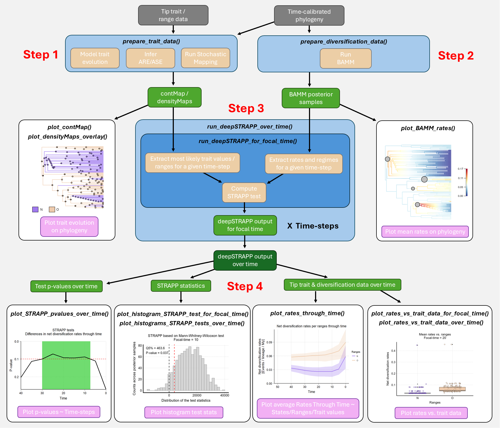

<!-- README.md is generated from README.Rmd. Please edit that file -->

# deepSTRAPP 

<!-- badges: start -->

<!-- 
usethis::use_cran_badge() reports the current version of your package on CRAN.
usethis::use_coverage() reports test coverage.
use_github_actions()  reports the R CMD check status of your development package. 
&#10;# Check badges in mFD package.
&#10;# Examples to adjust
&#10;[](https://cran.r-project.org/package=deepSTRAPP) 
[](https://opensource.org/licenses/MIT)
[](https://cran.r-project.org/package=deepSTRAPP) # Total (looks better)
[](https://r-pkg.org:443/pkg/deepSTRAPP) # Per month
[](https://zenodo.org/doi/TBA)
&#10;-->

<!-- badges: end -->

The **R package deepSTRAPP** employs time-calibrated phylogenies and
trait data to **test for differences in diversification rates between
traits over evolutionary time**. It works with continuous, categorical,
and biogeographic trait data and extends the STRAPP test from
`[BAMMtools::traitDependentBAMM()]` to any time step along phylogenies.

## :dart: Summary

<br> **deepSTRAPP** provides a powerful analytic framework to
investigate the **Diversification Rate Hypothesis (DRH)** in the context
of Historical Biogeography. DRH posits that current heterogeneity in
diversity patterns such as the Latitudinal Diversity Gradient are mostly
due to differences in diversification rates across bioregions. This
hypothesis is typically assessed by comparing diversification rates
across tips between the different bioregions with for example a STRAPP
test (*Rabosky & Huang, 2016*). However, such tests only compare current
rates of diversification that may not be informative about the
**long-term past dynamics shaping present-day biodiversity**. deepSTRAPP
overcomes this methodological gap: it enables users to test the DRH by
comparing diversification rates **at any time step along evolutionary
time**. As a typical outcome, it allows researchers to **identify
time-frames of significance** during which diversification rates were
different across trait values, providing a quantitative testing
framework to **disentangle effects of past and current dynamics** in
explaining current patterns of biodiversity.

Beyond the biogeographic context, deepSTRAPP can be used to test for an
evolutionary relationship between phenotypic evolution and
diversification dynamics for **any type of trait**. It provides an
alternative approach to state-dependent speciation and extinction (SSE)
models that intend to model altogether trait evolution and
diversification dynamics, but are often time-consuming and hard to
parametrize, especially on large time-calibrated phylogenies. Thus,
deepSTRAPP offers a flexible solution that **can be applied to
phylogenies encompassing thousands of lineages** (*Doré et al., 2025*).

deepSTRAPP is especially suited for large phylogenies as the power of
the statistical tests is limited by the number of diversification regime
shifts detected on the phylogeny and used to perform permutation tests.
Each macroevolutionary regime acts as an independent event used to test
for differences, therefore the sample size of the tests is conditioned
by the number of macroevolutionary regimes identified. It is unlikely to
detect any significant differences with few regime shifts.

A **full deepSTRAPP workflow** runs as follows:

- **Step 1**: Map trait evolution
- **Step 2:** Infer diversification dynamics (typically with BAMM)
- **Step 3:** Run deepSTRAPP
- **Step 3.1:** Extract trait values, diversification rates, and regimes
  at a given time in the past
- **Step 3.2:** Run a STRAPP test
- **Step 3.3:** Repeat steps 3.1 & 3.2 for many time steps along
  evolution time
- **Step 4:** Summarize test results


**Figure 1: Simplified deepSTRAPP workflow showing the main functions
*(in italics)* involved in each step**. Input data in grey. Data
processing in blue (main) and beige (internal). Intermediate objects in
green. Final outputs in pink.

**References:**

> STRAPP test: Rabosky, D. L., & Huang, H. (2016). A robust
> semi-parametric test for detecting trait-dependent diversification.
> Systematic biology, 65(2), 181-193.
> <https://doi.org/10.1093/sysbio/syv066>.

> deepSTRAPP application: Doré, M., Borowiec, M. L., Branstetter, M. G.,
> Camacho, G. P., Fisher, B. L., Longino, J. T., Ward, P. S., Blaimer,
> B. B. (2025). Evolutionary history of ponerine ants highlights how the
> timing of dispersal events shapes modern biodiversity. Nature
> Communications, 16, 8297. <https://doi.org/10.1038/s41467-025-63709-3>
> <br>

## :envelope_with_arrow: Installation

deepSTRAPP works on R version 4.4 or more. Be sure to have an R version
that is compatible. <br> See <https://CRAN.R-project.org/>.

From **CRAN**, for the latest release:

``` r
install.packages("deepSTRAPP")
```

From **GitHub**, for the current development version, including all
**example datasets**:

``` r
library(devtools)

# If you want to have access to the vignettes/tutorials locally, run:
remotes::install_github(repo = "MaelDore/deepSTRAPP")

# Altough, this is time-consuming, you can also opt for this light installation:
remotes::install_github(repo = "MaelDore/deepSTRAPP", build_vignettes = FALSE)
# You will not have access to the vignettes/tutorials within R, but can still acess them through this website.
# See the dedicated Sections below.
```

You may need additional tools for package compilation such as Rtools
(Windows) and Xcode (Mac OS). <br> See [this
page](https://support.posit.co/hc/en-us/articles/200486498-Package-Development-Prerequisites)
for details. <br>

## :link: Dependencies

deepSTRAPP relies on other software and R packages to perform some of
its core tasks. R package dependencies will automatically be downloaded
and installed alongside deepSTRAPP. However, R packages that are not
currently available on CRAN, and external software may need to be
installed independently.

- The C++ software **BAMM** is used to model diversification dynamics on
  time-calibrated phylogenies. It is needed by deepSTRAPP to obtain
  estimates of diversification rates along branches. You can install the
  latest version of BAMM from its [official
  website](http://bamm-project.org/). You will later need to provide to
  deepSTRAPP the path to your BAMM installation folder as an argument to
  the dedicated function \[prepare_diversification_data()\], so it can
  call BAMM within R to perform its tasks.

**Reference:**

> Rabosky, DL. Automatic detection of key innovations, rate shifts, and
> diversity-dependence on phylogenetic trees. PLoS One 9, e89543 (2014).
> DOI: <https://doi.org/10.1371/journal.pone.0089543> <br>

- The R package **BioGeoBEARS** is used to infer ancestral ranges on
  time-calibrated phylogenies. It is needed by deepSTRAPP to perform the
  tests based on biogeographic ranges. You can install the latest
  version of BioGeoBEARS from its [author’s repository on
  GitHub](https://github.com/nmatzke/BioGeoBEARS):

``` r
library(devtools)
devtools::install_github(repo="nmatzke/BioGeoBEARS")
```

For more information, please refer to the [official BioGeoBEARS
Wiki](http://phylo.wikidot.com/biogeobears).

**Reference:**

> Matzke, Nicholas J. (2018). BioGeoBEARS: BioGeography with Bayesian
> (and likelihood) Evolutionary Analysis with R Scripts. version 1.1.1,
> published on GitHub on November 6, 2018. DOI:
> <http://dx.doi.org/10.5281/zenodo.1478250>

- The R package **contsimmap** is used to produce stochastic character
  maps of continuous trait data on phylogenies (i.e., continuous
  stochastic maps). It is needed by deepSTRAPP to propagate the
  uncertainty in ancestral trait inferences within tests based on
  continuous traits. You can install the latest version of contsimmap
  from its [author’s repository on
  GitHub](https://github.com/bstaggmartin/contsimmap):

``` r
library(devtools)
devtools::install_github(repo="bstaggmartin/contsimmap")
```

**Reference:**

> Martin, B. S., & Weber, M. G. (2026). Stochastic character mapping of
> continuous traits on phylogenies. Systematic Biology, syag031. DOI:
> <http://doi.org/10.1093/sysbio/syag031>

- Archived copies of the non-CRAN R package dependencies are also
  provided through an alternative repository to ensure long-term
  compatibility and reproducibility, even if the development versions of
  these packages change over time.

``` r
install.packages("drat")
drat::addRepo("maeldore", "https://maeldore.github.io/drat")
install.packages(c("BioGeoBEARS", "contsimmap"))
```

## :desktop_computer: Website

A companion website is available to browse interactively the different
tutorials and functions of **deepSTRAPP** at this URL:
<https://maeldore.github.io/deepSTRAPP/>.

An overview of all functions and datasets is available
[here](https://maeldore.github.io/deepSTRAPP/reference/index.html). <br>

## :joystick: Quick-to-run example

A **simple use-case** that shows how deepSTRAPP can be used to **test
for differences in diversification rates between two trait states along
evolutionary times** is available
[here](https://maeldore.github.io/deepSTRAPP/articles/main_tutorial.html)
and within R: `vignette("main_tutorial")`.

This tutorial presents the main functions in a typical **deepSTRAPP
workflow**. <br> For more advanced uses, please refer to the
vignettes/tutorials below. <br>

## :scroll: Advanced uses / tutorials

Tutorials are available to explore more **advanced usages** of
deepSTRAPP. They provide explanations on available arguments and
interpretations of results of deepSTRAPP across multiple types of data.
They are listed below, in the [companion
website](https://maeldore.github.io/deepSTRAPP/articles/deepSTRAPP.html),
and in this vignette: `vignette("deepSTRAPP")`.

**1/ Full deepSTRAPP workflows on different types of data**

- [1.1/ Full deepSTRAPP workflow for **continuous** trait
  data](https://maeldore.github.io/deepSTRAPP/articles/deepSTRAPP_continuous_data.html):
  `vignette("deepSTRAPP_continuous_data")`.
- [1.2/ Full deepSTRAPP workflow for **categorical** trait data with
  3-levels](https://maeldore.github.io/deepSTRAPP/articles/deepSTRAPP_categorical_data.html):
  `vignette("deepSTRAPP_categorical_data")`.
- [1.3/ Full deepSTRAPP workflow for **biogeographic** range
  data](https://maeldore.github.io/deepSTRAPP/articles/deepSTRAPP_biogeographic_data.html):
  `vignette("deepSTRAPP_biogeographic_data")`.

**2/ Explore options for trait evolution**

- [2.1/ Model evolution of **continuous** trait
  data](https://maeldore.github.io/deepSTRAPP/articles/model_continuous_trait_evolution.html):
  `vignette("model_continuous_trait_evolution")`.
- [2.2/ Model evolution of **categorical** trait
  data](https://maeldore.github.io/deepSTRAPP/articles/model_categorical_trait_evolution.html):
  `vignette("model_categorical_trait_evolution")`.
- [2.3/ Model evolution of **biogeographic** range
  data](https://maeldore.github.io/deepSTRAPP/articles/model_biogeographic_range_evolution.html):
  `vignette("model_biogeographic_range_evolution")`.

**3/ Explore options for BAMM**

- [Model **diversification dynamics** with BAMM within
  deepSTRAPP](https://maeldore.github.io/deepSTRAPP/articles/model_diversification_dynamics.html):
  `vignette("model_diversification_dynamics")`.

**4/ Explore the STRAPP test options**

- [Test different
  hypotheses](https://maeldore.github.io/deepSTRAPP/articles/explore_STRAPP_test_types.html):
  `vignette("explore_STRAPP_test_types")`.

  - Type of STRAPP tests: **two-tailed** vs. **one-tailed**.
  - Continuous: “negative” or “positive” correlation.
  - Binary with hypothesis: (A \> B) vs. (B \> A).
  - Multinominal: Hypotheses for all post hoc tests.

**5/ Plot rates through time (RTT)**

- [Explore options for plotting diversification **rates through time**
  in relation to trait
  data](https://maeldore.github.io/deepSTRAPP/articles/plot_rates_through_time.html):
  `vignette("plot_rates_through_time")`.

**6/ Handle uncertainty**

- [Handle **uncertainty** in trait and rate
  estimates](https://maeldore.github.io/deepSTRAPP/articles/handle_uncertainty.html):
  `vignette("handle_uncertainty")`.

  Explore the three strategies available:

  - **‘rates_only’**: Only accounts for diversification-rate uncertainty
    across BAMM posterior samples.
  - **‘paired’**: Accounts for both diversification-rate and ancestral
    trait/range reconstruction uncertainty by pairing BAMM posterior
    samples with stochastic maps.
  - **‘full’**: Accounts for both diversification-rate and ancestral
    reconstruction uncertainty by evaluating every combination of BAMM
    posterior samples and stochastic maps.

**7/ Import external analyses**

- [Import **external
  analyses**](https://maeldore.github.io/deepSTRAPP/articles/import_external_analyses.html):
  `vignette("import_external_analyses")`.

  Import and format results of external analyses of trait-evolution
  histories and diversification dynamics, and make them ready-to-use as
  inputs for a deepSTRAPP run.

**8/ Cut phylogenies**

- [Cut different types of **(mapped) phylogenies** for a given
  focal-time](https://maeldore.github.io/deepSTRAPP/articles/cut_phylogenies.html):
  `vignette("cut_phylogenies")`.

  - time-calibrated phylogenies.
  - contMap for continuous traits.
  - densityMap for categorical and biogeographic traits.
  - simmaps for categorical and biogeographic traits.
  - BAMM_object for diversification dynamics.

<br> Alternatively, if you prefer to view the vignettes in R, you can
install the package with `build_vignettes = TRUE`. But be aware that
some vignettes can be slow to generate.

``` r

remotes::install_github(repo = "MaelDore/deepSTRAPP",
                        dependencies = TRUE, 
                        upgrade = "ask",
                        # Time-consuming, but needed if you want to have access to the vignettes/tutorials
                        build_vignettes = TRUE) 

# Access vignettes within R
vignette("deepSTRAPP")

# You can also use this to open access to all local vignettes in an HTML Brower
utils::browseVignettes(package = "deepSTRAPP")
```

## :bug: Found a bug?

Thank you for finding it! Head over to the [GitHub Issues
tab](https://github.com/MaelDore/deepSTRAPP/issues) and let me know
about it. <br> You can also [send me an
e-mail](mailto:mael.dore@gmail.com). <br>

## :black_nib: How to cite deepSTRAPP

For any use of **deepSTRAPP**:

> Doré, M., & Blaimer, B. B., deepSTRAPP: Testing for differences in
> diversification rates over deep evolutionary time. (DOI TBA)

As **deepSTRAPP** relies strongly on functions designed for the
[phytools R package](https://blog.phytools.org/), it is good practice to
also cite this package:

> Revell, L. J. (2024) phytools 2.0: an updated R ecosystem for
> phylogenetic comparative methods (and other things). PeerJ, 12,
> e16505. <https://doi.org/10.7717/peerj.16505>.

If you use the modeling tools for continuous and categorical trait
evolution embedded in the function *prepare_trait_data()*, you should
cite the [R package geiger](https://github.com/mwpennell/geiger-v2):

> Pennell, M.W., J.M. Eastman, G.J. Slater, J.W. Brown, J.C. Uyeda, R.G.
> FitzJohn, M.E. Alfaro, and L.J. Harmon. 2014. geiger v2.0: an expanded
> suite of methods for fitting macroevolutionary models to phylogenetic
> trees. Bioinformatics 30:2216-2218.
> <https://doi.org/10.1093/bioinformatics/btu181>.

If you specifically use the function *prepare_trait_data()* to produce
continuous stochastic maps, you should cite the [R package
contsimmap](https://github.com/bstaggmartin/contsimmap/):

> Martin, B. S., & Weber, M. G. (2026). Stochastic character mapping of
> continuous traits on phylogenies. Systematic Biology, syag031.
> <https://doi.org/10.1093/sysbio/syag031>.

If you use the modeling tools for historical biogeography embedded in
the function *prepare_trait_data()*, you should cite the [R package
BioGeoBEARS](http://phylo.wikidot.com/biogeobears):

> Matzke, N. J. (2013). Probabilistic historical biogeography: new
> models for founder-event speciation, imperfect detection, and fossils
> allow improved accuracy and model-testing. Frontiers of Biogeography,
> 5(4). <https://doi.org/10.21425/F5FBG19694>.
