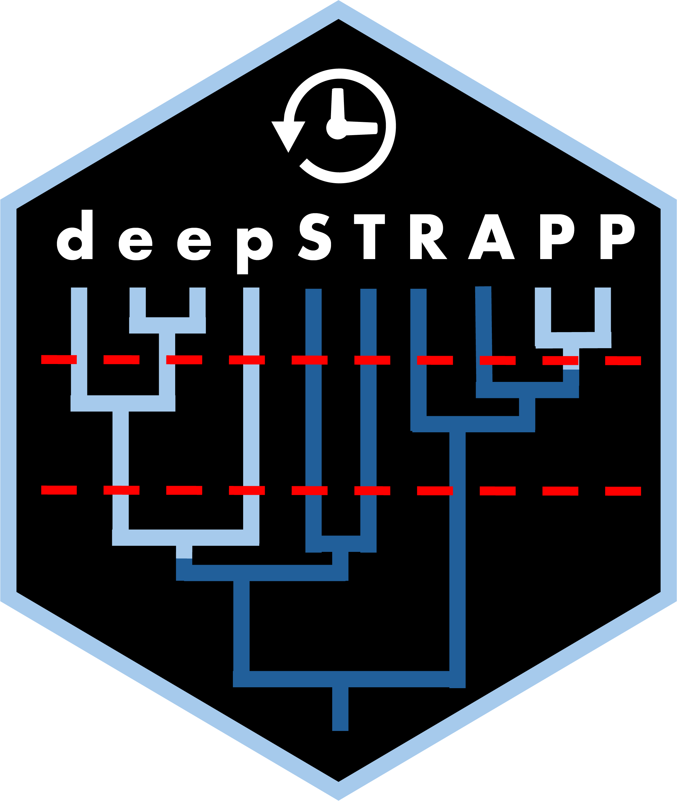

<!-- README.md is generated from README.Rmd. Please edit that file -->

# deepSTRAPP 

### Update the Hex logo

<!-- badges: start -->
<!-- 
usethis::use_cran_badge() reports the current version of your package on CRAN.
usethis::use_coverage() reports test coverage.
use_github_actions()  reports the R CMD check status of your development package. 
-->
<!-- badges: end -->

The **R package deepSTRAPP** employs time-calibrated phylogenies and
trait data to test for differences in diversification rates between
traits over evolutionary time. It works with continuous, categorical,
and biogeographic trait data and extends the STRAPP test from
`[BAMMtools::traitDependentBAMM()]` to any time step along phylogenies.

deepSTRAPP provides a powerful analytic framework to investigate the
Rate Diversification Hypothesis (RDH) in the context of Historical
Biogeography. RDH posits that current heterogeneity in diversity
patterns such as the Latitudinal Diversity Gradient are mostly due to
differences in diversification rates across bioregions. This hypothesis
is typically assessed by comparing diversification rates across tips
between the different bioregions with for example a STRAPP test
(*Rabosky & Huang, 2016*). However, such tests only compare current
rates of diversification that mat not be informative about the long-term
past dynamics shaping present-day biodiversity. deepSTRAPP overcomes
this methodological gap: it enables to test the RDH by comparing
diversification rates at any time step along evolutionary time. As a
typical outcome, it allows researchers to identify time-frame of
significance during which diversification rates were different across
trait values, providing a quantitative testing framework to disentangle
effects of past and current dynamics in explaining current patterns of
biodiversity.

Beyond the biogeographic context, deepSTRAPP can be used to test for an
evolutionary relationship between phenotypic evolution and
diversification dynamics for any type of traits. It provides an
alternative approach to state-dependent speciation and extinction (SSE)
models that intend to model altogether trait evolution and
diversification dynamics, but are often time-consuming and hard to
parametrize, especially on large time-calibrated phylogenies.
Conversely, deepSTRAPP offers a flexible solution that can be applied to
phylogenies encompassing thousands of lineages (*Doré al., 2025*).

deepSTRAPP is especially suited for large phylogenies as the power of
the statistical tests is limited by the number of diversification regime
shifts detected on the phylogeny and used to perform permutation tests.
Each macroevolutionary regime acts as an independent event used to test
for differences, therefore the sample size of the tests is conditioned
by the number of macroevolutionary regimes identified. It is unlikely to
detect any significant differences with few regime shifts.

A full deepSTRAPP workflow runs as follows:

- Step 1: Map trait evolution
- Step 2: Infer diversification dynamics (typically with BAMM)
- Step 3: Run deepSTRAPP
- Step 3.1: Extract traits values, diversification rates, and regimes at
  a given time in the past
- Step 3.2: Run a STRAPP test
- Step 3.3: Repeat steps 3.1 & 3.2 for many timesteps along evolution
  time
- Step 4: Summarize tests results

**(Insert simplified workflow diagram that shows how the main functions
interact with each other in a workflow to achieve a typical goal +
examples of outputs)**

**References:**

> STRAPP test: Rabosky, D. L., & Huang, H. (2016). A robust
> semi-parametric test for detecting trait-dependent diversification.
> Systematic biology, 65(2), 181-193.
> <https://doi.org/10.1093/sysbio/syv066>.

> deepSTRAPP application: Doré, M., Borowiec, M. L., Branstetter, M. G.,
> Camacho, G. P., Fisher, B. L., Longino, J. T., Ward, P. S., Blaimer,
> B. B. (2025). Evolutionary history of ponerine ants highlights how the
> timing of dispersal events shapes modern biodiversity, Nature
> Communications, 16, 8297. <https://doi.org/10.1038/s41467-025-63709-3>

## How to Cite deepSTRAPP

> Doré, M., & Blaimer, B. B., deepSTRAPP: Testing for differences in
> diversification rates over deep evolutionary time. (DOI TBA)

**May include a chunk of R script with a bibtex citation**

## Installation

deepSTRAPP works on R version 4.4 or more. Be sure to have an R version
that is compatible. See <https://cloud.r-project.org/>.

From CRAN for the latest release

From GitHub for the current development version

You can install the development version of deepSTRAPP like so:

``` r
library(devtools)
remotes::install_github(repo = "MaelDore/deepSTRAPP",
                        # Time-consuming, but needed if you want to have access to the vignettes/tutorials
                        build_vignettes = TRUE) 
```

You may need additional tools for package compilation such as Rtools
(Windows) and Xcode (Mac OS). See [this
page](https://support.posit.co/hc/en-us/articles/200486498-Package-Development-Prerequisites)
for details.

## Dependencies

deepSTRAPP relies on other software and R packages to perform some of
its core tasks. R package dependencies will automatically be downloaded
and installed alongside deepSTRAPP. However, R packages that are not
currently available on CRAN, and external software may need to be
installed independently.

- The R package **BioGeoBEARS** is used to infer ancestral ranges on
  time-calibrated phylogenies. It is needed by deepSTRAPP to perform the
  tests based on biogeographic ranges. You can install the latest
  version of BioGeoBEARS from its [author’s repository on
  GitHub](https://github.com/nmatzke/BioGeoBEARS) like so:

``` r
library(devtools)
devtools::install_github(repo="nmatzke/BioGeoBEARS")
```

For more information, please refer to the [official BioGeoBEARS
Wiki](http://phylo.wikidot.com/biogeobears).

Reference: Matzke, Nicholas J. (2018). BioGeoBEARS: BioGeography with
Bayesian (and likelihood) Evolutionary Analysis with R Scripts. version
1.1.1, published on GitHub on November 6, 2018. DOI:
<http://dx.doi.org/10.5281/zenodo.1478250>

- The C++ software **BAMM** is used to model diversification dynamics on
  time-calibrated phylogenies. It is needed by deepSTRAPP to obtain
  estimates of diversification rates along branches. You can install the
  latest version of BioGeoBEARS from its [official
  website](http://bamm-project.org/). You will later need to provide to
  deepSTRAPP the path to your BAMM installation folder as an argument to
  the dedicated function \[prepare_diversification_data()\], so it can
  call BAMM within R to perform its tasks.

Reference: Rabosky, DL. Automatic detection of key innovations, rate
shifts, and diversity-dependence on phylogenetic trees. PLoS One 9,
e89543 (2014). DOI: <https://doi.org/10.1371/journal.pone.0089543>

## Website

A company website is available to browse interactively the different
tutorials and functions of **deepSTRAPP** at this URL:
<https://maeldore.github.io/deepSTRAPP/>

## Quick-to-run example

A **simple use-case** that shows how deepSTRAPP can be used to **test
for differences in diversification rates between two trait states along
evolutionary times** is available here: `vignette("main_tutorial")`.

This tutorial presents the main functions in a typical **deepSTRAPP
workflow**. For more advanced used, please refer to the
vignettes/tutorials below.

## Advanced uses / tutorials

More tutorials are available to explore more **advanced usages** of
deepSTRAPP. They provide explanations on available arguments and
interpretations of results of deepSTRAPP across multiple type of data.
They are listed below, and in this vignette: `vignette("deepSTRAPP")`.

``` r
# You can also use this to open access to all vignettes in an HTML Brower
utils::browseVignettes(package = "deepSTRAPP")
```

**Full deepSTRAPP workflows on different types of data**

- Full deepSTRAPP workflow for **continuous** trait data:
  `vignette("deepSTRAPP_continuous_data")`.
- Full deepSTRAPP workflow for **categorical** trait data with 3-levels:
  `vignette("deepSTRAPP_categorical_3lvl_data")`.
- Full deepSTRAPP workflow for **biogeographic** range data:
  `vignette("deepSTRAPP_biogeographic_data")`.

**Explore options for trait evolution**

- Model evolution of **continuous** trait data on time-calibrated
  phylogeny: `vignette("model_continuous_trait_evolution")`.
- Model evolution of **categorical** trait data on time-calibrated
  phylogeny: `vignette("model_categorical_trait_evolution")`.
- Model evolution of **biogeographic** range data on time-calibrated
  phylogeny: `vignette("model_biogeographic_range_evolution")`.

**Explore options for BAMM**

- Model **diversification dynamics** with BAMM within deepSTRAPP:
  `vignette("model_diversification_dynamics")`.

**Explore the STRAPP test options**

Type of STRAPP tests: **two-tailed** vs. **one-tailed**:
`vignette("explore_STRAPP_test_types")`.

- Continuous: “negative” or “positive” correlation.
- Binary with hypothesis: (A \> B) vs. (B \> A).
- Multinominal: Hypotheses for all post hoc tests.

**Plot rates through time (RTT)**

Explore options for plotting diversification **rates through time** in
relation to trait data: `vignette("plot_rates_through_time")`.

**Cut phylogenies**

Cut different types of **(mapped) phylogenies** for a given focal-time:
phylogeny, contMap, densityMap, BAMM_object:
`vignette("cut_phylogenies")`.
