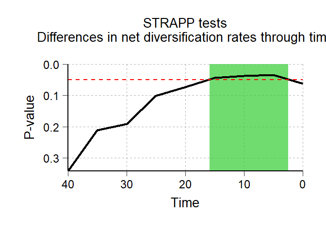
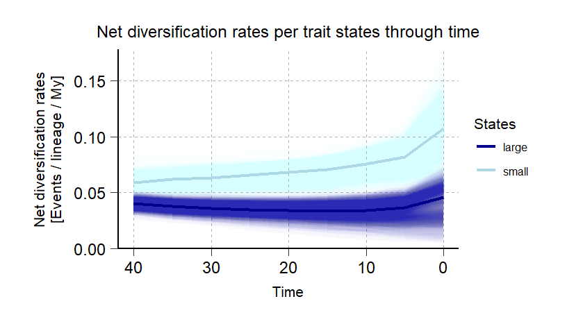
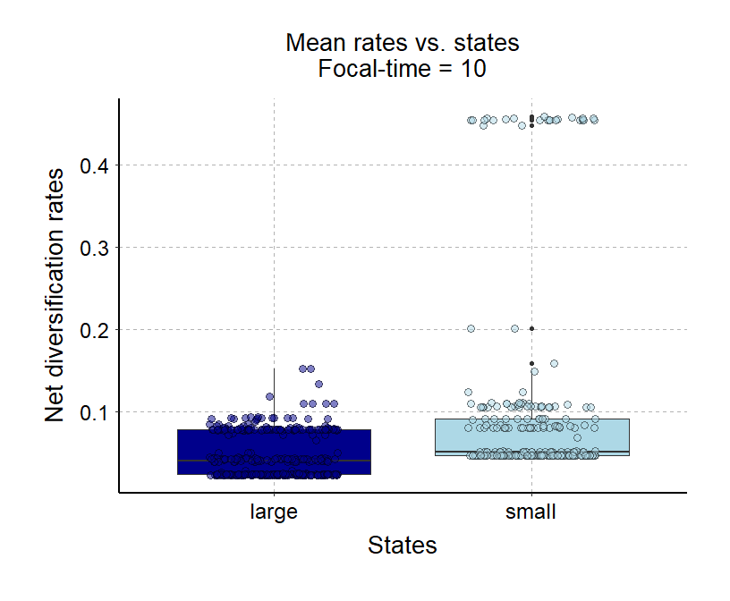
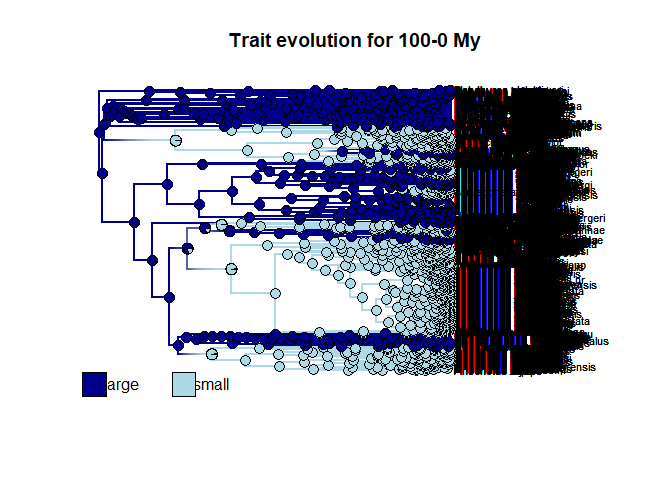
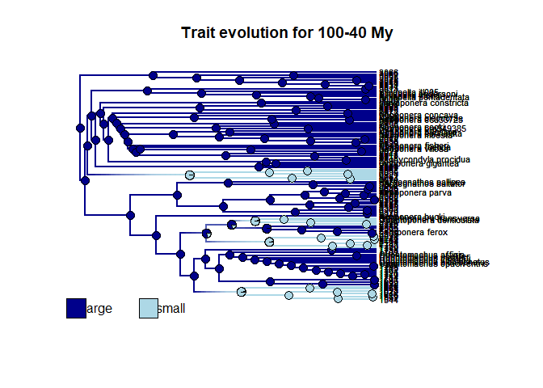
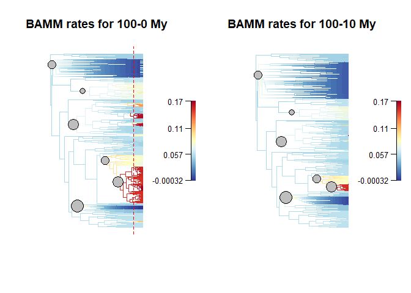
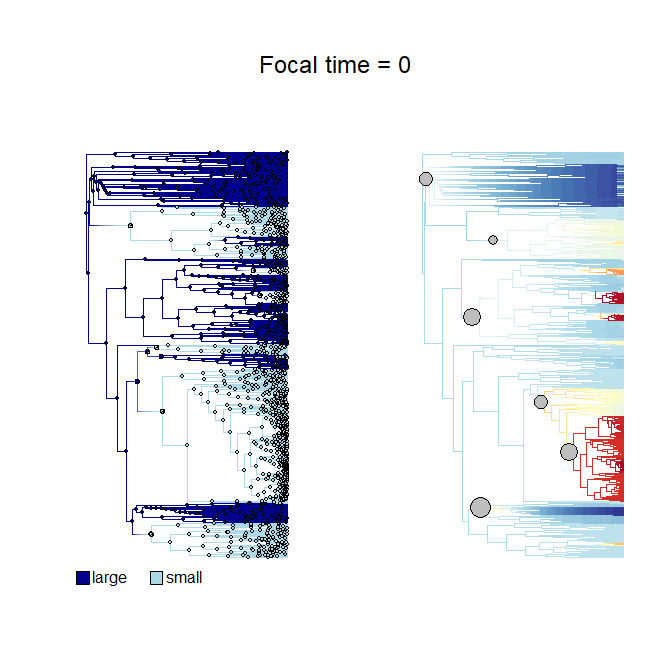
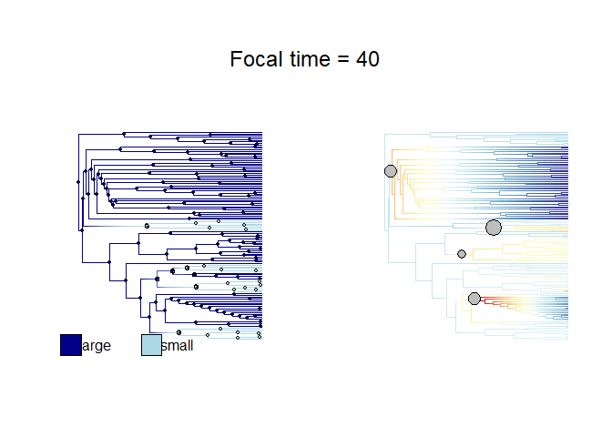

<!-- README.md is generated from README.Rmd. Please edit that file -->

# deepSTRAPP

### Add the Hex logo

<!-- badges: start -->
<!-- 
usethis::use_cran_badge() reports the current version of your package on CRAN.
usethis::use_coverage() reports test coverage.
use_github_actions()  reports the R CMD check status of your development package. 
-->
<!-- badges: end -->

The **R package deepSTRAPP** employs time-calibrated phylogenies and
trait data to test for differences in diversification rates between
traits over evolutionary time. It works with continuous, categorical,
and biogeographic trait data and extends the STRAPP test from
`[BAMMtools::traitDependentBAMM()]` to any time step along phylogenies.

deepSTRAPP provides a powerful analytic framework to investigate the
Rate Diversification Hypothesis (RDH) in the context of Historical
Biogeography. RDH posits that current heterogeneity in diversity
patterns such as the Latitudinal Diversity Gradient are mostly due to
differences in diversification rates across bioregions. This hypothesis
is typically assessed by comparing diversification rates across tips
between the different bioregions with for example a STRAPP test
(*Rabosky & Huang, 2016*). However, such tests only compare current
rates of diversification that mat not be informative about the long-term
past dynamics shaping present-day biodiversity. deepSTRAPP overcomes
this methodological gap: it enables to test the RDH by comparing
diversification rates at any time step along evolutionary time. As a
typical outcome, it allows researchers to identify time-frame of
significance during which diversification rates were different across
trait values, providing a quantitative testing framework to disentangle
effects of past and current dynamics in explaining current patterns of
biodiversity.

Beyond the biogeographic context, deepSTRAPP can be used to test for an
evolutionary relationship between phenotypic evolution and
diversification dynamics for any type of traits. It provides an
alternative approach to state-dependent speciation and extinction (SSE)
models that intend to model altogether trait evolution and
diversification dynamics, but are often time-consuming and hard to
parametrize, especially on large time-calibrated phylogenies.
Conversely, deepSTRAPP offers a flexible solution that can be applied to
phylogenies encompassing thousands of lineages (*Doré al., 2025*).

deepSTRAPP is especially suited for large phylogenies as the power of
the statistical tests is limited by the number of diversification regime
shifts detected on the phylogeny and used to perform permutation tests.
Each macroevolutionary regime acts as an independent event used to test
for differences, therefore the sample size of the tests is conditioned
by the number of macroevolutionary regimes identified. It is unlikely to
detect any significant differences with few regime shifts.

A full deepSTRAPP workflow runs as follows:

- Step 1: Map trait evolution
- Step 2: Infer diversification dynamics (typically with BAMM)
- Step 3: Run deepSTRAPP
- Step 3.1: Extract traits values, diversification rates, and regimes at
  a given time in the past
- Step 3.2: Run a STRAPP test
- Step 3.3: Repeat steps 3.1 & 3.2 for many timesteps along evolution
  time
- Step 4: Summarize tests results

**(Insert simplified workflow diagram that shows how the main functions
interact with each other in a workflow to achieve a typical goal +
examples of outputs)**

**References:**

> STRAPP test: Rabosky, D. L., & Huang, H. (2016). A robust
> semi-parametric test for detecting trait-dependent diversification.
> Systematic biology, 65(2), 181-193.
> <https://doi.org/10.1093/sysbio/syv066>.

> deepSTRAPP application: Doré, M., Borowiec, M. L., Branstetter, M. G.,
> Camacho, G. P., Fisher, B. L., Longino, J. T., Ward, P. S., Blaimer,
> B. B., (2025), Evolutionary history of ponerine ants highlights how
> the timing of dispersal events shapes modern biodiversity, Nature
> Communications. <https://doi.org/10.1038/s41467-025-63709-3>

## How to Cite deepSTRAPP

> Doré, M., & Blaimer, B. B., deepSTRAPP: Testing for differences in
> diversification rates over deep evolutionary time. (provide DOI link)

**May include a chunk of R script with a bibtex citation**

## Installation

deepSTRAPP works on R version 4.4 or more. Be sure to have an R version
that is compatible. See <https://cloud.r-project.org/>.

From CRAN for the latest release

From GitHub for the current development version

You can install the development version of deepSTRAPP like so:

``` r
remotes::install_github(repo = "MaelDore/deepSTRAPP",
                        # Time-consuming, but needed if you want to have access to the vignettes/tutorials
                        build_vignettes = TRUE) 
```

You may need additional tools for package compilation such as Rtools
(Windows) and Xcode (Mac OS). See [this
page](https://support.posit.co/hc/en-us/articles/200486498-Package-Development-Prerequisites)
for details.

## Quick-to-run example

This is a **simple use-case** that shows how deepSTRAPP can be used to
**test for differences in diversification rates between trait values
along evolutionary times**. It presents the main functions in a typical
**deepSTRAPP workflow**. For more advanced used, please refer to the
vignettes/tutorials below.

Please note that the trait data and phylogeny calibration used in this
example are **not** valid biological data. They were modified in order
to provide results illustrating the usefulness of deepSTRAPP.

``` r
# ------ Step 0: Load data ------ #

## Load trait df
data(Ponerinae_trait_tip_data, package = "deepSTRAPP")

dim(Ponerinae_trait_tip_data)
View(Ponerinae_trait_tip_data)

# Extract categorical data with 2-levels
Ponerinae_cat_2lvl_tip_data <- setNames(object = Ponerinae_trait_tip_data$fake_cat_2lvl_data,
                                    nm = Ponerinae_trait_tip_data$Taxa)
table(Ponerinae_cat_2lvl_tip_data)

# Select color scheme for states
colors_per_states <- c("darkblue", "lightblue")
names(colors_per_states) <- c("large", "small")

## Load phylogeny
data(Ponerinae_tree_old_calib, package = "deepSTRAPP")

plot(Ponerinae_tree_old_calib)
ape::Ntip(Ponerinae_tree_old_calib) == length(Ponerinae_cat_2lvl_tip_data)

## Check that trait data and phylogeny are named and ordered similarly
all(names(Ponerinae_cat_2lvl_tip_data) == Ponerinae_tree_old_calib$tip.label)

## Reorder trait data as in phylogeny
Ponerinae_cat_2lvl_tip_data <- Ponerinae_cat_2lvl_tip_data[match(x = Ponerinae_tree_old_calib$tip.label,
                                                                 table = names(Ponerinae_cat_2lvl_tip_data))]


## Plot data on tips for visualization
pdf(file = "./Ponerinae_cat_2lvl_data_old_calib_on_phylo.pdf", width = 20, height = 150)

# Set plotting parameters
par(mar = c(0.1,0.1,0.1,0.1), oma = c(0,0,0,0)) # bltr
# Graph presence/absence using plotTree.datamatrix
range_map <- phytools::plotTree.datamatrix(
  tree = Ponerinae_tree_old_calib,
  X = as.data.frame(Ponerinae_cat_2lvl_tip_data),
  fsize = 0.7, yexp = 1.1,
  header = TRUE, xexp = 1.25,
  colors = colors_per_states)

# Get plot info in "last_plot.phylo"
plot_info <- get("last_plot.phylo", envir=.PlotPhyloEnv)

# Add time line

# Extract root age
root_age <- max(phytools::nodeHeights(Ponerinae_tree_old_calib))

# Define ticks
# ticks_labels <- seq(from = 0, to = 100, by = 20)
ticks_labels <- seq(from = 0, to = 120, by = 20)
axis(side = 1, pos = 0, at = (-1 * ticks_labels) + root_age, labels = ticks_labels, cex.axis = 1.5)
legend(x = root_age/2,
       y = 0 - 5, adj = 0,
       bty = "n", legend = "", title = "Time  [My]", title.cex = 1.5)

# Add a legend
legend(x = plot_info$x.lim[2] - 10,
       y = mean(plot_info$y.lim),
       # adj = c(0,0),
       # x = "topleft",
       legend = c("Absence", "Presence"),
       pch = 22, pt.bg = c("white","gray30"), pt.cex =  1.8,
       cex = 1.5, bty = "n")

dev.off()
```

``` r
# ------ Step 1: Prepare trait data ------ #

## Goal: Map trait evolution on the time-calibrated phylogeny

# 1.1/ Fit evolutionary models to trait data using Maximum Likelihood.
# 1.2/ Select the best fitting model comparing AICc.
# 1.3/ Infer ancestral characters estimates (ACE) at nodes.
# 1.4/ Run stochastic mapping simulations to generate evolutionary histories
#      compatible with the best model and inferred ACE. (Only for categorical and biogeographic data)
# 1.5/ Infer ancestral states along branches.
#  - For continuous traits: use interpolation to produce a `contMap`.
#  - For categorical and biogeographic data: compute posterior frequencies of each state/range
#    to produce a `densityMap` for each state/range.

library(deepSTRAPP)

# All these actions are performed by a single function: deepSTRAPP::prepare_trait_data()
?deepSTRAPP::prepare_trait_data()

# Run prepare_trait_data with default options
# For categorical trait, an ARD model is assumed by default.
Ponerinae_trait_object <- prepare_trait_data(
   tip_data = Ponerinae_cat_2lvl_tip_data,
   phylo = Ponerinae_tree_old_calib,
   trait_data_type = "categorical",
   colors_per_levels = colors_per_states,
   seed = 1234) # Set seed for reproducibility

# Explore output
str(Ponerinae_trait_object, 1)

# Extract the densityMaps representing the posterior probabilities of states on the phylogeny
Ponerinae_densityMaps <- Ponerinae_trait_object$densityMaps
plot_densityMaps_overlay(Ponerinae_densityMaps,
                         colors_per_levels = colors_per_states)

# Extract the Ancestral Character Estimates (ACE) = trait values at nodes
Ponerinae_ACE <- Ponerinae_trait_object$ace
head(Ponerinae_ACE)


## Inputs needed for Step 2 are the densityMaps, and optionally,
## the tip_data (Ponerinae_cat_2lvl_tip_data), and the ACE (Ponerinae_ACE)
```

``` r
# ------ Step 2: Prepare diversification data ------ #

## Goal: Map evolution of diversification rates and regime shifts on the time-calibrated phylogeny

# Run a BAMM (Bayesian Analysis of Macroevolutionary Mixtures)

# You need the BAMM C++ program installed in your machine to run this step.
# See the BAMM website: http://bamm-project.org/ and the companion R package [BAMMtools].

# 2.1/ Set BAMM - Record BAMM settings and generate all input files needed for BAMM.
# 2.2/ Run BAMM - Run BAMM and move output files in dedicated directory.
# 2.3/ Evaluate BAMM - Produce evaluation plots and ESS data.
# 2.4/ Import BAMM outputs - Load `BAMM_object` in R and subset posterior samples.
# 2.5/ Clean BAMM files - Remove files generated during the BAMM run.

# All these actions are performed by a single function: deepSTRAPP::prepare_diversification_data()
?deepSTRAPP::prepare_diversification_data()

# Run BAMM workflow with deepSTRAPP
## This step is time-consuming. You can skip it and load directly the result if needed
Ponerinae_BAMM_object <- prepare_diversification_data(
   BAMM_install_directory_path = "./software/bamm-2.5.0/", # To adjust to your own path to BAMM
   phylo = Ponerinae_tree_old_calib,
   prefix_for_files = "Ponerinae_old_calib",
   seed = 1234, # Set seed for reproducibility
   numberOfGenerations = 10^7 # Set high for optimal run, but will take a long time
)

# Load directly the result
data(Ponerinae_BAMM_object_old_calib)

# Explore output
str(Ponerinae_BAMM_object_old_calib, 1)
# Record the regime shift events and macroevolutionary regimes parameters across posterior samples
str(Ponerinae_BAMM_object_old_calib$eventData, 1) 
# Mean speciation rates at tips aggregated across all posterior samples
head(Ponerinae_BAMM_object_old_calib$meanTipLambda)
# Mean extinction rates at tips aggregated across all posterior samples
head(Ponerinae_BAMM_object_old_calib$meanTipMu) 

# Plot mean net diversification rates and regime shifts on the phylogeny
plot_BAMM_rates(Ponerinae_BAMM_object_old_calib,
                labels = FALSE, legend = TRUE)

## Input needed for Step 3 is the BAMM_object (Ponerinae_BAMM_object)
```

``` r
# ------ Step 3: Run a deepSTRAPP workflow ------ #

## Goal: Extract traits, diversification rates and regimes at a given time in the past 
## to test for differences with a STRAPP test

# 3.1/ Extract trait data at a given time in the past ('focal_time')
# 3.2/ Extract diversification rates and regimes at a given time in the past ('focal_time')
# 3.3/ Compute STRAPP test
# 3.4/ Repeat previous actions for many timesteps along evolutionary time

# All these actions are performed by a single function:
#  For a single 'focal_time': deepSTRAPP::run_deepSTRAPP_for_focal_time()
#  For multiple 'time_steps': deepSTRAPP::run_deepSTRAPP_over_time()
?deepSTRAPP::run_deepSTRAPP_for_focal_time()
?deepSTRAPP::run_deepSTRAPP_over_time()

## Set for five time steps of 5 My. Will generate deepSTRAPP workflows for 0 to 40 Mya.
time_step_duration <- 5
time_range <- c(0, 40)

# Run deepSTRAPP on net diversification rates
## This step is time-consuming. You can skip it and load directly the result if needed
Ponerinae_deepSTRAPP_cat_2lvl_old_calib_0_40 <- run_deepSTRAPP_over_time(
    densityMaps = Ponerinae_densityMaps,
    ace = Ponerinae_ACE,
    tip_data = Ponerinae_cat_2lvl_data,
    trait_data_type = "categorical",
    BAMM_object = Ponerinae_BAMM_object_old_calib,
    time_range = time_range,
    time_step_duration = time_step_duration,
    seed = 1234, # Set seed for reproducibility
    posthoc_pairwise_tests = TRUE, # To run pairwise posthoc tests between pairs of states
    # Needed to obtain STRAPP stats and plot evaluation histograms (See 4.2)
    return_perm_data = TRUE, 
    # Needed to get trait data and plot rates through time (See 4.3)
    extract_trait_data_melted_df = TRUE, 
    # Needed to get diversification data and plot rates through time (See 4.3)
    extract_diversification_data_melted_df = TRUE, 
    # Needed to obtain STRAPP stats and plot evaluation histograms (See 4.2)
    return_STRAPP_results = TRUE, 
    # Needed to plot updated densityMaps (See 4.4)
    return_updated_trait_data_with_Map = TRUE, 
    # Needed to map diversification rates on updated phylogenies (See 4.5)
    return_updated_BAMM_object = TRUE, 
    verbose = TRUE,
    verbose_extended = TRUE)

# Load the deepSTRAPP output summarizing results for 0 to 40 My
data(Ponerinae_deepSTRAPP_cat_2lvl_old_calib_0_40, package = "deepSTRAPP")

## Explore output
str(Ponerinae_deepSTRAPP_cat_2lvl_old_calib_0_40, max.level = 1)

# See next step for how to generate plots from those outputs

# Display test summary
# Can be passed down to [deepSTRAPP::plot_STRAPP_pvalues_over_time()] to generate a plot
# showing the evolution of the test results across time
Ponerinae_deepSTRAPP_cat_2lvl_old_calib_0_40$pvalues_summary_df

# Access STRAPP test results
# Can be passed down to [deepSTRAPP::plot_histograms_STRAPP_tests_over_time()] to generate plot
# showing the null distribution of the test statistics
str(Ponerinae_deepSTRAPP_cat_2lvl_old_calib_0_40$STRAPP_results, max.level = 2)

# Access trait data in a melted data.frame
head(Ponerinae_deepSTRAPP_cat_2lvl_old_calib_0_40$trait_data_df_over_time)
# Access the diversification data in a melted data.frame
head(Ponerinae_deepSTRAPP_cat_2lvl_old_calib_0_40$diversification_data_df_over_time)
# Both can be passed down to [deepSTRAPP::plot_rates_through_time()] to generate a plot
# showing the evolution of diversification rates though time in relation to trait values

# Access updated densityMaps for each focal time
# Can be used to plot densityMaps with branch cut-off at focal time with [deepSTRAPP::plot_densityMaps_overlay()]
str(Ponerinae_deepSTRAPP_cat_2lvl_old_calib_0_40$updated_trait_data_with_Map_over_time, max.level = 2)

# Access updated BAMM_object for each focal time
# Can be used to map rates and regime shifts on phylogeny with branch cut-off 
# at focal time with [deepSTRAPP::plot_BAMM_rates()]
str(Ponerinae_deepSTRAPP_cat_2lvl_old_calib_0_40$updated_BAMM_objects_over_time, max.level = 2)

## Input needed for Step 4 is the deepSTRAPP object (Ponerinae_deepSTRAPP_cat_2lvl_old_calib_0_40)
```

``` r
# ------ Step 4: Plot results ------ #

## Goal: Summarize the outputs in meaningful plots

# 4.1/ Plot evolution of STRAPP tests p-values through time
# 4.2/ Plot histogram of STRAPP test stats
# 4.3/ Plot evolution of rates though time in relation to trait values
# 4.4/ Plot rates vs. trait data across branches for a given 'focal_time'
# 4.5/ Plot updated densityMaps mapping trait evolution for a given 'focal_time'
# 4.6/ Plot updated diversification rates and regimes for a given 'focal_time'
# 4.7/ Combine 4.5 and 4.6 to plot both mapped phylogenies with trait evolution (4.5)
#      and diversification rates and regimes (4.6).

# Each plot is achieve through a dedicated function

# Load the deepSTRAPP output summarizing results for 0 to 40 My
data(Ponerinae_deepSTRAPP_cat_2lvl_old_calib_0_40, package = "deepSTRAPP")

### 4.1/ Plot evolution of STRAPP tests p-values through time ####

# ?deepSTRAPP::plot_STRAPP_pvalues_over_time()

## Plot results of overall Kruskal-Wallis tests over time
deepSTRAPP::plot_STRAPP_pvalues_over_time(
   deepSTRAPP_outputs = Ponerinae_deepSTRAPP_cat_2lvl_old_calib_0_40)

# This is the main output of deepSTRAPP. It shows the evolution of the significance of the STRAPP tests over time.
# This example highlights the importance of deepSTRAPP as the significance of STRAPP tests change over time. 
# Differences in net diversification rates are not significant in the present 
# (assuming a significant threshold of alpha = 0.05).
# Meanwhile, rates are significantly different in the past between 5 My to 15 My (the green area).
# This result supports the idea that differences in biodiversity across states (i.e., "small" vs. "large" ants)
# can be explained by differences of diversification rates that was detected in the past.
# Without deepSTRAPP, this conclusion would not have been supported by current diversification rates alone.
```



``` r
### 4.2/ Plot histogram of STRAPP test stats ####

# Plot an histogram of the distribution of the test statistics used to assess the significance of STRAPP tests
  #  For a single 'focal_time': deepSTRAPP::plot_histogram_STRAPP_test_for_focal_time()
  #  For multiple 'time_steps': deepSTRAPP::plot_histograms_STRAPP_tests_over_time()

# ?deepSTRAPP::plot_histogram_STRAPP_test_for_focal_time
# ?deepSTRAPP::plot_histograms_STRAPP_tests_over_time

## These functions are used to provide visual illustration of the results of each STRAPP test. 
# They can be used to complement the provision of the statistical results summarized in Step 3.

# Display the time-steps
Ponerinae_deepSTRAPP_cat_2lvl_old_calib_0_40$time_steps

## Plot results from Mann-Whitney-Wilcoxon between the two states ####

# Plot the histogram of test stats for time-step n°3 = 10 My
plot_histogram_STRAPP_test_for_focal_time(
   deepSTRAPP_outputs = Ponerinae_deepSTRAPP_cat_2lvl_old_calib_0_40,
   focal_time = 10)

# The black line represents the expected value under the null hypothesis H0 => Δ Mann-Whitney-Wilcoxon U-stat = 0.
# The histogram shows the distribution of the test statistics as observed
# across the 1000 posterior samples from BAMM.
# The red line represents the significance threshold for which 95% of the observed data
# exhibited a higher value that expected.
# Since this red line is above the null expectation (quantile 5% = 463.6), 
# the test is significant for a value of alpha = 0.05.

# Plot the histograms of test stats for all time-steps
plot_histograms_STRAPP_tests_over_time(
   deepSTRAPP_outputs = Ponerinae_deepSTRAPP_cat_2lvl_old_calib_0_40)
```


``` r
### 4.3/ Plot evolution of rates through time ~ trait data ####

# ?deepSTRAPP::plot_rates_through_time()

# Generate ggplot
plot_rates_through_time(deepSTRAPP_outputs = Ponerinae_deepSTRAPP_cat_2lvl_old_calib_0_40,
                        colors_per_levels = colors_per_states,
                        plot_CI = TRUE)

# This plot helps to visualize how differences in rates evolved over time.
# You can see that both type of ants "large" and "small" had fairly different rates over time,
# with differences detected as significant between 5 to 15 My.
# However, in the present, we recorded an increase in diversification rates that blurred these differences
# and led to a non-significant STRAPP test when comparing current rates.
# This plot, alongside results of deepSTRAPP, supports the Diversification Rate Hypothesis in showing how 
# "small" ant lineages may have accumulated faster, especially between 5 to 15 My.

# N.B.: The increase of diversification rates recorded in the present may largely be artifactual,
# due to the fact some lineages in the present will go extinct in the future, but have not been recorded as such. 
# This bias is named the "pull of the present", and can impair evaluation of 
# the Diversification Rate Hypothesis based only on current rates.
# deepSTRAPP offers a solution to this issue by investigating rate differences at any time in the past.
```



``` r
### 4.4/ Plot rates vs. trait data across branches for a given focal time ####

# ?deepSTRAPP::plot_rates_vs_trait_data_for_focal_time()
# ?deepSTRAPP::plot_rates_vs_trait_data_over_time()

# This plot help to visualize differences in rates vs. states across all branches
# found at specific time-steps (i.e., 'focal_time').

# Generate ggplot for time = 10 My
plot_rates_vs_trait_data_for_focal_time(
   deepSTRAPP_outputs = Ponerinae_deepSTRAPP_cat_2lvl_old_calib_0_40,
   focal_time = 10,
   colors_per_levels = colors_per_states)

# Here we focus on T = 10 My to highlight the differences detected in the previous steps.
# You can see that "small" ants tend to have higher rates than "large" ants at this time-step.
# This plot, alongside other results of deepSTRAPP, supports the Diversification Rate Hypothesis in showing 
# how "small" ant lineages may have accumulated faster, especially between 5 to 15 My.

# Plot rates vs. trait data for all time-steps
plot_rates_vs_trait_data_over_time(
   deepSTRAPP_outputs = Ponerinae_deepSTRAPP_cat_2lvl_old_calib_0_40,
   colors_per_levels = colors_per_states)
```



``` r
### 4.5/ Plot updated densityMaps mapping trait evolution for a given 'focal_time' ####

# ?deepSTRAPP::plot_densityMaps_overlay()

## These plots help to visualize the evolution of trait data across the phylogeny,
## and to focus on tip values at specific time-steps.

# Display the time-steps
Ponerinae_deepSTRAPP_cat_2lvl_old_calib_0_40$time_steps

## The next plot shows the evolution of trait data across the whole phylogeny (100-0 My).

# Plot initial densityMaps (t = 0)
densityMaps_0My <- Ponerinae_deepSTRAPP_cat_2lvl_old_calib_0_40$updated_trait_data_with_Map_over_time[[1]]
plot_densityMaps_overlay(densityMaps_0My$densityMaps,
                         colors_per_levels = colors_per_states,
                         fsize = 0.1) # Reduce tip label size
title(main = "Trait evolution for 100-0 My")

## The next plot shows the evolution of trait data from root to 10 Mya (100-10 My).

# Plot updated densityMaps for time-step n°3 = 10 My
densityMaps_10My <- Ponerinae_deepSTRAPP_cat_2lvl_old_calib_0_40$updated_trait_data_with_Map_over_time[[3]]
plot_densityMaps_overlay(densityMaps_10My$densityMaps,
                         colors_per_levels = colors_per_states,
                         fsize = 0.1) # Reduce tip label size
title(main = "Trait evolution for 100-10 My")

## The next plot shows the evolution of trait data from root to 40 Mya (100-40 My).

# Plot updated densityMaps for time-step n°9 = 40 My
densityMaps_40My <- Ponerinae_deepSTRAPP_cat_2lvl_old_calib_0_40$updated_trait_data_with_Map_over_time[[9]]
plot_densityMaps_overlay(densityMaps_40My$densityMaps,
                         colors_per_levels = colors_per_states,
                         fsize = 0.2) # Reduce tip label size
title(main = "Trait evolution for 100-40 My")
```



``` r
### 4.6/ Plot updated diversification rates and regimes for a given 'focal_time' ####

# ?deepSTRAPP::plot_BAMM_rates()

## These plots help to visualize the evolution of diversification rates across the phylogeny,
## and to focus on tip values at specific time-steps.

# Display the time-steps
Ponerinae_deepSTRAPP_cat_2lvl_old_calib_0_40$time_steps

# Extract root age
root_age <- max(phytools::nodeHeights(Ponerinae_tree_old_calib)[,2])

## The next plot shows the evolution of net diversification rates across the whole phylogeny (100-0 My).

# Plot diversification rates on initial phylogeny (t = 0)
BAMM_map_0My <- Ponerinae_deepSTRAPP_cat_2lvl_old_calib_0_40$updated_BAMM_objects_over_time[[1]]
plot_BAMM_rates(BAMM_map_0My, labels = FALSE, par.reset = FALSE)
abline(v = root_age - 10, col = "red", lty = 2) # Show where the phylogeny will be cut for t = 10My
abline(v = root_age - 40, col = "red", lty = 2) # Show where the phylogeny will be cut for t = 40My
title(main = "BAMM rates for 100-0 My")

## The next plot shows the evolution of net diversification rates from root to 10 Mya (100-10 My).

# Plot diversification rates on updated phylogeny for time-step n°3 = 10 My
BAMM_map_10My <- Ponerinae_deepSTRAPP_cat_2lvl_old_calib_0_40$updated_BAMM_objects_over_time[[3]]
plot_BAMM_rates(BAMM_map_10My, labels = FALSE,
                colorbreaks = BAMM_map_10My$initial_colorbreaks$net_diversification)
title(main = "BAMM rates for 100-10 My")

## The next plot shows the evolution of net diversification rates from root to 40 Mya (100-40 My).

# Plot diversification rates on updated phylogeny for time-step n°9 = 40 My
BAMM_map_40My <- Ponerinae_deepSTRAPP_cat_2lvl_old_calib_0_40$updated_BAMM_objects_over_time[[9]]
plot_BAMM_rates(BAMM_map_40My, labels = FALSE,
                colorbreaks = BAMM_map_40My$initial_colorbreaks$net_diversification)
title(main = "BAMM rates for 100-40 My")
```



``` r
### 4.7/ Plot both trait evolution and diversification rates and regimes updated for a given 'focal_time' ####

# ?deepSTRAPP::plot_trait_vs_rate_maps_for_focal_time()

## These plots help to visualize simultaneously the evolution of trait and diversification rates across the phylogeny, 
## and to focus on tip values at specific time-steps.

# Display the time-steps
Ponerinae_deepSTRAPP_cat_2lvl_old_calib_0_40$time_steps

## The next plot shows the evolution of states and rates across the whole phylogeny (100-0 My).

# Plot both mapped phylogenies in the present (t = 0)
plot_trait_vs_rate_maps_for_focal_time(
  deepSTRAPP_outputs = Ponerinae_deepSTRAPP_cat_2lvl_old_calib_0_40,
  focal_time = 0,
  ftype = "off", lwd = 0.7,
  colors_per_levels = colors_per_states,
  labels = FALSE, legend = FALSE,
  par.reset = FALSE)

## The next plot shows the evolution of states and rates from root to 10 Mya (100-10 My).

# Plot both mapped phylogenies for time-step n°3 = 10 My
plot_trait_vs_rate_maps_for_focal_time(
  deepSTRAPP_outputs = Ponerinae_deepSTRAPP_cat_2lvl_old_calib_0_40,
  focal_time = 10, 
  ftype = "off", lwd = 1.2,
  colors_per_levels = colors_per_states,
  labels = FALSE, legend = FALSE,
  par.reset = FALSE)

## The next plot shows the evolution of states and rates from root to 40 Mya (100-40 My).

# Plot both mapped phylogenies for time-step n°9 = 40 My
plot_trait_vs_rate_maps_for_focal_time(
  deepSTRAPP_outputs = Ponerinae_deepSTRAPP_cat_2lvl_old_calib_0_40,
  focal_time = 40, 
  ftype = "off", lwd = 1.2,
  colors_per_levels = colors_per_states,
  labels = FALSE, legend = FALSE,
  par.reset = FALSE)
```



## Advanced uses / tutorials

More tutorials are available to explore more **advanced usages** of
deepSTRAPP. They provide explanations on available arguments and
interpretations of results of deepSTRAPP across multiple type of data.
They are listed below, and in this vignette: `vignette("deepSTRAPP")`.
[Link](https://github.com/MaelDore/deepSTRAPP/blob/master/doc/deepSTRAPP.html)

``` r
# You can also use this to open access to all vignettes in an HTML Brower
utils::browseVignettes(package = "deepSTRAPP")
```

**Full deepSTRAPP workflows on different types of data**

- Full deepSTRAPP workflow for **continuous** trait data:
  `vignette("deepSTRAPP_continuous_data")`.
  [Link](https://github.com/MaelDore/deepSTRAPP/blob/master/doc/deepSTRAPP_continuous_data.html)
- Full deepSTRAPP workflow for **categorical** trait data with 3-levels:
  `vignette("deepSTRAPP_categorical_3lvl_data")`.
  [Link](https://github.com/MaelDore/deepSTRAPP/blob/master/doc/deepSTRAPP_categorical_3lvl_data.html)
- Full deepSTRAPP workflow for **biogeographic** range data:
  `vignette("deepSTRAPP_biogeographic_data")`.
  [Link](https://github.com/MaelDore/deepSTRAPP/blob/master/doc/deepSTRAPP_biogeographic_data.html)

**Explore options for trait evolution**

- Model evolution of **continuous** trait data on time-calibrated
  phylogeny: `vignette("model_continuous_trait_evolution")`.
  [Link](https://github.com/MaelDore/deepSTRAPP/blob/master/doc/model_continuous_trait_evolution.html)
- Model evolution of **categorical** trait data on time-calibrated
  phylogeny: `vignette("model_categorical_trait_evolution")`.
  [Link](https://github.com/MaelDore/deepSTRAPP/blob/master/doc/model_categorical_trait_evolution.html)
- Model evolution of **biogeographic** range data on time-calibrated
  phylogeny: `vignette("model_biogeographic_range_evolution")`.
  [Link](https://github.com/MaelDore/deepSTRAPP/blob/master/doc/model_biogeographic_range_evolution.html)

**Explore options for BAMM**

- Model **diversification dynamics** with BAMM within deepSTRAPP:
  `vignette("model_diversification_dynamics")`.
  [Link](https://github.com/MaelDore/deepSTRAPP/blob/master/doc/model_diversification_dynamics.html)

**Explore the STRAPP test options**

Type of STRAPP tests: **two-tailed** vs. **one-tailed**:
`vignette("explore_STRAPP_test_types")`.
[Link](https://github.com/MaelDore/deepSTRAPP/blob/master/doc/explore_STRAPP_test_types.html)

- Continuous: “negative” or “positive” correlation.
- Binary with hypothesis: (A \> B) vs. (B \> A).
- Multinominal: Hypotheses for all post hoc tests.

**Plot rates through time (RTT)**

Explore options for plotting diversification **rates through time** in
relation to trait data: `vignette("plot_rates_through_time")`.
[Link](https://github.com/MaelDore/deepSTRAPP/blob/master/doc/plot_rates_through_time.html)

**Cut phylogenies**

Cut different types of **(mapped) phylogenies** for a given focal-time:
phylogeny, contMap, densityMap, BAMM_object:
`vignette("cut_phylogenies")`.
[Link](https://github.com/MaelDore/deepSTRAPP/blob/master/doc/cut_phylogenies.html)

**Plot rates vs. trait values/states**

Show how to plot rates vs. trait values/states from the melted df for
each focal time Make it a function??? And include it in the README +
vignette for each deepSTRAPP workflow + the STRAPP test options

Update the deepSTRAPP vignette that summarizes all vignettes!!!
