<!-- README.md is generated from README.Rmd. Please edit that file -->

# deepSTRAPP

### Add the Hex logo

<!-- badges: start -->
<!-- 
usethis::use_cran_badge() reports the current version of your package on CRAN.
usethis::use_coverage() reports test coverage.
use_github_actions()  reports the R CMD check status of your development package. 
-->
<!-- badges: end -->

The **R package deepSTRAPP** employs time-calibrated phylogenies and
trait data to test for differences in diversification rates between
traits over evolutionary time. It works with continuous, categorical,
and biogeographic trait data and extends the STRAPP test from
`[BAMMtools::traitDependentBAMM()]` to any time step along phylogenies.

deepSTRAPP provides a powerful analytic framework to investigate the
Rate Diversification Hypothesis (RDH) in the context of Historical
Biogeography. RDH posits that current heterogeneity in diversity
patterns such as the Latitudinal Diversity Gradient are mostly due to
differences in diversification rates across bioregions. This hypothesis
is typically assessed by comparing diversification rates across tips
between the different bioregions with for example a STRAPP test
(*Rabosky & Huang, 2016*). However, such tests only compare current
rates of diversification that mat not be informative about the long-term
past dynamics shaping present-day biodiversity. deepSTRAPP overcomes
this methodological gap: it enables to test the RDH by comparing
diversification rates at any time step along evolutionary time. As a
typical outcome, it allows researchers to identify time-frame of
significance during which diversification rates were different across
trait values, providing a quantitative testing framework to disentangle
effects of past and current dynamics in explaining current patterns of
biodiversity.

Beyond the biogeographic context, deepSTRAPP can be used to test for an
evolutionary relationship between phenotypic evolution and
diversification dynamics for any type of traits. It provides an
alternative approach to state-dependent speciation and extinction (SSE)
models that intend to model altogether trait evolution and
diversification dynamics, but are often time-consuming and hard to
parametrize, especially on large time-calibrated phylogenies (*Need a
ref*). Conversely, deepSTRAPP offers a flexible solution that can be
applied to phylogenies encompassing thousands of lineages (*Doré al.,
2025*).

deepSTRAPP is especially suited for large phylogenies as the power of
the statistical tests is limited by the number of diversification regime
shifts detected on the phylogeny and used to perform permutation tests.
Each macroevolutionary regime acts as an independent event used to test
for differences, therefore the sample size of the tests is conditioned
by the number of macroevolutionary regimes identified. It is unlikely to
detect any significant differences with few regime shifts.

A full deepSTRAPP workflow runs as follows:

- Step 1: Map trait evolution
- Step 2: Infer diversification dynamics (typically with BAMM)
- Step 3: Run deepSTRAPP
- Step 3.1: Extract traits values, diversification rates, and regimes at
  a given time in the past
- Step 3.2: Run a STRAPP test
- Step 3.3: Repeat steps 3.1 & 3.2 for many timesteps along evolution
  time
- Step 4: Summarize tests results

**(Insert simplified workflow diagram that shows how the main functions
interact with each other in a workflow to achieve a typical goal +
examples of outputs)**

**References:**

> STRAPP test: Rabosky, D. L., & Huang, H. (2016). A robust
> semi-parametric test for detecting trait-dependent diversification.
> Systematic biology, 65(2), 181-193.
> <https://doi.org/10.1093/sysbio/syv066>.

> deepSTRAPP method: Doré, M., & Blaimer, B. deepSTRAPP: Testing for
> differences in diversification rates over deep evolutionary time.
> (provide DOI link)

> deepSTRAPP application: Doré, M., Borowiec, M. L., Branstetter, M. G.,
> Camacho, G. P., Fisher, B. L., Longino, J. T., Ward, P. S., Blaimer,
> B. B., (2025), Timing is everything: Evolution of ponerine ants
> highlights how dispersal history shapes modern biodiversity, Nature
> Communications. <https://doi_of_Paper_to_provide.html>

## Installation

deepSTRAPP works on R version 4.4 or more. Be sure to have an R version
that is compatible. See <https://cloud.r-project.org/>.

From CRAN for the latest release

From GitHub for the current development version

You can install the development version of deepSTRAPP like so:

``` r
remotes::install_github("MaelDore/deepSTRAPP")
```

You may need additional tools for package compilation such as Rtools
(Windows) and Xcode (Mac OS). See [this
page](https://support.posit.co/hc/en-us/articles/200486498-Package-Development-Prerequisites)
for details.

## Quick-to-run example

This is a simple example that shows how deepSTRAPP can be used to test
for differences in diversification rates between trait values along
evolutionary times. It presents the main functions in a typical
deepSTRAPP workflow. For more advanced used, please refer to the
vignettes/tutorials below.

Please note that the trait data and phylogeny calibration used in this
example are not valid biological data. They were modified in order to
provide results illustrating the usefulness of deepSTRAPP.

``` r
# ------ Step 0: Load data ------ #

## Load trait df
data(Ponerinae_trait_tip_data, package = "deepSTRAPP")

dim(Ponerinae_trait_tip_data)
View(Ponerinae_trait_tip_data)

# Extract categorical data with 2-levels
Ponerinae_cat_2lvl_tip_data <- setNames(object = Ponerinae_trait_tip_data$fake_cat_2lvl_data,
                                    nm = Ponerinae_trait_tip_data$Taxa)
table(Ponerinae_cat_2lvl_tip_data)

# Select color scheme for states
colors_per_states <- c("darkblue", "lightblue")
names(colors_per_states) <- c("large", "small")

## Load phylogeny
data(Ponerinae_tree_old_calib, package = "deepSTRAPP")

plot(Ponerinae_tree_old_calib)
ape::Ntip(Ponerinae_tree_old_calib) == length(Ponerinae_cat_2lvl_tip_data)

## Check that trait data and phylogeny are named and ordered similarly
all(names(Ponerinae_cat_2lvl_tip_data) == Ponerinae_tree_old_calib$tip.label)

## Reorder trait data as in phylogeny
Ponerinae_cat_2lvl_tip_data <- Ponerinae_cat_2lvl_tip_data[match(x = Ponerinae_tree_old_calib$tip.label, table = names(Ponerinae_cat_2lvl_tip_data))]


## Plot data on tips for visualization
pdf(file = "./Ponerinae_cat_2lvl_data_old_calib_on_phylo.pdf", width = 20, height = 150)

# Set plotting parameters
par(mar = c(0.1,0.1,0.1,0.1), oma = c(0,0,0,0)) # bltr
# Graph presence/absence using plotTree.datamatrix
range_map <- phytools::plotTree.datamatrix(
  tree = Ponerinae_tree_old_calib,
  X = as.data.frame(Ponerinae_cat_2lvl_tip_data),
  fsize = 0.7, yexp = 1.1,
  header = TRUE, xexp = 1.25,
  colors = colors_per_states)

# Get plot info in "last_plot.phylo"
plot_info <- get("last_plot.phylo", envir=.PlotPhyloEnv)

# Add time line

# Extract root age
root_age <- max(phytools::nodeHeights(Ponerinae_tree_old_calib))

# Define ticks
# ticks_labels <- seq(from = 0, to = 100, by = 20)
ticks_labels <- seq(from = 0, to = 120, by = 20)
axis(side = 1, pos = 0, at = (-1 * ticks_labels) + root_age, labels = ticks_labels, cex.axis = 1.5)
legend(x = root_age/2,
       y = 0 - 5, adj = 0,
       bty = "n", legend = "", title = "Time  [My]", title.cex = 1.5)

# Add a legend
legend(x = plot_info$x.lim[2] - 10,
       y = mean(plot_info$y.lim),
       # adj = c(0,0),
       # x = "topleft",
       legend = c("Absence", "Presence"),
       pch = 22, pt.bg = c("white","gray30"), pt.cex =  1.8,
       cex = 1.5, bty = "n")

dev.off()
```

``` r
# ------ Step 1: Prepare trait data ------ #

## Goal: Map trait evolution on the time-calibrated phylogeny

# 1.1/ Fit evolutionary models to trait data using Maximum Likelihood.
# 1.2/ Select the best fitting model comparing AICc.
# 1.3/ Infer ancestral characters estimates (ACE) at nodes.
# 1.4/ Run stochastic mapping simulations to generate evolutionary histories
#      compatible with the best model and inferred ACE. (Only for categorical and biogeographic data)
# 1.5/ Infer ancestral states along branches.
#  - For continuous traits: use interpolation to produce a `contMap`.
#  - For categorical and biogeographic data: compute posterior frequencies of each state/range
#    to produce a `densityMap` for each state/range.

library(deepSTRAPP)

# All these actions are performed by a single function: deepSTRAPP::prepare_trait_data()
?deepSTRAPP::prepare_trait_data()

# Run prepare_trait_data with default options
# For categorical trait, an ARD model is assumed by default.
Ponerinae_trait_object <- prepare_trait_data(
   tip_data = Ponerinae_cat_2lvl_tip_data,
   phylo = Ponerinae_tree_old_calib,
   trait_data_type = "categorical",
   colors_per_levels = colors_per_states,
   seed = 1234) # Set seed for reproducibility

# Explore output
str(Ponerinae_trait_object, 1)

# Extract the densityMaps representing the posterior probabilities of states on the phylogeny
Ponerinae_densityMaps <- Ponerinae_trait_object$densityMaps
plot_densityMaps_overlay(Ponerinae_densityMaps,
                         colors_per_levels = colors_per_states)

# Extract the Ancestral Character Estimates (ACE) = trait values at nodes
Ponerinae_ACE <- Ponerinae_trait_object$ace
head(Ponerinae_ACE)


## Inputs needed for Step 2 are the densityMaps, and optionally, the tip_data (Ponerinae_cat_2lvl_tip_data), and the ACE (Ponerinae_ACE)
```

``` r
# ------ Step 2: Prepare diversification data ------ #

## Goal: Map evolution of diversification rates and regime shifts on the time-calibrated phylogeny

# Run a BAMM (Bayesian Analysis of Macroevolutionary Mixtures)

# You need the BAMM C++ program installed in your machine to run this step.
# See the BAMM website: http://bamm-project.org/ and the companion R package [BAMMtools].

# 2.1/ Set BAMM - Record BAMM settings and generate all input files needed for BAMM.
# 2.2/ Run BAMM - Run BAMM and move output files in dedicated directory.
# 2.3/ Evaluate BAMM - Produce evaluation plots and ESS data.
# 2.4/ Import BAMM outputs - Load `BAMM_object` in R and subset posterior samples.
# 2.5/ Clean BAMM files - Remove files generated during the BAMM run.

# All these actions are performed by a single function: deepSTRAPP::prepare_diversification_data()
?deepSTRAPP::prepare_diversification_data()

# Run BAMM workflow with deepSTRAPP
## This step is time-consuming. You can skip it and load directly the result if needed
Ponerinae_BAMM_object <- prepare_diversification_data(
   BAMM_install_directory_path = "./software/bamm-2.5.0/", # To adjust to your own path to BAMM
   phylo = Ponerinae_tree_old_calib,
   prefix_for_files = "Ponerinae_old_calib",
   seed = 1234, # Set seed for reproducibility
   numberOfGenerations = 10^7 # Set high for optimal run, but will take a long time
)

# Load directly the result
data(Ponerinae_BAMM_object_old_calib)

# Explore output
str(Ponerinae_BAMM_object_old_calib, 1)
str(Ponerinae_BAMM_object_old_calib$eventData, 1) # Record the regime shift events and macroevolutionary regimes parameters across posterior samples
head(Ponerinae_BAMM_object_old_calib$meanTipLambda) # Mean speciation rates at tips aggregated across all posterior samples
head(Ponerinae_BAMM_object_old_calib$meanTipMu) # Mean extinction rates at tips aggregated across all posterior samples

# Plot mean net diversification rates and regime shifts on the phylogeny
plot_BAMM_rates(Ponerinae_BAMM_object_old_calib,
                labels = FALSE, legend = TRUE)

## Input needed for Step 3 is the BAMM_object (Ponerinae_BAMM_object)
```

``` r
# ------ Step 3: Run a deepSTRAPP workflow ------ #

## Goal: Extract traits, diversification rates and regimes at a given time in the past to test for differences with a STRAPP test

# 3.1/ Extract trait data at a given time in the past ('focal_time')
# 3.2/ Extract diversification rates and regimes at a given time in the past ('focal_time')
# 3.3/ Compute STRAPP test
# 3.4/ Repeat previous actions for many timesteps along evolutionary time

# All these actions are performed by a single function:
#  For a single 'focal_time': deepSTRAPP::run_deepSTRAPP_for_focal_time()
#  For multiple 'time_steps': deepSTRAPP::run_deepSTRAPP_over_time()
?deepSTRAPP::run_deepSTRAPP_for_focal_time()
?deepSTRAPP::run_deepSTRAPP_over_time()

## Set for five time steps of 5 My. Will generate deepSTRAPP workflows for 0 to 40 Mya.
time_step_duration <- 5
time_range <- c(0, 40)

# Run deepSTRAPP on net diversification rates
## This step is time-consuming. You can skip it and load directly the result if needed
Ponerinae_deepSTRAPP_cat_2lvl_old_calib_0_40 <- run_deepSTRAPP_over_time(
    densityMaps = Ponerinae_densityMaps,
    ace = Ponerinae_ACE,
    tip_data = Ponerinae_cat_2lvl_data,
    trait_data_type = "categorical",
    BAMM_object = Ponerinae_BAMM_object_old_calib,
    time_range = time_range,
    time_step_duration = time_step_duration,
    seed = 1234, # Set seed for reproducibility
    posthoc_pairwise_tests = TRUE, # To run pairwise posthoc tests between pairs of states
    return_perm_data = TRUE, # Needed to obtain STRAPP stats and plot evaluation histograms (See 4.2)
    extract_trait_data_melted_df = TRUE, # Needed to get trait data and plot rates through time (See 4.3)
    extract_diversification_data_melted_df = TRUE, # Needed to get diversification data and plot rates through time (See 4.3)
    return_STRAPP_results = TRUE, # Needed to obtain STRAPP stats and plot evaluation histograms (See 4.2)
    return_updated_trait_data_with_Map = TRUE, # Needed to plot updated densityMaps (See 4.4)
    return_updated_BAMM_object = TRUE, # Needed to map diversification rates on updated phylogenies (See 4.5)
    verbose = TRUE,
    verbose_extended = TRUE)

# Load the deepSTRAPP output summarizing results for 0 to 40 My
data(Ponerinae_deepSTRAPP_cat_2lvl_old_calib_0_40, package = "deepSTRAPP")

## Explore output
str(Ponerinae_deepSTRAPP_cat_2lvl_old_calib_0_40, max.level = 1)

# See next step for how to generate plots from those outputs

# Display test summary
# Can be passed down to [deepSTRAPP::plot_STRAPP_pvalues_over_time()] to generate a plot
# showing the evolution of the test results across time
Ponerinae_deepSTRAPP_cat_2lvl_old_calib_0_40$pvalues_summary_df

# Access STRAPP test results
# Can be passed down to [deepSTRAPP::plot_histograms_STRAPP_tests_over_time()] to generate plot
# showing the null distribution of the test statistics
str(Ponerinae_deepSTRAPP_cat_2lvl_old_calib_0_40$STRAPP_results, max.level = 2)

# Access trait data in a melted data.frame
head(Ponerinae_deepSTRAPP_cat_2lvl_old_calib_0_40$trait_data_df_over_time)
# Access the diversification data in a melted data.frame
head(Ponerinae_deepSTRAPP_cat_2lvl_old_calib_0_40$diversification_data_df_over_time)
# Both can be passed down to [deepSTRAPP::plot_rates_through_time()] to generate a plot
# showing the evolution of diversification rates though time in relation to trait values

# Access updated densityMaps for each focal time
# Can be used to plot densityMaps with branch cut-off at focal time with [deepSTRAPP::plot_densityMaps_overlay()]
str(Ponerinae_deepSTRAPP_cat_2lvl_old_calib_0_40$updated_trait_data_with_Map_over_time, max.level = 2)

# Access updated BAMM_object for each focal time
# Can be used to map rates and regime shifts on phylogeny with branch cut-off 
# at focal time with [deepSTRAPP::plot_BAMM_rates()]
str(Ponerinae_deepSTRAPP_cat_2lvl_old_calib_0_40$updated_BAMM_objects_over_time, max.level = 2)

## Input needed for Step 4 is the deepSTRAPP object (Ponerinae_deepSTRAPP_cat_2lvl_old_calib_0_40)
```

``` r
# ------ Step 4: Plot results ------ #

## Goal: Summarize the outputs in meaningful plots

# 4.1/ Plot evolution of STRAPP tests p-values through time
# 4.2/ Plot histogram of STRAPP test stats
# 4.3/ Plot evolution of rates though time in relation to trait values
# 4.4/ Plot updated densityMaps mapping trait evolution for a given 'focal_time'
# 4.5/ Plot updated diversification rates and regimes for a given 'focal_time'
# 4.6/ Combine 4.4 and 4.5 to plot both mapped phylogenies with trait evolution (4) and diversification rates and regimes (5).

# Each plot is achieve through a dedicated function

# Load the deepSTRAPP output summarizing results for 0 to 40 My
data(Ponerinae_deepSTRAPP_cat_2lvl_old_calib_0_40, package = "deepSTRAPP")

### 4.1/ Plot evolution of STRAPP tests p-values through time ####

# ?deepSTRAPP::plot_STRAPP_pvalues_over_time()

## Plot results of overall Kruskal-Wallis tests over time
deepSTRAPP::plot_STRAPP_pvalues_over_time(
   deepSTRAPP_outputs = Ponerinae_deepSTRAPP_cat_2lvl_old_calib_0_40)

# This is the main output of deepSTRAPP. It shows the evolution of the significance of the STRAPP tests over time.
# This example highlights the importance of deepSTRAPP as the significance of STRAPP tests change over time. 
# Differences in net diversification rates are not significant in the present (assuming a significant threshold of alpha = 0.05).
# Meanwhile, rates are significantly different in the past between 5 My to 15 My (the green area).
# This result supports the idea that differences in biodiversity across states (i.e., "small" vs. "large" ants) can be explained by differences of diversification rates that was detected in the past.
# Without deepSTRAPP, this conclusion would not have been supported by current diversification rates alone.
```


``` r
### 4.2/ Plot histogram of STRAPP test stats ####

# Plot an histogram of the distribution of the test statistics used to assess the significance of STRAPP tests
  #  For a single 'focal_time': deepSTRAPP::plot_histogram_STRAPP_test_for_focal_time()
  #  For multiple 'time_steps': deepSTRAPP::plot_histograms_STRAPP_tests_over_time()

# ?deepSTRAPP::plot_histogram_STRAPP_test_for_focal_time
# ?deepSTRAPP::plot_histograms_STRAPP_tests_over_time

## These functions are used to provide visual illustration of the results of each STRAPP test. 
# They can be used to complement the provision of the statistical results summarized in Step 3.

# Display the time-steps
Ponerinae_deepSTRAPP_cat_2lvl_old_calib_0_40$time_steps

## Plot results from Mann-Whitney-Wilcoxon between the two states ####

# Plot the histogram of test stats for time-step n°3 = 10 My
plot_histogram_STRAPP_test_for_focal_time(
   deepSTRAPP_outputs = Ponerinae_deepSTRAPP_cat_2lvl_old_calib_0_40,
   focal_time = 10)

# The black line represents the expected value under the null hypothesis H0 => Δ Mann-Whitney-Wilcoxon U-stat = 0.
# The histogram shows the distribution of the test statistics as observed across the 1000 posterior samples from BAMM.
# The red line represents the significance threshold for which 95% of the observed data exhibited a higher value that expected.
# Since this red line is above the null expectation (quantile 5% = 463.6), the test is significant for a value of alpha = 0.05.

# Plot the histograms of test stats for all time-steps
plot_histograms_STRAPP_tests_over_time(
   deepSTRAPP_outputs = Ponerinae_deepSTRAPP_cat_2lvl_old_calib_0_40)
```


``` r
### 4.3/ Plot evolution of rates through time ~ trait data ####

# ?deepSTRAPP::plot_rates_through_time()

# Generate ggplot
plot_rates_through_time(deepSTRAPP_outputs = Ponerinae_deepSTRAPP_cat_2lvl_old_calib_0_40,
                        colors_per_levels = colors_per_states,
                        plot_CI = TRUE)

# This plot helps to visualize how differences in rates evolved over time.
# You can see that both type of ants "large" and "small" had fairly different rates over time, with differences detected as significant between 5 to 15 My.
# However, in the present, we recorded an increase in diversification rates that blurred these differences and led to a non-significant STRAPP test when comparing current rates.
# This plot, alongside results of deepSTRAPP, supports the Diversification Rate Hypothesis in showing how "small" ant lineages may have accumulated faster, especially between 5 to 15 My.

# N.B.: The increase of diversification rates recorded in the present may largely be artifactual, due to the fact some lineages in the present will go extinct in the future, but have not been recorded as such. 
# This bias is named the "pull of the present", and can impair evaluation of the Diversification Rate Hypothesis based only on current rates.
# deepSTRAPP offers a solution to this issue by investigating rate differences at any time in the past.
```


``` r
### 4.4/ Plot updated densityMaps mapping trait evolution for a given 'focal_time' ####

# ?deepSTRAPP::plot_densityMaps_overlay()

## These plots help to visualize the evolution of trait data across the phylogeny, and to focus on tip values at specific time-steps.

# Display the time-steps
Ponerinae_deepSTRAPP_cat_2lvl_old_calib_0_40$time_steps

## The next plot shows the evolution of trait data across the whole phylogeny (100-0 My).

# Plot initial densityMaps (t = 0)
densityMaps_0My <- Ponerinae_deepSTRAPP_cat_2lvl_old_calib_0_40$updated_trait_data_with_Map_over_time[[1]]
plot_densityMaps_overlay(densityMaps_0My$densityMaps,
                         colors_per_levels = colors_per_states)
title(main = "Trait evolution for 100-0 My")

## The next plot shows the evolution of trait data from root to 10 Mya (100-10 My).

# Plot updated densityMaps for time-step n°3 = 10 My
densityMaps_10My <- Ponerinae_deepSTRAPP_cat_2lvl_old_calib_0_40$updated_trait_data_with_Map_over_time[[3]]
plot_densityMaps_overlay(densityMaps_10My$densityMaps,
                         colors_per_levels = colors_per_states)
title(main = "Trait evolution for 100-10 My")

## The next plot shows the evolution of trait data from root to 40 Mya (100-40 My).

# Plot updated densityMaps for time-step n°9 = 40 My
densityMaps_40My <- Ponerinae_deepSTRAPP_cat_2lvl_old_calib_0_40$updated_trait_data_with_Map_over_time[[9]]
plot_densityMaps_overlay(densityMaps_40My$densityMaps,
                         colors_per_levels = colors_per_states)
title(main = "Trait evolution for 100-40 My")
```


``` r
### 4.5/ Plot updated diversification rates and regimes for a given 'focal_time' ####

# ?deepSTRAPP::plot_BAMM_rates()

## These plots help to visualize the evolution of diversification rates across the phylogeny, and to focus on tip values at specific time-steps.

# Display the time-steps
Ponerinae_deepSTRAPP_cat_2lvl_old_calib_0_40$time_steps

# Extract root age
root_age <- max(phytools::nodeHeights(Ponerinae_tree_old_calib)[,2])

## The next plot shows the evolution of net diversification rates across the whole phylogeny (100-0 My).

# Plot diversification rates on initial phylogeny (t = 0)
BAMM_map_0My <- Ponerinae_deepSTRAPP_cat_2lvl_old_calib_0_40$updated_BAMM_objects_over_time[[1]]
plot_BAMM_rates(BAMM_map_0My, labels = FALSE, par.reset = FALSE)
abline(v = root_age - 10, col = "red", lty = 2) # Show where the phylogeny will be cut for t = 10My
abline(v = root_age - 40, col = "red", lty = 2) # Show where the phylogeny will be cut for t = 40My
title(main = "BAMM rates for 100-0 My")

## The next plot shows the evolution of net diversification rates from root to 10 Mya (100-10 My).

# Plot diversification rates on updated phylogeny for time-step n°3 = 10 My
BAMM_map_10My <- Ponerinae_deepSTRAPP_cat_2lvl_old_calib_0_40$updated_BAMM_objects_over_time[[3]]
plot_BAMM_rates(BAMM_map_10My, labels = FALSE,
                colorbreaks = BAMM_map_10My$initial_colorbreaks$net_diversification)
title(main = "BAMM rates for 100-10 My")

## The next plot shows the evolution of net diversification rates from root to 40 Mya (100-40 My).

# Plot diversification rates on updated phylogeny for time-step n°9 = 40 My
BAMM_map_40My <- Ponerinae_deepSTRAPP_cat_2lvl_old_calib_0_40$updated_BAMM_objects_over_time[[9]]
plot_BAMM_rates(BAMM_map_40My, labels = FALSE,
                colorbreaks = BAMM_map_40My$initial_colorbreaks$net_diversification)
title(main = "BAMM rates for 100-40 My")
```


``` r
### 4.6/ Plot both trait evolution and diversification rates and regimes updated for a given 'focal_time' ####

# ?deepSTRAPP::plot_trait_vs_rate_maps_for_focal_time()

## These plots help to visualize simultaneously the evolution of trait and diversification rates across the phylogeny, and to focus on tip values at specific time-steps.

# Display the time-steps
Ponerinae_deepSTRAPP_cat_2lvl_old_calib_0_40$time_steps

## The next plot shows the evolution of states and rates across the whole phylogeny (100-0 My).

# Plot both mapped phylogenies in the present (t = 0)
plot_trait_vs_rate_maps_for_focal_time(
  deepSTRAPP_outputs = Ponerinae_deepSTRAPP_cat_2lvl_old_calib_0_40,
  focal_time = 0,
  ftype = "off", lwd = 0.7,
  colors_per_levels = colors_per_states,
  labels = FALSE, legend = FALSE,
  par.reset = FALSE)

## The next plot shows the evolution of states and rates from root to 10 Mya (100-10 My).

# Plot both mapped phylogenies for time-step n°3 = 10 My
plot_trait_vs_rate_maps_for_focal_time(
  deepSTRAPP_outputs = Ponerinae_deepSTRAPP_cat_2lvl_old_calib_0_40,
  focal_time = 10, 
  ftype = "off", lwd = 1.2,
  colors_per_levels = colors_per_states,
  labels = FALSE, legend = FALSE,
  par.reset = FALSE)

## The next plot shows the evolution of states and rates from root to 40 Mya (100-40 My).

# Plot both mapped phylogenies for time-step n°9 = 40 My
plot_trait_vs_rate_maps_for_focal_time(
  deepSTRAPP_outputs = Ponerinae_deepSTRAPP_cat_2lvl_old_calib_0_40,
  focal_time = 40, 
  ftype = "off", lwd = 1.2,
  colors_per_levels = colors_per_states,
  labels = FALSE, legend = FALSE,
  par.reset = FALSE)
```


## Advanced uses / tutorials

Points to vignettes for tutorials on how to use the package in more
complex situations

**Full simple tuto for each type of data**

- Do not use options, just show the whole pipeline and the outputs \##
  DONE
- Continous
- Categorical 3-lvl
- Biogeographic 2-lvl

**Full complex tuto for each type of data** Too complex. Stick to short
thematical vignettes rather than full pipeline with plenty of options!

- Continuous
- Shows trait models available and explain them
- Explain the two-tailed vs. one-tailed (“negative” or “positive”)
- Categorical binary (2-lvl)
- Shows trait models available and explain them
- Options for densityMaps =\> with overlap or not
- one-tailed with hypothesis (A \> B vs. B \> A) vs. two-tailed
- Categorical multinominal (3-lvl)
- Shows trait models available and explain them
- Options for densityMaps =\> with overlap or not
- posthoc tests (all one-tailed vs. all two-tailed)
- Biogeographic
- shows the different types of inputs + with/without merging multi-area
  states
- Shows trait models available and explain them
- posthoc tests (If multinominal) (all one-tailed vs. all two-tailed)

**Explore options for trait evolution** \## DONE

- Continuous vs. categorical vs. biogeographic
  - Continuous:
  - Categorical: shows the plotting options for densityMaps =\> with
    overlap or not + Show the simmaps?
  - Biogeo: shows the different types of inputs + with/without merging
    multi-area states + Show the simmaps?
- Model options and model outputs (ACE and model parameters)

**Explore options for BAMM**

- Show the extent of possible parametrization
- Show evaluations
- Show options for plot_BAMM_rates() =\> Options for shift location:
  index, MAP, MSC

**Explore the STRAPP test options**

=\> To include in the continuous / categorical / biogeographic data
vignette?

- two-tailed vs. one-tailed
- Continuous: “negative” or “positive”
- Binary: with hypothesis (A \> B vs. B \> A)
- Multinominal: all posthoc tests. Overall test is Kruskal-Wallis =\>
  only one-tailed.
- Hypotheses for one-tailed (continuous and binary)
- posthoc tests (multinominal)

**Explore the extend of possible outputs**

- Histo for STRAPP results
  - With pairwise tests =\> To include in the categorical /
    biogeographic data vignette
- Plot rates and shifts =\> Options for shift location: index, MAP, MSC
  =\> To include in the options for BAMM vignette
- Plot traits: contMap, DensityMaps per states/ranges, DensityMap with
  alpha =\> To include in the options for trait evolution vignette
- Plot traits vs. rates + Updated BAMM and updated contMap/DensityMaps
  =\> Simply add a link at the end of the BAMM and trait evolution
  vignettes?
- RTT plots
  - For different type of data
  - Show how to adjust the different types of quartiles.
  - With pairwise tests and options =\> To include in the categorical /
    biogeographic data vignette and in a dedicated RTT vignette
  - Types of CI =\> To include in all data vignette and in a dedicated
    RTT vignette
- Diversification/traits melted df =\> Shows how to extract trait
  information. To merge with the RTT plots vignette.

**Advertise visible utility functions**

- Select best model from geiger: continuous and categorical
- Select best model from BioGeoBEARS: biogeographical
- Split multi-area states in densityMaps =\> Explain the rationale and
  how it is done (?)
- Cut phylogeny, contMap, densityMap for focal-time

## How to Cite

> Doré, M., & Blaimer, B. deepSTRAPP: Testing for differences in
> diversification rates over deep evolutionary time. (provide DOI link)

**May include a chunk of R script with a bibtex citation**

# Vignettes (Temporary; to move to dedicated separated documents)

## Full deepSTRAPP workflow for Continuous trait data

``` r
# ------ Step 0: Load data ------ #

## Load trait df
data(Ponerinae_trait_tip_data, package = "deepSTRAPP")

dim(Ponerinae_trait_tip_data)
View(Ponerinae_trait_tip_data)

# Extract continuous trait data as a named vector
Ponerinae_cont_tip_data <- setNames(object = Ponerinae_trait_tip_data$fake_cont_tip_data,
                                    nm = Ponerinae_trait_tip_data$Taxa)

# Select a color scheme from lowest to highest values
color_scale = c("darkgreen", "limegreen", "orange", "red")

## Load phylogeny with old time-calibration
data("Ponerinae_tree_old_calib", package = "deepSTRAPP")

plot(Ponerinae_tree_old_calib)
Ntip(Ponerinae_tree_old_calib) == length(Ponerinae_cont_tip_data)

## Check that trait data and phylogeny are named and ordered similarly
all(names(Ponerinae_cont_tip_data) == Ponerinae_tree_old_calib$tip.label)


## Inputs needed for Step 1 are the tip_data (Ponerinae_cont_tip_data) and the phylogeny (Ponerinae_tree_old_calib), and optionally, a color scheme (color_scale).
```

``` r
# ------ Step 1: Prepare trait data ------ #

## Goal: Map trait evolution on the time-calibrated phylogeny

# 1.1/ Fit evolutionary models to trait data using Maximum Likelihood.
# 1.2/ Select the best fitting model comparing AICc.
# 1.3/ Infer ancestral characters estimates (ACE) at nodes.
# 1.4/ Infer ancestral states along branches using interpolation to produce a `contMap`.

library(deepSTRAPP)

# All these actions are performed by a single function: deepSTRAPP::prepare_trait_data()
?deepSTRAPP::prepare_trait_data()

# Run prepare_trait_data with default options
# For continuous trait, a BM model is assumed by default.
Ponerinae_trait_object <- prepare_trait_data(tip_data = Ponerinae_cont_tip_data,
                                             trait_data_type = "continuous",
                                             phylo = Ponerinae_tree_old_calib,
                                             seed = 1234) # Set seed for reproducibility

# Explore output
str(Ponerinae_trait_object, 1)

# Extract the contMap representing continuous trait evolution on the phylogeny
Ponerinae_contMap <- Ponerinae_trait_object$contMap
plot_contMap(Ponerinae_contMap)

# Extract the Ancestral Character Estimates (ACE) = trait values at nodes
Ponerinae_ACE <- Ponerinae_trait_object$ace
head(Ponerinae_ACE)

## Inputs needed for Step 2 are the contMap, and optionally, the tip_data (Ponerinae_cont_tip_data), and the ACE (Ponerinae_ACE)
```

``` r
# ------ Step 2: Prepare diversification data ------ #

## Goal: Map evolution of diversification rates and regime shifts on the time-calibrated phylogeny

# Run a BAMM (Bayesian Analysis of Macroevolutionary Mixtures)

# You need the BAMM C++ program installed in your machine to run this step.
# See the BAMM website: http://bamm-project.org/ and the companion R package [BAMMtools].

# 2.1/ Set BAMM - Record BAMM settings and generate all input files needed for BAMM.
# 2.2/ Run BAMM - Run BAMM and move output files in dedicated directory.
# 2.3/ Evaluate BAMM - Produce evaluation plots and ESS data.
# 2.4/ Import BAMM outputs - Load `BAMM_object` in R and subset posterior samples.
# 2.5/ Clean BAMM files - Remove files generated during the BAMM run.

# All these actions are performed by a single function: deepSTRAPP::prepare_diversification_data()
?deepSTRAPP::prepare_diversification_data()

# Run BAMM workflow with deepSTRAPP
## This step is time-consuming. You can skip it and load directly the result if needed
Ponerinae_BAMM_object_old_calib <- prepare_diversification_data(
   BAMM_install_directory_path = "./software/bamm-2.5.0/", # To adjust to your own path to BAMM
   phylo = Ponerinae_tree_old_calib,
   prefix_for_files = "Ponerinae",
   seed = 1234, # Set seed for reproducibility
   numberOfGenerations = 10^7 # Set high for optimal run, but will take a long time
)

# Load directly the result
data(Ponerinae_BAMM_object_old_calib)

# Explore output
str(Ponerinae_BAMM_object_old_calib, 1)
str(Ponerinae_BAMM_object_old_calib$eventData, 1) # Record the regime shift events and macroevolutionary regimes parameters across posterior samples
head(Ponerinae_BAMM_object_old_calib$meanTipLambda) # Mean speciation rates at tips aggregated across all posterior samples
head(Ponerinae_BAMM_object_old_calib$meanTipMu) # Mean extinction rates at tips aggregated across all posterior samples

# Plot mean net diversification rates and regime shifts on the phylogeny
plot_BAMM_rates(Ponerinae_BAMM_object_old_calib,
                labels = FALSE, legend = TRUE)

## Input needed for Step 3 is the BAMM_object (Ponerinae_BAMM_object)
```

``` r
# ------ Step 3: Run a deepSTRAPP workflow ------ #

## Goal: Extract traits, diversification rates and regimes at a given time in the past to test for differences with a STRAPP test

# 3.1/ Extract trait data at a given time in the past ('focal_time')
# 3.2/ Extract diversification rates and regimes at a given time in the past ('focal_time')
# 3.3/ Compute STRAPP test
# 3.4/ Repeat previous actions for many timesteps along evolutionary time

# All these actions are performed by a single function:
#  For a single 'focal_time': deepSTRAPP::run_deepSTRAPP_for_focal_time()
#  For multiple 'time_steps': deepSTRAPP::run_deepSTRAPP_over_time()
?deepSTRAPP::run_deepSTRAPP_for_focal_time()
?deepSTRAPP::run_deepSTRAPP_over_time()

## Set for time steps of 5 My. Will generate deepSTRAPP workflows for 0 to 40 Mya.
# nb_time_steps <- 5
time_step_duration <- 5
time_range <- c(0, 40)

# Run deepSTRAPP on net diversification rates
## This step is time-consuming. You can skip it and load directly the result if needed
Ponerinae_deepSTRAPP_cont_old_calib_0_40 <- run_deepSTRAPP_over_time(
    contMap = Ponerinae_contMap,
    ace = Ponerinae_ACE,
    tip_data = Ponerinae_cont_tip_data,
    trait_data_type = "continuous",
    BAMM_object = Ponerinae_BAMM_object_old_calib,
    # nb_time_steps = nb_time_steps,
    time_range = time_range,
    time_step_duration = time_step_duration,
    seed = 1234, # Set seed for reproducibility
    return_perm_data = TRUE, # Needed to obtain STRAPP stats and plot evaluation histograms (See 4.2)
    extract_trait_data_melted_df = TRUE, # Needed to get trait data and plot rates through time (See 4.3)
    extract_diversification_data_melted_df = TRUE, # Needed to get diversification data and plot rates through time (See 4.3)
    return_STRAPP_results = TRUE, # Needed to obtain STRAPP stats and plot evaluation histograms (See 4.2)
    return_updated_trait_data_with_Map = TRUE, # Needed to plot updated contMaps (See 4.4)
    return_updated_BAMM_object = TRUE, # Needed to map diversification rates on updated phylogenies (See 4.5)
    verbose = TRUE,
    verbose_extended = TRUE)

# Load the deepSTRAPP output summarizing results for 0 to 40 My
data(Ponerinae_deepSTRAPP_cont_old_calib_0_40, package = "deepSTRAPP")

## Explore output
str(Ponerinae_deepSTRAPP_cont_old_calib_0_40, max.level = 1)

# See next step for how to generate plots from those outputs

# Display test summary
# Can be passed down to [deepSTRAPP::plot_STRAPP_pvalues_over_time()] to generate a plot
# showing the evolution of the test results across time
Ponerinae_deepSTRAPP_cont_old_calib_0_40$pvalues_summary_df

# Access STRAPP test results
# Can be passed down to [deepSTRAPP::plot_histograms_STRAPP_tests_over_time()] to generate plot
# showing the null distribution of the test statistics
str(Ponerinae_deepSTRAPP_cont_old_calib_0_40$STRAPP_results, max.level = 2)

# Access trait data in a melted data.frame
head(Ponerinae_deepSTRAPP_cont_old_calib_0_40$trait_data_df_over_time)
# Access the diversification data in a melted data.frame
head(Ponerinae_deepSTRAPP_cont_old_calib_0_40$diversification_data_df_over_time)
# Both can be passed down to [deepSTRAPP::plot_rates_through_time()] to generate a plot
# showing the evolution of diversification rates though time in relation to trait values

# Access updated contMaps for each focal time
# Can be used to plot contMap with branch cut-off at focal time with [deepSTRAPP::plot_contMap()]
str(Ponerinae_deepSTRAPP_cont_old_calib_0_40$updated_trait_data_with_Map_over_time, max.level = 2)

# Access updated BAMM_object for each focal time
# Can be used to map rates and regime shifts on phylogeny with branch cut-off 
# at focal time with [deepSTRAPP::plot_BAMM_rates()]
str(Ponerinae_deepSTRAPP_cont_old_calib_0_40$updated_BAMM_objects_over_time, max.level = 2)

## Input needed for Step 4 is the deepSTRAPP object (Ponerinae_deepSTRAPP_cont_old_calib_0_40)
```

``` r
# ------ Step 4: Plot results ------ #

## Goal: Summarize the outputs in meaningful plots

# 4.1/ Plot evolution of STRAPP tests p-values through time
# 4.2/ Plot histogram of STRAPP test stats
# 4.3/ Plot evolution of rates though time in relation to trait values
# 4.4/ Plot updated contMap mapping trait evolution for a given 'focal_time'
# 4.5/ Plot updated diversification rates and regimes for a given 'focal_time'
# 4.6/ Combine 4 and 5 to plot both mapped phylogenies with trait evolution (A) and diversification rates and regimes (B).

# Each plot is achieve through a dedicated function

# Load the deepSTRAPP output summarizing results for 0 to 40 My
data(Ponerinae_deepSTRAPP_cont_old_calib_0_40, package = "deepSTRAPP")

### 4.1/ Plot evolution of STRAPP tests p-values through time ####

# ?deepSTRAPP::plot_STRAPP_pvalues_over_time()

## Plot results of Spearman's tests over time
deepSTRAPP::plot_STRAPP_pvalues_over_time(
   deepSTRAPP_outputs = Ponerinae_deepSTRAPP_cont_old_calib_0_40)
```

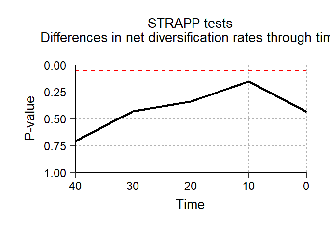

``` r

# This is the main output of deepSTRAPP. It shows the evolution of the significance of the STRAPP tests over time.
# This example highlights the importance of deepSTRAPP as the significance of STRAPP tests change over time. 
# Correlation between trait values and net diversification rates are not significant in the present (assuming a significant threshold of alpha = 0.05).
# Meanwhile, correlations were significant in the past between 5 My to 25 My (the green area).
# This result supports the idea that differences in biodiversity in relation to trait values (e.g., ant size) can be explained by correlations between rates and net diversification rates that occurred in the past.
# Without deepSTRAPP, this conclusion would not have been supported by current diversification rates alone.
```

``` r
### 4.2/ Plot histogram of STRAPP test stats ####

# Plot an histogram of the distribution of the test statistics used to assess the significance of STRAPP tests
  #  For a single 'focal_time': deepSTRAPP::plot_histogram_STRAPP_test_for_focal_time()
  #  For multiple 'time_steps': deepSTRAPP::plot_histograms_STRAPP_tests_over_time()

# ?deepSTRAPP::plot_histogram_STRAPP_test_for_focal_time
# ?deepSTRAPP::plot_histograms_STRAPP_tests_over_time

## These functions are used to provide visual illustration of the results of each STRAPP test. 
# They can be used to complement the provision of the statistical results summarized in Step 3.

# Display the time-steps
Ponerinae_deepSTRAPP_cont_old_calib_0_40$time_steps

# Plot the histogram of test stats for time-step n°3 = 10 My
plot_histogram_STRAPP_test_for_focal_time(
   deepSTRAPP_outputs = Ponerinae_deepSTRAPP_cont_old_calib_0_40,
   focal_time = 10)

# The black line represents the expected value under the null hypothesis H0 => Δ Spearman rho stat = 0.
# The histogram shows the distribution of the test statistics as observed across the 1000 posterior samples from BAMM.
# The red line represents the significance threshold for which 95% of the observed data exhibited a higher value that expected.
# Since this red line is above the null expectation (quantile 5% = 0.091), the test is significant for a value of alpha = 0.05.

# Plot the histograms of test stats for all time-steps
plot_histograms_STRAPP_tests_over_time(
   deepSTRAPP_outputs = Ponerinae_deepSTRAPP_cont_old_calib_0_40)
```

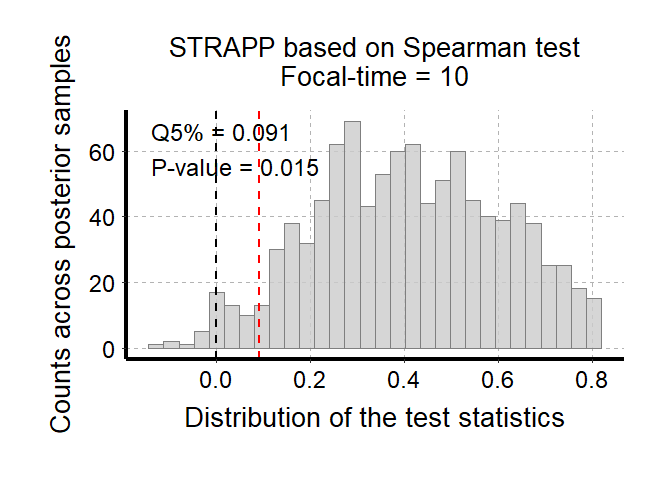

``` r
### 4.3/ Plot evolution of rates through time ~ trait data ####

# ?deepSTRAPP::plot_rates_through_time()

# Generate ggplot
plot_rates_through_time(deepSTRAPP_outputs = Ponerinae_deepSTRAPP_cont_old_calib_0_40,
                        plot_CI = TRUE)

# This plot helps to visualize how correlations between trait values and rates evolved over time.
# Here, their is "negative" correlation as ants in the lowest quartile of trait values (in blue) display the highest net diversification rates over time, 
# while ants in the highest quartile of trait values (in red) display the lowest net diversification rates over time.
# However, in the present, we recorded an increase in diversification rates that blurred these differences and led to a non-significant STRAPP test when comparing current rates.
# This plot, alongside results of deepSTRAPP, supports the Diversification Rate Hypothesis in showing how ant lineages with low trait values (e.g., small size)
# may have accumulated faster than ant lineages with high trait value (e.g., large size), especially between 5 to 25 My.

# N.B.: The increase of diversification rates recorded in the present may largely be artifactual, due to the fact some lineages in the present will go extinct in the future, but have not been recorded as such. 
# This bias is named the "pull of the present", and can impair evaluation of the Diversification Rate Hypothesis based only on current rates.
# deepSTRAPP offers a solution to this issue by investigating rate differences at any time in the past.
```

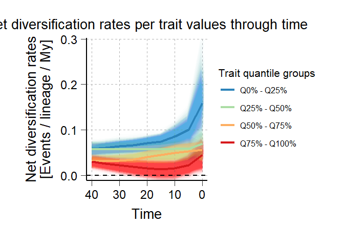

``` r
### 4.4/ Plot updated contMap mapping trait evolution for a given 'focal_time' ####

# ?deepSTRAPP::plot_contMap()

## These plots help to visualize the evolution of trait values across the phylogeny, and to focus on tip values at specific time-steps.

# Display the time-steps
Ponerinae_deepSTRAPP_cont_old_calib_0_40$time_steps
#> [1]  0  5 10 15 20 25 30 35 40

# Extract root age
root_age <- max(phytools::nodeHeights(Ponerinae_tree_old_calib)[,2])

## The next plot shows the evolution of trait values across the whole phylogeny (100-0 My).

# Plot initial contMap (t = 0)
contMap_0My <- Ponerinae_deepSTRAPP_cont_old_calib_0_40$updated_trait_data_with_Map_over_time[[1]]
plot_contMap(contMap_0My$contMap,
             color_scale = c("darkgreen", "limegreen", "orange", "red"))
abline(v = root_age - 20, col = "red", lty = 2) # Show where the phylogeny will be cut
```

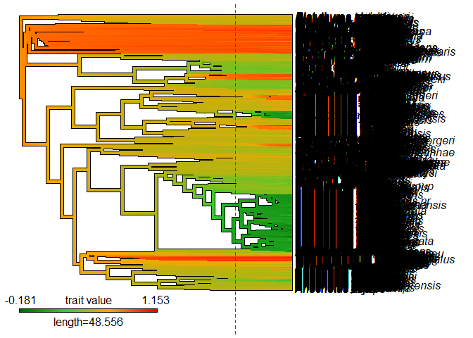

``` r

## The next plot shows the evolution of trait values from root to 20Mya (100-20 My).

# Plot updated contMap for time-step n°5 = 20 My
contMap_20My <- Ponerinae_deepSTRAPP_cont_old_calib_0_40$updated_trait_data_with_Map_over_time[[5]]
plot_contMap(contMap_20My$contMap,
             color_scale = c("darkgreen", "limegreen", "orange", "red"))
```

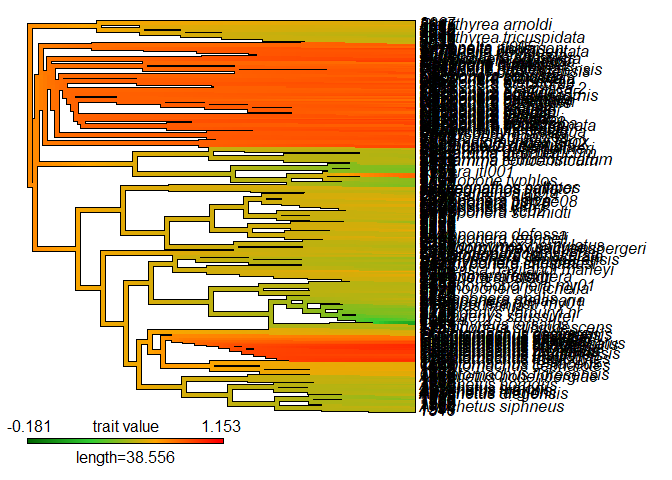

``` r
### 4.5/ Plot updated diversification rates and regimes for a given 'focal_time' ####

# ?deepSTRAPP::plot_BAMM_rates()

## These plots help to visualize the evolution of diversification rates across the phylogeny, and to focus on tip values at specific time-steps.

# Display the time-steps
Ponerinae_deepSTRAPP_cont_old_calib_0_40$time_steps

# Extract root age
root_age <- max(phytools::nodeHeights(Ponerinae_tree_old_calib)[,2])

## The next plot shows the evolution of net diversification rates across the whole phylogeny (100-0 My).

# Plot diversification rates on initial phylogeny (t = 0)
BAMM_map_0My <- Ponerinae_deepSTRAPP_cont_old_calib_0_40$updated_BAMM_objects_over_time[[1]]
plot_BAMM_rates(BAMM_map_0My, labels = FALSE, par.reset = FALSE)
abline(v = root_age - 20, col = "red", lty = 2) # Show where the phylogeny will be cut
title(main = "BAMM rates for 100-0 My")

## The next plot shows the evolution of net diversification rates from root to 20 Mya (100-20 My).

# Plot diversification rates on updated phylogeny for time-step n°5 = 20 My
BAMM_map_20My <- Ponerinae_deepSTRAPP_cont_old_calib_0_40$updated_BAMM_objects_over_time[[5]]
plot_BAMM_rates(BAMM_map_20My, labels = FALSE,
                colorbreaks = BAMM_map_20My$initial_colorbreaks$net_diversification)
title(main = "BAMM rates for 100-20 My")
```

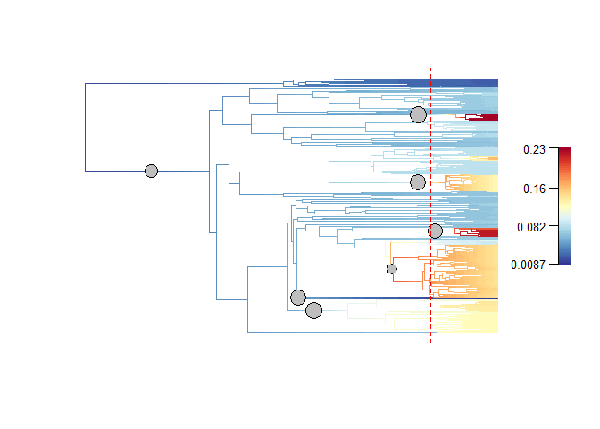

``` r
### 4.6/ Plot both trait evolution and diversification rates and regimes updated for a given 'focal_time' ####

# ?deepSTRAPP::plot_trait_vs_rate_maps_for_focal_time()

## These plots help to visualize simultaneously the evolution of trait and diversification rates across the phylogeny, and to focus on tip values at specific time-steps.

# Display the time-steps
Ponerinae_deepSTRAPP_cont_old_calib_0_40$time_steps

## The next plot shows the evolution of trait values and rates across the whole phylogeny (100-0 My).

# Plot diversification rates on initial phylogeny (t = 0)
plot_trait_vs_rate_maps_for_focal_time(
  deepSTRAPP_outputs = Ponerinae_deepSTRAPP_cont_old_calib_0_40,
  focal_time = 0,
  ftype = "off", lwd = 0.7,
  color_scale = c("darkgreen", "limegreen", "orange", "red"),
  labels = FALSE, legend = FALSE,
  par.reset = FALSE)

## The next plot shows the evolution of trait values and rates from root to 20 Mya (100-20 My).

# Plot diversification rates on updated phylogeny for time-step n°5 = 20 My
plot_trait_vs_rate_maps_for_focal_time(
  deepSTRAPP_outputs = Ponerinae_deepSTRAPP_cont_old_calib_0_40,
  focal_time = 20, 
  ftype = "off", lwd = 1.2,
  color_scale = c("darkgreen", "limegreen", "orange", "red"),
  labels = FALSE, legend = FALSE,
  par.reset = FALSE)
```

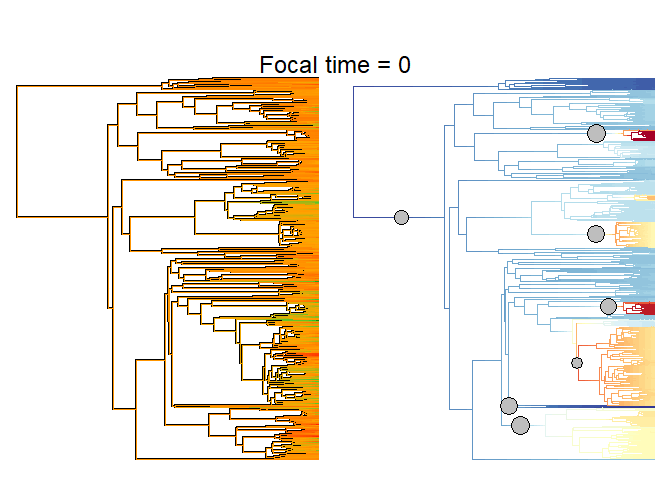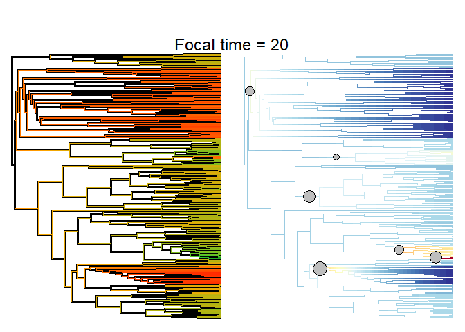

## Full deepSTRAPP workflow for Categorical trait data

This is a simple example that shows how deepSTRAPP can be used to test
for differences in diversification rates between multiple (three)
categorical states along evolutionary times. It presents the main
functions in a typical deepSTRAPP workflow.

For an example with binary data (2 levels), please see the example in
the main tutorial: **(ADD A LINK)** For an example with continuous data,
see this vignette: **(ADD A LINK)**

Please note that the trait data and phylogeny calibration used in this
example are not valid biological data. They were modified in order to
provide results illustrating the usefulness of deepSTRAPP.

``` r
# ------ Step 0: Load data ------ #

## Load trait df
data(Ponerinae_trait_tip_data, package = "deepSTRAPP")

dim(Ponerinae_trait_tip_data)
View(Ponerinae_trait_tip_data)

# Extract categorical data with 3-levels
Ponerinae_cat_3lvl_tip_data <- setNames(object = Ponerinae_trait_tip_data$fake_cat_3lvl_data,
                                    nm = Ponerinae_trait_tip_data$Taxa)
table(Ponerinae_cat_3lvl_tip_data)

## Select color scheme for states
colors_per_states <- c("forestgreen", "sienna", "goldenrod")
names(colors_per_states) <- c("arboreal", "subterranean", "terricolous")

## Load phylogeny with old time-calibration
data(Ponerinae_tree_old_calib, package = "deepSTRAPP")

plot(Ponerinae_tree_old_calib)
ape::Ntip(Ponerinae_tree_old_calib) == length(Ponerinae_cat_3lvl_tip_data)

## Check that trait data and phylogeny are named and ordered similarly
all(names(Ponerinae_cat_3lvl_tip_data) == Ponerinae_tree_old_calib$tip.label)

## Reorder trait data as in phylogeny
Ponerinae_cat_3lvl_tip_data <- Ponerinae_cat_3lvl_tip_data[match(x = Ponerinae_tree_old_calib$tip.label, table = names(Ponerinae_cat_3lvl_tip_data))]

## Plot data on tips for visualization
pdf(file = "./Ponerinae_cat_3lvl_data_old_calib_on_phylo.pdf", width = 20, height = 150)

# Set plotting parameters
par(mar = c(0.1,0.1,0.1,0.1), oma = c(0,0,0,0)) # bltr
# Graph presence/absence using plotTree.datamatrix
range_map <- phytools::plotTree.datamatrix(
  tree = Ponerinae_tree_old_calib,
  X = as.data.frame(Ponerinae_cat_3lvl_tip_data),
  fsize = 0.7, yexp = 1.1,
  header = TRUE, xexp = 1.25,
  colors = colors_per_states)

# Get plot info in "last_plot.phylo"
plot_info <- get("last_plot.phylo", envir=.PlotPhyloEnv)

# Add time line

# Extract root age
root_age <- max(phytools::nodeHeights(Ponerinae_tree_old_calib))

# Define ticks
# ticks_labels <- seq(from = 0, to = 100, by = 20)
ticks_labels <- seq(from = 0, to = 120, by = 20)
axis(side = 1, pos = 0, at = (-1 * ticks_labels) + root_age, labels = ticks_labels, cex.axis = 1.5)
legend(x = root_age/2,
       y = 0 - 5, adj = 0,
       bty = "n", legend = "", title = "Time  [My]", title.cex = 1.5)

# Add a legend
legend(x = plot_info$x.lim[2] - 10,
       y = mean(plot_info$y.lim),
       # adj = c(0,0),
       # x = "topleft",
       legend = c("Absence", "Presence"),
       pch = 22, pt.bg = c("white","gray30"), pt.cex =  1.8,
       cex = 1.5, bty = "n")

dev.off()


## Inputs needed for Step 1 are the tip_data (Ponerinae_cat_3lvl_tip_data) and the phylogeny (Ponerinae_tree_old_calib), and optionally, a color scheme (colors_per_states).
```

``` r
# ------ Step 1: Prepare trait data ------ #

## Goal: Map trait evolution on the time-calibrated phylogeny

# 1.1/ Fit evolutionary models to trait data using Maximum Likelihood.
# 1.2/ Select the best fitting model comparing AICc.
# 1.3/ Infer ancestral characters estimates (ACE) at nodes.
# 1.4/ Run stochastic mapping simulations to generate evolutionary histories
#      compatible with the best model and inferred ACE.
# 1.5/ Infer ancestral states along branches.
#  - Compute posterior frequencies of each state to produce a `densityMap` for each state.

library(deepSTRAPP)

# All these actions are performed by a single function: deepSTRAPP::prepare_trait_data()
?deepSTRAPP::prepare_trait_data()

# Run prepare_trait_data with default options
# For categorical trait, an ARD model is assumed by default.
Ponerinae_trait_object <- prepare_trait_data(
   tip_data = Ponerinae_cat_3lvl_tip_data,
   phylo = Ponerinae_tree_old_calib,
   trait_data_type = "categorical",
   colors_per_levels = colors_per_states,
   nb_simulations = 100, # Reduce number of simulations to save time
   seed = 1234) # Set seed for reproducibility

# Explore output
str(Ponerinae_trait_object, 1)

# Extract the densityMaps representing the posterior probabilities of states on the phylogeny
Ponerinae_densityMaps <- Ponerinae_trait_object$densityMaps

# Plot ancestral states as a single continuously mapped phylogeny overlaying all state posterior probabilities
plot_densityMaps_overlay(Ponerinae_densityMaps,
                         colors_per_levels = colors_per_states)

# Plot posterior probabilities of each state on an independent densityMap
# Plot densityMap for state = "arboreal"
plot(Ponerinae_densityMaps[[1]])
# Plot densityMap for state = "subterranean"
plot(Ponerinae_densityMaps[[2]])
# Plot densityMap for state = "terricolous"
plot(Ponerinae_densityMaps[[3]])

# Extract the Ancestral Character Estimates (ACE) = trait values at nodes
Ponerinae_ACE <- Ponerinae_trait_object$ace
head(Ponerinae_ACE)


## Inputs needed for Step 2 are the densityMaps, and optionally, the tip_data (Ponerinae_cat_3lvl_tip_data), and the ACE (Ponerinae_ACE)
```

``` r
# ------ Step 2: Prepare diversification data ------ #

## Goal: Map evolution of diversification rates and regime shifts on the time-calibrated phylogeny

# Run a BAMM (Bayesian Analysis of Macroevolutionary Mixtures)

# You need the BAMM C++ program installed in your machine to run this step.
# See the BAMM website: http://bamm-project.org/ and the companion R package [BAMMtools].

# 2.1/ Set BAMM - Record BAMM settings and generate all input files needed for BAMM.
# 2.2/ Run BAMM - Run BAMM and move output files in dedicated directory.
# 2.3/ Evaluate BAMM - Produce evaluation plots and ESS data.
# 2.4/ Import BAMM outputs - Load `BAMM_object` in R and subset posterior samples.
# 2.5/ Clean BAMM files - Remove files generated during the BAMM run.

# All these actions are performed by a single function: deepSTRAPP::prepare_diversification_data()
?deepSTRAPP::prepare_diversification_data()

# Run BAMM workflow with deepSTRAPP
## This step is time-consuming. You can skip it and load directly the result if needed
Ponerinae_BAMM_object <- prepare_diversification_data(
   BAMM_install_directory_path = "./software/bamm-2.5.0/", # To adjust to your own path to BAMM
   phylo = Ponerinae_tree_old_calib,
   prefix_for_files = "Ponerinae_old_calib",
   seed = 1234, # Set seed for reproducibility
   numberOfGenerations = 10^7 # Set high for optimal run, but will take a long time
)

# Load directly the result
data(Ponerinae_BAMM_object_old_calib)

# Explore output
str(Ponerinae_BAMM_object_old_calib, 1)
str(Ponerinae_BAMM_object_old_calib$eventData, 1) # Record the regime shift events and macroevolutionary regimes parameters across posterior samples
head(Ponerinae_BAMM_object_old_calib$meanTipLambda) # Mean speciation rates at tips aggregated across all posterior samples
head(Ponerinae_BAMM_object_old_calib$meanTipMu) # Mean extinction rates at tips aggregated across all posterior samples

## Explain what MAP and MSC are about, and what I improved compared to BAMMtools (aggregation of mean shift location along branches)

#'   Additional elements providing key information for downstream analyses:
#'   * `$expectedNumberOfShifts` Integer. The expected number of regime shifts used to set the prior in BAMM.
#'   * `$MSP_tree` Object of class `phylo`. List of 4 elements duplicating information from the Phylogeny-related elements above,
#'      except `$MSP_tree$edge.length` is recording the Marginal Shift Probability of each branch (i.e., the probability of a regime shift to occur along each branch)
#'   * `$MAP_indices` Vector of integers. The indices of the Maximum A Posteriori probability (MAP) configurations among the posterior samples.
#'   * `$MAP_BAMM_object`. List of 18 elements of class `"bammdata" recording the mean rates and regime shift locations found across
#'      the Maximum A Posteriori probability (MAP) configurations. All BAMM elements summarizing diversification data holds a single entry describing
#'      this mean diversification history.
#'   * `$MSC_indices` Vector of integers. The indices of the Maximum Shift Credibility (MSC) configurations among the posterior samples.
#'   * `$MSC_BAMM_object` List of 18 elements of class `"bammdata" recording the mean rates and regime shift locations found across
#'      the Maximum Shift Credibility (MSC) configurations. All BAMM elements summarizing diversification data holds a single entry describing
#'      this mean diversification history.

# Plot mean net diversification rates and regime shifts on the phylogeny
plot_BAMM_rates(Ponerinae_BAMM_object_old_calib,
                labels = FALSE, legend = TRUE)

## Input needed for Step 3 is the BAMM_object (Ponerinae_BAMM_object)
```

``` r
# ------ Step 3: Run a deepSTRAPP workflow ------ #

## Goal: Extract traits, diversification rates and regimes at a given time in the past to test for differences with a STRAPP test

# 3.1/ Extract trait data at a given time in the past ('focal_time')
# 3.2/ Extract diversification rates and regimes at a given time in the past ('focal_time')
# 3.3/ Compute STRAPP test
# 3.4/ Repeat previous actions for many timesteps along evolutionary time

# Because we have three levels as trait data, two types of tests can be performed:
#  - Overall Kruskal-Wallis tests that test for rate differences across all states at once.
#  - post hoc pairwise Dunn's tests that test for rate differences between pairs of states.
# Here, we select 'posthoc_pairwise_tests = TRUE' to conduct post hoc pairwise tests in addition to overall Kruskal-Wallis tests.

# All these actions are performed by a single function:
#  For a single 'focal_time': deepSTRAPP::run_deepSTRAPP_for_focal_time()
#  For multiple 'time_steps': deepSTRAPP::run_deepSTRAPP_over_time()
?deepSTRAPP::run_deepSTRAPP_for_focal_time()
?deepSTRAPP::run_deepSTRAPP_over_time()

## Set for five time steps of 5 My. Will generate deepSTRAPP workflows for 0 to 40 Mya.
time_step_duration <- 5
time_range <- c(0, 40)

# Run deepSTRAPP on net diversification rates
## This step is time-consuming. You can skip it and load directly the result if needed
Ponerinae_deepSTRAPP_cat_3lvl_old_calib_0_40 <- run_deepSTRAPP_over_time(
    densityMaps = Ponerinae_densityMaps,
    ace = Ponerinae_ACE,
    tip_data = Ponerinae_cat_3lvl_data,
    trait_data_type = "categorical",
    BAMM_object = Ponerinae_BAMM_object_old_calib,
    time_range = time_range,
    time_step_duration = time_step_duration,
    seed = 1234, # Set seed for reproducibility
    alpha = 0.10, # Set significance threshold to use for tests
    posthoc_pairwise_tests = TRUE, # To run pairwise posthoc tests between pairs of states
    return_perm_data = TRUE, # Needed to obtain STRAPP stats and plot evaluation histograms (See 4.2)
    extract_trait_data_melted_df = TRUE, # Needed to get trait data and plot rates through time (See 4.3)
    extract_diversification_data_melted_df = TRUE, # Needed to get diversification data and plot rates through time (See 4.3)
    return_STRAPP_results = TRUE, # Needed to obtain STRAPP stats and plot evaluation histograms (See 4.2)
    return_updated_trait_data_with_Map = TRUE, # Needed to plot updated densityMaps (See 4.4)
    return_updated_BAMM_object = TRUE, # Needed to map diversification rates on updated phylogenies (See 4.5)
    verbose = TRUE,
    verbose_extended = TRUE)

# Load the deepSTRAPP output summarizing results for 0 to 40 My
data(Ponerinae_deepSTRAPP_cat_3lvl_old_calib_0_40, package = "deepSTRAPP")

## Explore output
str(Ponerinae_deepSTRAPP_cat_3lvl_old_calib_0_40, max.level = 1)

# See next step for how to generate plots from those outputs

# Display test summaries
# Can be passed down to [deepSTRAPP::plot_STRAPP_pvalues_over_time()] to generate a plot
# showing the evolution of the test results across time

# For overall Kruskal-Wallis tests over time-steps
Ponerinae_deepSTRAPP_cat_3lvl_old_calib_0_40$pvalues_summary_df
# For posthoc pairwise Dunn's tests over time-steps
Ponerinae_deepSTRAPP_cat_3lvl_old_calib_0_40$pvalues_summary_df_for_posthoc_pairwise_tests

# Access STRAPP test results
# Can be passed down to [deepSTRAPP::plot_histograms_STRAPP_tests_over_time()] to generate plot
# showing the null distribution of the test statistics

# For overall Kruskal-Wallis tests over time-steps
str(Ponerinae_deepSTRAPP_cat_3lvl_old_calib_0_40$STRAPP_results, max.level = 2)
# For posthoc pairwise Dunn's tests over time-steps
# Results are found in the '$posthoc_pairwise_tests' element of each 'STRAPP_result'.
str(lapply(X = Ponerinae_deepSTRAPP_cat_3lvl_old_calib_0_40$STRAPP_results, FUN = function (x) { x$posthoc_pairwise_tests } ), max.level = 3)

# Access trait data in a melted data.frame
head(Ponerinae_deepSTRAPP_cat_3lvl_old_calib_0_40$trait_data_df_over_time)
# Access the diversification data in a melted data.frame
head(Ponerinae_deepSTRAPP_cat_3lvl_old_calib_0_40$diversification_data_df_over_time)
# Both can be passed down to [deepSTRAPP::plot_rates_through_time()] to generate a plot
# showing the evolution of diversification rates though time in relation to trait values

# Access updated densityMaps for each focal time
# Can be used to plot densityMaps with branch cut-off at focal time with [deepSTRAPP::plot_densityMaps_overlay()]
str(Ponerinae_deepSTRAPP_cat_3lvl_old_calib_0_40$updated_trait_data_with_Map_over_time, max.level = 2)

# Access updated BAMM_object for each focal time
# Can be used to map rates and regime shifts on phylogeny with branch cut-off 
# at focal time with [deepSTRAPP::plot_BAMM_rates()]
str(Ponerinae_deepSTRAPP_cat_3lvl_old_calib_0_40$updated_BAMM_objects_over_time, max.level = 2)

## Input needed for Step 4 is the deepSTRAPP object (Ponerinae_deepSTRAPP_cat_3lvl_old_calib_0_40)
```

``` r
# ------ Step 4: Plot results ------ #

## Goal: Summarize the outputs in meaningful plots

# 4.1/ Plot evolution of STRAPP tests p-values through time
# 4.2/ Plot histogram of STRAPP test stats
# 4.3/ Plot evolution of rates though time in relation to trait values
# 4.4/ Plot updated densityMaps mapping trait evolution for a given 'focal_time'
# 4.5/ Plot updated diversification rates and regimes for a given 'focal_time'
# 4.6/ Combine 4.4 and 4.5 to plot both mapped phylogenies with trait evolution (4) and diversification rates and regimes (5).

# Each plot is achieve through a dedicated function

# Load the deepSTRAPP output summarizing results for 0 to 40 My
data(Ponerinae_deepSTRAPP_cat_3lvl_old_calib_0_40, package = "deepSTRAPP")

### 4.1/ Plot evolution of STRAPP tests p-values through time ####

# ?deepSTRAPP::plot_STRAPP_pvalues_over_time()

## 4.1.1/ Plot results of overall Kruskal-Wallis tests over time

deepSTRAPP::plot_STRAPP_pvalues_over_time(
   deepSTRAPP_outputs = Ponerinae_deepSTRAPP_cat_3lvl_old_calib_0_40,
   alpha = 0.10)


# This is the main output of deepSTRAPP. They show the evolution of the significance of the STRAPP tests over time.
# Here, overall Kruskal-Wallis tests for rate difference across all states (i.e., habitats) are shown.
# This example highlights the importance of deepSTRAPP as the significance of STRAPP tests change over time. 
# Differences in net diversification rates are not significant in the present (assuming a significant threshold of alpha = 0.10).
# Meanwhile, rates are significantly different in the past between 5 My to 15 My (the green area).
# This result supports the idea that differences in biodiversity across habitats (i.e., "arboreal" vs. , "subterranean" vs. "terricolous" ants) can be explained by differences of diversification rates that was detected in the past.
# Without deepSTRAPP, this conclusion would not have been supported by current diversification rates alone.

# Note: This is NOT true ecological data. It is not a valid scientific result, but an illustration of the use of deepSTRAPP.

# A next step is to look in details into rate differences across pairs of states (i.e., habitats).
# For this, we can plot the results of the post hoc pairwise tests.

## 4.1.2/ Plot results of posthoc pairwise Dunn's tests over time

deepSTRAPP::plot_STRAPP_pvalues_over_time(
   deepSTRAPP_outputs = Ponerinae_deepSTRAPP_cat_3lvl_old_calib_0_40,
   plot_posthoc_tests = TRUE) # To plot results of post hoc pairwise tests instead

# Here, post hoc pairwise Dunn's tests for rate difference between pairs of states are shown.
# These results show that differences in rates were only detected between "arboreal" and "terricolous" ants between 2 My to 15 My (the green area), providing more detailed insights on
# how type of habitats may affect diversification rates (Note: This is NOT true ecological data. It is not a valid scientific result, but an illustration of the use of deepSTRAPP).
# This highlights the critical use of deepSTRAPP in revealing differences in diversification rates occurring in the past, that may drive current biodiversity patterns.
```

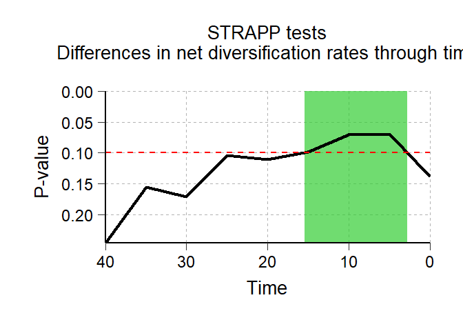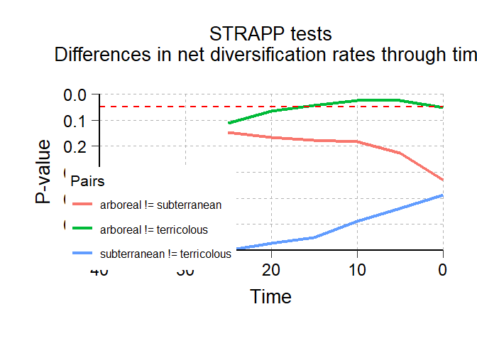

``` r
### 4.2/ Plot histogram of STRAPP test stats ####

# Plot an histogram of the distribution of the test statistics used to assess the significance of STRAPP tests
  #  For a single 'focal_time': deepSTRAPP::plot_histogram_STRAPP_test_for_focal_time()
  #  For multiple 'time_steps': deepSTRAPP::plot_histograms_STRAPP_tests_over_time()

# ?deepSTRAPP::plot_histogram_STRAPP_test_for_focal_time
# ?deepSTRAPP::plot_histograms_STRAPP_tests_over_time

## These functions are used to provide visual illustration of the results of each STRAPP test. 
# They can be used to complement the provision of the statistical results summarized in Step 3.

# Display the time-steps
Ponerinae_deepSTRAPP_cat_3lvl_old_calib_0_40$time_steps

## 4.2.1/ Plot results from overall Kruskal-Wallis tests across all states ####

# Plot the histogram of overall Kruskal-Wallis stats for time-step n°3 = 10 My
plot_histogram_STRAPP_test_for_focal_time(
   deepSTRAPP_outputs = Ponerinae_deepSTRAPP_cat_3lvl_old_calib_0_40,
   focal_time = 10)

# The black line represents the expected value under the null hypothesis H0 => Δ Kruskal-Wallis H-stat = 0.
# The histogram shows the distribution of the test statistics as observed across the 1000 posterior samples from BAMM.
# The red line represents the significance threshold for which 90% of the observed data exhibited a higher value that expected.
# Since this red line is below the null expectation (quantile 10% = 6.942), the test is significant for a value of alpha = 0.10.
# However, this significance must be discussed in regards to the relatively generous significance threshold chosen here (alpha = 0.10).

# Plot the histograms of overall Kruskal-Wallis stats for all time-steps
plot_histograms_STRAPP_tests_over_time(
   deepSTRAPP_outputs = Ponerinae_deepSTRAPP_cat_3lvl_old_calib_0_40)

## 4.2.2/ Plot results from posthoc pairwise Dunn's tests between pairs of states ####

# Plot the histogram of posthoc pairwise Dunn's stats for time-step n°3 = 10 My
plot_histogram_STRAPP_test_for_focal_time(
   deepSTRAPP_outputs = Ponerinae_deepSTRAPP_cat_3lvl_old_calib_0_40,
   plot_posthoc_tests = TRUE, # To plot results of post hoc pairwise tests instead
   focal_time = 10)

# Each facet represent a pairwise post hoc test conducted across a given pair of states.
# In each facet, the black line represents the expected value under the null hypothesis H0 => Δ Dunn's Z-stat = 0.
# The red line represents the significance threshold for which 90% of the observed data exhibited a higher value that expected.
# This red line is below the null expectation for the "arboreal != subterranean" and "subterranean != terricolous" pairs. This means the test is not significant for these pairs of habitats.
# The red line is above the null expectation for the "arboreal != terricolous" pair (Q10% = 1.695, p = 0.025). This means the test is significant for this pair of habitat.
# This is the pair that is driving the significance detected in the previous plot when looking at differences across all habitats.
# This significance must still be discussed in regards to the relatively generous significance threshold chosen here (alpha = 0.10).

# Plot the histograms of posthoc pairwise Dunn's stats for all time-steps
plot_histograms_STRAPP_tests_over_time(
   deepSTRAPP_outputs = Ponerinae_deepSTRAPP_cat_3lvl_old_calib_0_40,
   plot_posthoc_tests = TRUE) # To plot results of post hoc pairwise tests instead
```

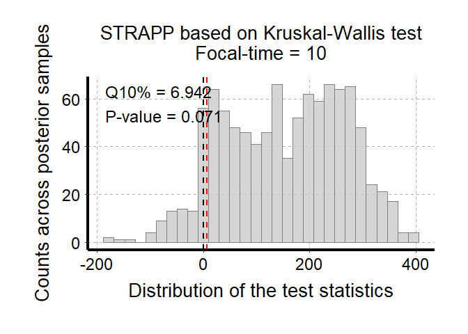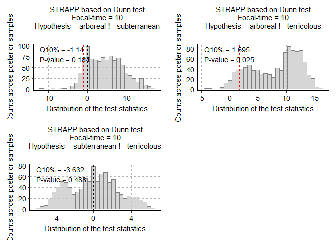

``` r
### 4.3/ Plot evolution of rates through time ~ trait data ####

# ?deepSTRAPP::plot_rates_through_time()

# Generate ggplot
plot_rates_through_time(deepSTRAPP_outputs = Ponerinae_deepSTRAPP_cat_3lvl_old_calib_0_40,
                        colors_per_levels = colors_per_states,
                        plot_CI = TRUE)

# This plot helps to visualize how differences in rates evolved over time.

# You can see that both type of ants "arboreal" and "terricolous" had fairly different rates over time, with differences detected as significant between 2 to 15 My.
# Meanwhile, "subterranean" ants exhibited intermediate diversification levels.
# This plot, alongside results of deepSTRAPP, supports the Diversification Rate Hypothesis in showing how "terricolous" ant lineages may have accumulated faster, especially between 2 to 15 My.
# It hints that "terricolous" ant lineages are fairly recent as no lineage in this state/habitat is inferred to have existed before 25 Mya.
# The larger uncertainty across estimates of diversification rates for "terricolous" ant lineages also hints to their relatively lower number due to their recent emergence.

# Note: This is NOT true ecological data. It is not a valid scientific result, but an illustration of the use of deepSTRAPP.
```

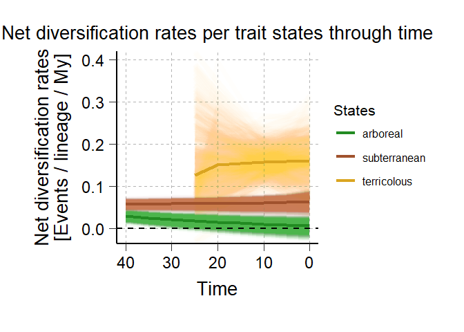

``` r
### 4.4/ Plot updated densityMaps mapping trait evolution for a given 'focal_time' ####

# ?deepSTRAPP::plot_densityMaps_overlay()

## These plots help to visualize the evolution of states across the phylogeny, and to focus on tip values at specific time-steps.

# Display the time-steps
Ponerinae_deepSTRAPP_cat_3lvl_old_calib_0_40$time_steps

## The next plot shows the evolution of states across the whole phylogeny (100-0 My).

# Plot initial densityMaps (t = 0)
densityMaps_0My <- Ponerinae_deepSTRAPP_cat_3lvl_old_calib_0_40$updated_trait_data_with_Map_over_time[[1]]
plot_densityMaps_overlay(densityMaps_0My$densityMaps,
                         colors_per_levels = colors_per_states)
title(main = "Trait evolution for 100-0 My")

# It highlights the relatively recent emergence of "terricolous" ants (in this fake illustrative dataset), where no lineages exhibit this state in deep times.

## The next plot shows the evolution of states from root to 10 Mya (100-10 My).

# Plot updated densityMaps for time-step n°3 = 10 My
densityMaps_10My <- Ponerinae_deepSTRAPP_cat_3lvl_old_calib_0_40$updated_trait_data_with_Map_over_time[[3]]
plot_densityMaps_overlay(densityMaps_10My$densityMaps,
                         colors_per_levels = colors_per_states)
title(main = "Trait evolution for 100-10 My")

## The next plot shows the evolution of states from root to 40 Mya (100-40 My).

# Plot updated densityMaps for time-step n°9 = 40 My
densityMaps_40My <- Ponerinae_deepSTRAPP_cat_3lvl_old_calib_0_40$updated_trait_data_with_Map_over_time[[9]]
plot_densityMaps_overlay(densityMaps = densityMaps_40My$densityMaps,
                         colors_per_levels = colors_per_states)
title(main = "Trait evolution for 100-40 My")

# In this fake illustrative dataset, no ant lineages are inferred in "terricolous" habitats 40 Mya.
```

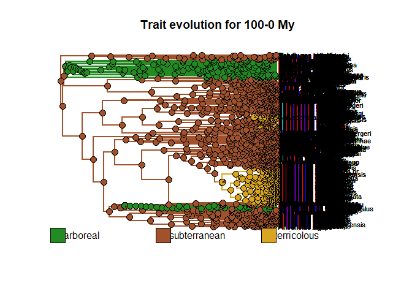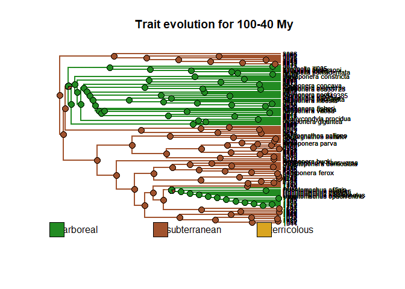

``` r
### 4.5/ Plot updated diversification rates and regimes for a given 'focal_time' ####

# ?deepSTRAPP::plot_BAMM_rates()

## These plots help to visualize the evolution of diversification rates across the phylogeny, and to focus on tip values at specific time-steps.

# Display the time-steps
Ponerinae_deepSTRAPP_cat_3lvl_old_calib_0_40$time_steps

# Extract root age
root_age <- max(phytools::nodeHeights(Ponerinae_tree_old_calib)[,2])

## The next plot shows the evolution of diversification rates across the whole phylogeny (100-0 My).

# Plot diversification rates on initial phylogeny (t = 0)
BAMM_map_0My <- Ponerinae_deepSTRAPP_cat_3lvl_old_calib_0_40$updated_BAMM_objects_over_time[[1]]
plot_BAMM_rates(BAMM_map_0My, labels = FALSE, par.reset = FALSE)
abline(v = root_age - 10, col = "red", lty = 2) # Show where the phylogeny will be cut at 10 Mya
abline(v = root_age - 40, col = "red", lty = 2) # Show where the phylogeny will be cut at 40 Mya
title(main = "BAMM rates for 100-0 My")

## The next plot shows the evolution of diversification rates from root to 10 Mya (100-10 My).

# Plot diversification rates on updated phylogeny for time-step n°3 = 10 My
BAMM_map_10My <- Ponerinae_deepSTRAPP_cat_3lvl_old_calib_0_40$updated_BAMM_objects_over_time[[3]]
plot_BAMM_rates(BAMM_map_10My, labels = FALSE,
                colorbreaks = BAMM_map_10My$initial_colorbreaks$net_diversification)
title(main = "BAMM rates for 100-10 My")

## The next plot shows the evolution of diversification rates from root to 40 Mya (100-40 My).

# Plot diversification rates on updated phylogeny for time-step n°9 = 40 My
BAMM_map_40My <- Ponerinae_deepSTRAPP_cat_3lvl_old_calib_0_40$updated_BAMM_objects_over_time[[9]]
plot_BAMM_rates(BAMM_map_40My, labels = FALSE,
                colorbreaks = BAMM_map_40My$initial_colorbreaks$net_diversification)
title(main = "BAMM rates for 100-40 My")
```


``` r
### 4.6/ Plot both trait evolution and diversification rates and regimes updated for a given 'focal_time' ####

# ?deepSTRAPP::plot_trait_vs_rate_maps_for_focal_time()

## These plots help to visualize simultaneously the evolution of trait and diversification rates across the phylogeny, and to focus on tip values at specific time-steps.

# Display the time-steps
Ponerinae_deepSTRAPP_cat_3lvl_old_calib_0_40$time_steps

## The next plot shows the evolution of states and rates across the whole phylogeny (100-0 My).

# Plot both mapped phylogenies in the present (t = 0)
plot_trait_vs_rate_maps_for_focal_time(
  deepSTRAPP_outputs = Ponerinae_deepSTRAPP_cat_3lvl_old_calib_0_40,
  focal_time = 0,
  ftype = "off", lwd = 0.7,
  colors_per_levels = colors_per_states,
  labels = FALSE, legend = FALSE,
  par.reset = FALSE)

## The next plot shows the evolution of states and rates from root to 10 Mya (100-10 My).

# Plot both mapped phylogenies for time-step n°3 = 10 My
plot_trait_vs_rate_maps_for_focal_time(
  deepSTRAPP_outputs = Ponerinae_deepSTRAPP_cat_3lvl_old_calib_0_40,
  focal_time = 10, 
  ftype = "off", lwd = 1.2,
  colors_per_levels = colors_per_states,
  labels = FALSE, legend = FALSE,
  par.reset = FALSE)

## The next plot shows the evolution of states and rates from root to 40 Mya (100-40 My).

# Plot both mapped phylogenies for time-step n°9 = 40 My
plot_trait_vs_rate_maps_for_focal_time(
  deepSTRAPP_outputs = Ponerinae_deepSTRAPP_cat_3lvl_old_calib_0_40,
  focal_time = 40, 
  ftype = "off", lwd = 1.2,
  colors_per_levels = colors_per_states,
  labels = FALSE, legend = FALSE,
  par.reset = FALSE)
```

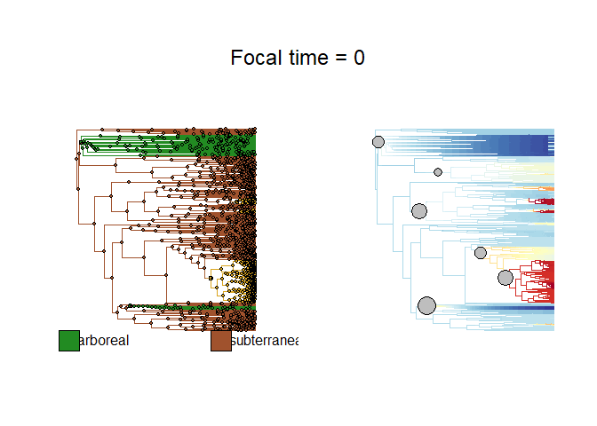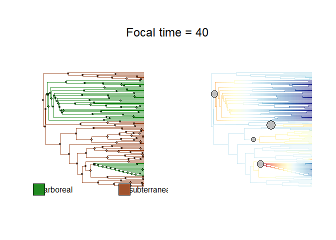

## Full deepSTRAPP workflow for Biogeographic data

This is a simple example that shows how deepSTRAPP can be used to test
for differences in diversification rates between two biogeographic
areas. It presents the main functions in a typical deepSTRAPP workflow.

For an example with categorical binary data (2 levels), please see the
example in the main tutorial: **(ADD A LINK)** For an example with
categorical multinominal data, see this vignette: **(ADD A LINK)** For
an example with continuous data, see this vignette: **(ADD A LINK)**

Please note that the phylogeny calibration used in this example is not
valid biological data. It was adjusted in order to provide results
illustrating the usefulness of deepSTRAPP.

``` r
# ------ Step 0: Load data ------ #

## Load range data
data(Ponerinae_binary_range_table, package = "deepSTRAPP")

dim(Ponerinae_binary_range_table)
View(Ponerinae_binary_range_table)

## Prepare range data for Old World vs. New World

# No overlap in ranges in current taxa
table(Ponerinae_binary_range_table$Old_World, Ponerinae_binary_range_table$New_World)

Ponerinae_NO_tip_data <- stats::setNames(object = Ponerinae_binary_range_table$Old_World,
                                     nm = Ponerinae_binary_range_table$Taxa)
Ponerinae_NO_tip_data <- as.character(Ponerinae_NO_tip_data)
Ponerinae_NO_tip_data[Ponerinae_NO_tip_data == "TRUE"] <- "O" # O = Old World
Ponerinae_NO_tip_data[Ponerinae_NO_tip_data == "FALSE"] <- "N" # N = New World
names(Ponerinae_NO_tip_data) <- Ponerinae_binary_range_table$Taxa
table(Ponerinae_NO_tip_data)


# Select color scheme for ranges
colors_per_ranges <- c("mediumpurple2", "peachpuff2")
names(colors_per_ranges) <- c("N", "O")

## Load phylogeny
data(Ponerinae_tree_old_calib, package = "deepSTRAPP")

plot(Ponerinae_tree_old_calib)
ape::Ntip(Ponerinae_tree_old_calib) == length(Ponerinae_NO_tip_dataPonerinae_NO_tip_data)

## Check that trait data and phylogeny are named and ordered similarly
all(names(Ponerinae_NO_tip_data) == Ponerinae_tree_old_calib$tip.label)

## Reorder trait data as in phylogeny
Ponerinae_NO_tip_data <- Ponerinae_NO_tip_data[match(x = Ponerinae_tree_old_calib$tip.label, table = names(Ponerinae_NO_tip_data))]


## Plot data on tips for visualization
pdf(file = "./Ponerinae_biogeo_data_old_calib_on_phylo.pdf", width = 20, height = 150)

# Set plotting parameters
par(mar = c(0.1,0.1,0.1,0.1), oma = c(0,0,0,0)) # bltr
# Graph presence/absence using plotTree.datamatrix
range_map <- phytools::plotTree.datamatrix(
  tree = Ponerinae_tree_old_calib,
  X = as.data.frame(Ponerinae_NO_tip_data),
  fsize = 0.7, yexp = 1.1,
  header = TRUE, xexp = 1.25,
  colors = colors_per_ranges)

# Get plot info in "last_plot.phylo"
plot_info <- get("last_plot.phylo", envir=.PlotPhyloEnv)

# Add time line

# Extract root age
root_age <- max(phytools::nodeHeights(Ponerinae_tree_old_calib))

# Define ticks
# ticks_labels <- seq(from = 0, to = 100, by = 20)
ticks_labels <- seq(from = 0, to = 120, by = 20)
axis(side = 1, pos = 0, at = (-1 * ticks_labels) + root_age, labels = ticks_labels, cex.axis = 1.5)
legend(x = root_age/2,
       y = 0 - 5, adj = 0,
       bty = "n", legend = "", title = "Time  [My]", title.cex = 1.5)

# Add a legend
legend(x = plot_info$x.lim[2] - 10,
       y = mean(plot_info$y.lim),
       # adj = c(0,0),
       # x = "topleft",
       legend = c("Absence", "Presence"),
       pch = 22, pt.bg = c("white","gray30"), pt.cex =  1.8,
       cex = 1.5, bty = "n")

dev.off()

## Inputs needed for Step 1 are the tip_data (Ponerinae_NO_tip_data) and the phylogeny (Ponerinae_tree_old_calib), and optionally, a color scheme (colors_per_ranges).
```

``` r
# ------ Step 1: Prepare trait data ------ #

## Goal: Map trait evolution on the time-calibrated phylogeny

# 1.1/ Fit evolutionary models to trait data using Maximum Likelihood.
# 1.2/ Select the best fitting model comparing AICc.
# 1.3/ Infer ancestral characters estimates (ACE) at nodes.
# 1.4/ Run stochastic mapping simulations to generate evolutionary histories
#      compatible with the best model and inferred ACE. (Only for categorical and biogeographic data)
# 1.5/ Infer ancestral states along branches.
#  - For continuous traits: use interpolation to produce a `contMap`.
#  - For categorical and biogeographic data: compute posterior frequencies of each state/range
#    to produce a `densityMap` for each state/range.

library(deepSTRAPP)

# All these actions are performed by a single function: deepSTRAPP::prepare_trait_data()
?deepSTRAPP::prepare_trait_data()

## In this example, to simplify the analyses, we set 'split_multi_area_ranges' = TRUE such as
# multi-range areas ('NO' in this case) are split between unique areas ('N' and 'O') to keep only two areas for downstream analyses

# Run prepare_trait_data with default options
# For biogeographic data, a DEC model is assumed by default.
Ponerinae_biogeo_data_old_calib <- prepare_trait_data(
   tip_data = Ponerinae_NO_tip_data,
   trait_data_type = "biogeographic",
   phylo = Ponerinae_tree_old_calib,
   evolutionary_models = "DEC+J", # Default = "DEC" for biogeographic
   prefix_for_files = "Ponerinae_old_calib",
   split_multi_area_ranges = TRUE, # Set to TRUE to split multi-range areas NO between N and O
   nb_simulations = 100, # Reduce number of simulations to save time
   colors_per_levels = colors_per_ranges,
   seed = 1234) # Set seed for reproducibility

## Load Result to save time
data(Ponerinae_biogeo_data_old_calib, package = "deepSTRAPP")

# Explore output
str(Ponerinae_biogeo_data_old_calib, 1)

# $densityMaps hold maps for unique areas (Here, 'N' and 'O'), that will be used for downstream analyses.
# $densityMaps_all_ranges hold maps for unique areas AND multi-range areas (Here, also includes 'NO')

## Plot densityMaps for each range

# densityMap for range n°1 (N = "New World")
plot(Ponerinae_biogeo_data_old_calib$densityMaps[[1]])
# densityMap for range n°2 (N = "Old World")
plot(Ponerinae_biogeo_data_old_calib$densityMaps[[2]])
# densityMap for range n°3 (NO = "New World" + "Old World")
plot(Ponerinae_biogeo_data_old_calib$densityMaps_all_ranges[[3]])

## Plot densityMaps for all ranges together

# densityMaps with all unique areas overlaid
plot_densityMaps_overlay(Ponerinae_densityMaps)
# densityMaps with all ranges (including multi-area ranges) overlaid
plot_densityMaps_overlay(Ponerinae_biogeo_data_old_calib$densityMaps_all_ranges)

# As you can see, the probability of multi-range area 'NO' is significant only for deep nodes and is not likely to affect any of our downstream analyses if ignored.

## Inspect ancestral ranges at nodes

# Posterior probabilities of each range (= ACE) at internal nodes
Ponerinae_biogeo_data_old_calib$ace # Only with unique areas (Here, N and O)
Ponerinae_biogeo_data_old_calib$ace_all_ranges # Including multi-area ranges too (Here, NO)


## Inputs needed for Step 2 are the densityMaps (Ponerinae_densityMaps), and optionally, the tip_data (Ponerinae_NO_tip_data), and the ACE (Ponerinae_ACE)
```

``` r
# ------ Step 2: Prepare diversification data ------ #

## Goal: Map evolution of diversification rates and regime shifts on the time-calibrated phylogeny

# Run a BAMM (Bayesian Analysis of Macroevolutionary Mixtures)

# You need the BAMM C++ program installed in your machine to run this step.
# See the BAMM website: http://bamm-project.org/ and the companion R package [BAMMtools].

# 2.1/ Set BAMM - Record BAMM settings and generate all input files needed for BAMM.
# 2.2/ Run BAMM - Run BAMM and move output files in dedicated directory.
# 2.3/ Evaluate BAMM - Produce evaluation plots and ESS data.
# 2.4/ Import BAMM outputs - Load `BAMM_object` in R and subset posterior samples.
# 2.5/ Clean BAMM files - Remove files generated during the BAMM run.

# All these actions are performed by a single function: deepSTRAPP::prepare_diversification_data()
?deepSTRAPP::prepare_diversification_data()

# Run BAMM workflow with deepSTRAPP
## This step is time-consuming. You can skip it and load directly the result if needed
Ponerinae_BAMM_object <- prepare_diversification_data(
   BAMM_install_directory_path = "./software/bamm-2.5.0/", # To adjust to your own path to BAMM
   phylo = Ponerinae_tree_old_calib,
   prefix_for_files = "Ponerinae_old_calib",
   seed = 1234, # Set seed for reproducibility
   numberOfGenerations = 10^7 # Set high for optimal run, but will take a long time
)

# Load directly the result
data(Ponerinae_BAMM_object_old_calib)

# Explore output
str(Ponerinae_BAMM_object_old_calib, 1)
str(Ponerinae_BAMM_object_old_calib$eventData, 1) # Record the regime shift events and macroevolutionary regimes parameters across posterior samples
head(Ponerinae_BAMM_object_old_calib$meanTipLambda) # Mean speciation rates at tips aggregated across all posterior samples
head(Ponerinae_BAMM_object_old_calib$meanTipMu) # Mean extinction rates at tips aggregated across all posterior samples

# Plot mean net diversification rates and regime shifts on the phylogeny
plot_BAMM_rates(Ponerinae_BAMM_object_old_calib,
                labels = FALSE, legend = TRUE)

## Input needed for Step 3 is the BAMM_object (Ponerinae_BAMM_object)
```

``` r
# ------ Step 3: Run a deepSTRAPP workflow ------ #

## Goal: Extract traits, diversification rates and regimes at a given time in the past to test for differences with a STRAPP test

# 3.1/ Extract trait data at a given time in the past ('focal_time')
# 3.2/ Extract diversification rates and regimes at a given time in the past ('focal_time')
# 3.3/ Compute STRAPP test
# 3.4/ Repeat previous actions for many timesteps along evolutionary time

# All these actions are performed by a single function:
#  For a single 'focal_time': deepSTRAPP::run_deepSTRAPP_for_focal_time()
#  For multiple 'time_steps': deepSTRAPP::run_deepSTRAPP_over_time()
?deepSTRAPP::run_deepSTRAPP_for_focal_time()
?deepSTRAPP::run_deepSTRAPP_over_time()

## Set for five time steps of 5 My. Will generate deepSTRAPP workflows for 0 to 40 Mya.
time_step_duration <- 5
time_range <- c(0, 40)

# Run deepSTRAPP on net diversification rates
## This step is time-consuming. You can skip it and load directly the result if needed
Ponerinae_deepSTRAPP_biogeo_old_calib_0_40 <- run_deepSTRAPP_over_time(
    densityMaps = Ponerinae_biogeo_data_old_calib$densityMaps,
    ace = Ponerinae_biogeo_data_old_calib$ace,
    tip_data = Ponerinae_NO_tip_data,
    trait_data_type = "biogeographic",
    BAMM_object = Ponerinae_BAMM_object_old_calib,
    time_range = time_range,
    time_step_duration = time_step_duration,
    seed = 1234, # Set seed for reproducibility
    alpha = 0.10, # Select a generous level of significance for the sake of the example
    return_perm_data = TRUE, # Needed to obtain STRAPP stats and plot evaluation histograms (See 4.2)
    extract_trait_data_melted_df = TRUE, # Needed to get trait data and plot rates through time (See 4.3)
    extract_diversification_data_melted_df = TRUE, # Needed to get diversification data and plot rates through time (See 4.3)
    return_STRAPP_results = TRUE, # Needed to obtain STRAPP stats and plot evaluation histograms (See 4.2)
    return_updated_trait_data_with_Map = TRUE, # Needed to plot updated densityMaps (See 4.4)
    return_updated_BAMM_object = TRUE, # Needed to map diversification rates on updated phylogenies (See 4.5)
    verbose = TRUE,
    verbose_extended = TRUE)

# Load the deepSTRAPP output summarizing results for 0 to 40 My
data(Ponerinae_deepSTRAPP_biogeo_old_calib_0_40, package = "deepSTRAPP")

## Explore output
str(Ponerinae_deepSTRAPP_biogeo_old_calib_0_40, max.level = 1)

# See next step for how to generate plots from those outputs

# Display test summary
# Can be passed down to [deepSTRAPP::plot_STRAPP_pvalues_over_time()] to generate a plot
# showing the evolution of the test results across time
Ponerinae_deepSTRAPP_biogeo_old_calib_0_40$pvalues_summary_df

# Access STRAPP test results
# Can be passed down to [deepSTRAPP::plot_histograms_STRAPP_tests_over_time()] to generate plot
# showing the null distribution of the test statistics
str(Ponerinae_deepSTRAPP_biogeo_old_calib_0_40$STRAPP_results, max.level = 2)

# Access trait data in a melted data.frame
head(Ponerinae_deepSTRAPP_biogeo_old_calib_0_40$trait_data_df_over_time)
# Access the diversification data in a melted data.frame
head(Ponerinae_deepSTRAPP_biogeo_old_calib_0_40$diversification_data_df_over_time)
# Both can be passed down to [deepSTRAPP::plot_rates_through_time()] to generate a plot
# showing the evolution of diversification rates though time in relation to trait values

# Access updated densityMaps for each focal time
# Can be used to plot densityMaps with branch cut-off at focal time with [deepSTRAPP::plot_densityMaps_overlay()]
str(Ponerinae_deepSTRAPP_biogeo_old_calib_0_40$updated_trait_data_with_Map_over_time, max.level = 2)

# Access updated BAMM_object for each focal time
# Can be used to map rates and regime shifts on phylogeny with branch cut-off 
# at focal time with [deepSTRAPP::plot_BAMM_rates()]
str(Ponerinae_deepSTRAPP_biogeo_old_calib_0_40$updated_BAMM_objects_over_time, max.level = 2)

## Input needed for Step 4 is the deepSTRAPP object (Ponerinae_deepSTRAPP_biogeo_old_calib_0_40)
```

``` r
# ------ Step 4: Plot results ------ #

## Goal: Summarize the outputs in meaningful plots

# 4.1/ Plot evolution of STRAPP tests p-values through time
# 4.2/ Plot histogram of STRAPP test stats
# 4.3/ Plot evolution of rates though time in relation to trait values
# 4.4/ Plot updated densityMaps mapping trait evolution for a given 'focal_time'
# 4.5/ Plot updated diversification rates and regimes for a given 'focal_time'
# 4.6/ Combine 4.4 and 4.5 to plot both mapped phylogenies with trait evolution (4) and diversification rates and regimes (5).

# Each plot is achieve through a dedicated function

# Load the deepSTRAPP output summarizing results for 0 to 40 My
data(Ponerinae_deepSTRAPP_biogeo_old_calib_0_40, package = "deepSTRAPP")

### 4.1/ Plot evolution of STRAPP tests p-values through time ####

# ?deepSTRAPP::plot_STRAPP_pvalues_over_time()

## Plot results of Mann-Whitney-Wilcoxon tests across all time-steps
deepSTRAPP::plot_STRAPP_pvalues_over_time(
   deepSTRAPP_outputs = Ponerinae_deepSTRAPP_biogeo_old_calib_0_40,
   alpha = 0.1)

# This is the main output of deepSTRAPP. It shows the evolution of the significance of the STRAPP tests over time.
# This example highlights the importance of deepSTRAPP as the significance of STRAPP tests change over time. 
# Differences in net diversification rates are not significant in the present (assuming a significant threshold of alpha = 0.10).
# Meanwhile, rates are significantly different in the past between 8 My to 30 My (the green area).
# This result supports the idea that differences in biodiversity across bioregions (i.e., "Old World" vs. "New World" ants) can be explained by differences of diversification rates that was detected in the past.
# Without deepSTRAPP, this conclusion would not have been supported by current diversification rates alone (although here, results should be discussed is regards to their weak degree of significance).
```

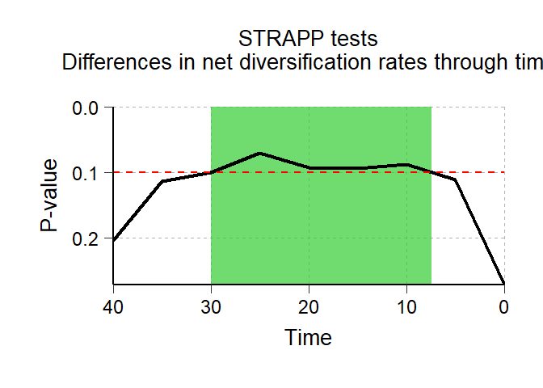

``` r
### 4.2/ Plot histogram of STRAPP test stats ####

# Plot an histogram of the distribution of the test statistics used to assess the significance of STRAPP tests
  #  For a single 'focal_time': deepSTRAPP::plot_histogram_STRAPP_test_for_focal_time()
  #  For multiple 'time_steps': deepSTRAPP::plot_histograms_STRAPP_tests_over_time()

# ?deepSTRAPP::plot_histogram_STRAPP_test_for_focal_time
# ?deepSTRAPP::plot_histograms_STRAPP_tests_over_time

## These functions are used to provide visual illustration of the results of each STRAPP test. 
# They can be used to complement the provision of the statistical results summarized in Step 3.

# Display the time-steps
Ponerinae_deepSTRAPP_biogeo_old_calib_0_40$time_steps

## Plot results from Mann-Whitney-Wilcoxon between the two unique areas ####

# Plot the histogram of test stats for time-step n°3 = 10 My
plot_histogram_STRAPP_test_for_focal_time(
   deepSTRAPP_outputs = Ponerinae_deepSTRAPP_biogeo_old_calib_0_40,
   focal_time = 10)

# The black line represents the expected value under the null hypothesis H0 => Δ Mann-Whitney-Wilcoxon U-stat = 0.
# The histogram shows the distribution of the test statistics as observed across the 1000 posterior samples from BAMM.
# The red line represents the significance threshold for which 90% of the observed data exhibited a higher value that expected.
# Since this red line is above the null expectation (quantile 10% = 380.4), the test is significant for a value of alpha = 0.10.

# Plot the histograms of test stats for all time-steps
plot_histograms_STRAPP_tests_over_time(
   deepSTRAPP_outputs = Ponerinae_deepSTRAPP_biogeo_old_calib_0_40)
```

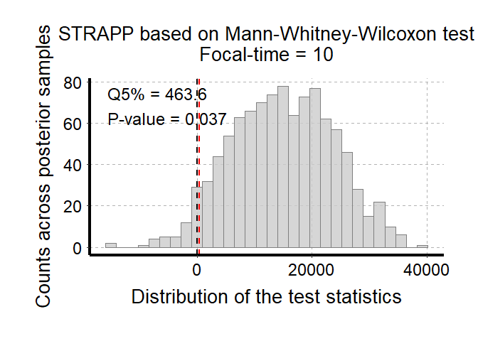

``` r
### 4.3/ Plot evolution of rates through time ~ trait data ####

# ?deepSTRAPP::plot_rates_through_time()

# Generate ggplot
plot_rates_through_time(deepSTRAPP_outputs = Ponerinae_deepSTRAPP_biogeo_old_calib_0_40,
                        colors_per_levels = colors_per_ranges,
                        plot_CI = TRUE)

# This plot helps to visualize how differences in rates evolved over time.
# You can see that both bioregions "New World" and "Old World" had fairly different rates over time, with differences detected as significant between 10 to 30 My.
# However, in the present, we recorded an increase in diversification rates that blurred these differences and led to a non-significant STRAPP test when comparing current rates.
# This plot, alongside results of deepSTRAPP, supports the Diversification Rate Hypothesis in showing how "Old World" ant lineages may have accumulated faster, especially between 10 to 30 My.

# N.B.: The increase of diversification rates recorded in the present may largely be artifactual, due to the fact some lineages in the present will go extinct in the future, but have not been recorded as such. 
# This bias is named the "pull of the present", and can impair evaluation of the Diversification Rate Hypothesis based only on current rates.
# deepSTRAPP offers a solution to this issue by investigating rate differences at any time in the past.
```

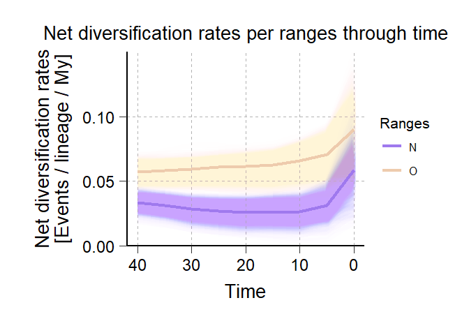

``` r
### 4.4/ Plot updated densityMaps mapping trait evolution for a given 'focal_time' ####

# ?deepSTRAPP::plot_densityMaps_overlay()

## These plots help to visualize the evolution of trait data across the phylogeny, and to focus on tip values at specific time-steps.

# Display the time-steps
Ponerinae_deepSTRAPP_biogeo_old_calib_0_40$time_steps

## The next plot shows the evolution of trait data across the whole phylogeny (100-0 My).

# Plot initial densityMaps (t = 0)
densityMaps_0My <- Ponerinae_deepSTRAPP_biogeo_old_calib_0_40$updated_trait_data_with_Map_over_time[[1]]
plot_densityMaps_overlay(densityMaps_0My$densityMaps,
                         colors_per_levels = colors_per_ranges)
title(main = "Trait evolution for 100-0 My")

## The next plot shows the evolution of trait data from root to 10 Mya (100-10 My).

# Plot updated densityMaps for time-step n°3 = 10 My
densityMaps_10My <- Ponerinae_deepSTRAPP_biogeo_old_calib_0_40$updated_trait_data_with_Map_over_time[[3]]
plot_densityMaps_overlay(densityMaps_10My$densityMaps,
                         colors_per_levels = colors_per_ranges)
title(main = "Trait evolution for 100-10 My")

## The next plot shows the evolution of trait data from root to 40 Mya (100-40 My).

# Plot updated densityMaps for time-step n°9 = 40 My
densityMaps_40My <- Ponerinae_deepSTRAPP_biogeo_old_calib_0_40$updated_trait_data_with_Map_over_time[[9]]
plot_densityMaps_overlay(densityMaps_40My$densityMaps,
                         colors_per_levels = colors_per_ranges)
title(main = "Trait evolution for 100-40 My")
```

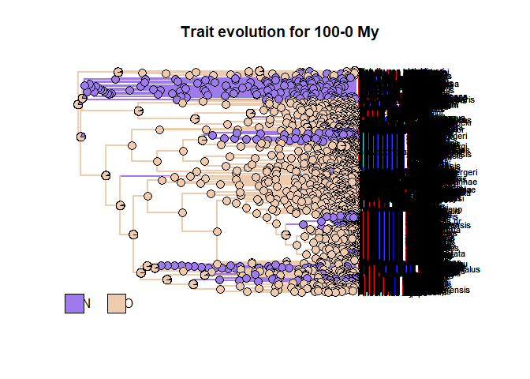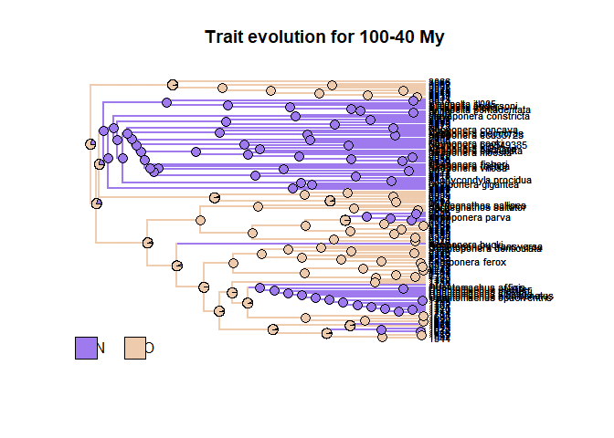

``` r
### 4.5/ Plot updated diversification rates and regimes for a given 'focal_time' ####

# ?deepSTRAPP::plot_BAMM_rates()

## These plots help to visualize the evolution of diversification rates across the phylogeny, and to focus on tip values at specific time-steps.

# Display the time-steps
Ponerinae_deepSTRAPP_biogeo_old_calib_0_40$time_steps

# Extract root age
root_age <- max(phytools::nodeHeights(Ponerinae_tree_old_calib)[,2])

## The next plot shows the evolution of net diversification rates across the whole phylogeny (100-0 My).

# Plot diversification rates on initial phylogeny (t = 0)
BAMM_map_0My <- Ponerinae_deepSTRAPP_biogeo_old_calib_0_40$updated_BAMM_objects_over_time[[1]]
plot_BAMM_rates(BAMM_map_0My, labels = FALSE, par.reset = FALSE)
abline(v = root_age - 10, col = "red", lty = 2) # Show where the phylogeny will be cut for t = 10My
abline(v = root_age - 40, col = "red", lty = 2) # Show where the phylogeny will be cut for t = 40My
title(main = "BAMM rates for 100-0 My")

## The next plot shows the evolution of net diversification rates from root to 10 Mya (100-10 My).

# Plot diversification rates on updated phylogeny for time-step n°3 = 10 My
BAMM_map_10My <- Ponerinae_deepSTRAPP_biogeo_old_calib_0_40$updated_BAMM_objects_over_time[[3]]
plot_BAMM_rates(BAMM_map_10My, labels = FALSE,
                colorbreaks = BAMM_map_10My$initial_colorbreaks$net_diversification)
title(main = "BAMM rates for 100-10 My")

## The next plot shows the evolution of net diversification rates from root to 40 Mya (100-40 My).

# Plot diversification rates on updated phylogeny for time-step n°9 = 40 My
BAMM_map_40My <- Ponerinae_deepSTRAPP_biogeo_old_calib_0_40$updated_BAMM_objects_over_time[[9]]
plot_BAMM_rates(BAMM_map_40My, labels = FALSE,
                colorbreaks = BAMM_map_40My$initial_colorbreaks$net_diversification)
title(main = "BAMM rates for 100-40 My")
```


``` r
### 4.6/ Plot both trait evolution and diversification rates and regimes updated for a given 'focal_time' ####

# ?deepSTRAPP::plot_trait_vs_rate_maps_for_focal_time()

## These plots help to visualize simultaneously the evolution of trait and diversification rates across the phylogeny, and to focus on tip values at specific time-steps.

# Display the time-steps
Ponerinae_deepSTRAPP_biogeo_old_calib_0_40$time_steps

## The next plot shows the evolution of ranges and rates across the whole phylogeny (100-0 My).

# Plot both mapped phylogenies in the present (t = 0)
plot_trait_vs_rate_maps_for_focal_time(
  deepSTRAPP_outputs = Ponerinae_deepSTRAPP_biogeo_old_calib_0_40,
  focal_time = 0,
  ftype = "off", lwd = 0.7,
  colors_per_levels = colors_per_ranges,
  labels = FALSE, legend = FALSE,
  par.reset = FALSE)

## The next plot shows the evolution of ranges and rates from root to 10 Mya (100-10 My).

# Plot both mapped phylogenies for time-step n°3 = 10 My
plot_trait_vs_rate_maps_for_focal_time(
  deepSTRAPP_outputs = Ponerinae_deepSTRAPP_biogeo_old_calib_0_40,
  focal_time = 10, 
  ftype = "off", lwd = 1.2,
  colors_per_levels = colors_per_ranges,
  labels = FALSE, legend = FALSE,
  par.reset = FALSE)

## The next plot shows the evolution of ranges and rates from root to 40 Mya (100-40 My).

# Plot both mapped phylogenies for time-step n°9 = 40 My
plot_trait_vs_rate_maps_for_focal_time(
  deepSTRAPP_outputs = Ponerinae_deepSTRAPP_biogeo_old_calib_0_40,
  focal_time = 40, 
  ftype = "off", lwd = 1.2,
  colors_per_levels = colors_per_ranges,
  labels = FALSE, legend = FALSE,
  par.reset = FALSE)
```

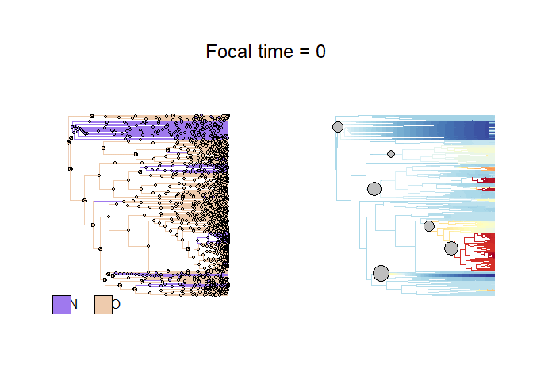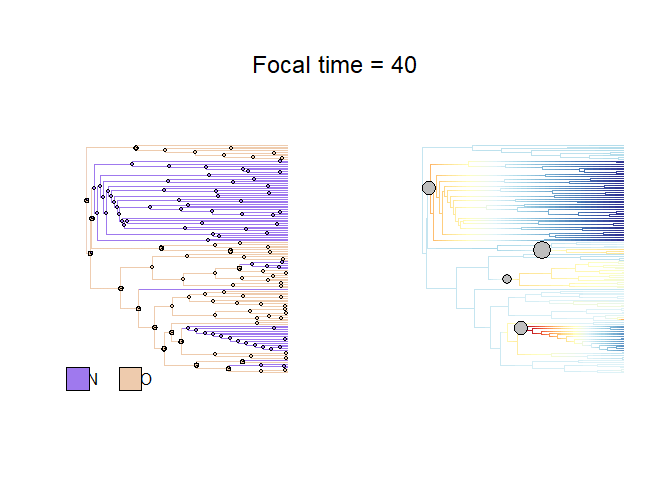

## Model continuous trait evolution with deepSTRAPP

This vignette presents the different options available to model
continuous trait evolution within deepSTRAPP.

It builds mainly upon functions from R packages geiger and phytools to
offer a simplify framework to model and visualize continuous trait
evolution on a time-calibrated phylogeny.

For an example with categorical data, see this vignette: **(ADD A
LINK)** For an example with biogeographic data, see this vignette:
**(ADD A LINK)**

``` r

# ------ Step 0: Load data ------ #

## Load phylogeny and tip data

library(phytools)
data(eel.tree)
data(eel.data)
# Dataset of feeding mode and maximum total length from 61 species of elopomorph eels.
# Source: Collar, D. C., P. C. Wainwright, M. E. Alfaro, L. J. Revell, and R. S. Mehta (2014) Biting disrupts integration to spur skull evolution in eels. Nature Communications, 5, 5505.

# Extract body size
eel_tip_data <- stats::setNames(eel.data$Max_TL_cm,
                                rownames(eel.data))

plot(eel.tree)
Ntip(eel.tree) == length(eel_tip_data)

## Check that trait tip data and phylogeny are named and ordered similarly
all(names(eel_tip_data) == eel.tree$tip.label)

# Reorder tip_data as in phylogeny
eel_tip_data <- eel_tip_data[eel.tree$tip.label]

# ------ Step 1: Prepare continuous trait data ------ #

## Goal: Map continuous trait evolution on the time-calibrated phylogeny

# 1.1/ Fit evolutionary models to trait data using Maximum Likelihood.
# 1.2/ Select the best fitting model comparing AICc.
# 1.3/ Infer ancestral characters estimates (ACE) at nodes.
# 1.4/ Infer ancestral states along branches using interpolation to produce a `contMap`.

library(deepSTRAPP)

# All these actions are performed by a single function: deepSTRAPP::prepare_trait_data()
?deepSTRAPP::prepare_trait_data()
# Model selection is performed internally with deepSTRAPP::select_best_model_from_geiger()
?deepSTRAPP::select_best_model_from_geiger()
# Plotting of the contMap is carried out with deepSTRAPP::plot_contMap()
?deepSTRAPP::plot_contMap()
  
## Macroevolutionary models for continuous traits

?geiger::fitContinuous() # For more in-depth information on the models available

## 7 models from geiger::fitContinuous() are available
 # "BM": Brownian Motion model. Default model that assumes a Brownian random walk in the trait space. No trend. No time-dependence. 
       # Correlation structure is proportional to the extent of shared ancestry for pairs of species. sigma² ('sigsq') is the evolutionary rate that represents the expected variance in traits in proportion to time.
       # 'z0' is the ancestral character estimate (trait value) at the root.
 # "OU": Ornstein-Uhlenbeck model. Random walk with a central tendency (= an optimum). Attraction toward the central tendency is controlled by parameter 'alpha'. 
 # "EB": Early-burst model. Time-dependent model where rate of evolution increases or decreases exponentially through time under the model r[t] = r[0] * exp(a * t), 
       # where r[0] is the initial rate, 'a' is the rate change parameter, and t is time. By default, 'a' is set to be negative, therefore the model represents a decelerating rate of evolution.
       # Parameter estimate boundaries can be change to allow accelerating evolution with positive values of 'a' (as in the ACDC model).
 # "rate_trend": Time dependent model where rate of evolution varies linearly with time (i.e., following a slope). If the 'slope' parameter is positive, rates are increasing, and conversely.
 # "lambda": Pagel's model based on branch length transformation. Modulates the extent to which the phylogeny predicts covariance among trait values for species (i.e., the degree of phylogenetic signal).
           # The model multiplies all internal branch lengths by 'lambda'.
           # 'lambda' close to zero indicates no phylogenetic signal. 'lambda' close to one approximate the 'BM' model and indicates strong phylogenetic signal.
 # "kappa": Pagel's model based on branch length transformation. Punctuational (speciational) model where trait divergence is related to the number of speciation events between pairs of species.
           # Assumes that speciation events are responsible for trait divergence. The model raises all branch lengths to an estimated power 'kappa'.
           # 'kappa' close to zero indicates a strong dependency of trait evolution on speciation events.
           # 'kappa' close to one approximate the 'BM' model and indicates strong phylogenetic signal.
 # "delta": Pagel's model based on branch length transformation. Time-dependent model that modulates the relative contributions of early vs. late evolution in the tree.
           # The model raises all node depths to an estimated power 'delta'.
           # 'delta' close to one approximate the 'BM' model and indicates strong phylogenetic signal.
           # 'delta' lower than one gives more weight to early evolution, thus represent decelerating rates of evolution.
           # 'delta' higher than one gives more weight to late evolution, thus represent accelerating rates of evolution.

## Model trait data evolution
eel_cont_data <- prepare_trait_data(
    tip_data = eel_tip_data,
    trait_data_type = "continuous",
    phylo = eel.tree,
    seed = 1234, # Set seed for reproducibility
    evolutionary_models = c("BM", "OU",  "EB", "rate_trend", "lambda", "kappa", "delta"), # All possible models
    control = list(niter = 200), # Example of additional parameters that can be pass down to geiger::fitContinuous() to control parameter optimization.
    res = 100, # To set the reoslution of the continuous mapping of trait value on the contMap
    color_scale = c("darkgreen", "limegreen", "orange", "red"),
    # PDF_file_path = "./eel_contMap.pdf", # To export in PDF the contMap generated
    return_ace = TRUE, # To include Ancestral Character Estimates (ACE) at nodes in the output
    return_best_model_fit = TRUE, # To include the best model fit in the output
    return_model_selection_df = TRUE, # To include the df for model selection in the output
    verbose = TRUE) # To display progress


# ------ Step 2: Explore output ------ #

## Explore output
str(eel_cont_data, 1)

## Extract the contMap showing interpolated continuous trait evolution on the phylogeny as estimated from the model
eel_contMap <- eel_cont_data$contMap

# Plot with initial color_scale
plot_contMap(eel_contMap)
# Plot with updated color_scale
plot_contMap(contMap = eel_contMap,
             color_scale = c("purple", "violet", "cyan", "blue"))
# The contMap is the main input needed to perform a deepSTRAPP run on continuous trait data.

## Extract the Ancestral Character Estimates (ACE) = trait values at nodes
eel_ACE <- eel_cont_data$ace
head(eel_ACE)
# This is a named numerical vector with names = internal node ID and values = ACE.
# It can be used as an optional input in deepSTRAPP run to provide perfectly accurate estimates for trait values at internal nodes. 

## Explore summary of model selection
eel_cont_data$model_selection_df # Summary of model selection
# Models are compared using the corrected Akaike's Information Criterion (AICc)
# Akaike's weights represent the probability that a given model is the best among the set of candidate models, given the data.
# Here, the best model is Pagel's lambda

## Explore best model fit (Pagel's lambda)
eel_cont_data$best_model_fit # Summary of best model optimization by geiger::fitContinuous()
eel_cont_data$best_model_fit$opt # Parameter estimates and goodness-of-fit information
# 'lambda' = 0.636. The best model detects a moderate degree of phylogenetic signal.


## Inputs needed to run deepSTRAPP are the contMap (eel_contMap), and optionally, the tip_data (eel_tip_data), and the ACE (eel_ACE)
```

    #> Loading required package: ape
    #> Loading required package: maps

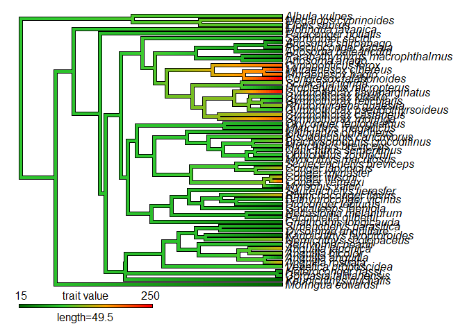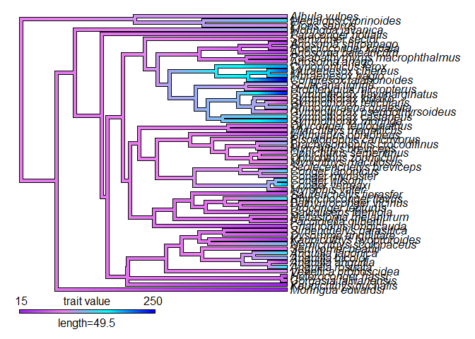

    #>                 model      logL k     AICc Akaike_weights rank
    #> BM                 BM -338.9352 2 682.0773            0.0    6
    #> OU                 OU -329.2538 3 664.9287           28.0    3
    #> EB                 EB -338.9355 3 684.2921            0.0    7
    #> rate_trend rate_trend -335.1346 3 676.6902            0.1    5
    #> lambda         lambda -328.9440 3 664.3090           38.2    1
    #> kappa           kappa -329.0984 3 664.6179           32.7    2
    #> delta           delta -332.6586 3 671.7383            0.9    4

## Model categorical trait evolution with deepSTRAPP

This vignette presents the different options available to model
categorical trait evolution within deepSTRAPP.

It builds mainly upon functions from R packages geiger and phytools to
offer a simplify framework to model and visualize categorical trait
evolution on a time-calibrated phylogeny.

For an example with continuous data, see this vignette: **(ADD A LINK)**
For an example with biogeographic data, see this vignette: **(ADD A
LINK)**

``` r

# ------ Step 0: Load data ------ #

## Load phylogeny and tip data

library(phytools)
data(eel.tree)
data(eel.data)
# Dataset of feeding mode and maximum total length from 61 species of elopomorph eels.
# Source: Collar, D. C., P. C. Wainwright, M. E. Alfaro, L. J. Revell, and R. S. Mehta (2014) Biting disrupts integration to spur skull evolution in eels. Nature Communications, 5, 5505.

## Transform feeding mode data into a 3-level factor
# This is NOT actual biological data anymore, but data adjusted for the sake of example!

eel_tip_data <- stats::setNames(object = eel.data$feed_mode, nm = rownames(eel.data))
eel_tip_data <- as.character(eel_tip_data)
eel_tip_data[c(1, 5, 6, 7, 10, 11, 15, 16, 17, 24, 25, 28, 30, 51, 52, 53, 55, 58, 60)] <- "kiss"
eel_tip_data <- stats::setNames(eel_tip_data, rownames(eel.data))
table(eel_tip_data)

plot(eel.tree)
Ntip(eel.tree) == length(eel_tip_data)

## Check that trait tip data and phylogeny are named and ordered similarly
all(names(eel_tip_data) == eel.tree$tip.label)

# Reorder tip_data as in phylogeny
eel_tip_data <- eel_tip_data[eel.tree$tip.label]


## Set colors per states
colors_per_states <- c("limegreen", "orange", "dodgerblue")
names(colors_per_states) <- c("bite", "kiss", "suction")


# ------ Step 1: Prepare categorical trait data ------ #

## Goal: Map categorical trait evolution on the time-calibrated phylogeny

# 1.1/ Fit evolutionary models to trait data using Maximum Likelihood.
# 1.2/ Select the best fitting model comparing AICc.
# 1.3/ Infer ancestral characters estimates (ACE) at nodes.
# 1.4/ Run stochastic mapping simulations to generate evolutionary histories
#      compatible with the best model and inferred ACE.
# 1.5/ Infer ancestral states along branches.
#  - Compute posterior frequencies of each state/range
#    to produce a `densityMap` for each state/range.

library(deepSTRAPP)

# All these actions are performed by a single function: deepSTRAPP::prepare_trait_data()
?deepSTRAPP::prepare_trait_data()
# Model selection is performed internally with deepSTRAPP::select_best_model_from_geiger()
?deepSTRAPP::select_best_model_from_geiger()
# Plotting of all densityMaps as a unique phylogeny is carried out with deepSTRAPP::plot_densityMaps_overlay()
?deepSTRAPP::plot_densityMaps_overlay()
  
## Macroevolutionary models for categorical traits

?geiger::fitDiscrete() # For more in-depth information on the models available

## 5 models from geiger::fitDiscrete() are available
 # "ER": Equal-Rates model. Default model where a single parameter governs all transition rates between states. Rates are symmetrical.
       # Ex: A <-> B = A <-> C.
 # "SYM": Symmetric model. Forward and reverse transitions share the same parameter, but transitions between diffrent states have different rates.
       # Ex: (A -> B = B -> A) ≠ (A -> C = C -> A).
 # "ARD": All-Rates-Different model. Each transition rate is a unique parameter.
        # Ex: A -> B ≠ B -> A ≠ A -> C ≠ C -> A.
 # "meristic": Step-stone model where transitions occur in a step-wise ordered fashion (e.g., 1 <-> 2 <-> 3). Transitions between non-adjacent states are forbidden (e.g., 1 <-> 3 is forbidden).
             # Transitions rates are assumed to be symmetrical.
             # Ex: (1 -> 2 = 2 -> 1) ≠ (2 -> 3 = 3 -> 2), with 1 <-> 3 set to zero.
 # "matrix": Custom model that allows to provide a custom "Q_matrix" defining transition classes between states. 
           # Transitions with similar integers are estimated with a shared rate parameter.
           # Transitions with `0` represent rates that are fixed to zero (i.e., impossible transitions).
           # Diagonal must be populated with `NA`. row.names(Q_matrix) and col.names(Q_matrix) are the states.


## Example of custom Q_matrix defining rate classes of state transitions to use in the 'matrix' model

# Does not allow transitions from state 1 ("bite") to state 2 ("kiss") or state 3 ("suction")
# Does not allow transitions from state 3 ("suction") to state 1 ("bite")
# Set symmetrical rates between state 2 ("kiss") and state 3 ("suction")
Q_matrix = rbind(c(NA, 0, 0), c(1, NA, 2), c(0, 2, NA))


## Model trait data evolution
eel_cat_3lvl_data <- prepare_trait_data(
    tip_data = eel_tip_data,
    trait_data_type = "categorical",
    phylo = eel.tree,
    seed = 1234, # Set seed for reproducibility
    evolutionary_models = c("ER", "SYM", "ARD", "meristic", "matrix"), # All possible models
    Q_matrix = Q_matrix, # Custom transition rate classes matrix for the "matrix" model
    transform = "lambda", # Example of additional parameters that can be pass down to geiger::fitDiscrete() to control tree transformation.
    res = 100, # To set the resolution of the continuous mapping of states on the densityMaps
    nb_simulations = 100, # Reduce the number of Stochastic Mapping simulations to save time (Default = '1000')
    colors_per_levels = colors_per_states,
    plot_overlay = TRUE, # Plot the densityMaps with plot_densityMaps_overlay() to show all states at once.
    # PDF_file_path = "./eel_densityMaps_overlay.pdf", # To export in PDF the densityMaps generated (Here a single map as 'plot_overlay = TRUE')
    return_ace = TRUE, # To include Ancestral Character Estimates (ACE) at nodes in the output
    return_simmaps = TRUE, # To include the Stochastic Mapping simulations (simmaps) in the output
    return_best_model_fit = TRUE, # To include the best model fit in the output
    return_model_selection_df = TRUE, # To include the df for model selection in the output
    verbose = TRUE) # To display progress


# ------ Step 2: Explore output ------ #

## Explore output
str(eel_cat_3lvl_data, 1)

## Extract the densityMaps showing posterior probabilities of states on the phylogeny as estimated from the model
eel_densityMaps <- eel_cat_3lvl_data$densityMaps

# Plot densityMap for each state.
# Grey represents absence of the state. Color represents presence of the state.
plot(eel_densityMaps[[1]]) # densityMap for state n°1 ("bite")
plot(eel_densityMaps[[2]]) # densityMap for state n°2 ("kiss")
plot(eel_densityMaps[[3]]) # densityMap for state n°3 ("suction")

# Plot all densityMaps overlaid in on a single phylogeny.
# Each color highlights presence of its associated state.
plot_densityMaps_overlay(eel_densityMaps)

# Plot with a new color scheme
new_colors_per_states <- c("red", "pink", "goldenrod")
names(new_colors_per_states) <- c("bite", "kiss", "suction")

plot_densityMaps_overlay(
    densityMaps = eel_densityMaps,
    colors_per_levels = new_colors_per_states)
    # PDF_file_path = "./eel_densityMaps_overlay_new_colors.pdf")

# The densityMaps are the main input needed to perform a deepSTRAPP run on categorical trait data.

## Extract the Ancestral Character Estimates (ACE) = trait values at nodes
eel_ACE <- eel_cat_3lvl_data$ace
head(eel_ACE)
# This is a matrix with row.names = internal node ID, colnames = ancestral states, and values = posterior probabilities.
# It can be used as an optional input in deepSTRAPP run to provide perfectly accurate estimates for ancestral states at internal nodes. 

## Explore summary of model selection
eel_cat_3lvl_data$model_selection_df # Summary of model selection
# Models are compared using the corrected Akaike's Information Criterion (AICc)
# Akaike's weights represent the probability that a given model is the best among the set of candidate models, given the data.
# Here, the best model is the Equal-Rates model ('ER')

## Explore best model fit (ER model)
eel_cat_3lvl_data$best_model_fit # Summary of best model optimization by geiger::fitContinuous()
eel_cat_3lvl_data$best_model_fit$opt # Parameter estimates and goodness-of-fit information
# Unique transition parameter = 0.0208 transitions per branch per My.

## Explore simmaps
# Since we selected 'return_simmaps = TRUE', Stochastic Mapping simulations (simmaps) are included in the output
# Each simmap represents a simulated evolutionary history with final states compatible with the tip_data and estimated ACE at nodes.
# Each simmap also follows the transition parameters of the best fit model to simulate transitions along branches.

# Plot simmap n°1 using the same color scheme as in densityMaps
plot(eel_cat_3lvl_data$simmaps[[1]], colors = colors_per_states)
# Plot simmap n°10 using the same color scheme as in densityMaps
plot(eel_cat_3lvl_data$simmaps[[10]], colors = colors_per_states)
# Plot simmap n°100 using the same color scheme as in densityMaps
plot(eel_cat_3lvl_data$simmaps[[100]], colors = colors_per_states)


## Inputs needed to run deepSTRAPP are the densityMaps (eel_densityMaps), and optionally, the tip_data (eel_tip_data), and the ACE (eel_ACE)
```

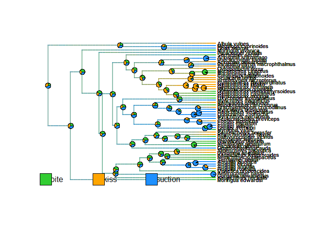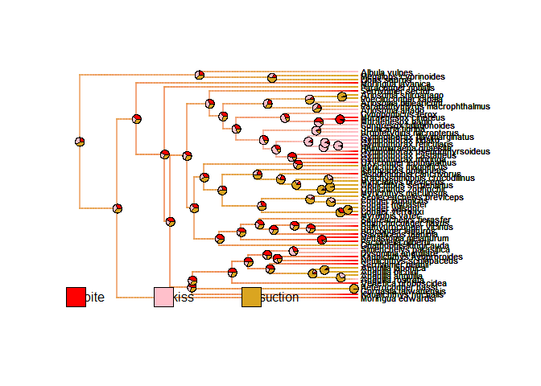

    #>             model      logL k     AICc Akaike_weights rank
    #> ER             ER -63.78440 2 131.7757           62.1    1
    #> SYM           SYM -63.44259 4 135.5995            9.2    3
    #> ARD           ARD -62.75870 7 141.6306            0.4    5
    #> meristic meristic -63.66754 3 133.7561           23.1    2
    #> matrix     matrix -65.15849 3 136.7380            5.2    4

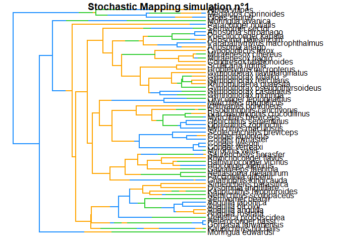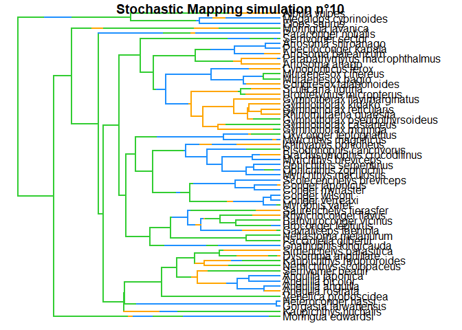

## Model biogeographic history / range evolution with deepSTRAPP

This vignette presents the different options available to model
biogeographic data = range evolution = biogeographic history within
deepSTRAPP.

It builds mainly upon functions from R package BioGeoBEARS to offer a
simplify framework to model and visualize biogeographic range evolution
on a time-calibrated phylogeny.

For an example with continuous data, see this vignette: **(ADD A LINK)**
For an example with categorical data, see this vignette: **(ADD A
LINK)**

``` r

# ------ Step 0: Load data ------ #

## Load phylogeny and tip data

library(phytools)
data(eel.tree)
data(eel.data)
# Dataset of feeding mode and maximum total length from 61 species of elopomorph eels.
# Source: Collar, D. C., P. C. Wainwright, M. E. Alfaro, L. J. Revell, and R. S. Mehta (2014) Biting disrupts integration to spur skull evolution in eels. Nature Communications, 5, 5505.

# Transform feeding mode data into biogeographic data with ranges A, B, and AB.
# This is NOT actual biogeographic data, but data fake generated for the sake of example!
eel_range_tip_data <- stats::setNames(eel.data$feed_mode, rownames(eel.data))
eel_range_tip_data <- as.character(eel_data)
eel_range_tip_data[eel_range_tip_data == "bite"] <- "A"
eel_range_tip_data[eel_range_tip_data == "suction"] <- "B"
eel_range_tip_data[c(5, 6, 7, 15, 25, 32, 33, 34, 50, 52, 57, 58, 59)] <- "AB"
eel_range_tip_data <- stats::setNames(eel_range_tip_data, rownames(eel.data))
table(eel_range_tip_data)

# Here, the input date is a vector of character strings with tip.label as names, and range data as values.
# Range coding scheme must follow the coding scheme used in BioGeoBEARS:
  # Unique areas must be in CAPITAL letters (e.g., "A", "B")
  # Ranges encompassing multiple areas are formed in combining unique area letters in alphabetic order (e.g., "AB", "BC", "ABC")
eel_range_tip_data

## Convert into binary presence/absence matrix

# deepSTRAPP also accept biogeographic data as binary presence/absence matrix or data.frame
# Here is the equivalent biogeographic data converted into a valid binary presence/absence matrix

# Extract ranges
all_ranges <- levels(as.factor(eel_range_tip_data))
# Order in number of areas x alphabetic order (i.e., single areas, then 2-area ranges, etc.)
unique_areas <- all_ranges[nchar(all_ranges) == 1]
unique_areas <- unique_areas[order(unique_areas)]
multi_area_ranges <- setdiff(all_ranges, unique_areas)
multi_area_ranges <- multi_area_ranges[order(multi_area_ranges)]
all_ranges_ordered <- c(unique_areas, multi_area_ranges)
# Create template matrix only with unique areas
eel_range_binary_matrix <- matrix(data = 0,
                                  nrow = length(eel_range_tip_data),
                                  ncol = length(unique_areas),
                                  dimnames = list(names(eel_range_tip_data), unique_areas))
# Fill with presence/absence data
for (i in seq_along(eel_range_tip_data))
{
  # i <- 1
  
  # Extract range for taxa i
  range_i <- eel_range_tip_data[i]
  # Decompose range in unique areas
  all_unique_areas_in_range_i <- unlist(strsplit(x = range_i, split = ""))
  # Record match in eel_range_tip_data vector
  eel_range_binary_matrix[i, all_unique_areas_in_range_i] <- 1
}
eel_range_binary_matrix

# Rows are taxa. Columns are unique areas. Values are presence/absence recorded in each area with '0/1' integers.
# Taxa with multi-area ranges (i.e., encompassing multiple unique areas) have multiple '1' in the same row.


## Check that trait tip data and phylogeny are named and ordered similarly
all(names(eel_range_tip_data) == eel.tree$tip.label)
all(row.names(eel_range_binary_matrix) == eel.tree$tip.label)

# Reorder tip_data as in phylogeny
eel_range_tip_data <- eel_range_tip_data[eel.tree$tip.label]
# Reorder eel_range_binary_matrix as in phylogeny
eel_range_binary_matrix <- eel_range_binary_matrix[eel.tree$tip.label, ]

## Set colors per ranges
colors_per_ranges <- c("dodgerblue3", "gold")
names(colors_per_ranges) <- c("A", "B")

# If you provide only colors for unique areas (e.g., "A", "B"), the colors of multi-area ranges will be interpolated (e.g., "AB")
# In this example, using types of blue and yellow for range "A" and "B" respectively will yield a type of green for multi-area range "AB".


# ------ Step 1: Prepare biogeographic data ------ #

## Goal: Map biogeographic range evolution on the time-calibrated phylogeny

# 1.1/ Fit biogeographic evolutionary models to trait data using Maximum Likelihood.
# 1.2/ Select the best fitting model comparing AICc.
# 1.3/ Infer ancestral characters estimates (ACE) of ranges at nodes.
# 1.4/ Run Biogeographic Stochastic Mapping (BSM) simulations to generate biogeographic histories
#      compatible with the best model and inferred ACE.
# 1.5/ Infer ancestral ranges along branches.
#  - Compute posterior frequencies of each range to produce a `densityMap` for each range.

library(deepSTRAPP)

# All these actions are performed by a single function: deepSTRAPP::prepare_trait_data()
?deepSTRAPP::prepare_trait_data()
# Model selection is performed internally with deepSTRAPP::select_best_model_from_geiger()
?deepSTRAPP::select_best_model_from_geiger()
# Plotting of all densityMaps as a unique phylogeny is carried out with deepSTRAPP::plot_densityMaps_overlay()
?deepSTRAPP::plot_densityMaps_overlay()
  

## Macroevolutionary models for biogeographic data

# For more in-depth information on the models available see the R package [BioGeoBEARS]
# See the associated website: http://phylo.wikidot.com/biogeobears

## Parameters in BioGeoBEARS

# Biogeographic models are based on a set of biogeographic events defined by a set of parameters

  ## Anagenetic events = occurring along branches
  # d = dispersal rate = anagenetic range extension. Ex: A -> AB
  # e = extinction rate = anagenetic range contraction. Ex: AB -> A

  ## Cladogenetic events = occurring at speciation
  # y = Non-transitional speciation relative weight = cladogenetic inheritance. Ex: Narrow inheritance: A -> (A),(A); Wide-spread sympatric speciation: AB -> (AB),(AB)
  # v = Vicariance relative weight = cladogenetic vicariance. Ex: Narrow vicariance: AB -> (A),(B); Wide-vicariance: ABCD -> (AB),(CD)
  # s = Subset speciation relative weight = cladogenetic sympatric speciation. Ex: AB -> (AB),(A)
  # j = Jump-dispersal relative weight = cladogenetic founder-event. Ex: A -> (A),(B)

## 6 models from BioGeoBEARS are available

 # "BAYAREALIKE": BAYAREALIKE is a likelihood interpretation of the Bayesian implementation of BAYAREA model, and it is "like BAYAREA".
    # It is the "simpler" model, that allows the least types of biogeographic events to occur.
    # Nothing is happening during cladogenesis. Only inheritance of previous range (y = 1).
      # Allows narrow and wide-spread sympatric speciation: A -> (A),(A); AB => (AB),(AB)
    # No narrow or wide vicariance (v = 0)
    # No subset sympatric speciation (s = 0)
    # No jump dispersal (j = 0)
    # Model has 2 free parameters = d (range extension), e (range contraction).

 # "DIVALIKE": DIVALIKE is a likelihood interpretation of parsimony DIVA, and it is "like DIVA".
    # Compared to BAYAREALIKE, it allows vicariance events to occur during speciation.
    # Allows narrow sympatric speciation (y): A -> (A),(A)
      # Does NOT allow wide-spread sympatric speciation.
    # Allows and narrow AND wide-spread vicariance (v): AB -> (A),(B); ABCD -> (AB),(CD)
    # No subset sympatric speciation (s = 0)
    # No jump dispersal (j = 0)
    # Relative weights of y and v are fixed to 1.
    # Model has 2 free parameters = d (range extension), e (range contraction).

 # "DEC": Dispersal-Extinction-Cladogenesis model. This is the default model in deepSTRAPP.
    # Compared to BAYAREALIKE, it allows subset speciation (s) to occur, but it does not allows wide-spread vicariance.
    # Allows narrow sympatric speciation (y): A -> (A),(A)
      # Does NOT allow wide-spread sympatric speciation.
    # Allows narrow vicariance (v): AB -> (A),(B)
      # Does NOT allow wide-spread vicariance.
    # Allows subset sympatric speciation: AB -> (AB),(A)
    # No jump dispersal (j = 0)
    # Relative weights of y, v, and s are fixed to 1.
    # Model has 2 free parameters = d (range extension), e (range contraction).

 # "...+J": All previous models can add jump-dispersal events with the parameter j.
    # Allows jump-dispersal events to occur at speciation: A -> (A),(B)
      # Depicts cladogenetic founder events where a small population disperse to a new area .
      # Isolation results in speciation of the two populations in distinct lineages occurring in two different areas.
    # Relative weights of y,v,s are fixed to 1-j ("BAYAREALIKE+J"), 2-j ("DIVALIKE+J"), or 3-j ("DEC+J").
    # Models have only 3 free parameters = d (range extension), e (range contraction), and j (jump dispersal).

## Model trait data evolution
eel_biogeo_data <- prepare_trait_data(
     tip_data = eel_range_tip_data,
     # tip_data = eel_range_binary_matrix, # alternative input using the binary presence/absence range matrix
     trait_data_type = "biogeographic",
     phylo = eel.tree,
     seed = 1234, # Set seed for reproducibility
     evolutionary_models = c("BAYAREALIKE", "DIVALIKE", "DEC", "BAYAREALIKE+J", "DIVALIKE+J", "DEC+J"), # All models available
     BioGeoBEARS_directory_path = "./BioGeoBEARS_directory/", # To provide link to the directory folder where the outputs of BioGeoBEARS will be saved
     keep_BioGeoBEARS_files = TRUE, # Whether to save BioGeoBEARS intermediate files, or remove them after the run
     prefix_for_files = "eel", # Prefixe used to save BioGeoBEARS intermediate files
     nb_cores = 1, # To set the number of core to use for computation. Parallelization over multiple cores may speed up the process.
     max_range_size = 2, # To define the maximum number of unique areas in ranges. Ex: "AB" = 2; "ABC" = 3.
     split_multi_area_ranges = TRUE, # Set to TRUE to display the two outputs
     res = 100, # To set the resolution of the continuous mapping of ranges on the densityMaps
     colors_per_levels = colors_per_ranges,
     nb_simulations = 100, # Reduce the number of Stochastic Mapping simulations to save time (Default = '1000')
     plot_overlay = TRUE, # Plot the densityMaps with plot_densityMaps_overlay() to show all ranges at once.
     # PDF_file_path = "./eel_biogeo_evolution_mapped_on_phylo.pdf",
     return_ace = TRUE, # To include Ancestral Character Estimates (ACE) of ranges at nodes in the output
     return_BSM = FALSE, # To include the lists of cladogenetic and anagenetic events produced with BioGeoBEARS::runBSM()
     return_simmaps = TRUE, # To include the Biogeographic Stochastic Mapping simulations (simmaps) in the output
     return_best_model_fit = TRUE, # To include the best model fit in the output
     return_model_selection_df = TRUE, # To include the df for model selection in the output
     verbose = TRUE) # To display progress

# ------ Step 2: Explore output ------ #

## Explore output
str(eel_biogeo_data, 1)


## Extract the densityMaps showing posterior probabilities of ranges on the phylogeny as estimated from the model
eel_densityMaps <- eel_biogeo_data$densityMaps

# Because we selected 'split_multi_area_ranges = TRUE', those densityMaps only record posterior probability of presence in the two uniqe areas "A" and "B".
# Probability of presences in multi-area range "AB" have been equally split between "A" and "B".
# This is useful when you wish to test for differences in rates between unique areas only (e.g., "A" and "B").

# densityMaps including all ranges are also available in the output
eel_densityMaps_all_ranges <- eel_biogeo_data$densityMaps_all_ranges
# If you wish to test for differences across all types of ranges (e.g., "A", "B", and "AB"), you need to use these densityMaps,
# or set 'split_multi_area_ranges = FALSE' such as no split of multi-area ranges is performed, and the densityMaps contains all ranges by default.

## Plot densityMap for each range
# Grey represents absence of the range. Color represents presence of the range.
plot(eel_densityMaps_all_ranges[[1]]) # densityMap for range n°1 ("A")
plot(eel_densityMaps_all_ranges[[2]]) # densityMap for range n°2 ("B")
plot(eel_densityMaps_all_ranges[[3]]) # densityMap for range n°3 ("AB")

## Plot all densityMaps overlaid in on a single phylogeny
# Each color highlights presence of its associated range.

# Plot densityMaps considering only unique areas
plot_densityMaps_overlay(eel_densityMaps)
# Plot densityMaps with all ranges, including multi-area ranges
plot_densityMaps_overlay(eel_densityMaps_all_ranges)

# The densityMaps are the main input needed to perform a deepSTRAPP run on categorical trait data.


## Extract the Ancestral Character Estimates (ACE) = trait values at nodes

# Only with unique areas
eel_ACE <- eel_biogeo_data$ace 
head(eel_ACE)

# Including multi-area ranges (Here, "AB")
eel_ACE_all_ranges <- eel_biogeo_data$ace_all_ranges 
head(eel_ACE_all_ranges)

# This is a matrix of numerical values with row.names = internal node ID, colnames = ancestral ranges and values = posterior probability.
# It can be used as an optional input in deepSTRAPP run to provide perfectly accurate estimates for ancestral ranges at internal nodes. 


## Explore summary of model selection
eel_biogeo_data$model_selection_df # Summary of model selection
# Models are compared using the corrected Akaike's Information Criterion (AICc)
# Akaike's weights represent the probability that a given model is the best among the set of candidate models, given the data.
# Here, the best model is the "DEC+J" model


## Explore best model fit (DEC+J model)
str(eel_biogeo_data$best_model_fit, 1) # Summary of best model optimization by BioGeoBEARS::bears_optim_run()
eel_biogeo_data$best_model_fit$optim_result # Parameter estimates and likelihood optimization information
  # p1 = d = dispersal rate = anagenetic range extension. Ex: A -> AB
  # p2 = e = extinction rate = anagenetic range contraction. Ex: AB -> A
  # p3 = j = jump-dispersal relative weight = cladogenetic founder-event. Ex: A -> (A),(B)


## Explore Biogeographic Stochastic Mapping outputs from BioGeoBEARS::runBSM()
# Since we selected 'return_BSM = TRUE', lists of cladogenetic and anagenetic events produced with BioGeoBEARS::runBSM() are included in the output
?BioGeoBEARS::runBSM()

# This element contains two lists of data.frames summarizing cladogenetic and anagentic events occurring all BSM simulations.
# Each simulation yields a data.frame for each list.
str(eel_biogeo_data$BSM_output, 1)

# Example: Cladogenetic event summary for simulation n°1
head(eel_biogeo_data$BSM_output$RES_clado_events_tables[[1]])
# Example: Anagenetic event summary for simulation n°1
head(eel_biogeo_data$BSM_output$RES_ana_events_tables[[1]])


## Explore simmaps
# Since we selected 'return_simmaps = TRUE', Stochastic Mapping simulations (simmaps) are included in the output
# Each simmap represents a simulated evolutionary history with final ranges compatible with the tip_data and estimated ACE at nodes.
# Each simmap also follows the transition parameters of the best fit model to simulate transitions along branches.

# Update color_per_ranges to include the color interpolated for range "AB"
AB_color_gradient <- eel_densityMaps_all_ranges$Density_map_AB$cols
AB_color <- AB_color_gradient[length(AB_color_gradient)]

colors_per_all_ranges <- c(colors_per_ranges, AB_color)
names(colors_per_all_ranges) <- c("A", "B", "AB")

# Plot simmap n°1 using the same color scheme as in densityMaps
plot(eel_biogeo_data$simmaps[[1]], colors = colors_per_all_ranges)
# Plot simmap n°10 using the same color scheme as in densityMaps
plot(eel_biogeo_data$simmaps[[10]], colors = colors_per_all_ranges)
# Plot simmap n°100 using the same color scheme as in densityMaps
plot(eel_biogeo_data$simmaps[[100]], colors = colors_per_all_ranges)


## Inputs needed to run deepSTRAPP are the densityMaps (eel_densityMaps), and optionally, the tip_data (eel_tip_data), and the ACE (eel_ACE)
```

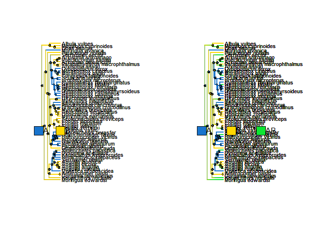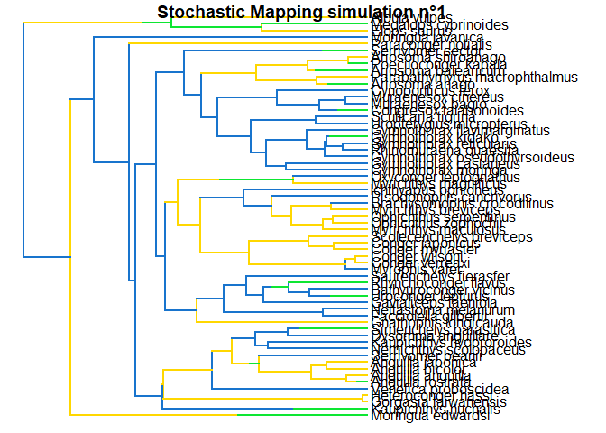

    #>                       model     logLk k      AIC     AICc delta_AICc
    #> BAYAREALIKE     BAYAREALIKE -80.93972 2 165.8794 165.9484  40.467618
    #> DIVALIKE           DIVALIKE -63.80815 2 131.6163 131.6853   6.204488
    #> DEC                     DEC -63.83295 2 131.6659 131.7349   6.254083
    #> BAYAREALIKE+J BAYAREALIKE+J -66.46193 3 138.9239 139.1344  13.653595
    #> DIVALIKE+J       DIVALIKE+J -60.28105 3 126.5621 126.7726   1.291847
    #> DEC+J                 DEC+J -59.63513 3 125.2703 125.4808   0.000000
    #>               Akaike_weights rank
    #> BAYAREALIKE              0.0    6
    #> DIVALIKE                 2.8    3
    #> DEC                      2.7    4
    #> BAYAREALIKE+J            0.1    5
    #> DIVALIKE+J              32.5    2
    #> DEC+J                   62.0    1

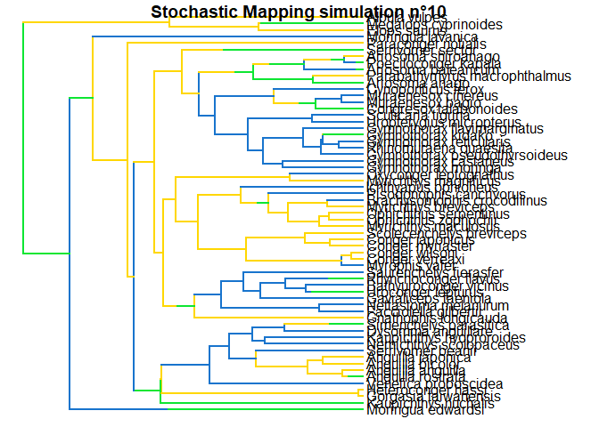

## Model diversification dynamics with BAMM

This vignette presents the different options available to model
diversification dynamics with BAMM within deepSTRAPP.

BAMM (Bayesian Analysis of Macroevolutionary Mixtures) is a fully
independent C++ software developed by Daniel L. Rabosky. You need to
install BAMM first on your machine to be able to run this section of
deepSTRAPP. Source: Rabosky, D. L. (2014). Automatic detection of key
innovations, rate shifts, and diversity-dependence on phylogenetic
trees. PloS one, 9(2), e89543. DOI: BAMM website:

deepSTRAPP builds upon BAMM and functions from R package BAMMtools to
offer a simplify framework to model and visualize diversification
dynamics on a time-calibrated phylogeny.

``` r

## Goal: Map evolution of diversification rates and regime shifts on the time-calibrated phylogeny

# Run a BAMM (Bayesian Analysis of Macroevolutionary Mixtures)

# Step 1/ Set BAMM - Record BAMM settings and generate all input files needed for BAMM.
# Step 2/ Run BAMM - Run BAMM and move output files in dedicated directory.
# Step 3/ Evaluate BAMM - Produce evaluation plots and ESS data.
# Step 4/ Import BAMM outputs - Load `BAMM_object` in R and subset posterior samples.
# Step 5/ Clean BAMM files - Remove files generated during the BAMM run.

# All these actions are performed by a single function: deepSTRAPP::prepare_diversification_data()
?deepSTRAPP::prepare_diversification_data()

# This function perform a single BAMM run to infer diversification rates and regime shifts.
# Due to the stochastic nature of the exploration of the parameter space with MCMC process,
# best practice recommend to ran multiple runs and check for convergence of the MCMC traces,
# ensuring that the region of high probability has been reached by your MCMC runs.


## Parametrize BAMM

# BAMM accepts numerous arguments that control the modeling process.
# The main arguments are listed in the function deepSTRAPP::prepare_diversification_data().
# Additional arguments can be provided as a named list under 'additional_BAMM_settings'.
# To see all available settings, load and print the BAMM template file provided within deepSTRAPP.
data(BAMM_template_diversification)
print(BAMM_template_diversification)


## Load time-calibrated phylogeny
library(phytools)
data(whale.tree)

# Source: Steeman, M. E., M. B. Hebsgaard, R. E. Fordyce, S. Y. W. Ho, D. L. Rabosky, R. Nielsen, C. Rahbek, H. Glenner, M. V. Sorensen, and E. Willerslev (2009) Radiation of extant cetaceans driven by restructuring of the oceans. Systematic Biology, 58, 573-585.


## Run BAMM workflow with deepSTRAPP
whale_BAMM_object <- prepare_diversification_data(
   BAMM_install_directory_path = "./software/bamm-2.5.0/", # To provide path to BAMM directory
   phylo = whale.tree,
   prefix_for_files = "whale",
   seed = 1234, # Set seed for reproducibility
   numberOfGenerations = 10^5, # Set low for the example (Default = 10^7)
   globalSamplingFraction = 1.0, # Set the overall proportion of terminals in the phylogeny compared to the estimated overall richness in the clade
   sampleProbsFilename = NULL, # The path to the `.txt` file used to provide clade-specific sampling fractions. Here, we use a global sampling fraction.
   expectedNumberOfShifts = NULL, # Set the expected number of regime shifts. It acts as an hyperparameter controlling the exponential prior distribution used to modulate reversible jumps across model configurations in the rjMCMC run.
                                  # When set to 'NULL', an empirical rule is used to define this value: 1 regime shift expected for every 100 tips in the phylogeny, with a minimum of 1.
   eventDataWriteFreq = NULL, # Set the frequency in which to write the event data to the output file = the sampling frequency of posterior samples.
                              # When set to `NULL`, the frequency is set such as 2000 posterior samples are recorded (before removing the burn-in).
   burn_in = 0.25, # Proportion of posterior samples removed from the BAMM output to ensure that the remaining samples where drawn once the equilibrium distribution was reached.
   nb_posterior_samples = 1000, # Number of posterior samples to extract, after removing the burn-in, in the final `BAMM_object` to use for downstream analyses.
   additional_BAMM_settings = list(), # List of additional arguments as found in `BAMM_template_diversification`.
   BAMM_output_directory_path = "./BAMM_outputs/", # Output directory used to store input/output files generated
   keep_BAMM_outputs = TRUE, # To keeo the BAMM_output directory after the run
   MAP_odd_ratio_threshold = 5, # Controls the definition of 'core-shifts' used to distinguish across configurations when identifying the most frequent regime shift configuration (MAP) across samples.
   skip_evaluations = FALSE, # To include (or not) the evaluation step and produce MCMC trace, ESS, and prior/posterior comparisons for expected number of shifts.
   plot_evaluations = TRUE, # To plot the three outputs of the evaluation step
   save_evaluations = TRUE) # To save in a table (ESS), and PDFs (MCMC trace, and prior/posterior comparisons for expected number of shifts) the evlauaiton outputs.
```

``` r


# Load directly the result
data(whale_BAMM_object)

# Explore output
str(whale_BAMM_object, 1)


# Plot mean net diversification rates and regime shifts on the phylogeny
plot_BAMM_rates(whale_BAMM_object,
                labels = TRUE, legend = TRUE)
    
# Explore output
str(Ponerinae_BAMM_object_old_calib, 1)
str(Ponerinae_BAMM_object_old_calib$eventData, 1) # Record the regime shift events and macroevolutionary regimes parameters across posterior samples
head(Ponerinae_BAMM_object_old_calib$meanTipLambda) # Mean speciation rates at tips aggregated across all posterior samples
head(Ponerinae_BAMM_object_old_calib$meanTipMu) # Mean extinction rates at tips aggregated across all posterior samples

# Plot mean net diversification rates and regime shifts on the phylogeny
plot_BAMM_rates(Ponerinae_BAMM_object_old_calib,
                labels = FALSE, legend = TRUE)


Show options for plot_BAMM_rates() => Options for shift location: index, MAP, MSC


## Note on diversification models for time-calibrated phylogenies

# This function relies on BAMM to provide a reliable solution to map diversification rates and regime shifts on a time-calibrated phylogeny
# and obtain the `BAMM_object` object needed to run the deepSTRAPP workflow ([run_deepSTRAPP_for_focal_time], [run_deepSTRAPP_over_time]).
# However, it is one option among others for modeling diversification on phylogenies.
# You may wish to explore alternatives models such as LSBDS model in RevBayes (Höhna et al., 2016), the MTBD model (Barido-Sottani et al., 2020),
# or the ClaDS2 model (Maliet et al., 2019) for our own data.
# However, you will need Bayesian models that infer regime shifts to be able to perform STRAPP tests (Rabosky & Huang, 2016).
# Additionally, you need to format the model output such as in `BAMM_object`, so it can be used in a deepSTRAPP workflow.
```

**Explore options for BAMM**

- Show the extent of possible parametrization in the template. Explain
  where is the template
- Show evaluations
- Show options for plot_BAMM_rates() =\> Options for shift location:
  index, MAP, MSC
