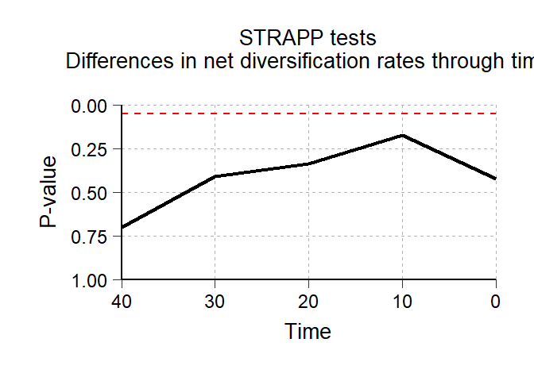
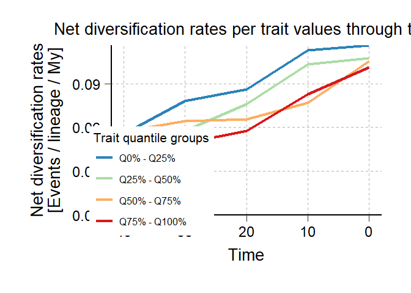
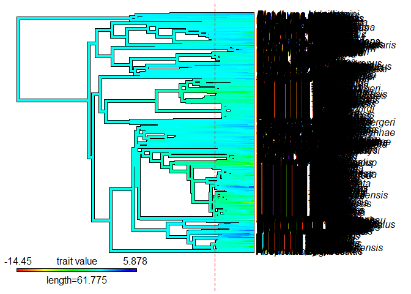
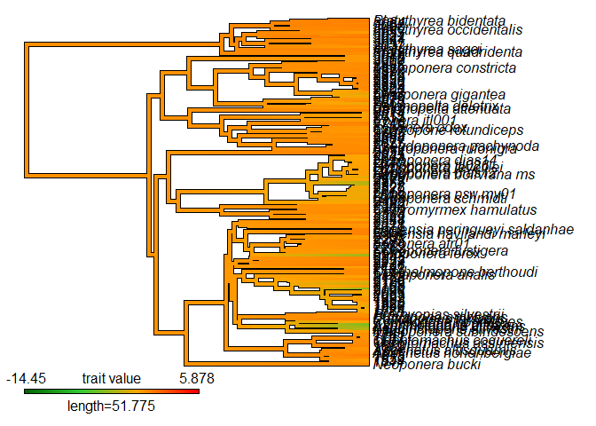
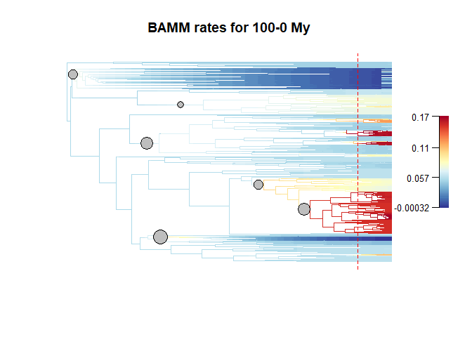
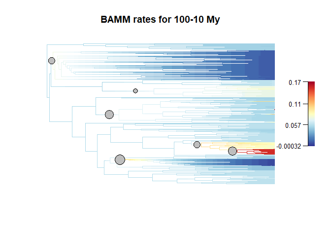

<!-- README.md is generated from README.Rmd. Please edit that file -->

# deepSTRAPP

### Add the Hex logo

<!-- badges: start -->
<!-- 
usethis::use_cran_badge() reports the current version of your package on CRAN.
usethis::use_coverage() reports test coverage.
use_github_actions()  reports the R CMD check status of your development package. 
-->
<!-- badges: end -->

The **R package deepSTRAPP** employs time-calibrated phylogenies and
trait data to test for differences in diversification rates between
traits over evolutionary time. It works with continuous, categorical,
and biogeographic trait data and extends the STRAPP test from
`[BAMMtools::traitDependentBAMM()]` to any time step along phylogenies.

deepSTRAPP provides a powerful analytic framework to investigate the
Rate Diversification Hypothesis (RDH) in the context of Historical
Biogeography. RDH posits that current heterogeneity in diversity
patterns such as the Latitudinal Diversity Gradient are mostly due to
differences in diversification rates across bioregions. This hypothesis
is typically assessed by comparing diversification rates across tips
between the different bioregions with for example a STRAPP test
(*Rabosky & Huang, 2016*). However, such tests only compare current
rates of diversification that mat not be informative about the long-term
past dynamics shaping present-day biodiversity. deepSTRAPP overcomes
this methodological gap: it enables to test the RDH by comparing
diversification rates at any time step along evolutionary time. As a
typical outcome, it allows researchers to identify time-frame of
significance during which diversification rates were different across
trait values, providing a quantitative testing framework to disentangle
effects of past and current dynamics in explaining current patterns of
biodiversity.

Beyond the biogeographic context, deepSTRAPP can be used to test for an
evolutionary relationship between phenotypic evolution and
diversification dynamics for any type of traits. It provides an
alternative approach to state-dependent speciation and extinction (SSE)
models that intend to model altogether trait evolution and
diversification dynamics, but are often time-consuming and hard to
parametrize, especially on large time-calibrated phylogenies (*Need a
ref*). Conversely, deepSTRAPP offers a flexible solution that can be
applied to phylogenies encompassing thousands of lineages (*Doré al.,
2025*).

A deepSTRAPP workflow runs as follows:

- Step 1: Map trait evolution
- Step 2: Infer diversification dynamics (typically with BAMM)
- Step 3: Extract traits values, diversification rates, and regimes at a
  given time in the past
- Step 4: Run a STRAPP test
- Step 5: Repeat steps 3 & 4 for many timesteps along evolution time
- Step 6: Summarize tests results

**(Insert simplified workflow diagram that shows how the main functions
interact with each other in a workflow to achieve a typical goal +
examples of outputs)**

**References:**

> STRAPP test: Rabosky, D. L., & Huang, H. (2016). A robust
> semi-parametric test for detecting trait-dependent diversification.
> Systematic biology, 65(2), 181-193.
> <https://doi.org/10.1093/sysbio/syv066>.

> deepSTRAPP method: Doré, M., & Blaimer, B. deepSTRAPP: Testing for
> differences in diversification rates over deep evolutionary time.
> (provide DOI link)

> deepSTRAPP application: Doré, M., Borowiec, M. L., Branstetter, M. G.,
> Camacho, G. P., Fisher, B. L., Longino, J. T., Ward, P. S., Blaimer,
> B. B., (2025), Timing is everything: Evolution of ponerine ants
> highlights how dispersal history shapes modern biodiversity, Nature
> Communications. <https://doi_of_Paper_to_provide.html>

## Installation

From CRAN for the latest release

From GitHub for the current development version

You can install the development version of deepSTRAPP like so:

``` r
remotes::install_github("MaelDore/deepSTRAPP")
```

You may need additional tools for package compilation such as Rtools
(Windows) and Xcode (Mac OS). See [this
page](https://support.posit.co/hc/en-us/articles/200486498-Package-Development-Prerequisites)
for details.

## Quick-to-run example

This is a simple example that shows how deepSTRAPP can be used to test
for differences in diversification rates between traits along
evolutionary times. It presents the main functions in a typical
deepSTRAPP workflow. For more advanced used, please refer to the
vignettes/tutorials below.

**Temporary version with continuous trait, but should be replace by
categorical trait once prepare_trait_data() is updated**

**Need to find a simple example with enough regime shifts to find
significant results, and ideally, non-significant results in the
present, but a significant time-frame in the past**

``` r
# ------ Step 0: Load data ------ #

## Load trait df
data(Ponerinae_trait_data, package = "deepSTRAPP")

dim(Ponerinae_trait_data)
View(Ponerinae_trait_data)

# Extract continuous trait data as a named vector
Ponerinae_data_ln_HW <- setNames(object = Ponerinae_trait_data$sim_ln_HW,
                                 nm = Ponerinae_trait_data$Taxa)


## Load phylogeny
data(Ponerinae_tree, package = "deepSTRAPP")

plot(Ponerinae_tree)
Ntip(Ponerinae_tree) == length(Ponerinae_data_ln_HW)

## Check that trait data and phylogeny are named and ordered similarly
all(names(Ponerinae_data_ln_HW) == Ponerinae_tree$tip.label)
```

``` r
# ------ Step 1: Prepare trait data ------ #

## Goal: Map trait evolution on the time-calibrated phylogeny

# 1/ Fit evolutionary models to trait data using Maximum Likelihood.
# 2/ Select the best fitting model comparing AICc.
# 3/ Infer ancestral characters estimates (ACE) at nodes.
# 4/ Run stochastic mapping simulations to generate evolutionary histories
#    compatible with the best model and inferred ACE. (Only for categorical and biogeographic data)
# 5/ Infer ancestral states along branches.
#  - For continuous traits: use interpolation to produce a `contMap`.
#  - For categorical and biogeographic data: compute posterior frequencies of each state/range
#    to produce a `densityMap` for each state/range.

library(deepSTRAPP)

# All these actions are performed by a single function: deepSTRAPP::prepare_trait_data()
?deepSTRAPP::prepare_trait_data()

#### Temporary version with continuous trait, but should be replace by categorical trait once prepare_trait_data() is updated

# Run prepare_trait_data with default options
# For continuous trait, a BM model is assumed by default.
Ponerinae_trait_object <- prepare_trait_data(tip_data = Ponerinae_data_ln_HW,
                                             trait_data_type = "continuous",
                                             phylo = Ponerinae_tree)

# Explore output
str(Ponerinae_trait_object, 1)

# Extract the contMap representing continuous trait evolution on the phylogeny
Ponerinae_contMap <- Ponerinae_trait_object$contMap
plot(Ponerinae_contMap)

# Extract the Ancestral Character Estimates (ACE) = trait values at nodes
Ponerinae_ACE <- Ponerinae_trait_object$ace
head(Ponerinae_ACE)

## Inputs needed for Step 2 are the contMap, and optionally, the tip_data (Ponerinae_data_ln_HW), and the ACE (Ponerinae_ACE)


#### Version with categorical trait, to replace the version above once prepare_trait_data() is updated


## Inputs needed for Step 2 are the densityMaps (Ponerinae_densityMaps)
```

``` r
# ------ Step 2: Prepare diversification data ------ #

## Goal: Map evolution of diversification rates and regime shifts on the time-calibrated phylogeny

# Run a BAMM (Bayesian Analysis of Macroevolutionary Mixtures)

# You need the BAMM C++ program installed in your machine to run this step.
# See the BAMM website: http://bamm-project.org/ and the companion R package [BAMMtools].

# 1/ Set BAMM - Record BAMM settings and generate all input files needed for BAMM.
# 2/ Run BAMM - Run BAMM and move output files in dedicated directory.
# 3/ Evaluate BAMM - Produce evaluation plots and ESS data.
# 4/ Import BAMM outputs - Load `BAMM_object` in R and subset posterior samples.
# 5/ Clean BAMM files - Remove files generated during the BAMM run.

# All these actions are performed by a single function: deepSTRAPP::prepare_diversification_data()
?deepSTRAPP::prepare_diversification_data()

# Run BAMM workflow with deepSTRAPP
## This step is time-consuming. You can skip it and load directly the result if needed
Ponerinae_BAMM_object <- prepare_diversification_data(
   BAMM_install_directory_path = "./software/bamm-2.5.0/", # To adjust to your own path to BAMM
   phylo = Ponerinae_tree,
   prefix_for_files = "Ponerinae",
   numberOfGenerations = 10^7 # Set high for optimal run, but will take a long time
)

# Load directly the result
data(Ponerinae_BAMM_object)

# Explore output
str(Ponerinae_BAMM_object, 1)
str(Ponerinae_BAMM_object$eventData, 1) # Record the regime shift events and macroevolutionary regimes parameters across posterior samples
head(Ponerinae_BAMM_object$meanTipLambda) # Mean speciation rates at tips aggregated across all posterior samples
head(Ponerinae_BAMM_object$meanTipMu) # Mean extinction rates at tips aggregated across all posterior samples

# Plot mean net diversification rates and regime shifts on the phylogeny
plot_BAMM_rates(Ponerinae_BAMM_object,
                labels = FALSE, legend = TRUE)

## Input needed for Step 3 is the BAMM_object (Ponerinae_BAMM_object)
```

``` r
# ------ Step 3: Run a deepSTRAPP workflow ------ #

## Goal: Extract traits, diversification rates and regimes at a given time in the past to test for differences with a STRAPP test

# 1/ Extract trait data at a given time in the past ('focal_time')
# 2/ Extract diversification rates and regimes at a given time in the past ('focal_time')
# 3/ Compute STRAPP test
# 4/ Repeat previous actions for many timesteps along evolutionary time

# All these actions are performed by a single function:
#  For a single 'focal_time': deepSTRAPP::run_deepSTRAPP_for_focal_time()
#  For multiple 'time_steps': deepSTRAPP::run_deepSTRAPP_over_time()
?deepSTRAPP::run_deepSTRAPP_for_focal_time()
?deepSTRAPP::run_deepSTRAPP_over_time()

## Set for five time steps of 10 My. Will generate deepSTRAPP workflows for 0, 10, 20, 30, and 40 Mya.
nb_time_steps <- 5
time_step_duration <- 10

# Run deepSTRAPP on net diversification rates
## This step is time-consuming. You can skip it and load directly the result if needed
Ponerinae_deepSTRAPP_0_40 <- run_deepSTRAPP_over_time(
    contMap = Ponerinae_contMap,
    ace = Ponerinae_ACE,
    tip_data = Ponerinae_data_ln_HW,
    trait_data_type = "continuous",
    BAMM_object = Ponerinae_BAMM_object,
    nb_time_steps = nb_time_steps,
    time_step_duration = time_step_duration,
    return_perm_data = TRUE, # Needed to obtain STRAPP stats and plot evaluation histograms (See 4.2)
    extract_trait_data_melted_df = TRUE, # Needed to get trait data and plot rates through time (See 4.3)
    extract_diversification_data_melted_df = TRUE, # Needed to get diversification data and plot rates through time (See 4.3)
    return_STRAPP_results = TRUE, # Needed to obtain STRAPP stats and plot evaluation histograms (See 4.2)
    return_updated_trait_data_with_contMap = TRUE, # Needed to plot updated contMaps (See 4.4)
    return_updated_BAMM_object = TRUE, # Needed to map diversification rates on updated phylogenies (See 4.5)
    verbose = TRUE,
    verbose_extended = TRUE)

# Load the deepSTRAPP output summarizing results for 0 to 40 My
data(Ponerinae_deepSTRAPP_0_40, package = "deepSTRAPP")

## Explore output
str(Ponerinae_deepSTRAPP_0_40, max.level = 1)

# See next step for how to generate plots from those outputs

# Display test summary
# Can be passed down to [deepSTRAPP::plot_STRAPP_pvalues_over_time()] to generate a plot
# showing the evolution of the test results across time
Ponerinae_deepSTRAPP_0_40$pvalues_summary_df

# Access STRAPP test results
# Can be passed down to [deepSTRAPP::plot_histograms_STRAPP_tests_over_time()] to generate plot
# showing the null distribution of the test statistics
str(Ponerinae_deepSTRAPP_0_40$STRAPP_results, max.level = 2)

# Access trait data in a melted data.frame
head(Ponerinae_deepSTRAPP_0_40$trait_data_df_over_time)
# Access the diversification data in a melted data.frame
head(Ponerinae_deepSTRAPP_0_40$diversification_data_df_over_time)
# Both can be passed down to [deepSTRAPP::plot_rates_through_time()] to generate a plot
# showing the evolution of diversification rates though time in relation to trait values

# Access updated contMaps for each focal time
# Can be used to plot contMap with branch cut-off at focal time with [phytools::plot.contMap()]
str(Ponerinae_deepSTRAPP_0_40$updated_trait_data_with_contMap_over_time, max.level = 2)

# Access updated BAMM_object for each focal time
# Can be used to map rates and regime shifts on phylogeny with branch cut-off 
# at focal time with [deepSTRAPP::plot_BAMM_rates()]
str(Ponerinae_deepSTRAPP_0_40$updated_trait_data_with_contMap_over_time, max.level = 2)

## Input needed for Step 4 is the deepSTRAPP object (Ponerinae_deepSTRAPP_0_40)
```

``` r
# ------ Step 4: Plot results ------ #

## Goal: Summarize the outputs in meaningful plots

# 1/ Plot evolution of STRAPP tests p-values through time
# 2/ Plot histogram of STRAPP test stats
# 3/ Plot evolution of rates though time in relation to trait values
# 4/ Plot updated contMap mapping trait evolution for a given 'focal_time'
# 5/ Plot updated diversification rates and regimes for a given 'focal_time'

# Each plot is achieve through a dedicated function

# Load the deepSTRAPP output summarizing results for 0 to 40 My
data(Ponerinae_deepSTRAPP_0_40, package = "deepSTRAPP")

### 1/ Plot evolution of STRAPP tests p-values through time ####

# ?deepSTRAPP::plot_STRAPP_pvalues_over_time()

## Plot results of Spearman's tests over time
deepSTRAPP::plot_STRAPP_pvalues_over_time(
   STRAPP_tests_over_time = Ponerinae_deepSTRAPP_0_40)
```



``` r

# This is the main output of deepSTRAPP. It shows the evolution of the significance of the STRAPP test over time.
```

``` r
### 2/ Plot histogram of STRAPP test stats ####

# Plot an histogram of the distribution of the test statistics used to assess the significance of STRAPP tests
  #  For a single 'focal_time': deepSTRAPP::plot_histogram_STRAPP_test_for_focal_time()
  #  For multiple 'time_steps': deepSTRAPP::plot_histograms_STRAPP_tests_over_time()

# ?deepSTRAPP::plot_histogram_STRAPP_test_for_focal_time
# ?deepSTRAPP::plot_histograms_STRAPP_tests_over_time

# Display the time-steps
Ponerinae_deepSTRAPP_0_40$time_steps

# Plot the histogram of test stats for time-step n°3 = 20 My
plot_histogram_STRAPP_test_for_focal_time(
   STRAPP_results = Ponerinae_deepSTRAPP_0_40$STRAPP_results_over_time[[2]])

# Plot the histograms of test stats for all time-steps
plot_histograms_STRAPP_tests_over_time(
   STRAPP_tests_over_time = Ponerinae_deepSTRAPP_0_40)
```


``` r
### 3/ Plot evolution of rates through time ~ trait data ####

# ?deepSTRAPP::plot_rates_through_time()

# Generate ggplot
plotTT_continuous <- plot_rates_through_time(STRAPP_tests_over_time = Ponerinae_deepSTRAPP_0_40,
                                             display_plot = FALSE)

# Plot results
print(plotTT_continuous$rates_TT_ggplot)
# Adjust aesthetics of ggplot a posteriori
plotTT_continuous_adj <- plotTT_continuous$rates_TT_ggplot +
    ggplot2::theme(plot.title = ggplot2::element_text(color = "red", size = 15))
print(plotTT_continuous_adj)
```



``` r
### 4/ Plot updated contMap mapping trait evolution for a given 'focal_time' ####

# ?phytools::plot.contMap()

# Display the time-steps
Ponerinae_deepSTRAPP_0_40$time_steps
#> [1]  0 10 20 30 40

# Extract root age
root_age <- max(phytools::nodeHeights(Ponerinae_tree)[,2])

# Plot initial contMap (t = 0)
contMap_0My <- Ponerinae_deepSTRAPP_0_40$updated_trait_data_with_contMap_over_time[[1]]
phytools::plot.contMap(contMap_0My$contMap)
abline(v = root_age - 20, col = "red", lty = 2) # Show where the phylogeny will be cut
```



``` r

# Plot updated contMap for time-step n°3 = 20 My
contMap_20My <- Ponerinae_deepSTRAPP_0_40$updated_trait_data_with_contMap_over_time[[3]]
phytools::plot.contMap(contMap_20My$contMap)
```



``` r
### 5/ Plot updated diversification rates and regimes for a given 'focal_time' ####

# ?deepSTRAPP::plot_BAMM_rates()

# Display the time-steps
Ponerinae_deepSTRAPP_0_40$time_steps

# Extract root age
root_age <- max(phytools::nodeHeights(Ponerinae_tree)[,2])

# Plot diversification rates on initial phylogeny (t = 0)
BAMM_map_0My <- Ponerinae_deepSTRAPP_0_40$updated_BAMM_objects_over_time[[1]]
plot_BAMM_rates(BAMM_map_0My, labels = FALSE, par.reset = FALSE)
abline(v = root_age - 20, col = "red", lty = 2) # Show where the phylogeny will be cut

# Plot diversification rates on updated phylogeny for time-step n°3 = 20 My
BAMM_map_20My <- Ponerinae_deepSTRAPP_0_40$updated_BAMM_objects_over_time[[3]]
plot_BAMM_rates(BAMM_map_20My, labels = FALSE,
                colorbreaks = BAMM_map_20My$initial_colorbreaks$net_diversification)
```



## Advanced uses / tutorials

Points to vignettes for tutorials on how to use the package in more
complex situations

**Full simple tuto for each type of data**

- Do not use options, just show the whole pipeline and the outputs

**Explore options for trait evolution**

- Continuous vs. categorical vs. biogeographic
- Model options and model outputs (ACE and model parameters)

**Explore options for BAMM**

- Show the extent of possible parametrization
- Show evaluations

**Explore the STRAPP test options**

- one-tailed vs. two-tailed
- Hypotheses
- posthoc tests

**Explore the extend of possible outputs**

- Histo for STRAPP results
  - With pairwise tests
- Plot rates and shifts =\> Options for shift location
- Plot traits: contMap, DensityMaps per states/ranges, DensityMap with
  alpha
- Plot traits vs. rates + Updated BAMM and updated contMap/DensityMaps
- RTT plots
  - For different type of data
  - With pairwise tests and options
- Diversification/traits melted df

## How to Cite

> Doré, M., & Blaimer, B. deepSTRAPP: Testing for differences in
> diversification rates over deep evolutionary time. (provide DOI link)

**May include a chunk of R script with a bibtex citation**
