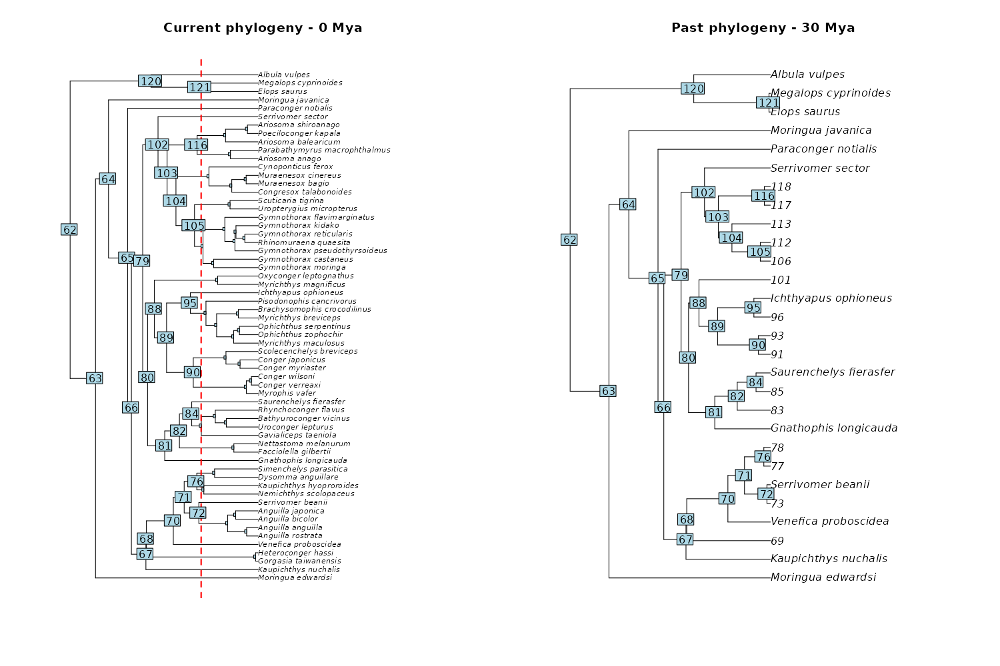
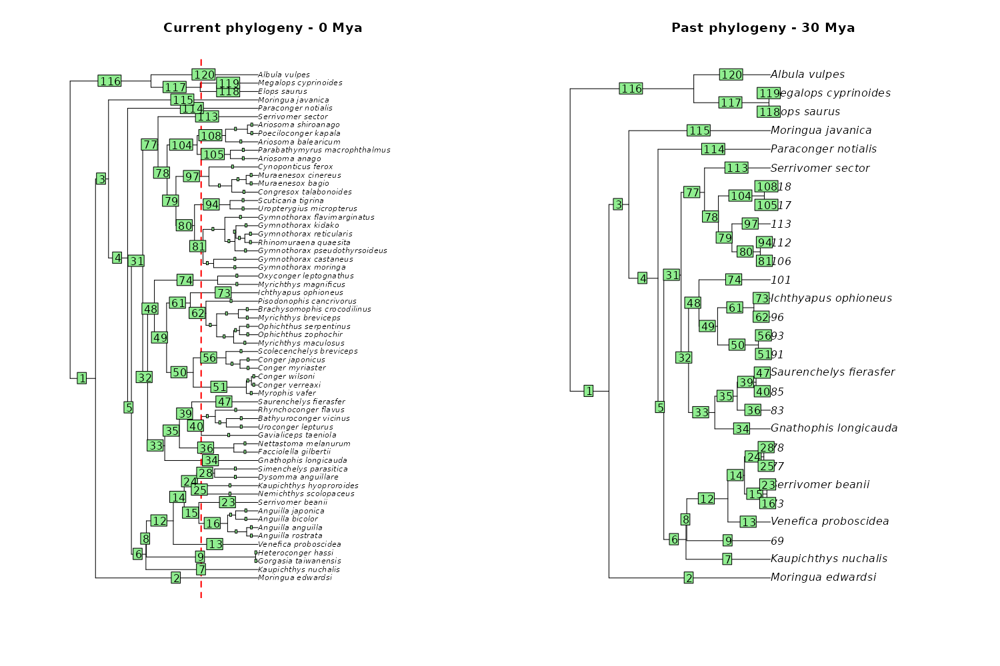
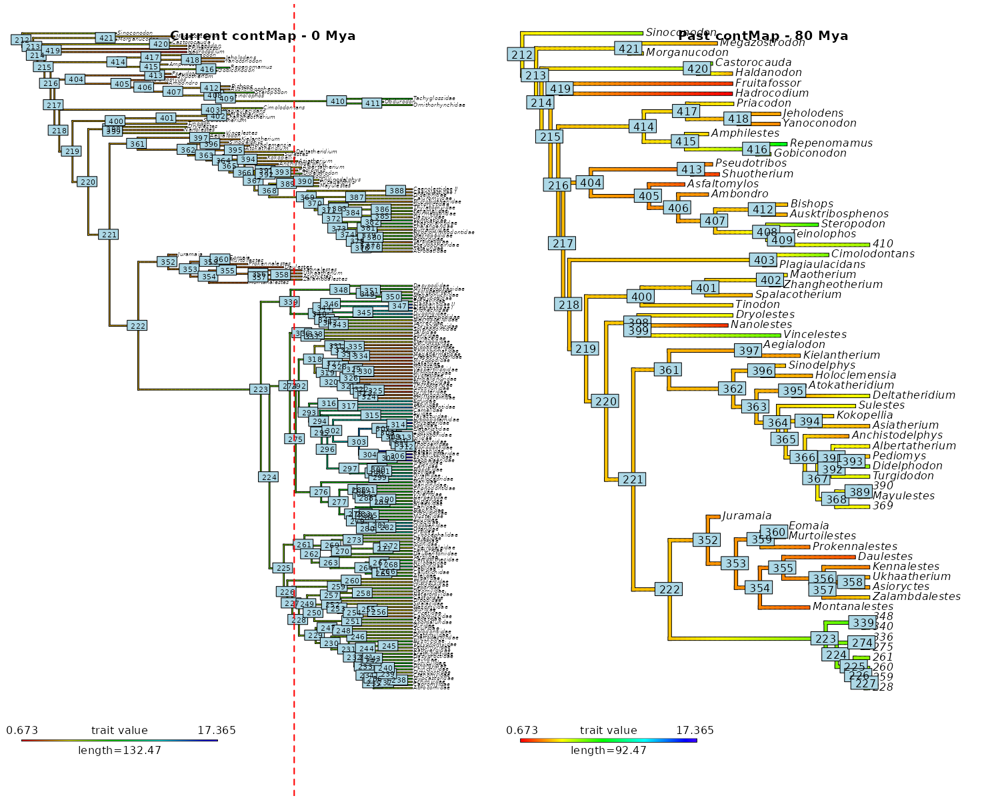
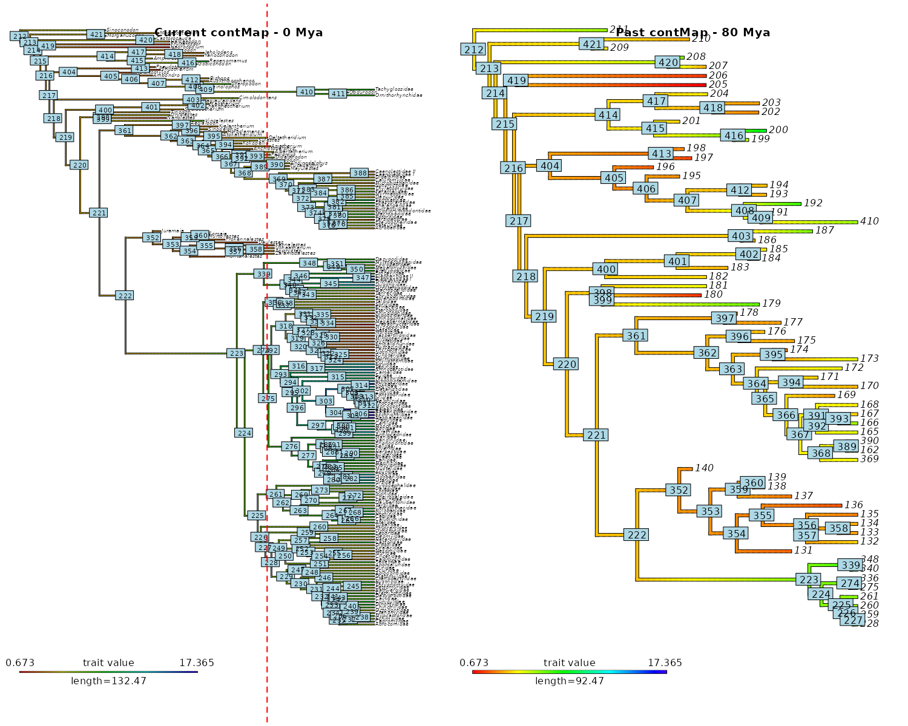
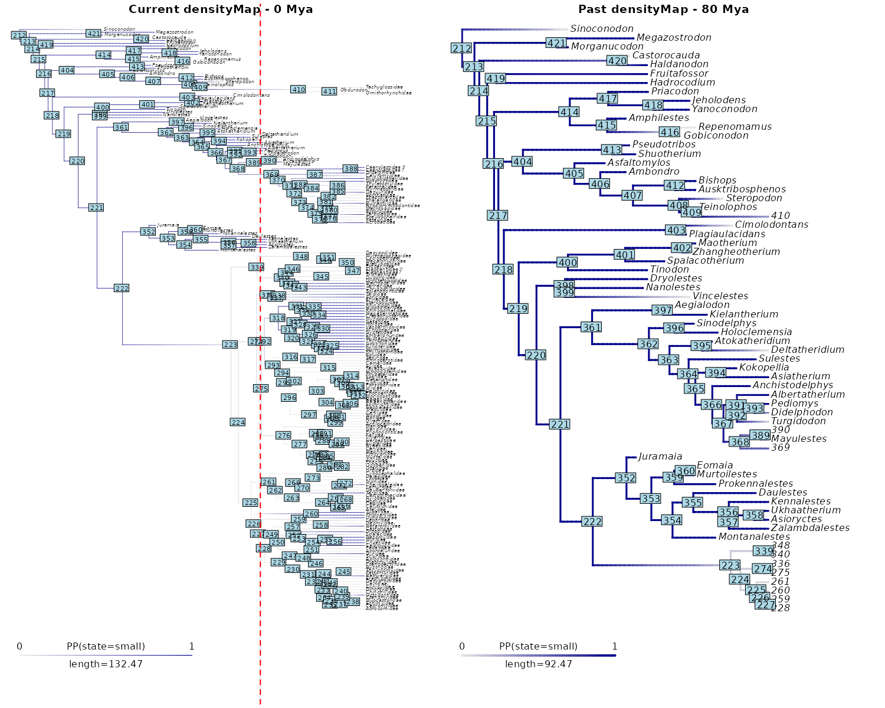
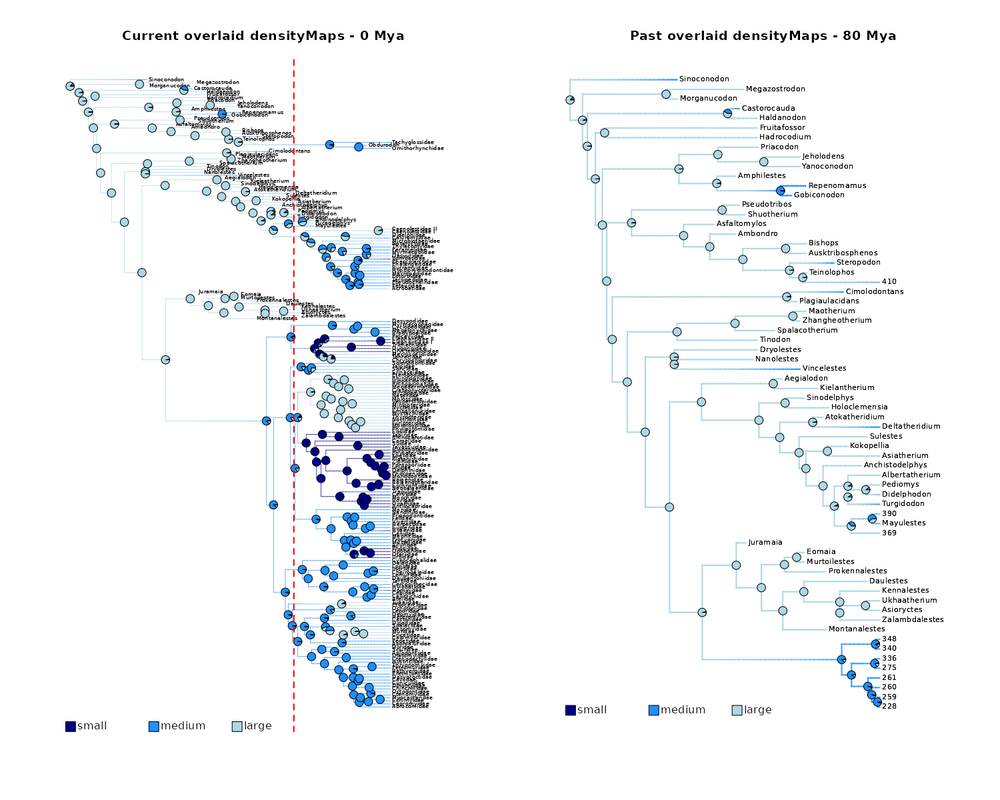
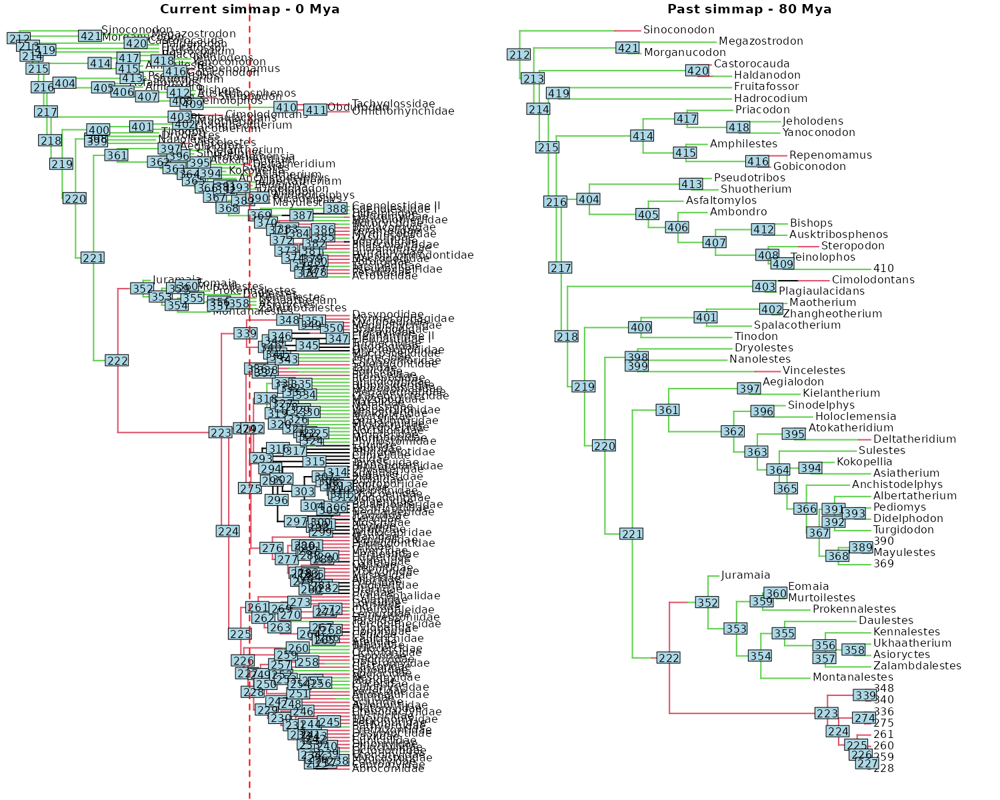
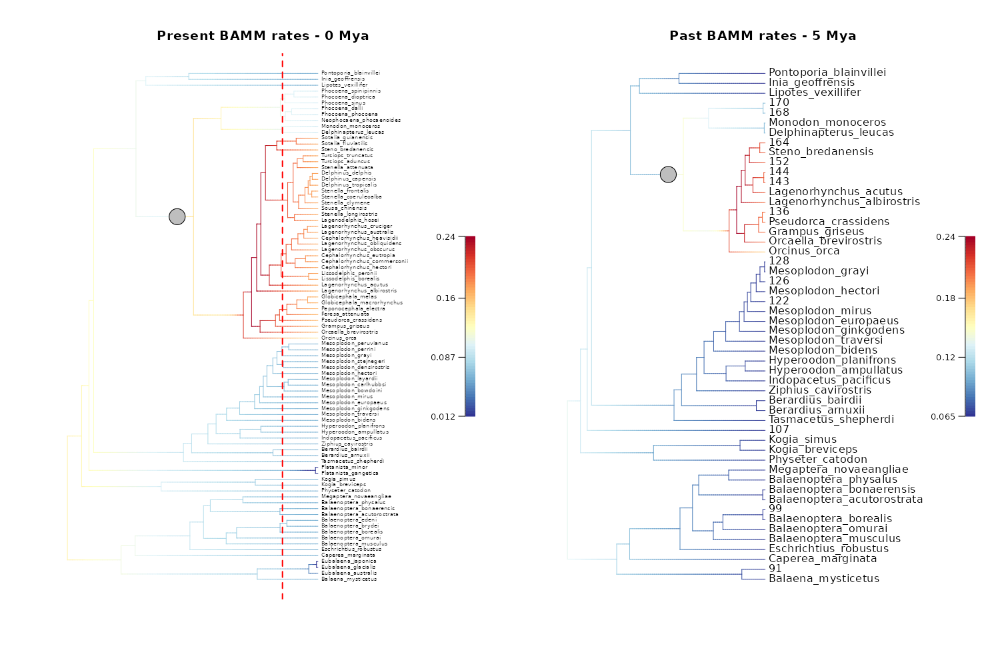

# Cut phylogenies

  
This vignette presents the different **utility functions** used
internally by deepSTRAPP to **cut (mapped) phylogenies** to a given
focal-time, and then extract data from freshly cut tips.

These functions can be used to cut any (mapped) phylogenies outside of a
deepSTRAPP run including a regular phylogeny, contMap(s), densityMap(s),
simmap(s), and BAMM_object with diversification rates.

  

``` r

# ------ Example 1: Cut a regular phylogeny ------ #

# See help of the dedicated function
?deepSTRAPP::cut_phylo_for_focal_time()

## Load eel phylogeny from the R package phytools
# Source: Collar et al., 2014; DOI: 10.1038/ncomms6505
library(phytools)
data(eel.tree)

## Cut phylogeny

# Cut tree to 30 Mya 
cut_tree_with_tip_labels <- cut_phylo_for_focal_time(
  tree = eel.tree,
  focal_time = 30, 
  keep_tip_labels = TRUE)

## Show tip labels

# Because we used 'keep_tip_labels = TRUE', we kept tip.label on terminal branches
# with a unique descending tip.

# Plot internal node labels on initial tree with cut-off
plot(eel.tree)
abline(v = max(phytools::nodeHeights(eel.tree)[,2]) - 30, col = "red", lty = 2, lwd = 2)
nb_tips <- length(eel.tree$tip.label)
nodelabels_in_cut_tree <- (nb_tips + 1):(nb_tips + eel.tree$Nnode)
nodelabels_in_cut_tree[!(nodelabels_in_cut_tree %in% cut_tree_with_tip_labels$initial_nodes_ID)] <- NA
ape::nodelabels(text = nodelabels_in_cut_tree)
title(main = "Current phylogeny - 0 Mya")

# Plot initial internal node labels on cut tree
plot(cut_tree_with_tip_labels)
ape::nodelabels(text = cut_tree_with_tip_labels$initial_nodes_ID)
title(main = "Past phylogeny - 30 Mya")

# Plot cut tree without keeping tip.label on terminal branches with a unique descending tip.
# All tip.labels are converted to their descending/tipward node ID
cut_tree_without_tip_labels <- cut_phylo_for_focal_time(
  tree = eel.tree, 
  focal_time = 30, 
  keep_tip_labels = FALSE)
plot(cut_tree_without_tip_labels)
title(main = "Past phylogeny - 30 Mya")
```



``` r

## Show edge labels

# Plot edge labels on initial tree with cut-off
plot(eel.tree)
abline(v = max(phytools::nodeHeights(eel.tree)[,2]) - 30, col = "red", lty = 2, lwd = 2)
edgelabels_in_cut_tree <- 1:nrow(eel.tree$edge)
edgelabels_in_cut_tree[!(1:nrow(eel.tree$edge) %in% cut_tree_with_tip_labels$initial_edges_ID)] <- NA
ape::edgelabels(text = edgelabels_in_cut_tree)
title(main = "Current phylogeny - 0 Mya")

# Plot initial edge labels on cut tree
plot(cut_tree_with_tip_labels)
ape::edgelabels(text = cut_tree_with_tip_labels$initial_edges_ID)
title(main = "Past phylogeny - 30 Mya")
```



``` r

# ------ Example 2: Cut a contMap ------ #

# See help of the dedicated function
?deepSTRAPP::cut_contMap_for_focal_time()

# A contMap is a phylogeny with estimated continuous ancestral trait values mapped along branches.
# It is typically obtained with `[phytools::contMap()]`.
# Within deepSTRAPP, it is part of the output of `[deepSTRAPP::prepare_trait_data()]`
# when used on a continuous trait.

## Load mammals phylogeny and data from the R package motmot (data included in deepSTRAPP)
# Initial data source: Slater, 2013; DOI: 10.1111/2041-210X.12084
data(mammals, package = "deepSTRAPP")

# Get the phylogeny
mammals_tree <- mammals$mammal.phy
# Get the continuous trait data
mammals_data <- setNames(object = mammals$mammal.mass$mean,
                         nm = row.names(mammals$mammal.mass))[mammals_tree$tip.label]

# Run a stochastic mapping based on a Brownian Motion model
# for Ancestral Trait Estimates to obtain a "contMap" object
mammals_contMap <- phytools::contMap(mammals_tree, x = mammals_data,
                                     res = 100, # Number of time steps
                                     plot = FALSE)

# Set focal time
focal_time <- 80

## Cut contMap to 80 Mya while keeping tip.label
# on terminal branches with a unique descending tip.
updated_contMap <- cut_contMap_for_focal_time(
   contMap = mammals_contMap,
   focal_time = focal_time,
   keep_tip_labels = TRUE)

# Plot node labels on initial stochastic map with cut-off
plot_contMap(mammals_contMap)
ape::nodelabels()
abline(v = max(phytools::nodeHeights(mammals_contMap$tree)[,2]) - focal_time,
       col = "red", lty = 2, lwd = 2)
title(main = "Current contMap - 0 Mya")

# Plot initial node labels on cut stochastic map
plot_contMap(updated_contMap)
ape::nodelabels(text = updated_contMap$tree$initial_nodes_ID)
title(main = "Past contMap - 80 Mya")


## Cut contMap to 80 Mya while NOT keeping tip.label.
updated_contMap <- cut_contMap_for_focal_time(
   contMap = mammals_contMap,
   focal_time = focal_time,
   keep_tip_labels = FALSE)

# Plot node labels on initial stochastic map with cut-off
plot_contMap(mammals_contMap)
ape::nodelabels()
abline(v = max(phytools::nodeHeights(mammals_contMap$tree)[,2]) - focal_time,
       col = "red", lty = 2, lwd = 2)
title(main = "Current contMap - 0 Mya")

# Plot initial node labels on cut stochastic map
plot_contMap(updated_contMap)
ape::nodelabels(text = updated_contMap$tree$initial_nodes_ID)
title(main = "Past contMap - 80 Mya")
```



``` r

# ------ Example 3: Cut densityMaps and simmaps ------ #

# See help of the dedicated functions
?deepSTRAPP::cut_densityMaps_for_focal_time()
?deepSTRAPP::cut_simmaps_for_focal_time()

# A densityMap is a phylogeny with posterior probabilities of a given state mapped along branches.
# It is typically obtained with `[phytools::densityMap()]`.
# Within deepSTRAPP, it is part of the output of `[deepSTRAPP::prepare_trait_data()]`
# when used on a categorical or biogeographic trait.
# deepSTRAPP also offers to overlay densityMaps of all states/ranges to obtain a single mapping 
# of all states/ranges on a unique phylogeny with `[deepSTRAPP::plot_densityMaps_overlay()]`

# A simmap is a phylogeny with states/ranges from a unique simulation of evolutionary history mapped along branches.
# It is typically obtained with `[phytools::make.simmap()]`.
# Within deepSTRAPP, it is part of the output of `[deepSTRAPP::prepare_trait_data()]`
# when 'run_stochastic_maps = TRUE' and 'return_simmaps = TRUE'.


#### 3.1/ Prepare data ####

## Load mammals phylogeny and data from the R package motmot (data included in deepSTRAPP)
# Initial data source: Slater, 2013; DOI: 10.1111/2041-210X.12084
data(mammals, package = "deepSTRAPP")

# Get the phylogeny
mammals_tree <- mammals$mammal.phy
# Get the continuous trait data
mammals_data <- setNames(object = mammals$mammal.mass$mean,
                         nm = row.names(mammals$mammal.mass))[mammals_tree$tip.label]
# Convert mass data into categories
mammals_mass <- setNames(object = mammals$mammal.mass$mean,
                         nm = row.names(mammals$mammal.mass))[mammals_tree$tip.label]
mammals_data <- mammals_mass
mammals_data[seq_along(mammals_data)] <- "small"
mammals_data[mammals_mass > 5] <- "medium"
mammals_data[mammals_mass > 10] <- "large"
table(mammals_data)

## Select color scheme for states
colors_per_states <- c("darkblue", "dodgerblue", "lightblue")
names(colors_per_states) <- c("small", "medium", "large")

# Produce densityMaps and simmaps using stochastic character mapping based on an equal-rates (ER) Mk model
mammals_cat_data <- prepare_trait_data(tip_data = mammals_data, phylo = mammals_tree,
                                       trait_data_type = "categorical",
                                       evolutionary_models = "ER",
                                       run_stochastic_maps = TRUE,
                                       nb_simulations = 100, 
                                       colors_per_levels = colors_per_states,
                                       return_simmaps = TRUE)

# Set focal time
focal_time <- 80

#### 3.2/ Plot a unique cut densityMap ####

# Extract the density map for small mammals (state 3 = "small")
mammals_densityMap_small <- mammals_cat_data$densityMaps[[3]]

## Cut densityMap to 80 Mya while keeping tip.label
# on terminal branches with a unique descending tip.
updated_mammals_densityMap_small <- cut_densityMap_for_focal_time(
     densityMap = mammals_densityMap_small,
     focal_time = focal_time,
     keep_tip_labels = TRUE)

# Plot node labels on initial densityMap with cut-off
phytools::plot.densityMap(mammals_densityMap_small)
ape::nodelabels()
abline(v = max(phytools::nodeHeights(mammals_densityMap_small$tree)[,2]) - focal_time,
       col = "red", lty = 2, lwd = 2)
title(main = "Current densityMap - 0 Mya")

# Plot initial node labels on cut densityMap
phytools::plot.densityMap(updated_mammals_densityMap_small)
ape::nodelabels(text = updated_mammals_densityMap_small$tree$initial_nodes_ID)
title(main = "Past densityMap - 80 Mya")
```

    #> mammals_data
    #>  large medium  small 
    #>     36     83     92
    #> make.simmap is sampling character histories conditioned on
    #> the transition matrix
    #> 
    #> Q =
    #>               large       medium        small
    #> large  -0.006199429  0.003099714  0.003099714
    #> medium  0.003099714 -0.006199429  0.003099714
    #> small   0.003099714  0.003099714 -0.006199429
    #> (specified by the user);
    #> and (mean) root node prior probabilities
    #> pi =
    #>     large    medium     small 
    #> 0.3333333 0.3333333 0.3333333



``` r


#### 3.3/ Plot set of overlaid densityMaps ####

## Cut all densityMaps to 80 Mya while keeping tip.label
# on terminal branches with a unique descending tip.
updated_mammals_densityMaps <- cut_densityMaps_for_focal_time(
     densityMaps = mammals_cat_data$densityMaps,
     focal_time = focal_time,
     keep_tip_labels = TRUE)

# Plot node labels on initial stochastic map with cut-off
plot_densityMaps_overlay(densityMaps = mammals_cat_data$densityMaps,
                         colors_per_levels = colors_per_states)
ape::nodelabels()
abline(v = max(phytools::nodeHeights(mammals_cat_data$densityMaps[[1]]$tree)[,2]) - focal_time,
       col = "red", lty = 2, lwd = 2)
title(main = "Current overlaid densityMaps - 0 Mya")

# Plot initial node labels on cut stochastic map
plot_densityMaps_overlay(densityMaps = updated_mammals_densityMaps,
                         colors_per_levels = colors_per_states)
ape::nodelabels(text = updated_mammals_densityMaps[[1]]$tree$initial_nodes_ID)
title(main = "Past overlaid densityMaps - 80 Mya")
```



``` r


#### 3.4/ Plot a unique cut simmap ####

# Extract the simmap n°1 as an example
mammals_simmap_1 <- mammals_cat_data$simmaps[[1]]

## Cut the extracted simmap to 80 Mya while keeping tip.label
# on terminal branches with a unique descending tip.
updated_mammals_simmap_1 <- cut_simmap_for_focal_time(
     simmap = mammals_simmap_1,
     focal_time = focal_time,
     keep_tip_labels = TRUE)

# Plot node labels on initial stochastic map with cut-off
plot(mammals_simmap_1)
ape::nodelabels()
abline(v = max(phytools::nodeHeights(mammals_simmap_1)[,2]) - focal_time,
       col = "red", lty = 2, lwd = 2)
title(main = "Current simmap - 0 Mya")

# Plot initial node labels on cut stochastic map
plot(updated_mammals_simmap_1)
ape::nodelabels(text = updated_mammals_simmap_1$initial_nodes_ID)
title(main = "Past simmap - 80 Mya")
```

    #> no colors provided. using the following legend:
    #>     large    medium     small 
    #>   "black" "#DF536B" "#61D04F"
    #> no colors provided. using the following legend:
    #>     large    medium     small 
    #>   "black" "#DF536B" "#61D04F"



``` r

# ------ Example 4: Cut a BAMM_object ------ #

# See help of the dedicated function
?deepSTRAPP::update_rates_and_regimes_for_focal_time()

# A BAMM_object is the typical output of a Bayesian Analysis of Macroevolutionary Mixtures (BAMM).
# It is a phylogeny with additional elements describing diversification dynamics,
# including estimates of diversification rates over BAMM posterior samples.
# Within deepSTRAPP, it is the output of `[deepSTRAPP::prepare_diversification_data()]`.

# Similarly to phylogenies, contMap, and densityMaps, it can be updated for a given focal-time 
# by cutting branches at focal-time and updating tip rates.


## Load the BAMM_object summarizing 1000 posterior samples of BAMM
data(whale_BAMM_object, package = "deepSTRAPP")

# Set focal-time to 5 My
focal_time = 5

## Update the BAMM object
whale_BAMM_object_5My <- update_rates_and_regimes_for_focal_time(
   BAMM_object = whale_BAMM_object,
   focal_time = 5,
   update_all_elements = TRUE,
   keep_tip_labels = TRUE)


## Explore updated outputs

# Extract speciation rates for t = 0My
speciation_tip_rates_0My <- whale_BAMM_object$meanTipLambda
names(speciation_tip_rates_0My) <- whale_BAMM_object$tip.label
speciation_tip_rates_0My

# Extract speciation rates for t = 5My
speciation_tip_rates_5My <- whale_BAMM_object_5My$meanTipLambda
names(speciation_tip_rates_5My) <- whale_BAMM_object_5My$tip.label
speciation_tip_rates_5My
# Speciation rates have been updated so that they reflect values estimated at the focal-time (t = 5My).

# Extract extinction rates for t = 0My
extinction_tip_rates_0My <- whale_BAMM_object$meanTipMu
names(extinction_tip_rates_0My) <- whale_BAMM_object$tip.label
extinction_tip_rates_0My

# Extract extinction rates for t = 5My
extinction_tip_rates_5My <- whale_BAMM_object_5My$meanTipMu
names(extinction_tip_rates_5My) <- whale_BAMM_object_5My$tip.label
extinction_tip_rates_5My
# Extinction rates have been updated so that they reflect values estimated at the focal-time (t = 5My).


## Plot BAMM_object

# Add "phylo" class to be compatible with phytools::nodeHeights()
class(whale_BAMM_object) <- unique(c(class(whale_BAMM_object), "phylo"))
root_age <- max(phytools::nodeHeights(whale_BAMM_object)[,2])
# Remove temporary "phylo" class
class(whale_BAMM_object) <- setdiff(class(whale_BAMM_object), "phylo")

# Plot initial BAMM_object for t = 0 My
plot_BAMM_rates(whale_BAMM_object, add_regime_shifts = TRUE,
                labels = TRUE, legend = TRUE)
abline(v = root_age - focal_time,
       col = "red", lty = 2, lwd = 2)
title(main = "\nPresent BAMM rates - 0 Mya")

# Plot updated BAMM_object for t = 5 My
plot_BAMM_rates(whale_BAMM_object_5My, add_regime_shifts = TRUE,
                labels = TRUE, legend = TRUE)
title(main = "\nPast BAMM rates - 5 Mya")
```


