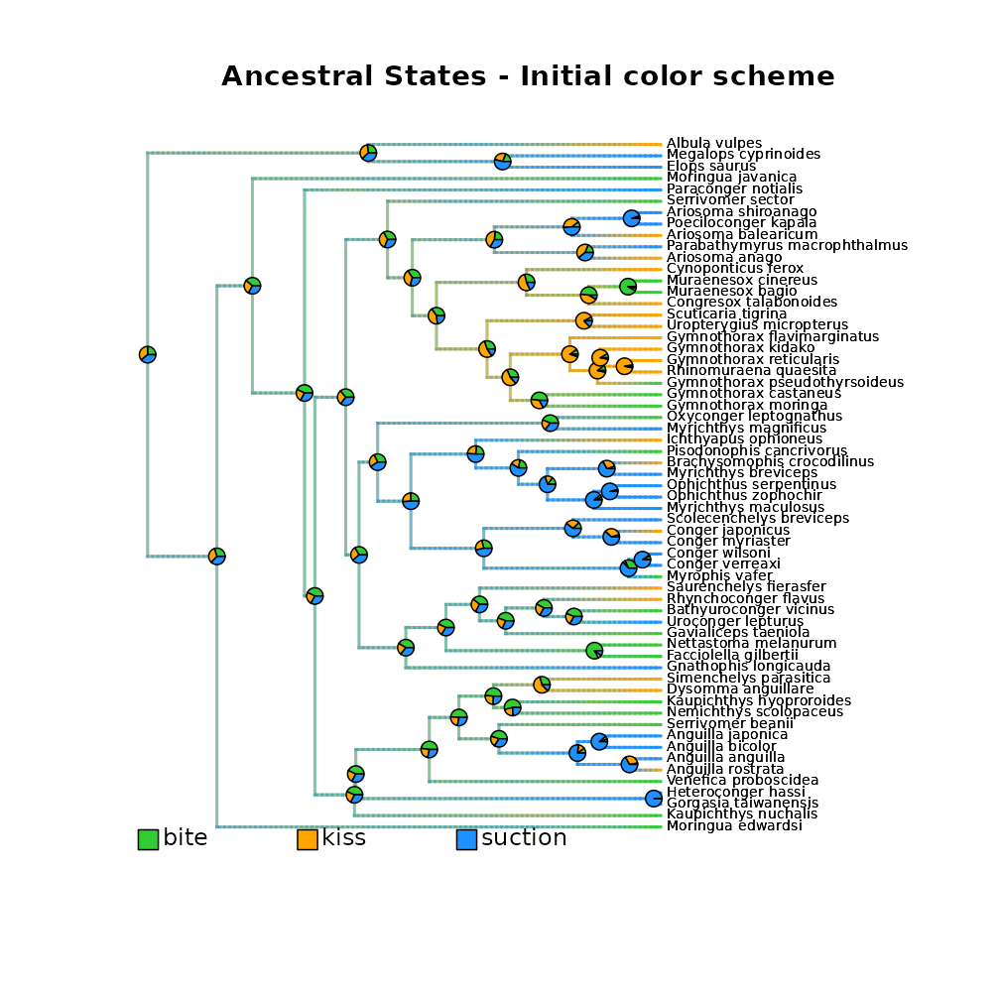
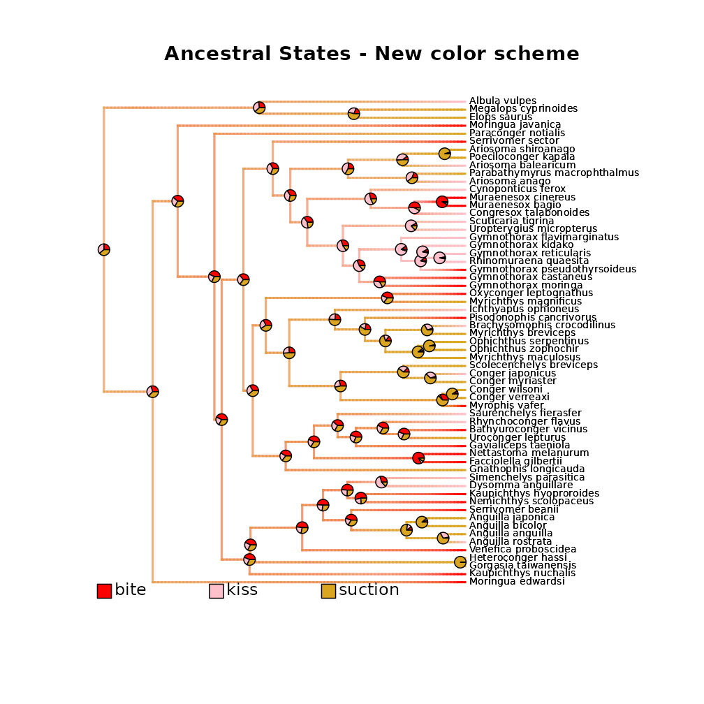
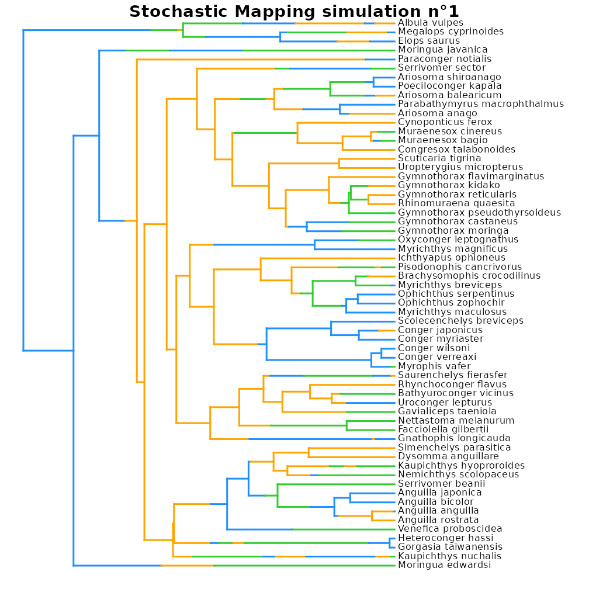
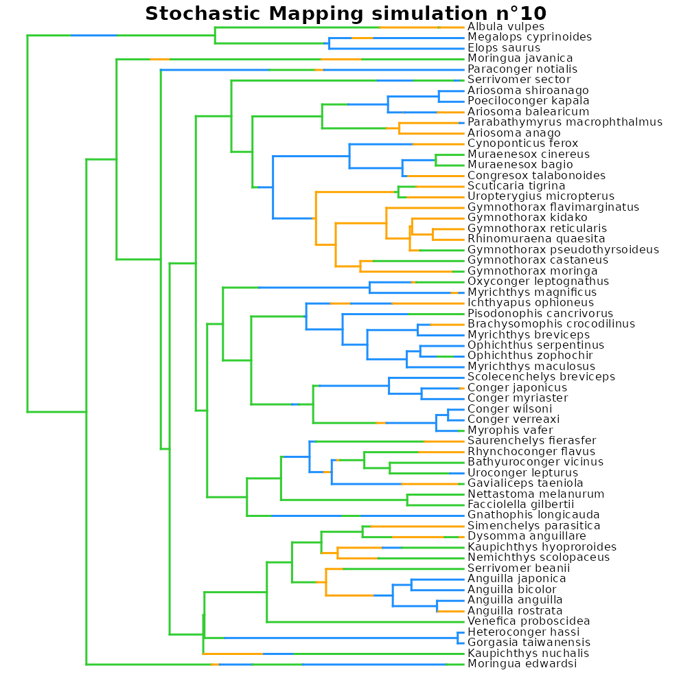
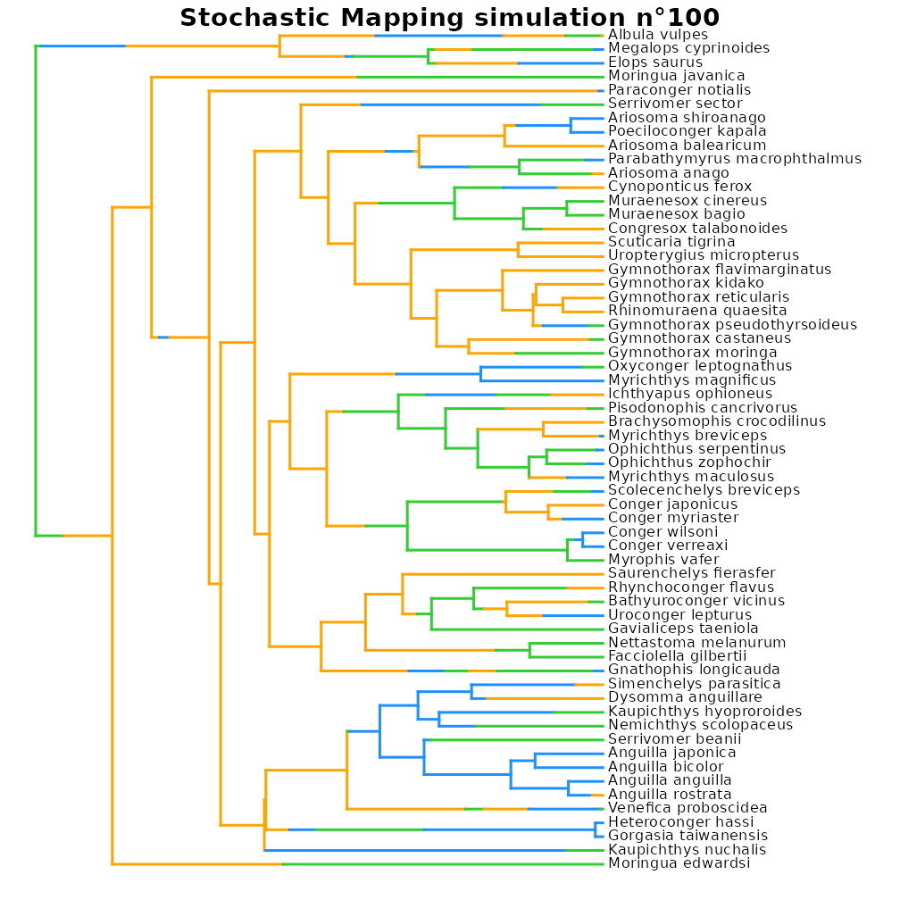

# Model categorical trait evolution

  
This vignette presents the different options available to model
**categorical trait evolution** within deepSTRAPP.

It builds mainly upon functions from R packages `[geiger]` and
`[phytools]` to offer a simplified framework to model and visualize
**categorical trait evolution** on a **time-calibrated phylogeny**.  
Please, cite also the initial R packages if you are using deepSTRAPP for
this purpose.

  
For an example with **continuous data**, see this vignette:
[`vignette("model_continuous_trait_evolution")`](https://maeldore.github.io/deepSTRAPP/articles/model_continuous_trait_evolution.md)

For an example with **biogeographic data**, see this vignette:
[`vignette("model_biogeographic_range_evolution")`](https://maeldore.github.io/deepSTRAPP/articles/model_biogeographic_range_evolution.md)

  

For a detailed explanation on how to load results from **external
analyses** within deepSTRAPP rather than relying on deepSTRAPP
all-in-one function to infer trait evolution, please see the examples in
this vignette:
[`vignette("import_external_analyses")`](https://maeldore.github.io/deepSTRAPP/articles/import_external_analyses.md).

  

``` r


# ------ Step 0: Load data ------ #

## Load phylogeny and tip data

library(phytools)
data(eel.tree)
data(eel.data)
# Dataset of feeding mode and maximum total length from 61 species of elopomorph eels.
# Source: Collar, D. C., P. C. Wainwright, M. E. Alfaro, L. J. Revell, and R. S. Mehta (2014)
# Biting disrupts integration to spur skull evolution in eels. Nature Communications, 5, 5505.

## Transform feeding mode data into a 3-level factor
# This is NOT actual biological data anymore, but data adjusted for the sake of example!

eel_tip_data <- stats::setNames(object = eel.data$feed_mode, nm = rownames(eel.data))
eel_tip_data <- as.character(eel_tip_data)
eel_tip_data[c(1, 5, 6, 7, 10, 11, 15, 16, 17, 24, 25, 28, 30, 51, 52, 53, 55, 58, 60)] <- "kiss"
eel_tip_data <- stats::setNames(eel_tip_data, rownames(eel.data))
table(eel_tip_data)

plot(eel.tree)
 ape::Ntip(eel.tree) == length(eel_tip_data)

## Check that trait tip data and phylogeny are named and ordered similarly
all(names(eel_tip_data) == eel.tree$tip.label)

# Reorder tip_data as in phylogeny
eel_tip_data <- eel_tip_data[eel.tree$tip.label]


## Set colors per states
colors_per_states <- c("limegreen", "orange", "dodgerblue")
names(colors_per_states) <- c("bite", "kiss", "suction")


# ------ Step 1: Prepare categorical trait data ------ #

## Goal: Map categorical trait evolution on the time-calibrated phylogeny

# 1.1/ Fit evolutionary models to trait data using Maximum Likelihood.
# 1.2/ Select the best fitting model comparing AICc.
# 1.3/ Infer ancestral character estimates (ACE) at nodes.
# 1.4/ Run stochastic mapping simulations to generate evolutionary histories
#      compatible with the best model and inferred ACE.
# 1.5/ Infer ancestral states along branches.
#  - Compute posterior frequencies of each state/range
#    to produce a `densityMap` for each state/range.

library(deepSTRAPP)

# All these actions are performed by a single function: deepSTRAPP::prepare_trait_data()
?deepSTRAPP::prepare_trait_data()
# Model selection is performed internally with deepSTRAPP::select_best_model_from_geiger()
?deepSTRAPP::select_best_model_from_geiger()
# Plotting of all densityMaps as a unique phylogeny is carried out 
# with deepSTRAPP::plot_densityMaps_overlay()
?deepSTRAPP::plot_densityMaps_overlay()
  
## Macroevolutionary models for categorical traits

?geiger::fitDiscrete() # For more in-depth information on the models available

## 5 models from geiger::fitDiscrete() are available
 # "ER": Equal-Rates model.
    # Default model where a single parameter governs all transition rates between states.
    # Rates are symmetrical.
       # Ex: A <-> B = A <-> C.
 # "SYM": Symmetric model. 
    # Forward and reverse transitions share the same parameter,
    # but transitions between different states have different rates.
       # Ex: (A -> B = B -> A) ≠ (A -> C = C -> A).
 # "ARD": All-Rates-Different model. 
    # Each transition rate is a unique parameter.
        # Ex: A -> B ≠ B -> A ≠ A -> C ≠ C -> A.
 # "meristic": Stepping-stone model
    # Transitions occur in a step-wise ordered fashion (e.g., 1 <-> 2 <-> 3).
    # Transitions between non-adjacent states are forbidden (e.g., 1 <-> 3 is forbidden).
    # Transition rates are assumed to be symmetrical.
        # Ex: (1 -> 2 = 2 -> 1) ≠ (2 -> 3 = 3 -> 2), with 1 <-> 3 set to zero.
 # "matrix": Custom model.
    # Allows to provide a custom "Q_matrix" defining transition classes between states. 
    # Transitions with similar integers are estimated with a shared rate parameter.
    # Transitions with `0` represent rates that are fixed to zero (i.e., impossible transitions).
    # Diagonal must be populated with `NA`. row.names(Q_matrix) and col.names(Q_matrix) are the states.


## Example of custom Q_matrix defining rate classes of state transitions to use in the 'matrix' model

# Does not allow transitions from state 1 ("bite") to state 2 ("kiss") or state 3 ("suction")
# Does not allow transitions from state 3 ("suction") to state 1 ("bite")
# Set symmetrical rates between state 2 ("kiss") and state 3 ("suction")
Q_matrix = rbind(c(NA, 0, 0), c(1, NA, 2), c(0, 2, NA))


## Model trait data evolution
eel_cat_3lvl_data <- prepare_trait_data(
    tip_data = eel_tip_data,
    trait_data_type = "categorical",
    phylo = eel.tree,
    seed = 1234, # Set seed for reproducibility
    evolutionary_models = c("ER", "SYM", "ARD", "meristic", "matrix"), # All possible models
    Q_matrix = Q_matrix, # Custom transition rate classes matrix for the "matrix" model
    transform = "lambda", # Example of additional parameters that can be passed down 
    # to geiger::fitDiscrete() to control tree transformation.
    res = 100, # To set the resolution of the continuous mapping of states on the densityMaps
    # Reduce the number of Stochastic Mapping simulations to save time (Default = '1000')
    nb_simulations = 100, 
    colors_per_levels = colors_per_states,
    # Plot the densityMaps with plot_densityMaps_overlay() to show all states at once.
    plot_overlay = TRUE, 
    # To export to PDF the generated densityMaps (Here a single map as 'plot_overlay = TRUE')
    # PDF_file_path = "./eel_densityMaps_overlay.pdf", 
    return_ace = TRUE, # To include Ancestral Character Estimates (ACE) at nodes in the output
    # To include the Stochastic Mapping simulations (simmaps) in the output
    # This is needed if you want to keep track of which simulation produced which states
    # used to compute the tests in deepSTRAPP
    return_simmaps = TRUE, 
    return_best_model_fit = TRUE, # To include the best model fit in the output
    return_model_selection_df = TRUE, # To include the df for model selection in the output
    verbose = TRUE) # To display progress


# ------ Step 2: Explore output ------ #

## Explore output
str(eel_cat_3lvl_data, 1)

## Extract the densityMaps showing posterior probabilities of states on the phylogeny
## as estimated from the model
eel_densityMaps <- eel_cat_3lvl_data$densityMaps

# Plot densityMap for each state.
# Grey represents absence of the state. Color represents presence of the state.
plot(eel_densityMaps[[1]]) # densityMap for state n°1 ("bite")
plot(eel_densityMaps[[2]]) # densityMap for state n°2 ("kiss")
plot(eel_densityMaps[[3]]) # densityMap for state n°3 ("suction")

# Plot all densityMaps overlaid on a single phylogeny.
# Each color highlights presence of its associated state.
plot_densityMaps_overlay(eel_densityMaps)
title(main = "\nAncestral States - Initial color scheme")

# Plot with a new color scheme
new_colors_per_states <- c("red", "pink", "goldenrod")
names(new_colors_per_states) <- c("bite", "kiss", "suction")

plot_densityMaps_overlay(
    densityMaps = eel_densityMaps,
    colors_per_levels = new_colors_per_states)
    # PDF_file_path = "./eel_densityMaps_overlay_new_colors.pdf")
title(main = "\nAncestral States - New color scheme")

## Extract the Ancestral Character Estimates (ACE) = trait values at nodes
eel_ACE <- eel_cat_3lvl_data$ace
head(eel_ACE)
# This is a matrix with row.names = internal node ID, colnames = ancestral states,
# and values = posterior probabilities.
# It can be used as an optional input in a deepSTRAPP run to provide perfectly accurate estimates
# for ancestral states at internal nodes. 

## Explore summary of model selection
eel_cat_3lvl_data$model_selection_df # Summary of model selection
# Models are compared using the corrected Akaike's Information Criterion (AICc)
# Akaike's weights represent the probability that a given model is the best
# among the set of candidate models, given the data.
# Here, the best model is the Equal-Rates model ('ER')

## Explore best model fit (ER model)
eel_cat_3lvl_data$best_model_fit # Summary of best model optimization by geiger::fitDiscrete()
eel_cat_3lvl_data$best_model_fit$opt # Parameter estimates and goodness-of-fit information
# Unique transition parameter = 0.0208 transitions per branch per My.

## Explore simmaps
# Since we selected 'return_simmaps = TRUE',
# Stochastic Mapping simulations (simmaps) are included in the output
# Each simmap represents a simulated evolutionary history with final states compatible
# with the tip_data and estimated ACE at nodes = conditioned by tip data and model fit.
# Each simmap also follows the transition parameters of the best fit model
# to simulate transitions along branches.
eel_simmaps <- eel_cat_3lvl_data$simmaps

# Plot simmap n°1 using the same color scheme as in densityMaps
plot(eel_simmaps[[1]], colors = colors_per_states, fsize = 0.7)
title(main = "\nStochastic Mapping simulation n°1")
# Plot simmap n°10 using the same color scheme as in densityMaps
plot(eel_simmaps[[10]], colors = colors_per_states, fsize = 0.7)
title(main = "\nStochastic Mapping simulation n°10")
# Plot simmap n°100 using the same color scheme as in densityMaps
plot(eel_simmaps[[100]], colors = colors_per_states, fsize = 0.7)
title(main = "\nStochastic Mapping simulation n°100")


## The minimal inputs needed to run deepSTRAPP are the densityMaps (eel_densityMaps).
## However, densityMaps only records the frequency of trait states across simulations.
## If you want to keep track of which simulation (simmap) produced which states, 
## you need to provide the full sets of stochastic maps (eel_simmaps) as inputs.
## Optionally, you can provide the tip_data (eel_tip_data) and the ACE (eel_ACE) to force 
## the use of the exact states recorded at tips and nodes (in practice, the difference is negligible).
```



    #>             model      logL k     AICc Akaike_weights rank
    #> ER             ER -63.78440 2 131.7757           62.1    1
    #> SYM           SYM -63.44259 4 135.5995            9.2    3
    #> ARD           ARD -62.75870 7 141.6306            0.4    5
    #> meristic meristic -63.66754 3 133.7561           23.1    2
    #> matrix     matrix -65.15849 3 136.7380            5.2    4


