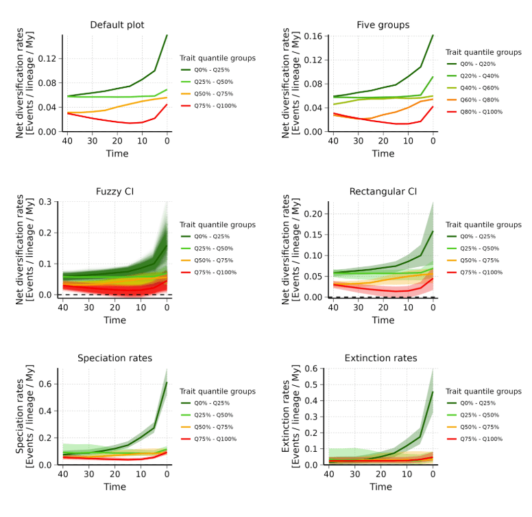
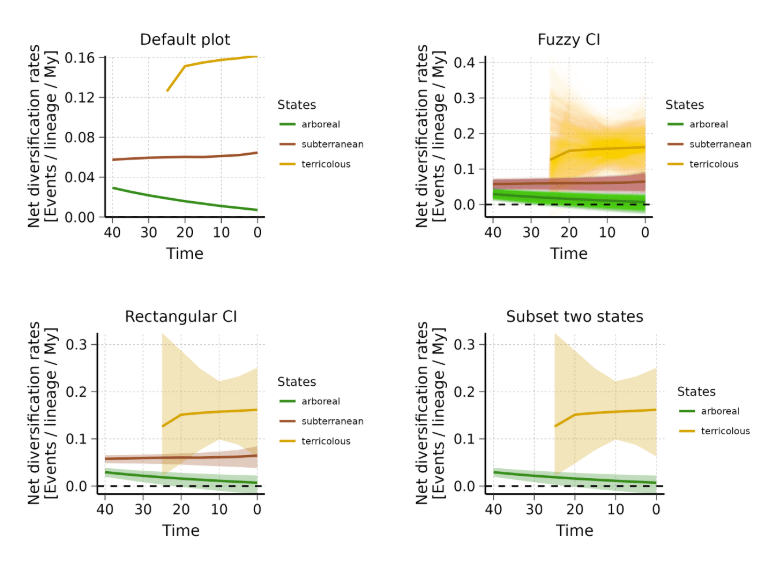

# Plot rates through time

  
This vignette presents the different options available to **plot rates
through time** following a deepSTRAPP workflow.

It is a nice and efficient way to provide illustrations and support the
conclusions of the deepSTRAPP tests.

The plot can be performed on different types of data (i.e., continuous,
binary, and multinomial).  
Below are examples with **continuous data** (Example 1) and
**categorical multinomial data** (Example 2).

  

``` r

# ------ Example 1: Continuous trait data ------ #

#### Step 1: Prepare data ####

# Load results of a STRAPP test workflow run on continuous trait data
Ponerinae_deepSTRAPP_cont_old_calib_0_40 <- readRDS(system.file("extdata", 
    "Ponerinae_deepSTRAPP_cont_old_calib_0_40.rds", package = "deepSTRAPP"))
# This dataset is only available in development versions installed from GitHub.
# It is not available in CRAN versions.
# Use remotes::install_github(repo = "MaelDore/deepSTRAPP") to get the latest development version.

# Visualize trait data
hist(Ponerinae_deepSTRAPP_cont_old_calib_0_40$trait_data_df_over_time$trait_value)
# Visualize diversification rates data
hist(Ponerinae_deepSTRAPP_cont_old_calib_0_40$diversification_data_df_over_time$rates)

# Select a color scheme from lowest to highest values
color_scale = c("darkgreen", "limegreen", "orange", "red")

### Step 2: Plot RTT ####

# For continuous trait data, the trait data are divided into groups based on 'quantile_ranges'.
# They form groups of trait values used to visualize the existence of a correlation with rates.
# If groups with higher quartile ranges exhibit higher rates over time, and conversely, there is a positive correlation.
# If groups with higher quartile ranges exhibit lower rates over time, and conversely, there is a negative correlation.

## Generate default plot
plot_RTT_continuous <- plot_rates_through_time(
   deepSTRAPP_outputs = Ponerinae_deepSTRAPP_cont_old_calib_0_40,
   color_scale = color_scale)
   # PDF_file_path = "./plot_RTT_continuous.pdf")

# Here, we observed a negative correlation as quartiles of lower trait values are consistently
# associated with higher rates, and conversely.

## Adjust aesthetics of plot a posteriori
plot_RTT_continuous_adj <- plot_RTT_continuous$rates_TT_ggplot +
    # Change size and color of the title
    ggplot2::theme(plot.title = ggplot2::element_text(color = "red", size = 18))
print(plot_RTT_continuous_adj)

## Adjust quartile ranges

# You can define different trait quantile groups based on 'quantile_ranges'.
# The default is c(0, 0.25, 0.5, 0.75, 1.0) which yields four equivalent groups
# with each spanning 25% of the trait data.

# You can try a different option with for instance five groups:
plot_rates_through_time(
   deepSTRAPP_outputs = Ponerinae_deepSTRAPP_cont_old_calib_0_40,
   quantile_ranges = c(0, 0.20, 0.40, 0.60, 0.80, 1.0),
   color_scale = color_scale)
   # PDF_file_path = "./plot_RTT_continuous_5groups.pdf")

## Plot Confidence Intervals (CI)

# You can include confidence intervals on the plot.
# They are built from the BAMM posterior samples, which each yields different diversification rates,
# that can be plotted to show uncertainty in the evaluation.

# The function offers two types of CI (CI_type):
  # "fuzzy": draws a line for each posterior sample with high transparency to highlight 
           # redundancy across BAMM posterior samples.
  # "quantiles_rect": draws plain polygons whose range can be controlled with 'CI_quantiles'.
                    # By default, 95% CI are shown (CI_quantiles = 0.95).

# Plot "fuzzy" CI
plot_rates_through_time(
   deepSTRAPP_outputs = Ponerinae_deepSTRAPP_cont_old_calib_0_40,
   color_scale = color_scale,
   plot_CI = TRUE, # To add CI on the plot
   CI_type = "fuzzy") # Select type of CI

# Plot "quantiles_rect" CI
plot_rates_through_time(
   deepSTRAPP_outputs = Ponerinae_deepSTRAPP_cont_old_calib_0_40,
   color_scale = color_scale,
   plot_CI = TRUE, # To add CI on the plot
   CI_type = "quantiles_rect", # Select type of CI
   CI_quantiles = 0.9) # Adjust range of CI

# The lack of overlap between the two most extreme trait quantile groups tends to indicate
# that the correlation is significant. However, a proper STRAPP test is needed to confirm what is observed.

## Plot different types of rates

# deepSTRAPP also lets you plot different types of rates.
# Even if you carried out the analysis on "net_diversification" rates (as the default)
# you can still plot the evolution of "speciation" and "extinction" rates

# Plot "speciation" rates
plot_rates_through_time(
   deepSTRAPP_outputs = Ponerinae_deepSTRAPP_cont_old_calib_0_40,
   rate_type = "speciation",
   color_scale = color_scale,
   plot_CI = TRUE, # To add CI on the plot
   CI_type = "quantiles_rect", # Select type of CI
   CI_quantiles = 0.9) # Adjust range of CI

# Plot "extinction" rates
plot_rates_through_time(
   deepSTRAPP_outputs = Ponerinae_deepSTRAPP_cont_old_calib_0_40,
   rate_type = "extinction",
   color_scale = color_scale,
   plot_CI = TRUE, # To add CI on the plot
   CI_type = "quantiles_rect", # Select type of CI
   CI_quantiles = 0.9) # Adjust range of CI
```



``` r

# ------ Example 2: Categorical multinomial trait data ------ #

#### Step 1: Prepare data ####

# Load results of a STRAPP test workflow run on categorical (3-levels) trait data
Ponerinae_deepSTRAPP_cat_3lvl_old_calib_0_40 <- readRDS(system.file("extdata", 
    "Ponerinae_deepSTRAPP_cat_3lvl_old_calib_0_40.rds", package = "deepSTRAPP"))
# This dataset is only available in development versions installed from GitHub.
# It is not available in CRAN versions.
# Use remotes::install_github(repo = "MaelDore/deepSTRAPP") to get the latest development version.

# Visualize trait data
table(Ponerinae_deepSTRAPP_cat_3lvl_old_calib_0_40$trait_data_df_over_time$trait_value)
# Visualize diversification rates data
hist(Ponerinae_deepSTRAPP_cat_3lvl_old_calib_0_40$diversification_data_df_over_time$rates)

## Select color scheme for states
colors_per_states <- c("forestgreen", "sienna", "goldenrod")
names(colors_per_states) <- c("arboreal", "subterranean", "terricolous")

### Step 2: Plot RTT ####

# For categorical trait data, the trait data are states.
# We can directly plot the evolution of rates between states.
# In the case of multinomial data (with more than two states/ranges), 
# the function allows you to select the states you wish to plot, if not all.

## Generate default plot with all states
plot_rates_through_time(
   deepSTRAPP_outputs = Ponerinae_deepSTRAPP_cat_3lvl_old_calib_0_40,
   colors_per_levels = colors_per_states)
   # PDF_file_path = "./plot_RTT_categorical.pdf")

# Plot with "fuzzy" CI
plot_rates_through_time(
   deepSTRAPP_outputs = Ponerinae_deepSTRAPP_cat_3lvl_old_calib_0_40,
   colors_per_levels = colors_per_states,
   plot_CI = TRUE, 
   CI_type = "fuzzy")

# Plot with "quantiles_rect" CI
plot_rates_through_time(
   deepSTRAPP_outputs = Ponerinae_deepSTRAPP_cat_3lvl_old_calib_0_40,
   colors_per_levels = colors_per_states,
   plot_CI = TRUE, 
   CI_type = "quantiles_rect")

## Subset to plot only "arboreal" and "terricolous" states
plot_RTT_categorical <- plot_rates_through_time(
   deepSTRAPP_outputs = Ponerinae_deepSTRAPP_cat_3lvl_old_calib_0_40,
   select_trait_levels = c("arboreal", "terricolous"), # List the states to plot
   colors_per_levels = colors_per_states[c("arboreal", "terricolous")], # Subset colors
   plot_CI = TRUE, 
   CI_type = "quantiles_rect")
```


