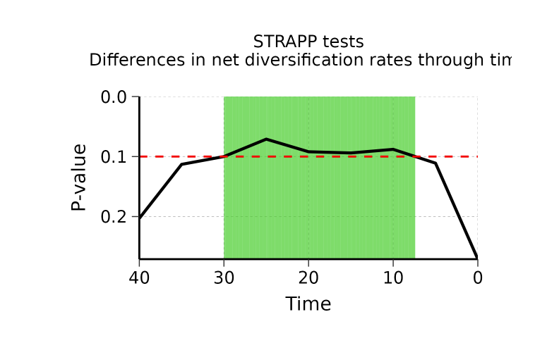
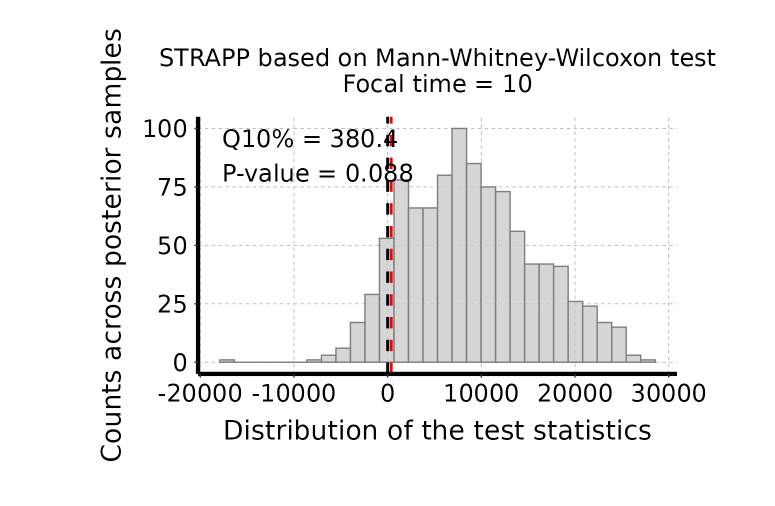
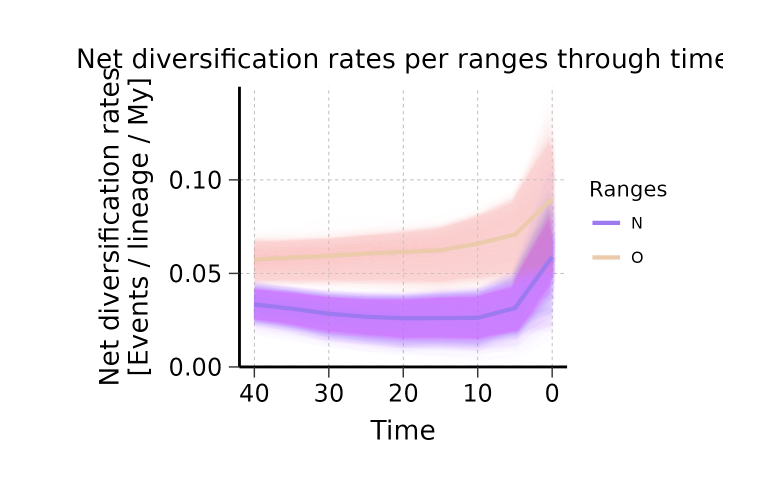
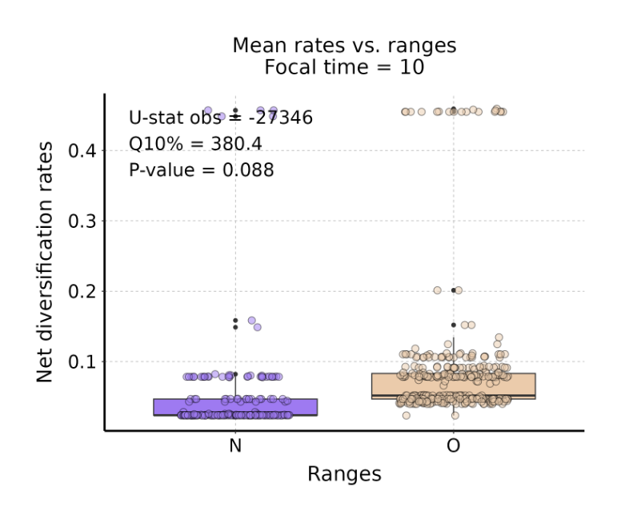
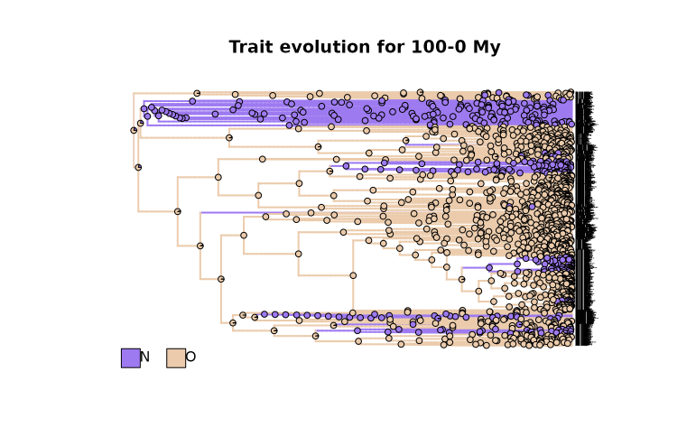
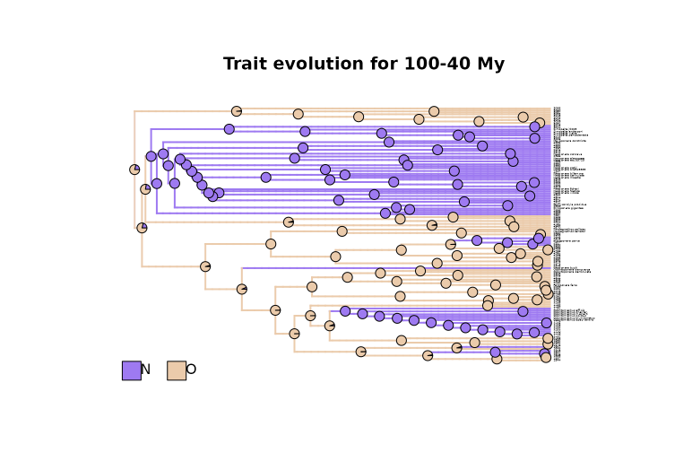
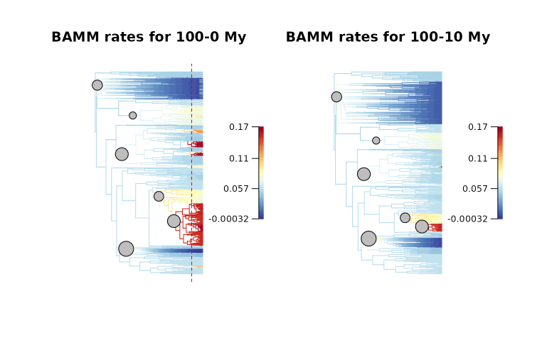
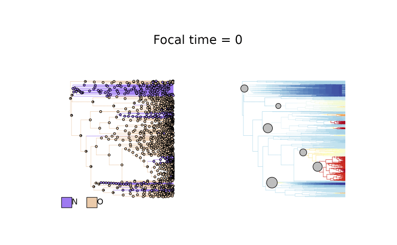
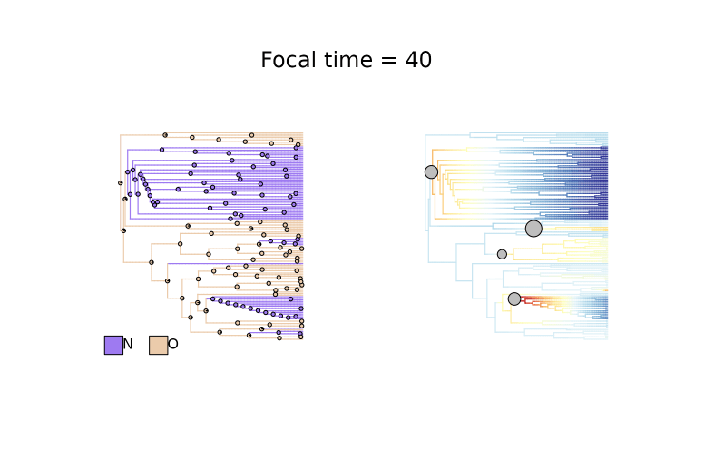

```{r set_options, include = FALSE}
knitr::opts_chunk$set(
  eval = FALSE, # Chunks of codes will not be evaluated by default
  collapse = TRUE,
  comment = "#>",
  fig.width = 7, fig.height = 5, # Set device size at rendering time (when plots are generated)
  fig.align = "center"
)
```

```{r setup, eval = TRUE, include = FALSE}
library(deepSTRAPP)

is_dev_version <- function (pkg = "deepSTRAPP")
{
  # # Check if ran on CRAN
  # not_cran <- identical(Sys.getenv("NOT_CRAN"), "true") # || interactive()

  # Version number check
  version <- tryCatch(as.character(utils::packageVersion(pkg)), error = function(e) "")
  dev_version <- grepl("\\.9000", version)

  # not_cran || dev_version
  
  return(dev_version)
}

```

<br>
This is a simple example that shows how deepSTRAPP can be used to test for __differences__ in diversification rates between two __biogeographic areas__.
It presents the main functions in a typical __deepSTRAPP workflow__.

<br>
For an example with __binary data__ (2 levels), please see the example in the __Main tutorial__: `vignette("main_tutorial")`.

For an example with __categorical multinominal data__, see this vignette: `vignette("deepSTRAPP_categorical_3lvl_data")`.

For an example with __continuous data__, see this vignette: `vignette("deepSTRAPP_continuous_data")`.

<br>
Please note that the trait data and phylogeny calibration used in this example are __NOT valid biological data__. They were modified in order to provide results illustrating the usefulness of deepSTRAPP.

<br>

The R package `BioGeoBEARS` is needed for this workflow to process biogeographic data. <br>
Please install it manually from: https://github.com/nmatzke/BioGeoBEARS.

<br>


```{r load_data_biogeo_2lvl}
# ------ Step 0: Load data ------ #

## Load range data
data(Ponerinae_binary_range_table, package = "deepSTRAPP")

dim(Ponerinae_binary_range_table)
View(Ponerinae_binary_range_table)

## Prepare range data for Old World vs. New World

# No overlap in ranges in current taxa
table(Ponerinae_binary_range_table$Old_World, Ponerinae_binary_range_table$New_World)

Ponerinae_NO_tip_data <- stats::setNames(object = Ponerinae_binary_range_table$Old_World,
                                     nm = Ponerinae_binary_range_table$Taxa)
Ponerinae_NO_tip_data <- as.character(Ponerinae_NO_tip_data)
Ponerinae_NO_tip_data[Ponerinae_NO_tip_data == "TRUE"] <- "O" # O = Old World
Ponerinae_NO_tip_data[Ponerinae_NO_tip_data == "FALSE"] <- "N" # N = New World
names(Ponerinae_NO_tip_data) <- Ponerinae_binary_range_table$Taxa
table(Ponerinae_NO_tip_data)


# Select color scheme for ranges
colors_per_ranges <- c("mediumpurple2", "peachpuff2")
names(colors_per_ranges) <- c("N", "O")

## Load phylogeny
data(Ponerinae_tree_old_calib, package = "deepSTRAPP")

plot(Ponerinae_tree_old_calib)
ape::Ntip(Ponerinae_tree_old_calib) == length(Ponerinae_NO_tip_data)

## Check that trait data and phylogeny are named and ordered similarly
all(names(Ponerinae_NO_tip_data) == Ponerinae_tree_old_calib$tip.label)

## Reorder trait data as in phylogeny
Ponerinae_NO_tip_data <- Ponerinae_NO_tip_data[match(x = Ponerinae_tree_old_calib$tip.label,
                                                     table = names(Ponerinae_NO_tip_data))]


## Plot data on tips for visualization
pdf(file = "./Ponerinae_biogeo_data_old_calib_on_phylo.pdf", width = 20, height = 150)

# Set plotting parameters
par(mar = c(0.1,0.1,0.1,0.1), oma = c(0,0,0,0)) # bltr
# Graph presence/absence using plotTree.datamatrix
range_map <- phytools::plotTree.datamatrix(
  tree = Ponerinae_tree_old_calib,
  X = as.data.frame(Ponerinae_NO_tip_data),
  fsize = 0.7, yexp = 1.1,
  header = TRUE, xexp = 1.25,
  colors = colors_per_ranges)

# Get plot info in "last_plot.phylo"
plot_info <- get("last_plot.phylo", envir=.PlotPhyloEnv)

# Add time line

# Extract root age
root_age <- max(phytools::nodeHeights(Ponerinae_tree_old_calib))

# Define ticks
# ticks_labels <- seq(from = 0, to = 100, by = 20)
ticks_labels <- seq(from = 0, to = 120, by = 20)
axis(side = 1, pos = 0, at = (-1 * ticks_labels) + root_age, labels = ticks_labels, cex.axis = 1.5)
legend(x = root_age/2,
       y = 0 - 5, adj = 0,
       bty = "n", legend = "", title = "Time  [My]", title.cex = 1.5)

# Add a legend
legend(x = plot_info$x.lim[2] - 10,
       y = mean(plot_info$y.lim),
       # adj = c(0,0),
       # x = "topleft",
       legend = c("Absence", "Presence"),
       pch = 22, pt.bg = c("white","gray30"), pt.cex =  1.8,
       cex = 1.5, bty = "n")

dev.off()

## Inputs needed for Step 1 are the tip_data (Ponerinae_NO_tip_data) and the phylogeny
## (Ponerinae_tree_old_calib), and optionally, a color scheme (colors_per_ranges).

```
```{r load_data_biogeo_2lvl_eval, eval = TRUE, echo = FALSE}
## Load phylogeny
data(Ponerinae_tree_old_calib, package = "deepSTRAPP")

## Load and prepare range tip_data
data(Ponerinae_binary_range_table, package = "deepSTRAPP")
Ponerinae_NO_tip_data <- stats::setNames(object = Ponerinae_binary_range_table$Old_World,
                                     nm = Ponerinae_binary_range_table$Taxa)
Ponerinae_NO_tip_data <- as.character(Ponerinae_NO_tip_data)
Ponerinae_NO_tip_data[Ponerinae_NO_tip_data == "FALSE"] <- "N" # N = New World
Ponerinae_NO_tip_data[Ponerinae_NO_tip_data == "TRUE"] <- "O" # O = Old World
names(Ponerinae_NO_tip_data) <- Ponerinae_binary_range_table$Taxa
Ponerinae_NO_tip_data <- Ponerinae_NO_tip_data[match(x = Ponerinae_tree_old_calib$tip.label, table = names(Ponerinae_NO_tip_data))]

# Select color scheme for ranges
colors_per_ranges <- c("mediumpurple2", "peachpuff2")
names(colors_per_ranges) <- c("N", "O")

```

```{r prepare_trait_data_biogeo_2lvl}
# ------ Step 1: Prepare trait data ------ #

## Goal: Map trait evolution on the time-calibrated phylogeny

# 1.1/ Fit evolutionary models to trait data using Maximum Likelihood.
# 1.2/ Select the best fitting model comparing AICc.
# 1.3/ Infer ancestral characters estimates (ACE) at nodes.
# 1.4/ Run stochastic mapping simulations to generate evolutionary histories
#      compatible with the best model and inferred ACE. (Only for categorical and biogeographic data)
# 1.5/ Infer ancestral states along branches.
#  - For continuous traits: use interpolation to produce a `contMap`.
#  - For categorical and biogeographic data: compute posterior frequencies of each state/range
#    to produce a `densityMap` for each state/range.

library(deepSTRAPP)

# All these actions are performed by a single function: deepSTRAPP::prepare_trait_data()
?deepSTRAPP::prepare_trait_data()

## In this example, to simplify the analyses, we set 'split_multi_area_ranges' = TRUE such as
## multi-range areas ('NO' in this case) are split between unique areas ('N' and 'O')
## to keep only two areas for downstream analyses

# Run prepare_trait_data with default options
# For biogeographic data, a DEC model is assumed by default.
Ponerinae_biogeo_data_old_calib <- prepare_trait_data(
   tip_data = Ponerinae_NO_tip_data,
   trait_data_type = "biogeographic",
   phylo = Ponerinae_tree_old_calib,
   evolutionary_models = "DEC+J", # Default = "DEC" for biogeographic
   prefix_for_files = "Ponerinae_old_calib",
   split_multi_area_ranges = TRUE, # Set to TRUE to split multi-range areas NO between N and O
   nb_simulations = 100, # Reduce number of simulations to save time
   colors_per_levels = colors_per_ranges,
   seed = 1234) # Set seed for reproducibility

## Load Result to save time
data(Ponerinae_biogeo_data_old_calib, package = "deepSTRAPP")

# Explore output
str(Ponerinae_biogeo_data_old_calib, 1)

# $densityMaps hold maps for unique areas (Here, 'N' and 'O'), that will be used for downstream analyses.
# $densityMaps_all_ranges hold maps for unique areas AND multi-range areas (Here, also includes 'NO')

## Plot densityMaps for each range

# densityMap for range n°1 (N = "New World")
plot(Ponerinae_biogeo_data_old_calib$densityMaps[[1]])
# densityMap for range n°2 (N = "Old World")
plot(Ponerinae_biogeo_data_old_calib$densityMaps[[2]])
# densityMap for range n°3 (NO = "New World" + "Old World")
plot(Ponerinae_biogeo_data_old_calib$densityMaps_all_ranges[[3]])

## Plot densityMaps for all ranges together

# densityMaps with all unique areas overlaid
plot_densityMaps_overlay(Ponerinae_biogeo_data_old_calib$densityMaps)
# densityMaps with all ranges (including multi-area ranges) overlaid
plot_densityMaps_overlay(Ponerinae_biogeo_data_old_calib$densityMaps_all_ranges)

# As you can see, the probability of multi-range area 'NO' is significant only for deep nodes
# and is not likely to affect any of our downstream analyses if ignored.

## Inspect ancestral ranges at nodes

# Posterior probabilities of each range (= ACE) at internal nodes
Ponerinae_biogeo_data_old_calib$ace # Only with unique areas (Here, N and O)
Ponerinae_biogeo_data_old_calib$ace_all_ranges # Including multi-area ranges too (Here, NO)


## Inputs needed for Step 2 are the densityMaps (Ponerinae_densityMaps), and optionally,
## the tip_data (Ponerinae_NO_tip_data), and the ACE (Ponerinae_ACE)


```

```{r prepare_diversification_data_biogeo_2lvl}
# ------ Step 2: Prepare diversification data ------ #

## Goal: Map evolution of diversification rates and regime shifts on the time-calibrated phylogeny

# Run a BAMM (Bayesian Analysis of Macroevolutionary Mixtures)

# You need the BAMM C++ program installed in your machine to run this step.
# See the BAMM website: http://bamm-project.org/ and the companion R package [BAMMtools].

# 2.1/ Set BAMM - Record BAMM settings and generate all input files needed for BAMM.
# 2.2/ Run BAMM - Run BAMM and move output files in dedicated directory.
# 2.3/ Evaluate BAMM - Produce evaluation plots and ESS data.
# 2.4/ Import BAMM outputs - Load `BAMM_object` in R and subset posterior samples.
# 2.5/ Clean BAMM files - Remove files generated during the BAMM run.

# All these actions are performed by a single function: deepSTRAPP::prepare_diversification_data()
?deepSTRAPP::prepare_diversification_data()

# Run BAMM workflow with deepSTRAPP
## This step is time-consuming. You can skip it and load directly the result if needed
Ponerinae_BAMM_object <- prepare_diversification_data(
   BAMM_install_directory_path = "./software/bamm-2.5.0/", # To adjust to your own path to BAMM
   phylo = Ponerinae_tree_old_calib,
   prefix_for_files = "Ponerinae_old_calib",
   seed = 1234, # Set seed for reproducibility
   numberOfGenerations = 10^7 # Set high for optimal run, but will take a long time
)

# Load directly the result
data(Ponerinae_BAMM_object_old_calib)

# Explore output
str(Ponerinae_BAMM_object_old_calib, 1)
# Record the regime shift events and macroevolutionary regimes parameters across posterior samples
str(Ponerinae_BAMM_object_old_calib$eventData, 1) 
# Mean speciation rates at tips aggregated across all posterior samples
head(Ponerinae_BAMM_object_old_calib$meanTipLambda) 
# Mean extinction rates at tips aggregated across all posterior samples
head(Ponerinae_BAMM_object_old_calib$meanTipMu) 

# Plot mean net diversification rates and regime shifts on the phylogeny
plot_BAMM_rates(Ponerinae_BAMM_object_old_calib,
                labels = FALSE, legend = TRUE)

## Input needed for Step 3 is the BAMM_object (Ponerinae_BAMM_object)

```


```{r run_deepSTRAPP_biogeo_2lvl}
# ------ Step 3: Run a deepSTRAPP workflow ------ #

## Goal: Extract traits, diversification rates and regimes at a given time in the past
## to test for differences with a STRAPP test

# 3.1/ Extract trait data at a given time in the past ('focal_time')
# 3.2/ Extract diversification rates and regimes at a given time in the past ('focal_time')
# 3.3/ Compute STRAPP test
# 3.4/ Repeat previous actions for many timesteps along evolutionary time

# All these actions are performed by a single function:
#  For a single 'focal_time': deepSTRAPP::run_deepSTRAPP_for_focal_time()
#  For multiple 'time_steps': deepSTRAPP::run_deepSTRAPP_over_time()
?deepSTRAPP::run_deepSTRAPP_for_focal_time()
?deepSTRAPP::run_deepSTRAPP_over_time()

## Set for five time steps of 5 My. Will generate deepSTRAPP workflows for 0 to 40 Mya.
time_step_duration <- 5
time_range <- c(0, 40)

# Run deepSTRAPP on net diversification rates
## This step is time-consuming. You can skip it and load directly the result if needed
Ponerinae_deepSTRAPP_biogeo_old_calib_0_40 <- run_deepSTRAPP_over_time(
    densityMaps = Ponerinae_biogeo_data_old_calib$densityMaps,
    ace = Ponerinae_biogeo_data_old_calib$ace,
    tip_data = Ponerinae_NO_tip_data,
    trait_data_type = "biogeographic",
    BAMM_object = Ponerinae_BAMM_object_old_calib,
    time_range = time_range,
    time_step_duration = time_step_duration,
    seed = 1234, # Set seed for reproducibility
    alpha = 0.10, # Select a generous level of significance for the sake of the example
    # Needed to obtain STRAPP stats and plot evaluation histograms (See 4.2)
    return_perm_data = TRUE, 
     # Needed to get trait data and plot rates through time (See 4.3)
    extract_trait_data_melted_df = TRUE,
    # Needed to get diversification data and plot rates through time (See 4.3)
    extract_diversification_data_melted_df = TRUE, 
    # Needed to obtain STRAPP stats and plot evaluation histograms (See 4.2)
    return_STRAPP_results = TRUE, 
    # Needed to plot updated densityMaps (See 4.4)
    return_updated_trait_data_with_Map = TRUE, 
    # Needed to map diversification rates on updated phylogenies (See 4.5)
    return_updated_BAMM_object = TRUE, 
    verbose = TRUE,
    verbose_extended = TRUE)

# Load the deepSTRAPP output summarizing results for 0 to 40 My
data(Ponerinae_deepSTRAPP_biogeo_old_calib_0_40, package = "deepSTRAPP")
# This dataset is only available in development versions installed from GitHub.
# It is not available in CRAN versions.
# Use remotes::install_github(repo = "MaelDore/deepSTRAPP") to get the latest development version.

## Explore output
str(Ponerinae_deepSTRAPP_biogeo_old_calib_0_40, max.level = 1)

# See next step for how to generate plots from those outputs

# Display test summary
# Can be passed down to [deepSTRAPP::plot_STRAPP_pvalues_over_time()] to generate a plot
# showing the evolution of the test results across time
Ponerinae_deepSTRAPP_biogeo_old_calib_0_40$pvalues_summary_df

# Access STRAPP test results
# Can be passed down to [deepSTRAPP::plot_histograms_STRAPP_tests_over_time()] to generate plot
# showing the null distribution of the test statistics
str(Ponerinae_deepSTRAPP_biogeo_old_calib_0_40$STRAPP_results, max.level = 2)

# Access trait data in a melted data.frame
head(Ponerinae_deepSTRAPP_biogeo_old_calib_0_40$trait_data_df_over_time)
# Access the diversification data in a melted data.frame
head(Ponerinae_deepSTRAPP_biogeo_old_calib_0_40$diversification_data_df_over_time)
# Both can be passed down to [deepSTRAPP::plot_rates_through_time()] to generate a plot
# showing the evolution of diversification rates though time in relation to trait values

# Access updated densityMaps for each focal time
# Can be used to plot densityMaps with branch cut-off at focal time
# with [deepSTRAPP::plot_densityMaps_overlay()]
str(Ponerinae_deepSTRAPP_biogeo_old_calib_0_40$updated_trait_data_with_Map_over_time, max.level = 2)

# Access updated BAMM_object for each focal time
# Can be used to map rates and regime shifts on phylogeny with branch cut-off 
# at focal time with [deepSTRAPP::plot_BAMM_rates()]
str(Ponerinae_deepSTRAPP_biogeo_old_calib_0_40$updated_BAMM_objects_over_time, max.level = 2)

## Input needed for Step 4 is the deepSTRAPP object (Ponerinae_deepSTRAPP_biogeo_old_calib_0_40)

```


```{r plot_pvalues_biogeo_2lvl}
# ------ Step 4: Plot results ------ #

## Goal: Summarize the outputs in meaningful plots

# 4.1/ Plot evolution of STRAPP tests p-values through time
# 4.2/ Plot histogram of STRAPP test stats
# 4.3/ Plot evolution of rates through time in relation to ranges
# 4.4/ Plot rates vs. ranges across branches for a given 'focal_time'
# 4.5/ Plot updated densityMaps mapping range evolution for a given 'focal_time'
# 4.6/ Plot updated diversification rates and regimes for a given 'focal_time'
# 4.7/ Combine 4.5 and 4.6 to plot both mapped phylogenies with range evolution (4.5)
#      and diversification rates and regimes (4.6).

# Each plot is achieved through a dedicated function

# Load the deepSTRAPP output summarizing results for 0 to 40 My
data(Ponerinae_deepSTRAPP_biogeo_old_calib_0_40, package = "deepSTRAPP")
# This dataset is only available in development versions installed from GitHub.
# It is not available in CRAN versions.
# Use remotes::install_github(repo = "MaelDore/deepSTRAPP") to get the latest development version.

### 4.1/ Plot evolution of STRAPP tests p-values through time ####

# ?deepSTRAPP::plot_STRAPP_pvalues_over_time()

## Plot results of Mann-Whitney-Wilcoxon tests across all time-steps
deepSTRAPP::plot_STRAPP_pvalues_over_time(
   deepSTRAPP_outputs = Ponerinae_deepSTRAPP_biogeo_old_calib_0_40,
   alpha = 0.1)

# This is the main output of deepSTRAPP. It shows the evolution of the significance
# of the STRAPP tests over time.
# This example highlights the importance of deepSTRAPP as the significance
# of STRAPP tests change over time. 
# Differences in net diversification rates are not significant in the present
# (assuming a significant threshold of alpha = 0.10).
# Meanwhile, rates are significantly different in the past between 8 My to 30 My (the green area).
# This result supports the idea that differences in biodiversity across bioregions
# (i.e., "Old World" vs. "New World" ants) can be explained by differences of diversification rates
# that was detected in the past.
# Without use of deepSTRAPP, this conclusion would not have been supported by current diversification rates
# alone (although here, results should be discussed is regards to their weak degree of significance).

```
```{r plot_pvalues_biogeo_2lvl_eval_dev, eval = is_dev_version(), echo = FALSE}

# Load the deepSTRAPP output summarizing results for 0 to 40 My
data(Ponerinae_deepSTRAPP_biogeo_old_calib_0_40, package = "deepSTRAPP")

# Produce plot for results of overall Kruskal-Wallis tests over time
ggplot_STRAPP_pvalues <- deepSTRAPP::plot_STRAPP_pvalues_over_time(
   deepSTRAPP_outputs = Ponerinae_deepSTRAPP_biogeo_old_calib_0_40,
   alpha = 0.1, display_plot = FALSE)
# Adjust main title size
ggplot_STRAPP_pvalues <- ggplot_STRAPP_pvalues +
  ggplot2::theme(plot.title = ggplot2::element_text(size = 18))
# Print plot
print(ggplot_STRAPP_pvalues)

```
```{r plot_pvalues_biogeo_2lvl_eval_CRAN, eval = !is_dev_version(), echo = FALSE, out.width = "100%"}

# Plot pre-rendered graph


```

```{r plot_histogram_STRAPP_tests_overall_biogeo_2lvl}
### 4.2/ Plot histogram of STRAPP test stats ####

# Plot an histogram of the distribution of the test statistics used
# to assess the significance of STRAPP tests
  #  For a single 'focal_time': deepSTRAPP::plot_histogram_STRAPP_test_for_focal_time()
  #  For multiple 'time_steps': deepSTRAPP::plot_histograms_STRAPP_tests_over_time()

# ?deepSTRAPP::plot_histogram_STRAPP_test_for_focal_time
# ?deepSTRAPP::plot_histograms_STRAPP_tests_over_time

## These functions are used to provide visual illustration of the results of each STRAPP test. 
# They can be used to complement the provision of the statistical results summarized in Step 3.

# Display the time-steps
Ponerinae_deepSTRAPP_biogeo_old_calib_0_40$time_steps

## Plot results from Mann-Whitney-Wilcoxon between the two unique areas ####

# Plot the histogram of test stats for time-step n°3 = 10 My
plot_histogram_STRAPP_test_for_focal_time(
   deepSTRAPP_outputs = Ponerinae_deepSTRAPP_biogeo_old_calib_0_40,
   focal_time = 10)

# The black line represents the expected value under the null hypothesis H0 
#  => Δ Mann-Whitney-Wilcoxon U-stat = 0.
# The histogram shows the distribution of the test statistics as observed
# across the 1000 posterior samples from BAMM.
# The red line represents the significance threshold for which 90% of the observed data
# exhibited a higher value than expected.
# Since this red line is above the null expectation (quantile 10% = 380.4),
# the test is significant for a value of alpha = 0.10.

# Plot the histograms of test stats for all time-steps
plot_histograms_STRAPP_tests_over_time(
   deepSTRAPP_outputs = Ponerinae_deepSTRAPP_biogeo_old_calib_0_40)

```
```{r plot_histogram_STRAPP_tests_biogeo_2lvl_eval_dev, eval = is_dev_version(), echo = FALSE}

# Produce the histogram of test stats for time-step n°3 = 10 My
ggplot_histogram <- plot_histogram_STRAPP_test_for_focal_time(
   deepSTRAPP_outputs = Ponerinae_deepSTRAPP_biogeo_old_calib_0_40,
   focal_time = 10, display_plot = FALSE)
# Adjust title size
ggplot_histogram <- ggplot_histogram +
  ggplot2::theme(plot.title = ggplot2::element_text(size = 18))
# Print plot
print(ggplot_histogram)

```
```{r plot_histogram_STRAPP_tests_biogeo_2lvl_eval_CRAN, eval = !is_dev_version(), echo = FALSE, out.width = "100%"}

# Plot pre-rendered graph


```

```{r plot_rates_through_time_biogeo_2lvl}
### 4.3/ Plot evolution of rates through time ~ trait data ####

# ?deepSTRAPP::plot_rates_through_time()

# Generate ggplot
plot_rates_through_time(deepSTRAPP_outputs = Ponerinae_deepSTRAPP_biogeo_old_calib_0_40,
                        colors_per_levels = colors_per_ranges,
                        plot_CI = TRUE)

# This plot helps to visualize how differences in rates evolved over time.
# You can see that both bioregions "New World" and "Old World" had fairly different rates over time,
# with differences detected as significant between 8 to 30 My.
# However, in the present, we recorded an increase in diversification rates that blurred 
# these differences and led to a non-significant STRAPP test when comparing current rates.
# This plot, alongside results of deepSTRAPP, supports the Diversification Rate Hypothesis 
# in showing how "Old World" ant lineages may have accumulated faster, especially between 8 to 30 My.

# N.B.: The increase of diversification rates recorded in the present may largely be artifactual,
# due to the fact some lineages in the present will go extinct in the future,
# but have not been recorded as such. 
# This bias is named the "pull of the present", and can impair evaluation of
# the Diversification Rate Hypothesis based only on current rates.
# deepSTRAPP offers a solution to this issue by investigating rate differences at any time in the past.

```
```{r plot_rates_through_time_biogeo_2lvl_eval_dev, eval = is_dev_version(), echo = FALSE}
plot_rates_through_time(deepSTRAPP_outputs = Ponerinae_deepSTRAPP_biogeo_old_calib_0_40,
                        colors_per_levels = colors_per_ranges,
                        plot_CI = TRUE)
```
```{r plot_rates_through_time_biogeo_2lvl_eval_CRAN, eval = !is_dev_version(), echo = FALSE, out.width = "100%"}

# Plot pre-rendered graph


```

```{r plot_rates_vs_traits_biogeo_2lvl}
### 4.4/ Plot rates vs. ranges across branches for a given focal time ####

# ?deepSTRAPP::plot_rates_vs_trait_data_for_focal_time()
# ?deepSTRAPP::plot_rates_vs_trait_data_over_time()

# This plot help to visualize differences in rates vs. ranges across all branches
# found at specific time-steps (i.e., 'focal_time').

# Generate ggplot for time = 10 My
plot_rates_vs_trait_data_for_focal_time(
   deepSTRAPP_outputs = Ponerinae_deepSTRAPP_biogeo_old_calib_0_40,
   focal_time = 10,
   colors_per_levels = colors_per_ranges)

# Here we focus on T = 10 My to highlight the differences detected in the previous steps.
# You can see that "Old World" ants tend to have higher rates than "New World" ants, at this time-step.
# This plot, alongside other results of deepSTRAPP, supports the Diversification Rate Hypothesis in showing 
# "Old World" ant lineages may have accumulated faster, especially between 8 to 30 My.
# Additionally, the plot displays summary statistics for the STRAPP test associated with the data shown:
#   * An observed statistic computed across the mean rates and trait states (i.e., habitats) shown on the plot.
#     Here, U-stat obs = -27346, indicating ants in the "New World" exhibited lower rates than "Old World" ants.
#     This is not the statistic of the STRAPP test itself, which is conducted across all BAMM posterior samples.
#   * The quantile of null statistic distribution at the significant threshold used to define test significance. 
#     The test will be considered significant (i.e., the null hypothesis is rejected)
#     if this value is higher than zero, as shown on the histogram in Section 4.2.
#     Here, Q10% = 380.4, so the test is significant (according to this significance threshold).
#   * The p-value of the associated STRAPP test. Here, p = 0.088.

# Plot rates vs. ranges for all time-steps
plot_rates_vs_trait_data_over_time(
   deepSTRAPP_outputs = Ponerinae_deepSTRAPP_biogeo_old_calib_0_40,
   colors_per_levels = colors_per_ranges)

```
```{r plot_rates_vs_traits_biogeo_2lvl_eval, fig.height = 7, fig.width = 8.5, out.width = "100%", eval = is_dev_version(), echo = FALSE}
# Generate ggplot for time = 10 My
plot_rates_vs_trait_data_for_focal_time(
   deepSTRAPP_outputs = Ponerinae_deepSTRAPP_biogeo_old_calib_0_40,
   focal_time = 10,
   colors_per_levels = colors_per_ranges)
```
```{r plot_rates_vs_traits_biogeo_2lvl_eval_CRAN, eval = !is_dev_version(), echo = FALSE, out.width = "100%"}

# Plot pre-rendered graph


```

```{r plot_updated_densityMaps_biogeo_2lvl}
### 4.5/ Plot updated densityMaps mapping trait evolution for a given 'focal_time' ####

# ?deepSTRAPP::plot_densityMaps_overlay()

## These plots help to visualize the evolution of trait data across the phylogeny,
## and to focus on tip values at specific time-steps.

# Display the time-steps
Ponerinae_deepSTRAPP_biogeo_old_calib_0_40$time_steps

## The next plot shows the evolution of trait data across the whole phylogeny (100-0 My).

# Plot initial densityMaps (t = 0)
densityMaps_0My <- Ponerinae_deepSTRAPP_biogeo_old_calib_0_40$updated_trait_data_with_Map_over_time[[1]]
plot_densityMaps_overlay(densityMaps_0My$densityMaps,
                         colors_per_levels = colors_per_ranges,
                         cex_pies = 0.3, # Reduce pie size
                         fsize = 0.1) # Reduce tip label size
title(main = "Trait evolution for 100-0 My")

## The next plot shows the evolution of trait data from root to 10 Mya (100-10 My).

# Plot updated densityMaps for time-step n°3 = 10 My
densityMaps_10My <- Ponerinae_deepSTRAPP_biogeo_old_calib_0_40$updated_trait_data_with_Map_over_time[[3]]
plot_densityMaps_overlay(densityMaps_10My$densityMaps,
                         colors_per_levels = colors_per_ranges,
                         cex_pies = 0.4, # Reduce pie size
                         fsize = 0.1) # Reduce tip label size
title(main = "Trait evolution for 100-10 My")

## The next plot shows the evolution of trait data from root to 40 Mya (100-40 My).

# Plot updated densityMaps for time-step n°9 = 40 My
densityMaps_40My <- Ponerinae_deepSTRAPP_biogeo_old_calib_0_40$updated_trait_data_with_Map_over_time[[9]]
plot_densityMaps_overlay(densityMaps_40My$densityMaps,
                         colors_per_levels = colors_per_ranges,
                         fsize = 0.2) # Reduce tip label size
title(main = "Trait evolution for 100-40 My")

```
```{r plot_updated_densityMaps_biogeo_2lvl_eval, eval = is_dev_version(), echo = FALSE}
# Plot initial densityMaps (t = 0)
densityMaps_0My <- Ponerinae_deepSTRAPP_biogeo_old_calib_0_40$updated_trait_data_with_Map_over_time[[1]]
plot_densityMaps_overlay(densityMaps_0My$densityMaps,
                         colors_per_levels = colors_per_ranges,
                         cex_pies = 0.3, # Reduce pie size
                         fsize = 0.1)
title(main = "Trait evolution for 100-0 My")

# Plot updated densityMaps for time-step n°9 = 40 My
densityMaps_40My <- Ponerinae_deepSTRAPP_biogeo_old_calib_0_40$updated_trait_data_with_Map_over_time[[9]]
plot_densityMaps_overlay(densityMaps_40My$densityMaps,
                         colors_per_levels = colors_per_ranges,
                         fsize = 0.2)
title(main = "Trait evolution for 100-40 My")
```
```{r plot_updated_densityMaps_biogeo_2lvl_eval_CRAN, eval = !is_dev_version(), echo = FALSE, out.width = "100%"}

# Plot pre-rendered graph



```

```{r plot_BAMM_rates_biogeo_2lvl}
### 4.6/ Plot updated diversification rates and regimes for a given 'focal_time' ####

# ?deepSTRAPP::plot_BAMM_rates()

## These plots help to visualize the evolution of diversification rates across the phylogeny,
## and to focus on tip values at specific time-steps.

# Display the time-steps
Ponerinae_deepSTRAPP_biogeo_old_calib_0_40$time_steps

# Extract root age
root_age <- max(phytools::nodeHeights(Ponerinae_tree_old_calib)[,2])

## The next plot shows the evolution of net diversification rates across the whole phylogeny (100-0 My).

# Plot diversification rates on initial phylogeny (t = 0)
BAMM_map_0My <- Ponerinae_deepSTRAPP_biogeo_old_calib_0_40$updated_BAMM_objects_over_time[[1]]
plot_BAMM_rates(BAMM_map_0My, labels = FALSE, par.reset = FALSE)
abline(v = root_age - 10, col = "red", lty = 2) # Show where the phylogeny will be cut for t = 10My
abline(v = root_age - 40, col = "red", lty = 2) # Show where the phylogeny will be cut for t = 40My
title(main = "BAMM rates for 100-0 My")

## The next plot shows the evolution of net diversification rates from root to 10 Mya (100-10 My).

# Plot diversification rates on updated phylogeny for time-step n°3 = 10 My
BAMM_map_10My <- Ponerinae_deepSTRAPP_biogeo_old_calib_0_40$updated_BAMM_objects_over_time[[3]]
plot_BAMM_rates(BAMM_map_10My, labels = FALSE,
                colorbreaks = BAMM_map_10My$initial_colorbreaks$net_diversification)
title(main = "BAMM rates for 100-10 My")

## The next plot shows the evolution of net diversification rates from root to 40 Mya (100-40 My).

# Plot diversification rates on updated phylogeny for time-step n°9 = 40 My
BAMM_map_40My <- Ponerinae_deepSTRAPP_biogeo_old_calib_0_40$updated_BAMM_objects_over_time[[9]]
plot_BAMM_rates(BAMM_map_40My, labels = FALSE,
                colorbreaks = BAMM_map_40My$initial_colorbreaks$net_diversification)
title(main = "BAMM rates for 100-40 My")

```
```{r plot_BAMM_rates_biogeo_2lvl_eval_dev, eval = is_dev_version(), echo = FALSE}
par(mfrow = c(1, 2))

# Plot diversification rates on initial phylogeny (t = 0)
BAMM_map_0My <- Ponerinae_deepSTRAPP_biogeo_old_calib_0_40$updated_BAMM_objects_over_time[[1]]
plot_BAMM_rates(BAMM_map_0My, labels = FALSE, legend = TRUE, par.reset = FALSE)
abline(v = max(phytools::nodeHeights(Ponerinae_tree_old_calib)[,2]) - 10, col = "red", lty = 2) # Show where the phylogeny will be cut
title(main = "BAMM rates for 100-0 My")

# Plot diversification rates on updated phylogeny for time-step n°3 = 10 My
BAMM_map_10My <- Ponerinae_deepSTRAPP_biogeo_old_calib_0_40$updated_BAMM_objects_over_time[[3]]
plot_BAMM_rates(BAMM_map_10My, labels = FALSE, legend = TRUE,
                colorbreaks = BAMM_map_10My$initial_colorbreaks$net_diversification)
title(main = "BAMM rates for 100-10 My")

par(mfrow = c(1, 1))
```
```{r plot_BAMM_rates_biogeo_2lvl_eval_CRAN, eval = !is_dev_version(), echo = FALSE, out.width = "100%"}

# Plot pre-rendered graph


```

```{r plot_traits_vs_rates_on_phylogeny_biogeo_2lvl}
### 4.7/ Plot both trait evolution and diversification rates and regimes updated for a given 'focal_time' ####

# ?deepSTRAPP::plot_traits_vs_rates_on_phylogeny_for_focal_time()

## These plots help to visualize simultaneously the evolution of trait and diversification rates
# across the phylogeny, and to focus on tip values at specific time-steps.

# Display the time-steps
Ponerinae_deepSTRAPP_biogeo_old_calib_0_40$time_steps

## The next plot shows the evolution of ranges and rates across the whole phylogeny (100-0 My).

# Plot both mapped phylogenies in the present (t = 0)
plot_traits_vs_rates_on_phylogeny_for_focal_time(
  deepSTRAPP_outputs = Ponerinae_deepSTRAPP_biogeo_old_calib_0_40,
  focal_time = 0,
  ftype = "off", lwd = 0.7,
  colors_per_levels = colors_per_ranges,
  labels = FALSE, legend = FALSE,
  par.reset = FALSE)

## The next plot shows the evolution of ranges and rates from root to 10 Mya (100-10 My).

# Plot both mapped phylogenies for time-step n°3 = 10 My
plot_traits_vs_rates_on_phylogeny_for_focal_time(
  deepSTRAPP_outputs = Ponerinae_deepSTRAPP_biogeo_old_calib_0_40,
  focal_time = 10, 
  ftype = "off", lwd = 1.2,
  colors_per_levels = colors_per_ranges,
  labels = FALSE, legend = FALSE,
  par.reset = FALSE)

## The next plot shows the evolution of ranges and rates from root to 40 Mya (100-40 My).

# Plot both mapped phylogenies for time-step n°9 = 40 My
plot_traits_vs_rates_on_phylogeny_for_focal_time(
  deepSTRAPP_outputs = Ponerinae_deepSTRAPP_biogeo_old_calib_0_40,
  focal_time = 40, 
  ftype = "off", lwd = 1.2,
  colors_per_levels = colors_per_ranges,
  labels = FALSE, legend = FALSE,
  par.reset = FALSE)

```
```{r plot_traits_vs_rates_on_phylogeny_biogeo_2lvl_eval_dev, eval = is_dev_version(), echo = FALSE}
# Plot both mapped phylogenies in the present (t = 0)
plot_traits_vs_rates_on_phylogeny_for_focal_time(
  deepSTRAPP_outputs = Ponerinae_deepSTRAPP_biogeo_old_calib_0_40,
  focal_time = 0,
  ftype = "off", lwd = 0.7,
  colors_per_levels = colors_per_ranges,
  labels = FALSE, legend = FALSE,
  par.reset = FALSE)

# Plot both mapped phylogenies for time-step n°9 = 40 My
plot_traits_vs_rates_on_phylogeny_for_focal_time(
  deepSTRAPP_outputs = Ponerinae_deepSTRAPP_biogeo_old_calib_0_40,
  focal_time = 40, 
  ftype = "off", lwd = 1.2,
  colors_per_levels = colors_per_ranges,
  labels = FALSE, legend = FALSE,
  par.reset = FALSE)
```
```{r plot_traits_vs_rates_on_phylogeny_biogeo_2lvl_eval_CRAN, eval = !is_dev_version(), echo = FALSE, out.width = "100%"}

# Plot pre-rendered graph



```

