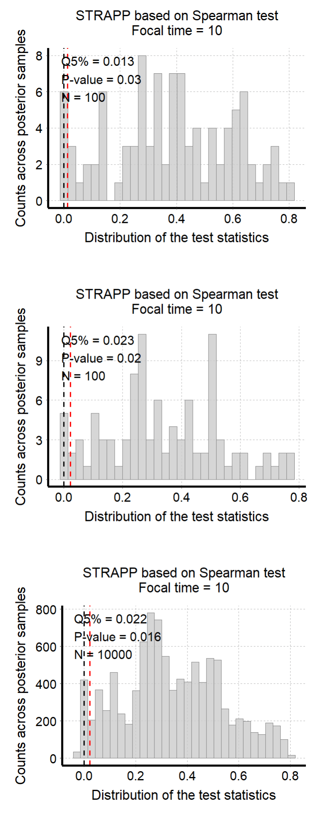
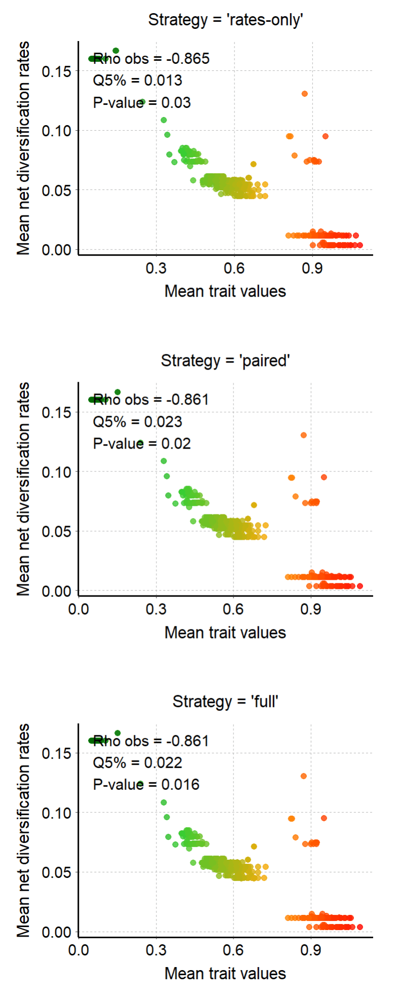

```{r set_options, include = FALSE}
knitr::opts_chunk$set(
  eval = FALSE, # Chunks of codes will not be evaluated by default
  collapse = TRUE,
  comment = "#>",
  fig.width = 7, fig.height = 5   # Set device size at rendering time (when plots are generated)
)
```

```{r setup, eval = TRUE, include = FALSE}
library(deepSTRAPP)

is_dev_version <- function (pkg = "deepSTRAPP")
{
  # # Check if ran on CRAN
  # not_cran <- identical(Sys.getenv("NOT_CRAN"), "true") # || interactive()

  # Version number check
  version <- tryCatch(as.character(utils::packageVersion(pkg)), error = function(e) "")
  dev_version <- grepl("\\.9000", version)

  # not_cran || dev_version
  
  return(dev_version)
}

```

```{r adjust_dpi_CRAN, include = FALSE, eval = !is_dev_version()}
knitr::opts_chunk$set(
  dpi = 72   # Lower DPI to save space
)
```
```{r adjust_dpi_dev, include = FALSE, eval = is_dev_version()}
knitr::opts_chunk$set(
  dpi = 72   # Default DPI for the dev version
)
```

<br>
This vignette presents the different strategies available to account for uncertainty in ancestral trait values/states/ranges and diversification rate estimates within deepSTRAPP.

It uses continuous data as an example, but the rationale applies similarly to categorical and biogeographic data.

<br>

```{r load_data_uncertainty}
# ------ Step 0: Load data ------ #

## Load trait df
data("Ponerinae_trait_tip_data", package = "deepSTRAPP")

dim(Ponerinae_trait_tip_data)
View(Ponerinae_trait_tip_data)

# Extract continuous trait data as a named vector
Ponerinae_cont_tip_data <- setNames(object = Ponerinae_trait_tip_data$fake_cont_tip_data,
                                    nm = Ponerinae_trait_tip_data$Taxa)

# This not valid biological data. For the sake of this example, we will assume this is size data.

# Select a color scheme from lowest to highest values (i.e., smallest to largest ants)
color_scale = c("darkgreen", "limegreen", "orange", "red")

## Load phylogeny with old time-calibration
data("Ponerinae_tree_old_calib", package = "deepSTRAPP")

plot(Ponerinae_tree_old_calib)
ape::Ntip(Ponerinae_tree_old_calib) == length(Ponerinae_cont_tip_data)

## Check that trait data and phylogeny are named and ordered similarly
all(names(Ponerinae_cont_tip_data) == Ponerinae_tree_old_calib$tip.label)


## Inputs needed for Step 1 are the tip_data (Ponerinae_cont_tip_data) and the phylogeny
# (Ponerinae_tree_old_calib), and optionally, a color scheme (color_scale).

```

```{r prepare_trait_data_uncertainty}
# ------ Step 1: Prepare trait data ------ #

## Goal: Map trait evolution on the time-calibrated phylogeny

# 1.1/ Fit evolutionary models to trait data using Maximum Likelihood (ML).
# 1.2/ Select the best fitting model comparing AICc.
# 1.3/ Infer ancestral characters estimates (ACE) at nodes.
# 1.4/ Infer ancestral states along branches using interpolation to produce a `contMap`.
# 1.5/ Produce simulations of trait evolutionary history conditioned to tip data and model fit 
#      (i.e., continuous stochastic mapping) to produce a set of `contMaps`.

library(deepSTRAPP)

# All these actions are performed by a single function: deepSTRAPP::prepare_trait_data()
?deepSTRAPP::prepare_trait_data()

# Run prepare_trait_data with default options
# For continuous trait, a BM model is assumed by default.
Ponerinae_trait_object <- prepare_trait_data(tip_data = Ponerinae_cont_tip_data,
                                             trait_data_type = "continuous",
                                             phylo = Ponerinae_tree_old_calib,
                                             # Set to 'TRUE' to produce the stochastic maps
                                             run_stochastic_maps = TRUE,
                                             nb_simulations = 100,
                                             seed = 1234) # Set seed for reproducibility

# Explore output
str(Ponerinae_trait_object, 1)

# Extract the contMap representing the Maximum Likelihood (ML) estimates 
# of continuous trait evolution on the phylogeny
Ponerinae_contMap <- Ponerinae_trait_object$contMap
plot_contMap(Ponerinae_contMap)
title(main = "\nML estimates")

# The contMap is the main input needed to perform a deepSTRAPP run on continuous trait data.
# However, since it only represents Maximum Likelihood (ML) estimates of ancestral trait values,
# it does not allow to account for uncertainty in trait estimates.
# For this, we need to provide the full set of stochastic maps as contMaps

# Extract the contMaps representing independent simulated evolutionary histories 
# conditioned to the observed trait data and model fit.
# The variance observed across the maps represent the uncertainty in ancestral trait estimates.
Ponerinae_contMaps <- Ponerinae_trait_object$contMaps

# Plot contMap n°1
plot_contMap(Ponerinae_contMaps[[1]],
             fsize = c(0.6, 1)) # Adjust tip label size
title(main = "\nStochastic Mapping simulation n°1")
# Plot contMap n°10
plot_contMap(Ponerinae_contMaps[[10]],
             fsize = c(0.6, 1)) # Adjust tip label size
title(main = "\nStochastic Mapping simulation n°10")
# Plot contMap n°100
plot_contMap(Ponerinae_contMaps[[100]],
             fsize = c(0.6, 1)) # Adjust tip label size
title(main = "\nStochastic Mapping simulation n°100")

# Each simulation is different, but in average, 
# they converge around the ML estimates showed in the contMap

## The minimal input needed to run deepSTRAPP is the contMap (Ponerinae_contMap).
## If you want to account for uncertainty in trait estimates,
## you need to provide the full sets of stochastic maps (Ponerinae_contMaps),
## and chose either 'paired' (the default) or 'full' as the uncertainty_strategy.

```
```{r prepare_trait_data_uncertainty_eval, eval = is_dev_version(), echo = FALSE}

## Load trait df
data("Ponerinae_trait_tip_data", package = "deepSTRAPP")

# Extract continuous trait data as a named vector
Ponerinae_cont_tip_data <- setNames(object = Ponerinae_trait_tip_data$fake_cont_tip_data,
                                    nm = Ponerinae_trait_tip_data$Taxa)

## Load phylogeny with old time-calibration
data("Ponerinae_tree_old_calib", package = "deepSTRAPP")

# Select a color scheme from lowest to highest values (i.e., smallest to largest ants)
color_scale = c("darkgreen", "limegreen", "orange", "red")

## Run prepare_trait_data with default options
# For continuous trait, a BM model is assumed by default.
Ponerinae_trait_object <- prepare_trait_data(tip_data = Ponerinae_cont_tip_data,
                                             trait_data_type = "continuous",
                                             phylo = Ponerinae_tree_old_calib,
                                             # Set to 'TRUE' to produce the stochastic maps
                                             run_stochastic_maps = TRUE,
                                             nb_simulations = 100,
                                             seed = 1234, # Set seed for reproducibility
                                             plot_map = FALSE) 

# Extract contMap(s)
Ponerinae_contMap <- Ponerinae_trait_object$contMap
Ponerinae_contMaps <- Ponerinae_trait_object$contMaps

## Input needed for Step 3 are the contMap (Ponerinae_contMap) and contMaps (Ponerinae_contMaps)

```

```{r prepare_diversification_data_uncertainty}
# ------ Step 2: Prepare diversification data ------ #

## Goal: Map evolution of diversification rates and regime shifts on the time-calibrated phylogeny

# Run a BAMM (Bayesian Analysis of Macroevolutionary Mixtures)

# You need the BAMM C++ program installed in your machine to run this step.
# See the BAMM website: http://bamm-project.org/ and the companion R package [BAMMtools].

# 2.1/ Set BAMM - Record BAMM settings and generate all input files needed for BAMM.
# 2.2/ Run BAMM - Run BAMM and move output files in dedicated directory.
# 2.3/ Evaluate BAMM - Produce evaluation plots and ESS data.
# 2.4/ Import BAMM outputs - Load `BAMM_object` in R and subset posterior samples.
# 2.5/ Clean BAMM files - Remove files generated during the BAMM run.

# All these actions are performed by a single function: deepSTRAPP::prepare_diversification_data()
?deepSTRAPP::prepare_diversification_data()

# Run BAMM workflow with deepSTRAPP
## This step is time-consuming. You can skip it and load directly the result if needed
Ponerinae_BAMM_object_old_calib <- prepare_diversification_data(
   BAMM_install_directory_path = "./software/bamm-2.5.0/", # To adjust to your own path to BAMM
   phylo = Ponerinae_tree_old_calib,
   prefix_for_files = "Ponerinae",
   seed = 1234, # Set seed for reproducibility
   numberOfGenerations = 10^7, # Set high for optimal run, but will take a long time
   BAMM_output_directory_path =  "./BAMM_outputs/")

# Load directly the result
data(Ponerinae_BAMM_object_old_calib)
# This dataset is only available in development versions installed from GitHub.
# It is not available in CRAN versions.
# Use remotes::install_github(repo = "MaelDore/deepSTRAPP") to get the latest development version.

## For the sake of example, we will use a BAMM_object with only 100 posterior samples
Ponerinae_BAMM_object <- subset_BAMM_object(
   BAMM_object = Ponerinae_BAMM_object_old_calib,
   nb_posterior_samples = 100,
   seed = 1234)

# Explore output
str(Ponerinae_BAMM_object, 1)
# Record the regime shift events and macroevolutionary regimes parameters across 100 posterior samples
str(Ponerinae_BAMM_object$eventData, 1) 
# Mean speciation rates at tips aggregated across all 100 posterior samples
head(Ponerinae_BAMM_object$meanTipLambda) 
# Mean extinction rates at tips aggregated across all 100 posterior samples
head(Ponerinae_BAMM_object$meanTipMu) 

# Plot mean net diversification rates and regime shifts on the phylogeny
plot_BAMM_rates(Ponerinae_BAMM_object,
                labels = FALSE, legend = TRUE)

## Input needed for Step 3 is the BAMM_object (Ponerinae_BAMM_object)

```
```{r prepare_diversification_data_uncertainty_eval, eval = is_dev_version(), echo = FALSE}

# Load the Ponerinae_BAMM_object output
data(Ponerinae_BAMM_object_old_calib, package = "deepSTRAPP")

# Produce the results of overall Kruskal-Wallis tests over time
Ponerinae_BAMM_object <- subset_BAMM_object(
   BAMM_object = Ponerinae_BAMM_object_old_calib,
   nb_posterior_samples = 100,
   seed = 1234)

```

```{r run_uncertainty}
# ------ Step 3: Run deepSTRAPP workflows ------ #

## Goal: Extract traits, diversification rates and regimes at a given time in the past
# to test for differences with a STRAPP test

# All these actions are performed by a single function:
#  For a single 'focal_time': deepSTRAPP::run_deepSTRAPP_for_focal_time()
#  For multiple 'time_steps': deepSTRAPP::run_deepSTRAPP_over_time()
?deepSTRAPP::run_deepSTRAPP_for_focal_time()
?deepSTRAPP::run_deepSTRAPP_over_time()

## We can perform the test according to three different strategies designed to handle uncertainty
#   * `"rates_only"`: Only accounts for diversification-rate uncertainty across BAMM posterior samples.
#                     Uses ML estimates for continuous traits and the most frequent state/range observed
#                     across stochastic maps for categorical and biogeographic data.
#   * `"paired"`: Default option. Accounts for both diversification-rate and ancestral trait/range
#                 reconstruction uncertainty by pairing BAMM posterior samples with stochastic maps.
#                 When the number of BAMM samples and stochastic maps differ, random pairing
#                 with replacement from the smaller set is used so that all posterior samples
#                 and stochastic maps contribute to the analysis.
#   * `"full"`: Exhaustive option that accounts for trait/range- and rate- uncertainty by crossing
#               all BAMM posterior samples with all stochastic maps.
#               Accounts for both diversification-rate and ancestral reconstruction uncertainty
#               by evaluating every combination of BAMM posterior sample and stochastic map.
#               WARNING: This exhaustive approach can substantially increase computation time and 
#               memory requirements, and is therefore recommended only for moderate-sized analyses.

## Set the focal_time for analyses to 10 Mya.
focal_time <- 10

#### 3.1/ The "rates_only" strategy ####

# The "rates_only" strategy is the fastest option.
# It only accounts for diversification-rate uncertainty across BAMM posterior samples.
# Therefore, it uses Maximum Likelihood estimates for continuous traits as mapped on a unique 'contMap'.
# For categorical and biogeographic data, it uses the most frequent state/range
# as recorded in densityMaps/simmaps.

## Run deepSTRAPP on net diversification rates
deepSTRAPP_rates_only <- run_deepSTRAPP_for_focal_time(
    contMap = Ponerinae_contMap,
    # No need to provide stochastic maps if using the "rates_only" strategy
    # as only ML estimates from the contMap are used for testing
    # contMaps = Ponerinae_contMaps,
    trait_data_type = "continuous",
    BAMM_object = Ponerinae_BAMM_object,
    focal_time = focal_time,
    # Deal with uncertainty in estimates by combining trait ML estimates 
    # with all BAMM posterior samples
    uncertainty_strategy = "rates_only",
    seed = 1234, # Set seed for reproducibility
    # Needed to obtain STRAPP stats and plot evaluation histograms (See 4.2)
    return_perm_data = TRUE, 
    # Needed to get trait data and plot rates through time (See 4.3)
    extract_trait_data_melted_df = TRUE, 
    # Needed to get diversification data and plot rates through time (See 4.3)
    extract_diversification_data_melted_df = TRUE, 
    verbose = TRUE)

## Explore output
str(deepSTRAPP_rates_only, max.level = 1)

# See next step for comparison of outputs between strategies


#### 3.2/ The "paired" strategy ####

# The "paired" strategy is the default option.
# It accounts for both diversification-rate and ancestral trait/range reconstruction uncertainty.
# It pairs trait data extracted from stochastic maps with
# diversification data extracted from BAMM posterior samples.
# When the number of BAMM samples and stochastic maps differ, random pairing with replacement from 
# the smaller set is used so that all posterior samples and stochastic maps contribute to the analysis.

# It requires the full set of stochastic maps ('contMaps') as input to account 
# for uncertainty in ancestral trait estimates.
# For categorical and biogeographic data, it uses the states/ranges as recorded in 'densityMaps'/'simmaps'.
# If 'densityMaps' are provided, only the frequency of states/ranges are recorded. 
# Trait data are then distributed accordingly across 'Dummy_maps' to reproduce the recorded frequencies.
# If 'simmaps' are provided, we can track which simulated history 
# (i.e., simmap) produced which trait data used for tests.

## Run deepSTRAPP on net diversification rates
deepSTRAPP_paired <- run_deepSTRAPP_for_focal_time(
    # A contMap can be provided optionally to be used for plotting
    contMap = Ponerinae_contMap,
    # Need to provide stochastic maps if using the "paired" strategy
    # as data from all simmaps are required to account for uncertainty in trait estimates
    contMaps = Ponerinae_contMaps,
    trait_data_type = "continuous",
    BAMM_object = Ponerinae_BAMM_object,
    focal_time = focal_time,
    # Deal with uncertainty in estimates by pairing trait simulations 
    # with BAMM posterior samples
    uncertainty_strategy = "paired",
    seed = 1234, # Set seed for reproducibility
    # Needed to obtain STRAPP stats and plot evaluation histograms (See 4.2)
    return_perm_data = TRUE, 
    # Needed to get trait data and plot rates through time (See 4.3)
    extract_trait_data_melted_df = TRUE, 
    # Needed to get diversification data and plot rates through time (See 4.3)
    extract_diversification_data_melted_df = TRUE, 
    verbose = TRUE)

## Explore output
str(deepSTRAPP_paired, max.level = 1)

# See next step for comparison of outputs between strategies

#### 3.3/ The "full" strategy ####

# The "full" strategy is the most exhaustive option.
# It accounts for both diversification-rate and ancestral trait/range reconstruction uncertainty.
# It crosses all trait data extracted from stochastic maps with all diversification data 
# extracted from BAMM posterior samples.
# WARNING: This exhaustive approach can substantially increase computation time and memory requirements
# and is therefore recommended only for moderate-sized analyses.

# It requires the full set of stochastic maps ('contMaps') as input 
# to account for uncertainty in ancestral trait estimates.
# For categorical and biogeographic data, it uses the states/ranges as recorded in 'densityMaps'/'simmaps'.
# If 'densityMaps' are provided, only the frequency of states/ranges are recorded. 
# Trait data are then distributed accordingly across 'Dummy_maps' to reproduce the recorded frequencies.
# If 'simmaps' are provided, we can track which simulated history
#  (i.e., simmap) produced which trait data used for tests. 

## Run deepSTRAPP on net diversification rates
deepSTRAPP_full <- run_deepSTRAPP_for_focal_time(
    # A contMap can be provided optionally to be used for plotting
    contMap = Ponerinae_contMap,
    # Need to provide stochastic maps if using the "paired" strategy
    # as data from all simmaps are required to account for uncertainty in trait estimates
    contMaps = Ponerinae_contMaps,
    trait_data_type = "continuous",
    BAMM_object = Ponerinae_BAMM_object,
    focal_time = focal_time,
    # Deal with uncertainty in estimates by crossing all trait simulations 
    # with all BAMM posterior samples
    uncertainty_strategy = "full",
    seed = 1234, # Set seed for reproducibility
    # Needed to obtain STRAPP stats and plot evaluation histograms (See 4.2)
    return_perm_data = TRUE, 
    # Needed to get trait data and plot rates through time (See 4.3)
    extract_trait_data_melted_df = TRUE, 
    # Needed to get diversification data and plot rates through time (See 4.3)
    extract_diversification_data_melted_df = TRUE, 
    verbose = TRUE)

## Explore output
str(deepSTRAPP_full, max.level = 1)

# See next step for comparison of outputs between strategies


```
```{r run_uncertainty_eval, eval = is_dev_version(), echo = FALSE}

## Set the focal_time for analyses to 10 Mya.
focal_time <- 10

## Run deepSTRAPP for the "rates_only" strategy
deepSTRAPP_rates_only <- run_deepSTRAPP_for_focal_time(
    contMap = Ponerinae_contMap,
    trait_data_type = "continuous",
    BAMM_object = Ponerinae_BAMM_object,
    focal_time = focal_time,
    uncertainty_strategy = "rates_only",
    seed = 1234, # Set seed for reproducibility
    return_perm_data = TRUE, 
    extract_trait_data_melted_df = TRUE, 
    extract_diversification_data_melted_df = TRUE)

## Run deepSTRAPP for the "paired" strategy
deepSTRAPP_paired <- run_deepSTRAPP_for_focal_time(
    contMaps = Ponerinae_contMaps,
    trait_data_type = "continuous",
    BAMM_object = Ponerinae_BAMM_object,
    focal_time = focal_time,
    uncertainty_strategy = "paired",
    seed = 1234, # Set seed for reproducibility
    return_perm_data = TRUE, 
    extract_trait_data_melted_df = TRUE, 
    extract_diversification_data_melted_df = TRUE)

## Run deepSTRAPP for the "full" strategy
deepSTRAPP_full <- run_deepSTRAPP_for_focal_time(
    contMaps = Ponerinae_contMaps,
    trait_data_type = "continuous",
    BAMM_object = Ponerinae_BAMM_object,
    focal_time = focal_time,
    uncertainty_strategy = "full",
    seed = 1234, # Set seed for reproducibility
    return_perm_data = TRUE, 
    extract_trait_data_melted_df = TRUE, 
    extract_diversification_data_melted_df = TRUE)

```

```{r compare_uncertainty_histos}
# ------ Step 4: Compare outputs across uncertainty strategies ------ #

### 4.1/ Compare trait and rates data ####

# For "rates_only":
# Trait data includes only the ML estimates
table(deepSTRAPP_rates_only$trait_data_df$Map_ID)
# Diversification data includes 100 BAMM posteriors
table(deepSTRAPP_rates_only$diversification_data_df$BAMM_sample_ID)

# For "paired":
# Trait data includes 100 stochastic maps
table(deepSTRAPP_paired$trait_data_df$Map_ID)
# Diversification data includes 100 BAMM posteriors
table(deepSTRAPP_paired$diversification_data_df$BAMM_sample_ID)
# Both were randomly paired in testing following this list:
head(as.data.frame(deepSTRAPP_paired$trait_maps_vs_BAMM_samples_list))

# For "full":
# Trait data includes 100 stochastic maps
table(deepSTRAPP_full$trait_data_df$Map_ID)
# Diversification data includes 100 BAMM posteriors
table(deepSTRAPP_full$diversification_data_df$BAMM_sample_ID)
# Both were combined to produce 100 X 100 iterations for the STRAPP test

### 4.2/ Compare test results and histograms ####

## Aggregate test results in a summary df
STRAPP_results_df <- rbind(
  deepSTRAPP_rates_only$STRAPP_results[c(10, 1:4)],
  deepSTRAPP_paired$STRAPP_results[c(10, 1:4)],
  deepSTRAPP_full$STRAPP_results[c(10, 1:4)])

print(STRAPP_results_df)

## We performed a STRAPP test as a two-tailed Spearman's rank correlation test:
# Null hypothesis: no correlation between trait data and diversification rates.
# Alternative hypothesis: negative or positive correlation between trait data diversification rates.
# The 'estimate' stats is the 5% quantile of differences in absolute rho-stats
# between observed and permuted data.
# The null hypothesis is rejected if 'estimate' is higher than zero / p-value lower than 0.05.

# All strategy provides similar results with 'estimate' Q5% stats ranging between 0.01 - 0.03,
# and p-values between 0.01 - 0.03.
# All analyses support a correlation between rates and trait values for focal_time = 10 Mya.

# Therefore, "paired" is the recommended default strategy as it allows to account
# for trait estimates without inflating computation / RAM requirements


## Plot histograms of STRAPP test stats

# The black line represents the expected value under the null hypothesis H0
# => Δ abs(Spearman rho stat) = 0.
# The histogram shows the distribution of the test statistics as observed
# across the combination of trait estimates with BAMM posterior samples.
# The red line represents the significance threshold for which 95% of the observed data
# exhibited a higher value than expected (alpha = 0.05).
# When the red line is above the null expectation (i.e., the black line), the test is significant.

# For "rates_only":
plot_histogram_STRAPP_test_for_focal_time(
   deepSTRAPP_outputs = deepSTRAPP_rates_only,
   focal_time = focal_time)
# Q5% = 0.013 across a distribution of 100 stats 
# based on ML trait estimates combined with rates from 100 BAMM posterior samples.

# For "paired":
plot_histogram_STRAPP_test_for_focal_time(
   deepSTRAPP_outputs = deepSTRAPP_paired,
   focal_time = focal_time)
# Q5% = 0.023 across a distribution of 100 stats 
# based on trait data from 100 stochastic maps
# paired with rates from 100 BAMM posterior samples.

# For "full":
plot_histogram_STRAPP_test_for_focal_time(
   deepSTRAPP_outputs = deepSTRAPP_full,
   focal_time = focal_time)
# Q5% = 0.022 across a distribution of 10000 stats 
# based on trait data from 100 stochastic maps
# combined with rates from all 100 BAMM posterior samples.

```
```{r compare_uncertainty_histos_eval, eval = is_dev_version(), echo = FALSE}

## Aggregate test results in a summary df
STRAPP_results_df <- rbind(
  deepSTRAPP_rates_only$STRAPP_results[c(10, 1:4)],
  deepSTRAPP_paired$STRAPP_results[c(10, 1:4)],
  deepSTRAPP_full$STRAPP_results[c(10, 1:4)])

print(STRAPP_results_df)

## Plot histos

# For "rates_only":
ggplot_rates_only <- plot_histogram_STRAPP_test_for_focal_time(
   deepSTRAPP_outputs = deepSTRAPP_rates_only,
   focal_time = focal_time,
   display_plot = FALSE)

# For "paired":
ggplot_paired <- plot_histogram_STRAPP_test_for_focal_time(
   deepSTRAPP_outputs = deepSTRAPP_paired,
   focal_time = focal_time,
   display_plot = FALSE)

# For "full":
ggplot_full <- plot_histogram_STRAPP_test_for_focal_time(
   deepSTRAPP_outputs = deepSTRAPP_full,
   focal_time = focal_time,
   display_plot = FALSE)

cowplot::plot_grid(plotlist = list(ggplot_rates_only, ggplot_paired, ggplot_full),
                   ncol = 1, nrow = 3)

```
```{r compare_uncertainty_histos_eval_CRAN, eval = !is_dev_version(), echo = FALSE, out.width = "100%"}

# Plot pre-rendered graph


```

```{r compare_uncertainty_rates_vs_traits}

### 4.3/ Compare rates vs traits plots ####

# Those plots displayed the data used for the tests,
# therefore they allow to visualize how accounting for uncertainty in estimates
# affects the distribution of data used for testing

# For "rates_only":
plot_rates_vs_trait_data_for_focal_time(
   deepSTRAPP_outputs = deepSTRAPP_rates_only,
   focal_time = focal_time,
   color_scale = color_scale)

# For "paired":
plot_rates_vs_trait_data_for_focal_time(
   deepSTRAPP_outputs = deepSTRAPP_paired,
   focal_time = focal_time,
   color_scale = color_scale)

# For "full":
plot_rates_vs_trait_data_for_focal_time(
   deepSTRAPP_outputs = deepSTRAPP_full,
   focal_time = focal_time,
   color_scale = color_scale)

# Mean rates vs. trait data recorded across branches are almost the same for "rates_only",
# and fully equal between "paired" and "full" strategies.
# This is because the mean trait data recorded across stochastic maps is 
# by design converging towards the ML trait estimates used in "rates_only".
# The "paired" and "full" strategies yield similar mean data but slightly different STRAPP results,
# because the difference lies in the way trait data are combined with rates data
# for testing through permutation, but their mean values for a given branches are the same.

## Overall, the "paired" strategy is the suggested default strategy as it allows to 
## account for uncertainty in trait estimates without inflating computation / RAM requirements,
## while providing results that are similar to an exhaustive approach like the 'full' strategy. 


```
```{r compare_uncertainty_rates_vs_traits_eval, eval = is_dev_version(), echo = FALSE}

## Plot rates vs. traits

# For "rates_only":
ggplot_rates_only <- plot_rates_vs_trait_data_for_focal_time(
   deepSTRAPP_outputs = deepSTRAPP_rates_only,
   focal_time = focal_time,
   color_scale = color_scale,
   display_plot = FALSE)[[1]]
ggplot_rates_only <- ggplot_rates_only +
  ggplot2::ggtitle(label = "Strategy = 'rates-only'")

# For "paired":
ggplot_paired <- plot_rates_vs_trait_data_for_focal_time(
   deepSTRAPP_outputs = deepSTRAPP_paired,
   focal_time = focal_time,
   color_scale = color_scale,
   display_plot = FALSE)[[1]]
ggplot_paired <- ggplot_paired +
  ggplot2::ggtitle(label = "Strategy = 'paired'")

# For "full":
ggplot_full <- plot_rates_vs_trait_data_for_focal_time(
   deepSTRAPP_outputs = deepSTRAPP_full,
   focal_time = focal_time,
   color_scale = color_scale,
   display_plot = FALSE)[[1]]
ggplot_full <- ggplot_full +
  ggplot2::ggtitle(label = "Strategy = 'full'")


cowplot::plot_grid(plotlist = list(ggplot_rates_only, ggplot_paired, ggplot_full),
                   ncol = 1, nrow = 3)

```
```{r compare_uncertainty_rates_vs_traits_eval_CRAN, eval = !is_dev_version(), echo = FALSE, out.width = "100%"}

# Plot pre-rendered graph


```

