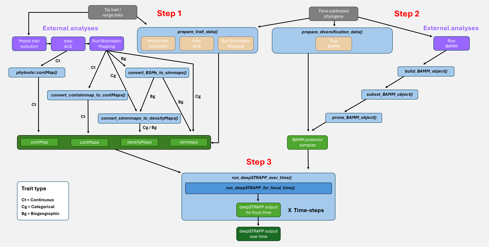
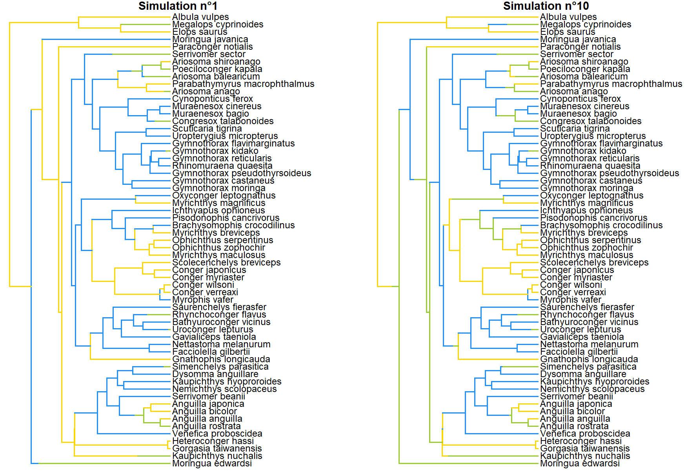
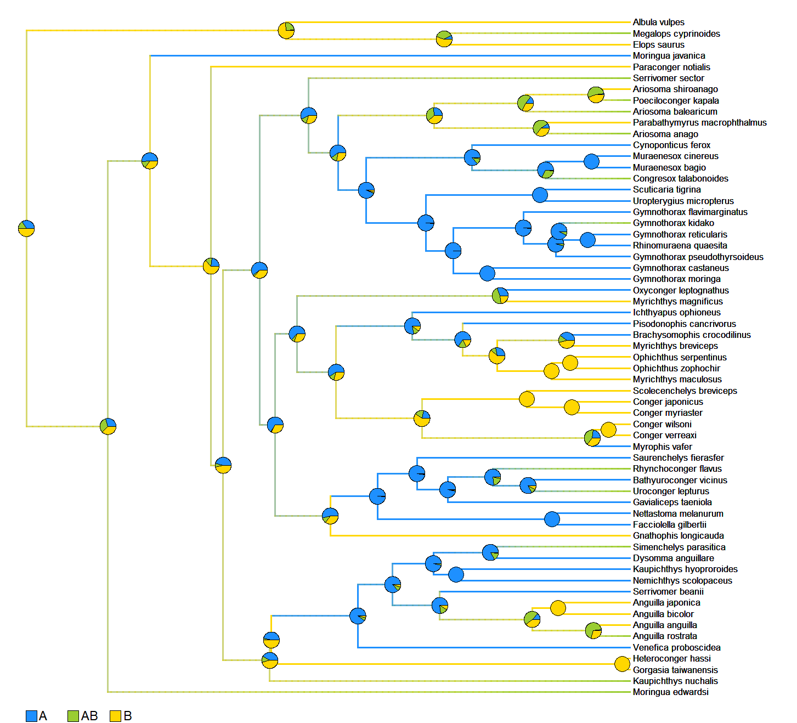
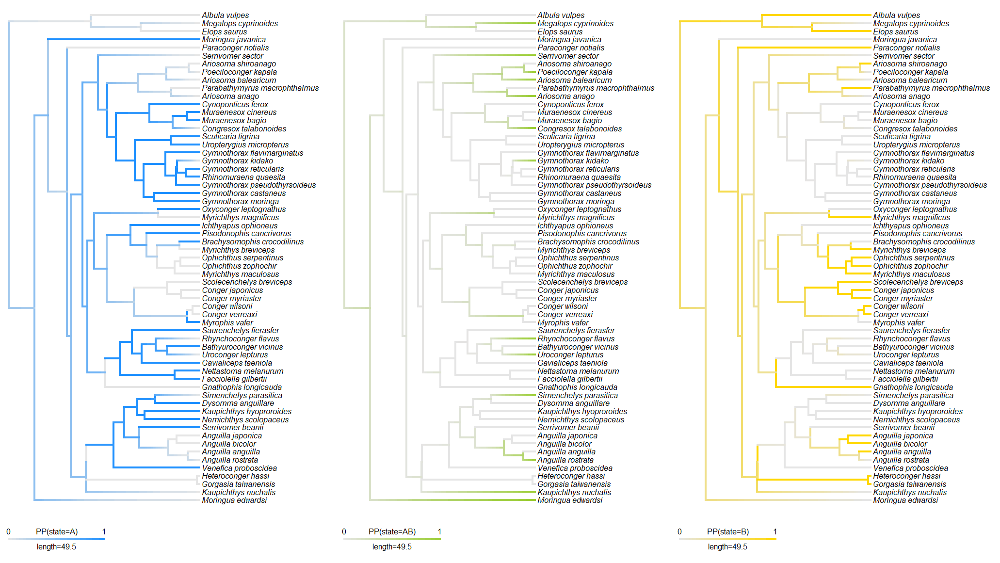
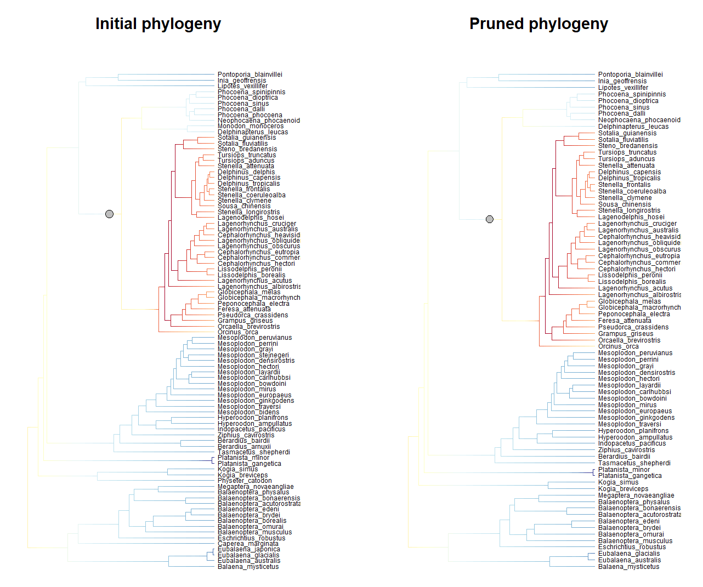
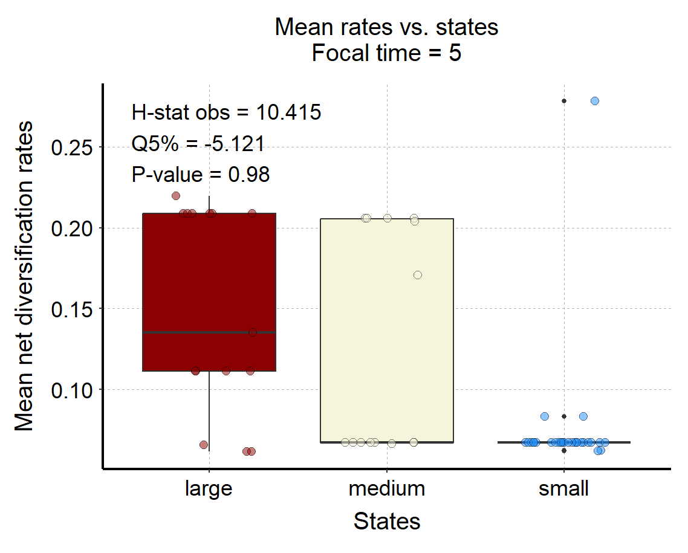

```{r set_options, include = FALSE}
knitr::opts_chunk$set(
  eval = FALSE, # Chunks of codes will not be evaluated by default
  collapse = TRUE,
  comment = "#>",
  fig.width = 7, fig.height = 5   # Set device size at rendering time (when plots are generated)
)
```

```{r setup, eval = TRUE, include = FALSE}
library(deepSTRAPP)

is_dev_version <- function (pkg = "deepSTRAPP")
{
  # # Check if ran on CRAN
  # not_cran <- identical(Sys.getenv("NOT_CRAN"), "true") # || interactive()

  # Version number check
  version <- tryCatch(as.character(utils::packageVersion(pkg)), error = function(e) "")
  dev_version <- grepl("\\.9000", version)

  # not_cran || dev_version
  
  return(dev_version)
}

```

```{r adjust_dpi_CRAN, include = FALSE, eval = !is_dev_version()}
knitr::opts_chunk$set(
  dpi = 72   # Lower DPI to save space
)
```
```{r adjust_dpi_dev, include = FALSE, eval = is_dev_version()}
knitr::opts_chunk$set(
  dpi = 72   # Default DPI for the dev version
)
```

<br>
This vignette presents the different options available to import and format results of external analyses of trait-evolution histories and diversification dynamics
and make them ready-to-use as inputs for a deepSTRAPP run.

Alternatively, trait-evolution histories and diversification dynamics can be inferred directly with deepSTRAPP functions.

In deepSTRAPP, trait-evolution histories are inferred with this function: [deepSTRAPP::prepare_trait_data()]
  * For details about modeling __continuous data__, see this vignette: `vignette("model_continuous_trait_evolution")`.
  * For details about modeling __categorical data__, see this vignette: `vignette("model_categorical_trait_evolution")`.*
  * For details about modeling __biogeographic data__, see this vignette: `vignette("model_biogeographic_range_evolution")`.

In deepSTRAPP, diversification-rate estimates are inferred with this function: [deepSTRAPP::prepare_diversification_data()]
  * For a detailed explanation, see this vignette: `vignette("model_diversification dynamics")`.

<br>
```{r modularity_figure_eval, eval = TRUE, echo = FALSE, out.width = "100%"}

# Plot pre-rendered graph


```
__Figure 1: deepSTRAPP modularity scheme illustrating input formats and functions available to feed a deepSTRAPP run__. Users can use all-in-one deepSTRAPP functions to infer trait-evolution histories and diversification dynamics and produce ready-to-use inputs for deepSTRAPP. Alternatively, they can use deepSTRAPP functions to import results of external analyses into deepSTRAPP. Input data in grey. Data processing in blue (main) and beige (internal). External analyses in purple. Intermediate objects = inputs for deepSTRAPP runs in light green. Final outputs in dark green.
<br>


```{r import_contMap}
# ------ Step 1: Prepare trait data ------ #

# deepSTRAPP relies on [phytools] objects to summarize trait evolution along phylogenies.
# These objects are the key inputs to provide for deepSTRAPP runs.

# The object depends on the type of trait data:

#  * For continuous trait data, a 'contMap' is summarizing the evolution of trait values along branches. (See section 1.1)
#    If ones wants to account for uncertainty in trait estimates, multiple continuous stochastic maps are needed and summarized in a 'contMaps' object,
#    which is a list with each 'contMap' representing an independent evolutionary history. (See section 1.2)

#  * For categorical trait data, 'densityMaps' are a list of `densityMap` objects that represent the posterior probabilities to observed
#    a given state along branches. Each `densityMap` in the list correspond to a state.
#    If ones wants to track which simulated history provided which trait data, the said simulated histories (i.e., stochastic maps) can be provided
#    as 'simmaps', a list of 'simmap' objects that map changes in states along branches for each simulation. (See section 1.3)
  
#  * For biogeographic range data, similarly, 'densityMaps' recording frequency of ranges, 
#    and/or 'simmaps' representing stochastic maps of biogeographic histories can be provided. (See section 1.4)


# Set seed for reproducibility
set.seed(seed = 1234)


#### 1.1/ Import continuous trait estimates as a 'contMap' #####

## The example below illustrates how to convert the results of modeling continuous trait evolution with phytools::anc.ML().
## Other models can be used as long as their outputs can be converted to a 'contMap'.

# Load the phylogeny
library(phytools)
data(whale.tree)

# Plot phylogeny
plot(whale.tree)
# 87 whale species
nb_taxa <- length(whale.tree$tip.label)

# Create fake whale data for the example
whale_tip_cont_data <- rnorm(mean = 1000, sd = 150, n = nb_taxa)
summary(whale_tip_cont_data)
  
# Assign species names
whale_tip_cont_data <- setNames(object = whale_tip_cont_data,
                                nm = whale.tree$tip.label)
head(whale_tip_cont_data)

## Model trait evolution using a Brownian Motion model and predict ancestral trait values at nodes

?phytools::anc.ML()

BM_fit <- phytools::anc.ML(tree = whale.tree,
                           x = whale_tip_cont_data,
                           model = "BM")

# This is your modeling results
str(BM_fit, 1)
print(BM_fit)
BM_fit$sig2 # Evolutionary rate as variance of trait change per unit of evolutionary time
BM_fit$ace # Ancestral Character Estimates = Maximum Likelihood trait estimates at nodes

## Convert model output into a 'contMap'

# We use the [phytools::contMap()] function to interpolate trait values along branches based on our modeling results
?phytools::contMap()

whale_contMap <- phytools::contMap(
  tree = whale.tree,
  method = "user",
  x = whale_tip_cont_data,
  anc.states = BM_fit$ace,
  plot = FALSE)

## Plot the resulting contMap
plot_contMap(whale_contMap, color_scale = c("dodgerblue", "beige", "darkred"))

## This contMap object ('whale_contMap') is the key input to provide to deepSTRAPP to test for correlations between rates and traits over evolutionary time.
# However, since it only represents the ML estimates of trait evolution, we cannot account for uncertainty in trait estimates in the analyses.
# We need to use the 'rates_only' option for 'uncertainty_strategy' in our deepSTRAPP run.
# To account for trait uncertainty, we need to produce continuous stochastic maps, and provide 'contMaps' as inputs. (See section 1.2 below)

# The ACE ('BM_fit$ace') and tip_data (whale_tip_cont_data) can also be provided to deepSTRAPP to ensure the exact values for tip and node estimates are used
# In practice the difference is negligeable if ignored.

```
```{r import_contMap_eval, eval = TRUE, echo = FALSE}

# Set seed for reproducibility
set.seed(seed = 1234)

# Load the phylogeny
library(phytools)
data(whale.tree)

# 87 whale species
nb_taxa <- length(whale.tree$tip.label)

# Create fake whale data for the example
whale_tip_cont_data <- setNames(object = rnorm(mean = 1000, sd = 150, n = nb_taxa),
                                nm = whale.tree$tip.label)

# Build contMap from BM
whale_contMap <- phytools::contMap(
  tree = whale.tree,
  x = whale_tip_cont_data,
  plot = FALSE)

## Plot the resulting contMap
plot_contMap(whale_contMap, color_scale = c("dodgerblue", "beige", "darkred"))
title(main = "\nML estimates")

```

```{r import_contMaps}

#### 1.2/ Import continuous stochastic maps as 'contMaps' #####

## The example below illustrates how to convert continuous stochastic maps with generated contsimmap::make.contsimmap().
## Other models for continuous stochastic mapping can be used as long as their outputs can be converted to 'contMaps'.

# Load the phylogeny
library(phytools)
data(whale.tree)

# Plot phylogeny
plot(whale.tree)
# 87 whale species
nb_taxa <- length(whale.tree$tip.label)

# Create fake whale data for the example
whale_tip_cont_data <- rnorm(mean = 1000, sd = 150, n = nb_taxa)
summary(whale_tip_cont_data)

# Assign species names
whale_tip_cont_data <- setNames(object = whale_tip_cont_data,
                                nm = whale.tree$tip.label)
head(whale_tip_cont_data)

## Model trait evolution using a Brownian Motion model and predict ancestral trait values at nodes
?phytools::anc.ML()

BM_fit <- phytools::anc.ML(tree = whale.tree,
                           x = whale_tip_cont_data,
                           model = "BM")

# This is your modeling results
str(BM_fit, 1)
BM_fit$sig2 # Evolutionary rate as variance of trait change per unit of evolutionary time
BM_fit$ace # Ancestral Character Estimates = Maximum Likelihood trait estimates at nodes

## Generate multiple simulations of evolutionary histories
# conditioned to the tip data and model fit (i.e., continuous stochastic maps)

?contsimmap::make.contsimmap()

contsimmap_output <- contsimmap::make.contsimmap(
   tree = whale.tree,
   trait.data = whale_tip_cont_data,
   Xsig2 = BM_fit$sig2, # Evolutionary rate
   nsims = 100) # Number of stochastic maps

## This is the results of your stochasting mapping
# Output is a array storing trait evolution along edges (1D), for each trait (2D), across simulations (3D)
dim(contsimmap_output)

## Use a custom function [deepSTRAPP::convert_contsimmap_to_contMaps()] to convert the contsimmap output into a list of contMaps
?deepSTRAPP::convert_contsimmap_to_contMaps

whale_contMaps <- convert_contsimmap_to_contMaps(contsimmap = contsimmap_output)

## Plot the resulting contMaps

plot_contMap(whale_contMaps[[1]], color_scale = c("dodgerblue", "beige", "darkred"))
title(main = "\nSimulation n°1")

plot_contMap(whale_contMaps[[10]], color_scale = c("dodgerblue", "beige", "darkred"))
title(main = "\nSimulation n°10")

plot_contMap(whale_contMaps[[100]], color_scale = c("dodgerblue", "beige", "darkred"))
title(main = "\nSimulation n°100")

## This contMaps object ('whale_contMaps') is the key input to provide to deepSTRAPP to test for correlations between rates and traits over evolutionary time.
# Since it includes multiple simulated histories, it allows to account for uncertainty in trait estimates in the analyses
# using the 'paired' or 'full' options for 'uncertainty_strategy' in our deepSTRAPP run.

```
```{r import_contMaps_eval, eval = TRUE, echo = FALSE}

## Model trait evolution and produce multiple simulations of evolutionary histories
contsimmap_output <- contsimmap::make.contsimmap(
   tree = whale.tree,
   trait.data = whale_tip_cont_data,
   nsims = 100) 

## Convert into a list of contMaps
whale_contMaps <- convert_contsimmap_to_contMaps(contsimmap = contsimmap_output)

## Plot the resulting contMaps

plot_contMap(whale_contMaps[[1]], color_scale = c("dodgerblue", "beige", "darkred"))
title(main = "\nSimulation n°1")

plot_contMap(whale_contMaps[[10]], color_scale = c("dodgerblue", "beige", "darkred"))
title(main = "\nSimulation n°10")

plot_contMap(whale_contMaps[[100]], color_scale = c("dodgerblue", "beige", "darkred"))
title(main = "\nSimulation n°100")

```

```{r import_cat}

#### 1.3/ Import ancestral state estimates as 'simmaps' and/or 'densityMaps' #####

## The example below illustrates how to produce 'simmaps' and 'densityMaps' compatible with deepSTRAPP *
## based on models of ancestral states reconstructions fitted with geiger::fit.Discrete().
## Other models for ancestral states reconstructions can be used as long as their outputs can be converted to 'simmaps' and then 'densityMaps'.

# Load the phylogeny
library(phytools)
data(whale.tree)

# Plot phylogeny
plot(whale.tree)
# 87 whale species
nb_taxa <- length(whale.tree$tip.label)

## For the sake of example, we will pretend we are missing data on 10 species (See section 2.3) 

# Randomly produce missing species 
set.seed(1234)
tips_without_data <- sample(whale_BAMM_object$tip.label, size = 10, replace = FALSE)
tips_with_data <- setdiff(whale.tree$tip.label, tips_without_data)

# Prune the whale phylogeny to keep only species with data
whale_tree_pruned <- ape::keep.tip(phy = whale.tree, tip = tips_with_data)
# New pruned phylogeny has 87 - 10 = 77 species
nb_taxa <- length(whale_tree_pruned$tip.label)

## Create fake categorical data for the whale example with N = 77
whale_tip_cat_data <- c(rep(x = "small", times = 25),
                        rep(x = "medium", times = 20),
                        rep(x = "large", times = 32))
table(whale_tip_cat_data)

# Assign species names
whale_tip_cat_data <- setNames(object = whale_tip_cat_data,
                               nm = whale_tree_pruned$tip.label)
head(whale_tip_cat_data)

## Model trait evolution using an Equal-Rates Mk model
?geiger::fitDiscrete()

ER_fit <- geiger::fitDiscrete(phy = whale_tree_pruned,
                              dat = whale_tip_cat_data,
                              model = "ER")

# This is your modeling results
str(ER_fit, 1)
print(ER_fit)

# Extract transition Q-matrix from model fit
Q_matrix <- phytools::as.Qmatrix(ER_fit)

## Generate multiple simulations of evolutionary histories
# conditioned to the tip data and model fit (i.e., continuous stochastic maps)

# We use [phytools::make.simmap()] function to simulate conditioned evolutionary histories
# and obtain a 'simmaps' object

?phytools::make.simmap()

# This may take several minutes
whale_simmaps <- phytools::make.simmap(
   tree = whale_tree_pruned,
   x = whale_tip_cat_data,
   model = "ER",
   nsim = 100,
   Q = Q_matrix)

## Extract posterior distribution of ancestral states across simmaps 

# Use phytools summary function
simmaps_summary_obj <- phytools::describe.simmap(tree = whale_simmaps, plot = FALSE)
ace_matrix <- simmaps_summary_obj$ace
head(ace_matrix)
  
## Plot the resulting simmaps

# Set colors per states
colors_per_states <- c("dodgerblue", "beige", "darkred")
names(colors_per_states) <- c("small", "medium", "large")

plot(whale_simmaps[[1]], colors = colors_per_states)
title(main = "\nSimulation n°1")

plot(whale_simmaps[[10]], colors = colors_per_states)
title(main = "\nSimulation n°10")

## The `simmaps` object (`whale_simmaps`) is the main input for testing differences
# in evolutionary rates between states over time with deepSTRAPP.
# Importantly, `simmaps` retain the identity of each simulated history,
# allowing deepSTRAPP to keep track of which simulation generated each set of trait values (i.e., states).

# However, retaining all simulated histories can require substantial RAM,
# particularly for large phylogenies or many simulations.
# Alternatively, `densityMaps` summarize the frequency of states across simulations.
# They require substantially less RAM and can be used to visualize the overall uncertainty
# in trait evolution with `deepSTRAPP::plot_densityMaps_overlay()`.

# The trade-off is that `densityMaps` discard the identity of individual simulations and
# therefore cannot be used to track which simulated history generated a given set of trait values.

## Convert `simmaps` into `densityMaps` used by deepSTRAPP

# We use a custom function [deepSTRAPP::convert_simmaps_to_densityMaps()] to perform the conversion
?deepSTRAPP::convert_simmaps_to_densityMaps()

whale_densityMaps <- convert_simmaps_to_densityMaps(
   simmaps = whale_simmaps,
   colors_per_levels = colors_per_states,
   verbose = FALSE)

## Plot the resulting densityMaps
plot_densityMaps_overlay(whale_densityMaps)

# Plot the densityMap for state n°1 = "large"
plot(whale_densityMaps[[1]])
# Plot the densityMap for state n°2 = "medium"
plot(whale_densityMaps[[2]])
# Plot the densityMap for state n°3 = "small"
plot(whale_densityMaps[[3]])

## This densityMaps object ('whale_densityMaps') is the alternative to 'simmaps' for testing differences
# in evolutionary rates between states over time with deepSTRAPP.
# Since it includes multiple simulated histories summarized as frequencies, it still allows to account for uncertainty in trait estimates
# in the analyses using the 'paired' or 'full' options for 'uncertainty_strategy'. 
# However, trait data (i.e., states) will be attributed to 'Dummmy_maps' when performing the tests.

```
```{r import_cat_eval, eval = TRUE, echo = FALSE}

# Randomly produce missing species 
set.seed(1234)
tips_without_data <- sample(whale_BAMM_object$tip.label, size = 10, replace = FALSE)
tips_with_data <- setdiff(whale.tree$tip.label, tips_without_data)

# Prune the whale phylogeny to keep only species with data
whale_tree_pruned <- ape::keep.tip(phy = whale.tree, tip = tips_with_data)


## Create fake categorical data for the whale example with N = 77
whale_tip_cat_data <- c(rep(x = "small", times = 25),
                        rep(x = "medium", times = 20),
                        rep(x = "large", times = 32))

# Assign species names
whale_tip_cat_data <- setNames(object = whale_tip_cat_data,
                               nm = whale_tree_pruned$tip.label)

## Model trait evolution using an Equal-Rates Mk model
ER_fit <- geiger::fitDiscrete(phy = whale_tree_pruned,
                              dat = whale_tip_cat_data,
                              model = "ER")


## Generate multiple simulations of evolutionary histories
# conditioned to the tip data and model fit (i.e., continuous stochastic maps)
whale_simmaps <- phytools::make.simmap(
   tree = whale_tree_pruned,
   x = whale_tip_cat_data,
   model = "ER",
   nsim = 100,
   # Extract transition Q-matrix from model fit
   Q = phytools::as.Qmatrix(ER_fit))

## Plot the resulting simmaps

# Set colors per states
colors_per_states <- c("dodgerblue", "beige", "darkred")
names(colors_per_states) <- c("small", "medium", "large")

par(mfrow = c(1,2))
plot(whale_simmaps[[1]], colors = colors_per_states)
title(main = "\nSimulation n°1")

plot(whale_simmaps[[10]], colors = colors_per_states)
title(main = "\nSimulation n°10")
par(mfrow = c(1,1))

## Convert `simmaps` into `densityMaps` used by deepSTRAPP

# Use custom deepSTRAPP function to perform the conversion
whale_densityMaps <- convert_simmaps_to_densityMaps(
   simmaps = whale_simmaps,
   colors_per_levels = colors_per_states)

## Plot the resulting densityMaps
plot_densityMaps_overlay(whale_densityMaps)

```

```{r import_biogeo}

#### 1.4/ Import biogeographic histories as 'simmaps' and/or 'densityMaps' #####

## The example below illustrates how to produce 'densityMaps' compatible with deepSTRAPP
## based on models of biogeographic history fitted with the package [BioGeoBEARS].
## Other models for ancestral states reconstructions can be used as long as their outputs can be converted to 'simmaps' and then 'densityMaps'.

# The package 'BioGeoBEARS' is available at https://github.com/nmatzke/BioGeoBEARS.
# For instructions, please see http://phylo.wikidot.com/biogeobears.


### 1.4.1/ Load data ####

## Load the phylogeny
library(phytools)
data(eel.tree)

# Plot phylogeny
plot(eel.tree)
# 61 eel species
nb_taxa <- length(eel.tree$tip.label)

# Load biogeo data
data(eel.data)
# Dataset of feeding mode and maximum total length from 61 species of elopomorph eels.
# Source: Collar, D. C., P. C. Wainwright, M. E. Alfaro, L. J. Revell, and R. S. Mehta (2014)
# Biting disrupts integration to spur skull evolution in eels. Nature Communications, 5, 5505.

# Transform feeding mode data into fake biogeographic data with ranges A, B, and AB.
# This is NOT actual biogeographic data, but fake data generated for the sake of example!
eel_range_tip_data <- stats::setNames(eel.data$feed_mode, rownames(eel.data))
eel_range_tip_data <- as.character(eel_range_tip_data)
eel_range_tip_data[eel_range_tip_data == "bite"] <- "A"
eel_range_tip_data[eel_range_tip_data == "suction"] <- "B"
eel_range_tip_data[c(5, 6, 7, 15, 25, 32, 33, 34, 50, 52, 57, 58, 59)] <- "AB"
eel_range_tip_data <- stats::setNames(eel_range_tip_data, rownames(eel.data))
table(eel_range_tip_data)

# Reorder tip_data as in phylogeny
eel_range_tip_data <- eel_range_tip_data[eel.tree$tip.label]


### 1.4.2/ Model historical biogeography using a DEC model in BioGeoBEARS ####

# This section may takes several minutes to run.
# If using a development version of deepSTRAPP, you can directly load the output.
# Please use remotes::install_github(repo = "MaelDore/deepSTRAPP") to install the latest version.

##### 
# # Set a BioGeoBEARS directory
# BioGeoBEARS_directory_path <- "./BioGeoBEARS_directory/"
# dir.create(path = BioGeoBEARS_directory_path)
# 
# # Store phylogeny in Newick format
# write.tree(phylo = eel.tree, file = paste0(BioGeoBEARS_directory_path, "eel.tree"))
# path_to_phylo <- BioGeoBEARS::np(paste0(BioGeoBEARS_directory_path, "eel.tree"))
# 
# ## Prepare tip ranges for BioGeoBEARS
# 
# # Extract and order ranges
# all_ranges <- unique(eel_range_tip_data)
# all_ranges <- all_ranges[order(all_ranges)]
# unique_areas <- all_ranges[nchar(all_ranges) == 1]
# multi_area_ranges <- setdiff(all_ranges, unique_areas)
# all_ranges <- c(unique_areas, multi_area_ranges)
#   
# # Convert to df
# ranges_df <- as.data.frame(eel_range_tip_data)
# # Get list of all unique areas
# unique_areas_in_ranges_list <- strsplit(x = eel_range_tip_data, split = "")
# # Loop per unique areas
# for (i in seq_along(unique_areas))
# {
#   # i <- 1
# 
#   # Extract unique area
#   unique_area_i <- unique_areas[i]
#   # Detect presence in ranges
#   binary_match_i <- unlist(lapply(X = unique_areas_in_ranges_list, FUN = function (x) { unique_area_i %in% x } ))
#   
#   # Add to ranges_df
#   ranges_df <- cbind(ranges_df, binary_match_i)
# }
# 
# # Extract binary df of presence/absence
# binary_df <- ranges_df[, -1]
# # Convert character strings into numerical factors
# binary_df_num <- as.data.frame(apply(X = binary_df, MARGIN = 2, FUN = as.numeric))
# row.names(binary_df_num) <- names(tip_data)
# names(binary_df_num) <- unique_areas
# 
# # Produce tipranges object from numeric df
# Taxa_bioregions_tipranges_obj <- BioGeoBEARS::define_tipranges_object(tmpdf = binary_df_num)
# 
# # Set path to tip ranges object  
# path_to_tip_ranges <- BioGeoBEARS::np(paste0(BioGeoBEARS_directory_path,"tip_ranges.data"))
# 
# # Export tip ranges in Lagrange/PHYLIP format
# BioGeoBEARS::save_tipranges_to_LagrangePHYLIP(
#    tipranges_object = Taxa_bioregions_tipranges_obj,
#    lgdata_fn = path_to_tip_ranges,
#    areanames = colnames(Taxa_bioregions_tipranges_obj@df))
# 
# ## Setup run for DEC+J model
# DEC_J_run <- BioGeoBEARS::define_BioGeoBEARS_run(
#    num_cores_to_use = 1, # Only use one core. In most cases parallelization is actually slower.
#    max_range_size = 2, # To set the maximum number of areas encompassed by a lineage range at any time
#    trfn = path_to_phylo, # To provide path to the input tree file
#    geogfn = path_to_tip_ranges, # To provide path to the LagrangePHYLIP file with binary ranges
#    return_condlikes_table = TRUE) # To ask to obtain all marginal likelihoods computed by the model and used to display ancestral states
# 
# # Update status of jump speciation parameter to be estimated
# DEC_J_run$BioGeoBEARS_model_object@params_table["j","type"] <- "free"
# # Set initial value of J for optimization to an arbitrary low non-null value
# j_start <- 0.0001
# DEC_J_run$BioGeoBEARS_model_object@params_table["j","init"] <- j_start
# DEC_J_run$BioGeoBEARS_model_object@params_table["j","est"] <- j_start # MLE will evolved after optimization
# 
# # Check that starting parameter values are inside the min/max
# DEC_J_run <- BioGeoBEARS::fix_BioGeoBEARS_params_minmax(BioGeoBEARS_run_object = DEC_J_run)
# # Check validity of set-up before run
# BioGeoBEARS::check_BioGeoBEARS_run(DEC_J_run)
#
# ## Run DEC model in BioGeoBEARS
# DEC_J_fit <- BioGeoBEARS::bears_optim_run(DEC_J_run)
#####

## Load directly the output of prepare_trait_data() on biogeographic data to save time
# This will only work on development version of deepSTRAPP.
# Please use remotes::install_github(repo = "MaelDore/deepSTRAPP") to install the latest version.
data(eel_biogeo_data, package = "deepSTRAPP")
DEC_J_fit <- eel_biogeo_data$best_model_fit

# This object is your modeling results
# It stores information about model fit and ancestral range estimates at internal nodes
str(DEC_J_fit, 1)
print(DEC_J_fit$optim_result) # Those are the three model parameters. 
# p1 = d = dispersal rate = anagenetic range extension. Ex: A -> AB
# p2 = e = extinction rate = anagenetic range contraction. Ex: AB -> A
# p3 = j = jump-dispersal relative weight = cladogenetic founder-event. Ex: A -> (A),(B)


### 1.4.3/ Run simulations of biogeographic histories = Biogeographic Stochastic Mapping ####

# This section may takes several minutes to run.
# If using a development version of deepSTRAPP, you can directly load the output.
# Please use remotes::install_github(repo = "MaelDore/deepSTRAPP") to install the latest version.

####
# ## Extract inputs needed for Biogeographic Stochastic Mapping from model fit object
# BSM_inputs <- BioGeoBEARS::get_inputs_for_stochastic_mapping(res = DEC_fit)
# 
# ## Run Biogeographic Stochastic Mapping
# BSM_output <- BioGeoBEARS::runBSM(res = DEC_fit,  # Model fit object
#                                   stochastic_mapping_inputs_list = BSM_inputs,
#                                   nummaps_goal = 100, # Number of stochastic maps
#                                   savedir = BioGeoBEARS_directory_path)
####

## Load directly the output of prepare_trait_data() on biogeographic data to save time
BSM_output <- eel_biogeo_data$BSM_output

## This is the results of your BSM
str(BSM_output, 1)
# It stores two elements summarizing all the cladogenetic (i.e., at speciation) and
# anagenetic (along branches) events recorded along the 100 simulations
str(BSM_output$RES_clado_events_tables[[1]], 1) # Cladogenetic events for simulation n°1
str(BSM_output$RES_ana_events_tables[[1]], 1) # Anagenetic events for simulation n°1


### 1.4.4/ Convert BioGeoBEARS BSM output to simmaps ####

# Use a custom deepSTRAPP function to convert BSM output into simmap
# This is wrapper of the original `BioGeoBEARS::BSM_to_phytools_SM()` 
# and `BioGeoBEARS::BSMs_to_phytools_SMs()` functions

?deepSTRAPP::convert_BSMs_to_simmaps()

eel_simmaps <- convert_BSMs_to_simmaps(model_fit = DEC_J_fit,
                                       phylo = eel.tree,
                                       BSM_output = BSM_output)

## Plot the resulting simmaps

# Set colors per ranges
colors_per_ranges <- c("dodgerblue", "gold", "yellowgreen")
names(colors_per_ranges) <- c("A", "B", "AB")

par(mfrow = c(1,2))
plot(eel_simmaps[[1]], colors = colors_per_ranges)
title(main = "\nSimulation n°1")

plot(eel_simmaps[[10]], colors = colors_per_ranges)
title(main = "\nSimulation n°10")
par(mfrow = c(1,1))

## The `simmaps` object (`eel_simmaps`) is the main input for testing differences
# in evolutionary rates between states over time with deepSTRAPP.
# Importantly, `simmaps` retain the identity of each simulated history,
# allowing deepSTRAPP to keep track of which simulation generated each set of trait values (i.e., states).

# However, retaining all simulated histories can require substantial RAM,
# particularly for large phylogenies or many simulations.
# Alternatively, `densityMaps` summarize the frequency of states across simulations.
# They require substantially less RAM and can be used to visualize the overall uncertainty
# in trait evolution with `deepSTRAPP::plot_densityMaps_overlay()`.

# The trade-off is that `densityMaps` discard the identity of individual simulations and
# therefore cannot be used to track which simulated history generated a given set of trait values.

### 1.4.5/ Convert `simmaps` into `densityMaps` used by deepSTRAPP ####

# Use custom deepSTRAPP function to perform the conversion
eel_densityMaps <- convert_simmaps_to_densityMaps(
   simmaps = eel_simmaps,
   colors_per_levels = colors_per_ranges,
   verbose = FALSE)

## Plot the resulting densityMaps
plot_densityMaps_overlay(eel_densityMaps)

par(mfrow = c(1,3))
# Plot the densityMap for range n°1 = "A"
plot(eel_densityMaps[[1]])
# Plot the densityMap for range n°2 = "AB"
plot(eel_densityMaps[[2]])
# Plot the densityMap for range n°3 = "B"
plot(eel_densityMaps[[3]])
par(mfrow = c(1,1))

## This densityMaps object ('eel_densityMaps') is the alternative to 'simmaps' for testing differences
# in evolutionary rates between ranges over time with deepSTRAPP.
# Since it includes multiple simulated biogeographic histories summarized as frequencies,
# it still allows to account for uncertainty in range estimates in the analyses
# using the 'paired' or 'full' options for 'uncertainty_strategy'. 
# However, trait data (i.e., ranges) will be attributed to 'Dummmy_maps' when performing the tests.

```
```{r import_biogeo_eval, eval = is_dev_version(), echo = FALSE}

## Load phylogeny
library(phytools)
data(eel.tree)

## Load directly the output of prepare_trait_data() on biogeographic data to save time
data(eel_biogeo_data, package = "deepSTRAPP")
DEC_J_fit <- eel_biogeo_data$best_model_fit
BSM_output <- eel_biogeo_data$BSM_output

# Convert BioGeoBEARS outputs into simmaps
eel_simmaps <- convert_BSMs_to_simmaps(model_fit = DEC_J_fit,
                                       phylo = eel.tree,
                                       BSM_output = BSM_output)

## Plot the resulting simmaps

# Set colors per ranges
colors_per_ranges <- c("dodgerblue", "gold", "yellowgreen")
names(colors_per_ranges) <- c("A", "B", "AB")

par(mfrow = c(1,2))
plot(eel_simmaps[[1]], colors = colors_per_ranges)
title(main = "\nSimulation n°1")

plot(eel_simmaps[[10]], colors = colors_per_ranges)
title(main = "\nSimulation n°10")
par(mfrow = c(1,1))


## Convert 'simmaps' into 'densityMaps'
eel_densityMaps <- convert_simmaps_to_densityMaps(
   simmaps = eel_simmaps,
   colors_per_levels = colors_per_ranges,
   verbose = FALSE)

## Plot the resulting densityMaps
plot_densityMaps_overlay(eel_densityMaps)

par(mfrow = c(1,3))
# Plot the densityMap for range n°1 = "A"
plot(eel_densityMaps[[1]])
# Plot the densityMap for range n°2 = "AB"
plot(eel_densityMaps[[2]])
# Plot the densityMap for range n°3 = "B"
plot(eel_densityMaps[[3]])
par(mfrow = c(1,1))

```
```{r import_biogeo_eval_CRAN, eval = !is_dev_version(), echo = FALSE, out.width = "100%"}

# Plot pre-rendered graph




```

```{r import_BAMM_object}
# ------ Step 2: Prepare diversification data ------ #

# deepSTRAPP relies on BAMM objects to summarize diversification dynamics on phylogenies.
# These objects are the key inputs to provide for deepSTRAPP runs.

# The [BAMMtools] R package already provides functions to load results of BAMM analyses into R with [BAMMtools::getEventData()]
# However, BAMM objects used by deepSTRAPP, as produced directly by [deepSTRAPP::prepare_diversification_data()], also includes
# a few additional elements to tune the display of regime shift probabilities and locations with [deepSTRAPP::plot_BAMM_rates()].

# Therefore, deepSTRAPP also offers functions to build and curate deepSTRAPP-customized BAMM objects
# directly from external 'eventdata.txt' files resulting from a BAMM run.

?deepSTRAPP::build_BAMM_object()
?deepSTRAPP::subset_BAMM_object()
?deepSTRAPP::prune_BAMM_object()

## Please note that the 'whale_event_data.txt' file used in this example here is not provided within deepSTRAPP

### 2.1/ Build a BAMM_object from an external 'event_data.txt' file resulting from a BAMM run ####

whale_BAMM_object <- build_BAMM_object(
    phylo = whale.tree,
    eventdata = "./BAMM_outputs/whale_event_data.txt",
    burn_in = 0.25, # Remove 25% as burn-in
    nb_posterior_samples = 1000, # Retain 1000 samples
    expectedNumberOfShifts = 1,
    verbose = TRUE)

# Inspect resulting object
str(whale_BAMM_object, 1)
# Check current number of BAMM posterior samples
length(Ponerinae_BAMM_object_old_calib$eventData)
# We have initially 1000 posterior samples in the updated BAMM object

### 2.2/ Subset the BAMM_object to retain a lower number of posterior samples ####

whale_BAMM_object_subsetted <- subset_BAMM_object(
     BAMM_object = whale_BAMM_object,
     nb_posterior_samples = 100,
     seed = 1234)

# Inspect resulting object
str(whale_BAMM_object_subsetted, 1)
# Check updated number of BAMM posterior samples
length(whale_BAMM_object_subsetted$eventData)
# We have now 100 posterior samples in the updated BAMM object

### 2.3/ Prune the BAMM_object to retain a subset of tips ####

## Trait or range data are rarely available for every species of a phylogeny.
# When they are missing for some taxa, the BAMM_object must be reduced to the taxa that will
# actually be tested, so that it holds exactly the same tips as the trait data.

## The tips to retain can be defined in three mutually exclusive ways:
#  * 'tips_to_keep'  = the tips to retain.
#  * 'tips_to_prune' = the tips to remove.
#  * 'MRCA_node'     = the internal node subtending the subclade to retain.

# Let's prune the BAMM object so that it retains the same 77 species has
# the ones in our pruned phylogeny and densityMaps

# Identify the tips to keep
tips_with_data <- whale_tree_pruned$tip.label

# Prune the already subsetted BAMM object
whale_BAMM_object_pruned <- prune_BAMM_object(
    BAMM_object = whale_BAMM_object_subsetted,
    tips_to_keep = tips_with_data,
    verbose = TRUE)

# Inspect resulting object
str(whale_BAMM_object_pruned, 1)
# Check the updated number of tips
length(whale_BAMM_object_pruned$tip.label)
# We have now 87 - 10 = 77 tips in the pruned phylogeny

## All BAMM elements are updated, not just the phylogeny.
# Removing tips leaves some internal nodes with a single descendant. Those nodes are suppressed,
# and their parent and child branches are merged into one. Regime shifts that were located on a
# removed branch are dropped, those located on a merged branch are re-attached to it, and the
# macroevolutionary regimes are re-indexed accordingly.

# The tips that were removed are recorded in the pruned BAMM_object
head(whale_BAMM_object_pruned$pruned_tip_labels)
# Conversion tables relate the pruned phylogeny back to the initial one
head(whale_BAMM_object_pruned$pruning_nodes_ID_df)
head(whale_BAMM_object_pruned$pruning_edges_ID_df)
# Branches that merge several initial branches hold several rows in the edge conversion table
table(whale_BAMM_object_pruned$pruning_edges_ID_df$nb_merged_edges)

## /!\ Pruning subsets an existing BAMM posterior. It does NOT re-estimate diversification rates.
# Removing tips changes the incomplete taxon sampling of the phylogeny, but the sampling fractions
# used during the original BAMM run are not updated, and rates are not inferred again.
# Pruning is meant to restrict a deepSTRAPP analysis to the taxa for which trait data are available,
# while keeping the diversification dynamics inferred on the full phylogeny.
# If you need rates estimated for a specific set of taxa, run a dedicated BAMM analysis on that
# subset with appropriate sampling fractions. See [deepSTRAPP::prepare_diversification_data()].

## Diversification rates estimated at the retained tips are left untouched by the pruning
retained_tips <- match(whale_BAMM_object_pruned$tip.label, whale_BAMM_object$tip.label)
all.equal(whale_BAMM_object_pruned$meanTipLambda,
          whale_BAMM_object$meanTipLambda[retained_tips])

## Compare the mean BAMM rates before and after pruning

par(mfrow = c(1, 2))

plot_BAMM_rates(whale_BAMM_object_subsetted, labels = TRUE, cex = 0.5, par.reset = FALSE)
title("Initial phylogeny")
plot_BAMM_rates(whale_BAMM_object_pruned, labels = TRUE, cex = 0.5, par.reset = FALSE)
title("Pruned phylogeny")

par(mfrow = c(1, 1))


```
```{r import_BAMM_object_eval, eval = is_dev_version(), echo = FALSE}

## Load BAMM object
data(whale_BAMM_object, package = "deepSTRAPP")

## Subset BAMM_object
whale_BAMM_object_subsetted <- subset_BAMM_object(
  BAMM_object = whale_BAMM_object,
  nb_posterior_samples = 100,
  seed = 1234)

## Prune BAMM_object
whale_BAMM_object_pruned <- prune_BAMM_object(
  BAMM_object = whale_BAMM_object,
  tips_to_keep = whale_tree_pruned$tip.label,
  verbose = FALSE)

## Compare the initial and the pruned phylogeny
par(mfrow = c(1, 2))

plot_BAMM_rates(whale_BAMM_object_subsetted, labels = TRUE, cex = 0.5, par.reset = FALSE)
title("Initial phylogeny")
plot_BAMM_rates(whale_BAMM_object_pruned, labels = TRUE, cex = 0.5, par.reset = FALSE)
title("Pruned phylogeny")

par(mfrow = c(1, 1))

```
```{r import_BAMM_object_CRAN, eval = !is_dev_version(), echo = FALSE, out.width = "100%"}

# Plot pre-rendered graph


```

```{r import_run_deepSTRAPP}
# ------ Step 3: Run deepSTRAPP ------ #

## We can now run deepSTRAPP using those newly created contMap(s), densityMaps, simmaps, and BAMM_object
# the same way we would have if they were created directly using the dedicated [deepSTRAPP::prepare_trait_data()] 
# and [deepSTRAPP::prepare_diversification_data()] functions.

## Here is an example using the 'densityMaps' object summarizing the ancestral characters of whales,
# combined with the 'BAMM_object' built from the output of an external BAMM run.
# Both were subsetted and pruned in sections 2.2 to 2.4, so that they describe the same 57 species,
# and the same 100 BAMM posterior samples.

# Set focal time to 5 Mya
focal_time <- 5

## Run deepSTRAPP on net diversification rates for focal time = 5 Mya.
deepSTRAPP_output <- run_deepSTRAPP_for_focal_time( 
      densityMaps = whale_densityMaps_pruned,
      # Inform the nb of simulations to reconstruct
      # state distribution across dummy stochastic maps
      nb_simulations = 100,
      trait_data_type = "categorical",
      rate_type = "net_diversification",
      BAMM_object = whale_BAMM_object_pruned,
      focal_time = focal_time,
      seed = 1,
      uncertainty_strategy = "paired",
      return_perm_data = TRUE,
      extract_trait_data_melted_df = TRUE,
      extract_diversification_data_melted_df = TRUE)

## Explore output
str(deepSTRAPP_output, max.level = 1)

# Access deepSTRAPP results
str(deepSTRAPP_output$STRAPP_results, max.level = 2)
# Result for overall Kruskal-Wallis test
deepSTRAPP_output$STRAPP_results[1:3]
# Note that the test is not at all significant because:
#  - 1/ States were distributed 'randomly', so we should not expect rate differences.
#  - 2/ Whales exhibit only one main regime shift in diversification which makes 
#       the power of STRAPP tests based on permutation across regimes very low,
#       as most random permutations will reproduce the observed data (this also explains why stats_median = 0).

# Plot rates vs. states across branches
plot_rates_vs_trait_data_for_focal_time(
    deepSTRAPP_outputs = deepSTRAPP_output,
    colors_per_levels = colors_per_states)
# Our fake "small" whales seem to have lower rates, 
# but sample size is too low for anything significant.

# Access trait data in a melted data.frame
# Because trait data was provided as densityMaps and not simmaps,
# the stochastic maps are dummy maps generated to reproduce
# the frequency of states as recorded in the densityMaps.
head(deepSTRAPP_output$trait_data_df)
table(deepSTRAPP_output$trait_data_df$Map_ID)

# Access the diversification data in a melted data.frame
head(deepSTRAPP_output$diversification_data_df)
# Diversification data includes the 100 subsetted BAMM posteriors 
table(deepSTRAPP_output$diversification_data_df$BAMM_sample_ID)

```
```{r import_run_deepSTRAPP_eval, eval = is_dev_version(), echo = FALSE}

# Set focal time to 5 Mya
focal_time <- 5

## Run deepSTRAPP on net diversification rates for focal time = 5 Mya.
deepSTRAPP_output <- run_deepSTRAPP_for_focal_time( 
      densityMaps = whale_densityMaps_pruned,
      # Inform the nb of simulations to reconstruct
      # state distribution across dummy stochastic maps
      nb_simulations = 100,
      trait_data_type = "categorical",
      rate_type = "net_diversification",
      BAMM_object = whale_BAMM_object_pruned,
      focal_time = focal_time,
      seed = 1,
      uncertainty_strategy = "paired",
      return_perm_data = TRUE,
      extract_trait_data_melted_df = TRUE,
      extract_diversification_data_melted_df = TRUE)

# Plot rates vs. states across branches
plot_rates_vs_trait_data_for_focal_time(
    deepSTRAPP_outputs = deepSTRAPP_output,
    colors_per_levels = colors_per_states)

```
```{r import_run_deepSTRAPP_CRAN, eval = !is_dev_version(), echo = FALSE, out.width = "100%"}

# Plot pre-rendered graph


```

